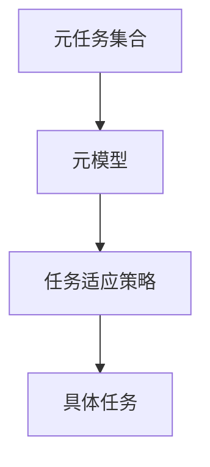
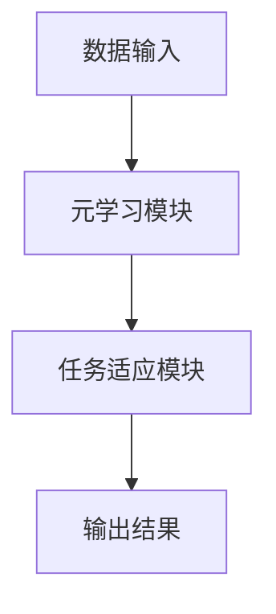
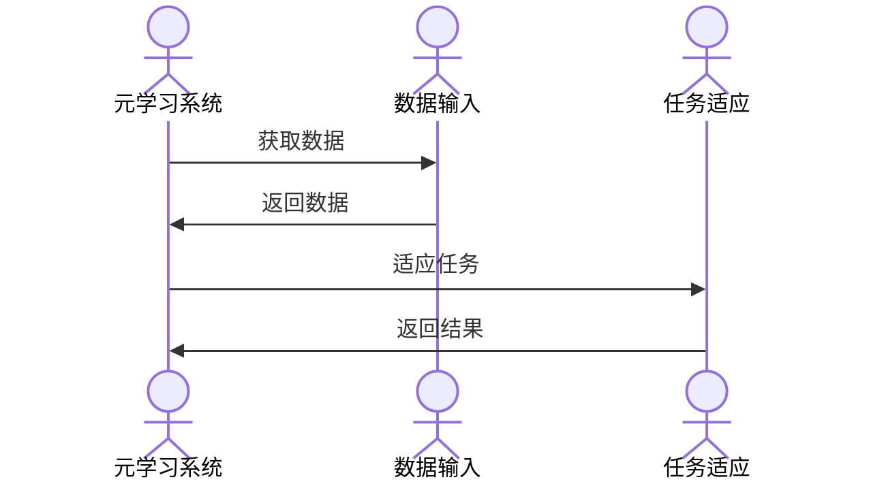

                 


# AI Agent的元学习能力开发实践

> 关键词：AI Agent，元学习，深度学习，算法设计，系统架构

> 摘要：本文深入探讨AI Agent的元学习能力开发实践，分析元学习的核心概念、算法原理及系统架构，结合实际案例，详细讲解如何在AI Agent中实现元学习能力，并提供最佳实践和开发建议。

---

# 第一部分: AI Agent的元学习能力开发背景

## 第1章: AI Agent与元学习概述

### 1.1 AI Agent的基本概念
#### 1.1.1 AI Agent的定义与分类
AI Agent（人工智能代理）是一种能够感知环境、自主决策并执行任务的智能实体。根据功能和应用场景，AI Agent可以分为**反应式Agent**、**基于模型的Agent**、**学习型Agent**和**元学习型Agent**。

#### 1.1.2 元学习的基本概念
元学习（Meta-Learning）是一种学习方法，旨在使模型能够快速适应新任务，而无需大量特定任务的数据。元学习的核心目标是通过“学习如何学习”，提升模型的泛化能力和适应性。

#### 1.1.3 元学习在AI Agent中的作用
在AI Agent中，元学习能力使其能够：
- 快速适应新任务
- 减少对大量数据的依赖
- 提高任务间的迁移能力

### 1.2 元学习的背景与问题背景
#### 1.2.1 传统机器学习的局限性
传统机器学习算法依赖大量标注数据，且在新任务上线时需要重新训练模型，适应性较弱。

#### 1.2.2 元学习的提出与目标
为了解决传统机器学习的局限性，元学习应运而生，其目标是通过“学习如何学习”，提升模型的泛化能力和适应性。

#### 1.2.3 元学习的核心问题描述
元学习的核心问题是在多个任务之间共享学习策略，通过少量样本快速适应新任务。

### 1.3 元学习的边界与外延
#### 1.3.1 元学习的适用场景
- 快速任务适应
- 数据稀缺场景
- 高度动态环境

#### 1.3.2 元学习的限制与挑战
- 元学习需要特定的训练策略
- 部分任务之间可能存在干扰
- 对计算资源要求较高

#### 1.3.3 元学习与其他学习方法的对比
| 特征 | 元学习 | 传统机器学习 |
|------|--------|--------------|
| 学习目标 | 学习如何学习 | 解决特定任务 |
| 数据需求 | 少量样本 | 大量样本 |
| 适应性 | 高 | 低 |

### 1.4 元学习的核心要素与概念结构
#### 1.4.1 元学习的核心要素
- **元任务**：一组相关任务的集合
- **元模型**：用于学习如何学习的核心模型
- **任务适应策略**：快速适应新任务的方法

#### 1.4.2 元学习的概念结构
使用Mermaid流程图展示元学习的概念结构：


#### 1.4.3 元学习的核心属性特征对比表
| 特征 | 元学习 | 传统机器学习 |
|------|--------|--------------|
| 学习目标 | 学习如何学习 | 解决特定任务 |
| 数据需求 | 少量样本 | 大量样本 |
| 适应性 | 高 | 低 |

---

## 第2章: 元学习的算法原理

### 2.1 元学习的基本算法
#### 2.1.1 元学习的基本算法原理
元学习的核心算法包括**MAML（Meta-Learner）**、**ReMAML**和**L2M（Learning to Learn by Meta-Gradient Descent）**等。

#### 2.1.2 MAML算法的基本原理
MAML通过在多个任务之间共享参数，实现快速适应新任务。其核心思想是优化参数，使得在不同任务之间共享梯度。

#### 2.1.3 MAML的数学模型
MAML的目标函数可以表示为：
$$ L_{meta}(θ) = \sum_{i=1}^{N} L_i(f_{θ}(x_i), y_i) $$
其中，$θ$是共享参数，$N$是任务的数量。

#### 2.1.4 ReMAML算法的改进
ReMAML在MAML的基础上引入了重放机制，通过重新采样任务数据来提高模型的泛化能力。

#### 2.1.5 L2M算法的数学模型
L2M的目标函数可以表示为：
$$ L_{meta}(θ) = \sum_{i=1}^{N} L_i(f_{θ}(x_i), y_i) + λ \cdot ||θ||^2 $$
其中，$λ$是正则化系数。

### 2.2 元学习算法的实现细节
#### 2.2.1 元学习算法的实现步骤
1. 初始化共享参数$θ$。
2. 对于每个任务，计算梯度并更新$θ$。
3. 通过反向传播优化$θ$。

#### 2.2.2 元学习算法的代码实现
```python
def meta_learning_step(optimizer, loss_fn, tasks):
    for task in tasks:
        optimizer.zero_grad()
        outputs = model(task.input)
        loss = loss_fn(outputs, task.target)
        loss.backward()
        optimizer.step()
    return model.parameters()
```

#### 2.2.3 元学习算法的数学公式
元学习的梯度计算公式为：
$$ ∇θL_{meta} = \sum_{i=1}^{N} ∇θL_i $$

---

## 第3章: 元学习系统的架构设计

### 3.1 系统功能设计
#### 3.1.1 系统功能模块划分
- 数据输入模块
- 元学习模块
- 任务适应模块

#### 3.1.2 系统功能流程
使用Mermaid流程图展示系统功能流程：


### 3.2 系统架构设计
#### 3.2.1 系统架构设计图
使用Mermaid架构图展示系统架构：


#### 3.2.2 模块间接口设计
- 元学习模块与数据输入模块之间的接口
- 任务适应模块与元学习模块之间的接口

#### 3.2.3 系统交互流程
使用Mermaid序列图展示系统交互流程：


---

## 第4章: 项目实战

### 4.1 项目背景与目标
#### 4.1.1 项目背景
通过一个图像分类任务来展示元学习能力的开发过程。

#### 4.1.2 项目目标
实现一个支持元学习的图像分类系统，能够在少量样本的情况下快速适应新任务。

### 4.2 环境配置
#### 4.2.1 环境要求
- Python 3.8+
- PyTorch 1.9+
- CUDA 11+

### 4.3 系统核心实现
#### 4.3.1 数据预处理与加载
```python
class ImageDataset(Dataset):
    def __init__(self, images, labels, transform):
        self.images = images
        self.labels = labels
        self.transform = transform
```

#### 4.3.2 元学习模型实现
```python
class MetaLearner(nn.Module):
    def __init__(self, input_size, hidden_size, output_size):
        super(MetaLearner, self).__init__()
        self.fc1 = nn.Linear(input_size, hidden_size)
        self.fc2 = nn.Linear(hidden_size, output_size)
```

#### 4.3.3 任务适应模块实现
```python
def adapt_task(model, optimizer, support_images, support_labels, query_images, query_labels):
    optimizer.zero_grad()
    outputs = model(query_images)
    loss = criterion(outputs, query_labels)
    loss.backward()
    optimizer.step()
```

### 4.4 代码实现与解读
#### 4.4.1 数据加载与训练
```python
def train(model, optimizer, criterion, tasks):
    for task in tasks:
        support_images, support_labels = task['support']
        query_images, query_labels = task['query']
        adapt_task(model, optimizer, support_images, support_labels, query_images, query_labels)
```

#### 4.4.2 模型评估
```python
def evaluate(model, tasks):
    for task in tasks:
        support_images, support_labels = task['support']
        query_images, query_labels = task['query']
        outputs = model(query_images)
        acc = accuracy(outputs, query_labels)
        print(f"Accuracy: {acc}%")
```

### 4.5 实际案例分析
#### 4.5.1 案例背景
假设我们有一个图像分类任务，每个任务只有少量样本。

#### 4.5.2 模型训练
```python
model = MetaLearner(input_size=3, hidden_size=64, output_size=10)
optimizer = Adam(model.parameters(), lr=0.001)
criterion = CrossEntropyLoss()
train(model, optimizer, criterion, tasks)
```

#### 4.5.3 模型评估
```python
evaluate(model, tasks)
```

---

## 第5章: 元学习开发中的最佳实践

### 5.1 开发建议
- 确保数据质量
- 合理选择算法
- 定期模型调优

### 5.2 注意事项
- 避免过拟合
- 注意计算资源消耗
- 定期监控模型性能

### 5.3 拓展阅读
- 阅读相关论文
- 关注领域动态
- 参与技术社区讨论

---

## 第6章: 总结与展望

### 6.1 小结
本文详细讲解了AI Agent的元学习能力开发实践，从背景到算法，从系统架构到项目实战，为读者提供了一套完整的开发指南。

### 6.2 展望
未来，随着AI技术的不断发展，元学习将在更多领域发挥重要作用。

---

# 作者：AI天才研究院 & 禅与计算机程序设计艺术

---

通过以上思考过程，我们可以看到，撰写一篇高质量的技术博客需要从背景、核心概念、算法原理、系统架构、项目实战等多个方面进行详细分析和讲解，确保内容全面且逻辑清晰。

