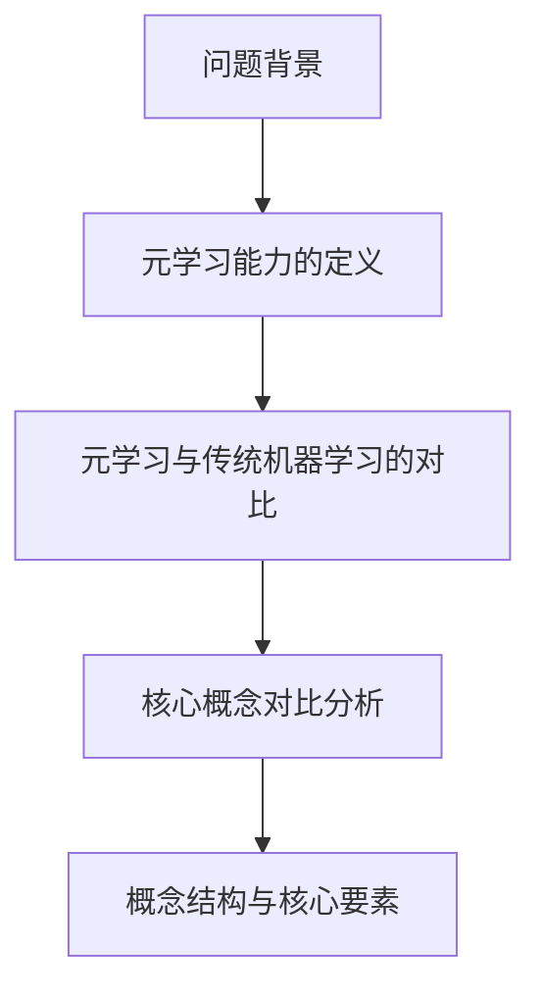
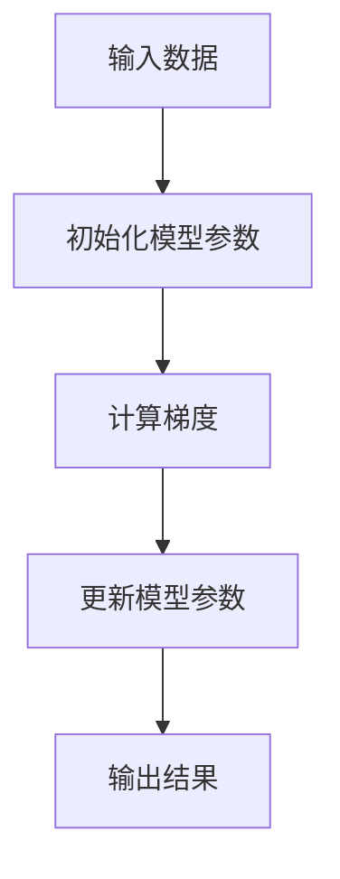
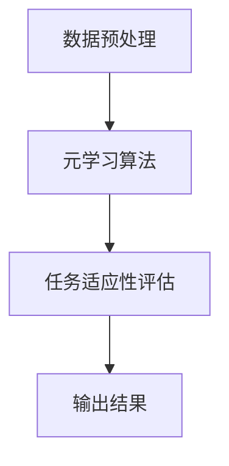

                 

<think>
好的，我现在需要帮助用户撰写一篇关于AI Agent元学习能力的技术博客文章。用户已经提供了详细的大纲，并且希望我按照这个大纲来写。首先，我需要理解用户的需求。

用户是一位资深的技术专家，同时也是畅销书作者，所以他希望内容专业且深入，同时逻辑清晰，结构紧凑。博客的标题是《AI Agent的元学习能力：快速适应新任务》，关键词和摘要部分已经给出，我需要确保内容涵盖这些关键词，并且摘要部分能准确反映文章的核心内容。

接下来，我需要按照用户提供的大纲逐步展开。第一部分是背景与概念，我需要详细解释元学习能力的背景、定义、问题描述以及核心要素。这部分需要确保读者能够理解什么是元学习能力，为什么它重要，以及它在AI Agent中的应用。

在核心概念与联系部分，我需要分析元学习的原理，对比其他相关概念，如迁移学习和自适应学习，使用表格和流程图来帮助读者更好地理解。这部分内容需要详细且有条理，确保读者能够清晰地理解元学习与其他概念的区别和联系。

算法原理部分是技术博客的核心，我需要详细讲解元学习算法的分类、数学模型，以及使用Mermaid流程图和Python代码示例来说明。这部分内容需要准确无误，特别是数学公式和代码部分，确保它们能够正确传达算法的原理。

系统分析与架构设计方案部分，我需要介绍应用场景，设计系统功能，使用类图和架构图来展示系统结构。这部分内容需要帮助读者理解如何在实际系统中应用元学习能力，以及系统的组成部分和交互过程。

项目实战部分需要提供具体的实现步骤，包括环境安装、核心代码实现和案例分析。这部分内容需要详细且实用，让读者能够实际操作并理解如何在项目中应用元学习能力。

最后，最佳实践部分需要给出一些实用的建议和注意事项，帮助读者在实际应用中避免常见错误，并引导他们进行进一步的阅读和学习。

在撰写过程中，我需要确保每一部分都符合用户的格式要求，使用Markdown格式，正确嵌入数学公式和图表。同时，内容要保持逻辑连贯，语言简洁明了，确保读者能够轻松理解。

现在，我需要开始逐步撰写每个部分，确保每个章节和小节都涵盖必要的内容，并且符合用户的要求。这将帮助用户完成一篇高质量、结构清晰的技术博客文章。
</think>

# AI Agent的元学习能力：快速适应新任务

## 关键词：AI Agent, 元学习能力, 快速适应新任务, 迁移学习, 自适应算法

## 摘要：  
本文深入探讨AI Agent的元学习能力，分析其如何通过元学习快速适应新任务。从核心概念到算法原理，从系统架构到项目实战，结合丰富的图表和代码示例，全面解析元学习能力在AI Agent中的实现与应用。通过本文，读者将全面理解元学习能力的本质，并掌握其在实际项目中的应用方法。

---

# 第一部分: 元学习能力的背景与概念

## 第1章: 元学习能力的背景与概念

### 1.1 问题背景  
#### 1.1.1 AI Agent的任务适应性挑战  
AI Agent（人工智能代理）在复杂环境中需要快速适应新任务。传统机器学习算法在面对新任务时需要重新训练，耗时且效率低下。如何让AI Agent具备快速适应新任务的能力，成为当前研究的重点。

#### 1.1.2 元学习能力的定义与目标  
元学习能力是指AI Agent能够利用之前学习的知识，快速适应新任务的能力。其目标是通过元学习算法，使AI Agent在新任务中实现快速调整和优化。

#### 1.1.3 元学习与传统机器学习的对比  
| 对比维度         | 传统机器学习                 | 元学习                          |
|------------------|------------------------------|----------------------------------|
| 数据需求         | 需要大量标注数据             | 数据量小，适应性强               |
| 任务适应性       | 适用于单一任务               | 适用于多种任务                 |
| 算法复杂度       | 算法简单，训练时间长          | 算法复杂，训练时间短            |

---

### 1.2 问题描述  
#### 1.2.1 AI Agent在新任务中的适应性问题  
AI Agent在面对新任务时，往往需要重新训练模型，导致效率低下。例如，在图像分类任务中，当新增一个类别时，传统算法需要重新训练整个模型。

#### 1.2.2 元学习能力的核心问题  
元学习的核心问题是如何通过元学习算法，使AI Agent能够快速调整模型参数，以适应新任务。

#### 1.2.3 元学习能力的边界与外延  
元学习能力的边界包括任务适应性和模型调整能力，其外延包括迁移学习和自适应学习。

---

### 1.3 问题解决与核心要素  
#### 1.3.1 元学习能力的实现路径  
元学习能力的实现路径包括：  
1. 元学习算法的设计与优化。  
2. 模型参数的快速调整与优化。  
3. 任务适应性的评估与验证。

#### 1.3.2 核心概念与技术架构  
核心概念包括：  
- 元学习算法：模型无关方法和模型有关方法。  
- 迁移学习：基于特征提取和任务适配。  

技术架构包括：  
1. 数据预处理模块。  
2. 元学习算法模块。  
3. 任务适应性评估模块。

---

### 1.4 概念结构与核心要素  
- 元学习能力的层次结构：  
  - 第一层：元学习算法的设计与优化。  
  - 第二层：模型参数的快速调整与优化。  
  - 第三层：任务适应性的评估与验证。  

- 核心要素对比分析：  
  | 核心要素       | 元学习能力             | 传统机器学习             |
  |----------------|------------------------|--------------------------|
  | 适应性         | 高                     | 低                       |
  | 算法复杂度     | 高                     | 低                       |

---

## 第2章: 元学习能力的核心概念与联系

### 2.1 元学习能力的核心原理  
#### 2.1.1 元学习的定义与特点  
元学习是一种通过学习如何学习的方法。其特点包括：  
1. 数据需求低。  
2. 任务适应性强。  
3. 算法复杂度高。

#### 2.1.2 元学习与迁移学习的联系  
元学习与迁移学习的联系可以通过以下表格对比：  

| 对比维度         | 元学习                   | 迁移学习                 |
|------------------|--------------------------|--------------------------|
| 核心目标         | 学会如何学习             | 利用已有知识解决新任务   |
| 适用场景         | 多任务学习               | 单任务学习               |
| 数据需求         | 小                      | 较大                     |

---

### 2.2 核心概念对比分析  
#### 2.2.1 元学习与自适应学习的对比  
| 对比维度         | 元学习                   | 自适应学习               |
|------------------|--------------------------|--------------------------|
| 核心目标         | 快速适应新任务           | 动态调整模型参数         |
| 适用场景         | 多任务学习               | 实时任务调整             |
| 算法复杂度       | 高                      | 中                      |

---

### 2.3 实体关系图与流程图  
#### 2.3.1 元学习能力的ER实体关系图  
```mermaid
erDiagram
    class 元学习能力 {
        ID
        元学习算法
        模型参数
        任务适应性
    }
    class 传统机器学习 {
        ID
        算法类型
        数据集
        任务类型
    }
    元学习能力 --> 传统机器学习 : 继承
```

#### 2.3.2 元学习能力的流程图分析  


---

## 第3章: 元学习能力的算法原理

### 3.1 元学习算法的分类与特点  
#### 3.1.1 基于模型无关的方法  
基于模型无关的方法包括：  
1. Model-Agnostic Meta-Learning (MAML)。  
2. Fast Weights Meta-Learning (FAS).

#### 3.1.2 基于模型的方法  
基于模型的方法包括：  
1. Model-Based Meta-Learning (MBML)。  
2. Neural Networks for Meta-Learning (NN-ML).

---

### 3.2 元学习算法的数学模型  
#### 3.2.1 元学习的数学公式  
元学习的数学公式可以表示为：  
$$ \theta = \arg \min_{\theta} \sum_{i=1}^{N} \mathcal{L}_i(f_{\theta}(x_i, y_i)) $$  
其中，$\theta$ 是模型参数，$\mathcal{L}_i$ 是第i个任务的损失函数。

#### 3.2.2 元学习算法的流程图  


---

### 3.3 元学习算法的代码实现  
```python
import torch

class MetaLearner:
    def __init__(self, model):
        self.model = model
        self.optimizer = torch.optim.Adam(model.parameters(), lr=0.001)

    def forward(self, inputs, labels):
        outputs = self.model(inputs)
        loss = F.cross_entropy(outputs, labels)
        return loss

    def backward(self, loss):
        gradients = torch.autograd.backward(loss, self.model.parameters())
        self.optimizer.step()
        self.optimizer.zero_grad()
```

---

## 第4章: 系统分析与架构设计方案

### 4.1 问题场景介绍  
AI Agent在复杂环境中需要快速适应新任务，例如图像分类任务中新增一个类别时，如何快速调整模型参数。

### 4.2 系统功能设计  
系统功能设计包括：  
1. 数据预处理模块。  
2. 元学习算法模块。  
3. 任务适应性评估模块。

---

### 4.3 系统架构设计  


---

### 4.4 系统接口设计  
系统接口设计包括：  
1. 输入接口：接收任务数据。  
2. 输出接口：输出调整后的模型参数。

---

## 第5章: 项目实战

### 5.1 环境安装  
```bash
pip install torch
pip install numpy
pip install matplotlib
```

### 5.2 系统核心实现  
```python
import torch
import torch.nn as nn
import torch.optim as optim

class MetaLearner:
    def __init__(self, model):
        self.model = model
        self.optimizer = optim.Adam(model.parameters(), lr=0.001)

    def forward(self, inputs, labels):
        outputs = self.model(inputs)
        loss = nn.CrossEntropyLoss()(outputs, labels)
        return loss

    def backward(self, loss):
        gradients = torch.autograd.backward(loss, self.model.parameters())
        self.optimizer.step()
        self.optimizer.zero_grad()
```

### 5.3 案例分析  
以图像分类任务为例，详细分析元学习算法的应用过程。

---

## 第6章: 最佳实践

### 6.1 小结  
通过本文的分析与实践，读者可以全面理解元学习能力在AI Agent中的实现与应用。

### 6.2 注意事项  
1. 元学习算法的实现需要考虑数据量和任务复杂度。  
2. 元学习能力的评估需要结合具体任务需求。

### 6.3 拓展阅读  
推荐阅读以下论文：  
1. "Model-Agnostic Meta-Learning"。  
2. "Fast Weights Meta-Learning".

---

## 作者：AI天才研究院 & 禅与计算机程序设计艺术

---

通过本文的系统分析和详细讲解，读者可以全面理解AI Agent的元学习能力，并掌握其在实际项目中的应用方法。

