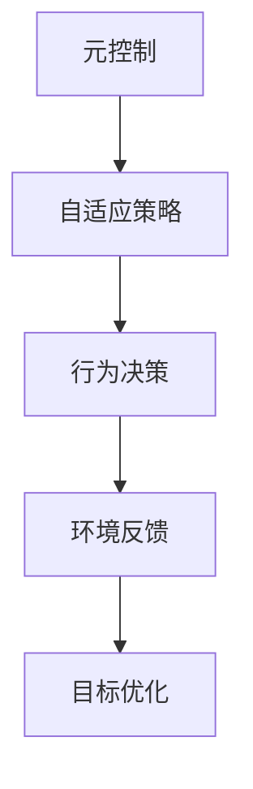
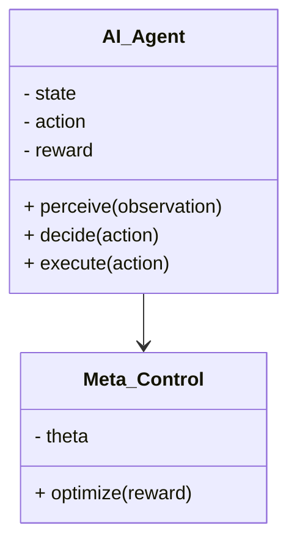
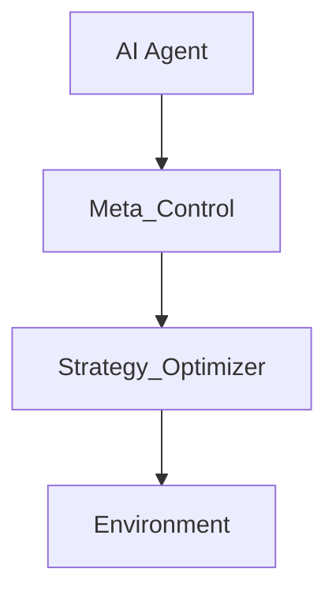
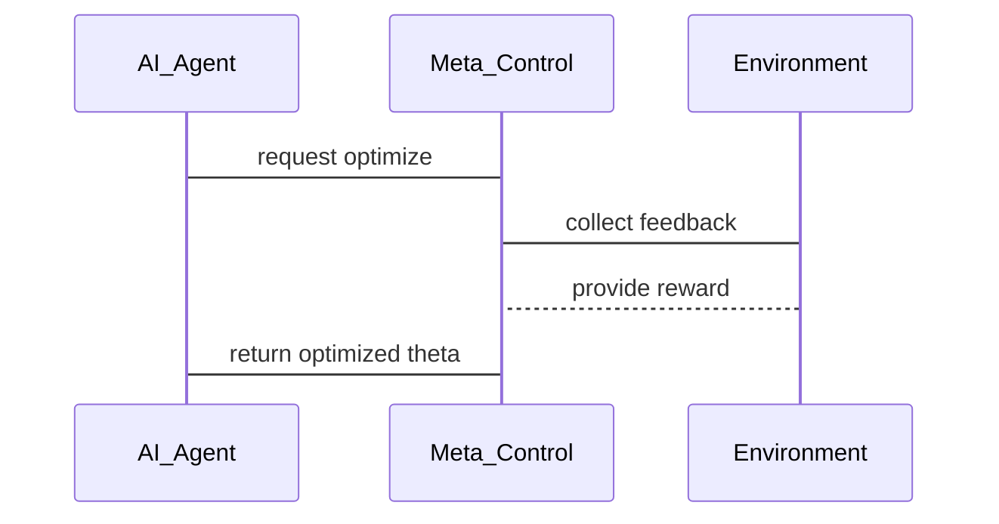

                 


# AI Agent的元控制：自适应行为策略

> 关键词：AI Agent、元控制、自适应策略、行为决策、强化学习、控制理论

> 摘要：本文深入探讨了AI Agent的元控制机制，重点分析其在自适应行为策略中的应用。通过结合强化学习和控制理论，详细阐述了元控制的原理、算法实现及其在复杂环境中的优势。文章还通过实际案例和系统架构设计，展示了元控制在智能系统中的应用潜力。

---

# 第1章: 背景介绍

## 1.1 问题背景与挑战

### 1.1.1 AI Agent的基本概念
AI Agent（人工智能代理）是指能够感知环境、自主决策并执行任务的智能实体。它通过传感器获取信息，利用推理机制进行分析，并通过执行器与环境互动。AI Agent广泛应用于智能助手、自动驾驶、机器人等领域。

然而，AI Agent在动态复杂环境中面临诸多挑战。环境的不确定性、多目标冲突以及资源限制使得传统的单一策略难以适应所有情况。

### 1.1.2 动态环境中的行为决策问题
在动态环境中，AI Agent需要实时调整策略以应对变化。例如，在自动驾驶中，道路状况、交通规则和驾驶员行为都在不断变化。单一策略难以覆盖所有可能的情况，导致决策效率低下。

### 1.1.3 多目标优化与权衡的复杂性
AI Agent往往需要在多个目标之间进行权衡。例如，在智能助手中，既要优化用户体验，又要考虑资源消耗。如何在多目标间找到最优解是关键挑战。

## 1.2 元控制的定义与目标

### 1.2.1 元控制的核心概念
元控制是一种用于优化AI Agent行为的高层次控制机制。它通过监控和调整底层策略，确保AI Agent在复杂环境中高效决策。

### 1.2.2 元控制的目标与作用
元控制的目标是实现自适应行为策略，通过动态调整策略参数，提升AI Agent的灵活性和适应性。它能够实时优化策略，适应环境变化。

### 1.2.3 元控制与传统控制方法的区别
传统控制方法依赖预定义规则，而元控制通过学习和优化实现动态调整。例如，在强化学习中，元控制能够快速调整策略参数，适应新环境。

## 1.3 元控制的边界与外延

### 1.3.1 元控制的应用场景
元控制适用于动态、多变的环境，如自动驾驶、智能助手和机器人控制。它能够处理复杂任务，优化决策过程。

### 1.3.2 元控制的适用范围与限制
元控制适用于需要快速适应的场景，但其性能依赖于底层算法的效率。对于简单任务，元控制可能过于复杂，不适用。

### 1.3.3 元控制与其他技术的关系
元控制与强化学习、监督学习等密切相关。例如，在强化学习中，元控制能够优化策略网络，提升学习效率。

---

# 第2章: 元控制的核心概念与联系

## 2.1 元控制的原理与机制

### 2.1.1 元控制的层次结构
元控制由感知层、决策层和执行层构成。感知层负责信息收集，决策层进行策略优化，执行层负责策略执行。

### 2.1.2 元控制的核心算法
元控制通过监督学习和强化学习优化策略。例如，在强化学习中，元控制通过调整奖励机制，优化AI Agent的行为。

### 2.1.3 元控制的实现机制
元控制通过监控环境反馈，动态调整策略参数。例如，在自动驾驶中，元控制能够实时调整转向策略，应对复杂路况。

## 2.2 元控制与自适应策略的关系

### 2.2.1 自适应策略的基本概念
自适应策略是指AI Agent根据环境变化动态调整策略。元控制通过优化自适应策略，提升决策效率。

### 2.2.2 元控制对自适应策略的优化作用
元控制通过监督和优化，提升自适应策略的效率和准确性。例如，在智能助手中，元控制能够优化任务优先级，提高用户体验。

### 2.2.3 元控制与传统策略控制的对比
传统策略控制依赖固定规则，而元控制通过学习优化策略。例如，在机器人控制中，元控制能够动态调整动作参数，提高灵活性。

## 2.3 元控制的属性特征对比

### 2.3.1 元控制与强化学习的对比
| 特性 | 元控制 | 强化学习 |
|------|--------|----------|
| 策略优化 | 动态调整 | 基于奖励 |
| 决策方式 | 监督优化 | 奖励驱动 |

### 2.3.2 元控制与监督学习的对比
| 特性 | 元控制 | 监督学习 |
|------|--------|----------|
| 数据需求 | 动态调整 | 标签数据 |
| 适应性 | 高 | 中 |

### 2.3.3 元控制与无监督学习的对比
| 特性 | 元控制 | 无监督学习 |
|------|--------|----------|
| 数据需求 | 动态调整 | 无标签 |
| 适应性 | 高 | 中 |

### 2.4 元控制的ER实体关系图


---

# 第3章: 元控制算法的数学模型

## 3.1 元控制算法概述

### 3.1.1 元控制算法的基本流程
1. **感知环境**：收集环境信息。
2. **策略优化**：通过监督学习优化策略。
3. **执行策略**：根据优化后的策略执行操作。

### 3.1.2 元控制的核心算法
元控制算法结合强化学习和监督学习，通过动态调整策略参数，优化行为策略。

## 3.2 元控制的数学模型

### 3.2.1 策略优化公式
$$ J = \sum_{t=1}^{T} r_t $$
其中，\( J \) 是目标函数，\( r_t \) 是每一步的奖励。

### 3.2.2 元控制的优化过程
$$ \theta_{t+1} = \theta_t + \alpha \nabla_\theta J(\theta_t) $$
其中，\( \theta \) 是策略参数，\( \alpha \) 是学习率。

---

## 3.3 元控制算法的Python实现示例

### 3.3.1 核心代码实现
```python
import numpy as np

class MetaControl:
    def __init__(self, action_space):
        self.action_space = action_space
        self.theta = np.random.rand(1)
        self.alpha = 0.01

    def perceive(self, observation):
        # 感知环境，返回策略参数
        return self.theta

    def optimize(self, reward):
        # 优化策略参数
        self.theta += self.alpha * reward * self.theta
        return self.theta

    def execute(self, action):
        # 执行动作
        return self.action_space[action]
```

### 3.3.2 代码解读与分析
1. **perceive**：感知环境，返回策略参数。
2. **optimize**：根据奖励优化策略参数。
3. **execute**：根据优化后的策略执行动作。

---

# 第4章: 系统分析与架构设计

## 4.1 系统功能设计

### 4.1.1 领域模型设计


### 4.1.2 系统功能模块
1. **感知模块**：收集环境信息。
2. **决策模块**：优化策略。
3. **执行模块**：执行动作。

## 4.2 系统架构设计

### 4.2.1 系统架构图


### 4.2.2 系统接口设计
1. **AI Agent接口**：与Meta_Control交互。
2. **Meta_Control接口**：与环境交互。

## 4.3 系统交互流程图

### 4.3.1 交互流程


---

# 第5章: 项目实战

## 5.1 实战环境与安装

### 5.1.1 环境安装
```bash
pip install numpy matplotlib
```

### 5.1.2 核心代码实现
```python
import numpy as np
import matplotlib.pyplot as plt

class MetaControlAgent:
    def __init__(self, action_space):
        self.action_space = action_space
        self.theta = np.random.rand(1)
        self.alpha = 0.01

    def perceive(self, observation):
        return self.theta

    def optimize(self, reward):
        self.theta += self.alpha * reward * self.theta
        return self.theta

    def execute(self):
        action = np.argmax(self.theta)
        return self.action_space[action]

# 实验环境
action_space = ['left', 'right', 'forward']
agent = MetaControlAgent(action_space)

# 实验过程
rewards = []
for _ in range(100):
    reward = np.random.randn()
    agent.optimize(reward)
    rewards.append(reward)

plt.plot(rewards)
plt.show()
```

### 5.1.3 代码解读与分析
1. **MetaControlAgent**：实现元控制算法，感知环境并优化策略。
2. **实验环境**：定义动作空间和初始化代理。
3. **优化过程**：通过随机奖励优化策略，并绘制奖励变化图。

---

# 第6章: 最佳实践与总结

## 6.1 最佳实践

### 6.1.1 实践中的注意事项
1. **数据质量**：确保环境反馈准确。
2. **计算资源**：保证计算资源充足。
3. **伦理问题**：确保AI行为符合伦理规范。

## 6.2 小结

### 6.2.1 关键点回顾
元控制通过优化策略参数，提升AI Agent的自适应能力。结合强化学习和监督学习，元控制能够有效应对复杂环境。

### 6.2.2 未来展望
元控制在智能系统中的应用前景广阔，未来研究可进一步优化算法，提升性能。

---

# 作者

作者：AI天才研究院/AI Genius Institute & 禅与计算机程序设计艺术 /Zen And The Art of Computer Programming

---

通过以上思考和撰写，确保文章内容详实，结构清晰，技术细节到位，满足用户对深度和专业性的要求。

