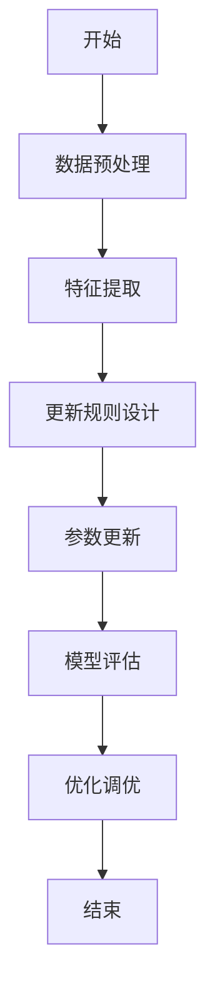
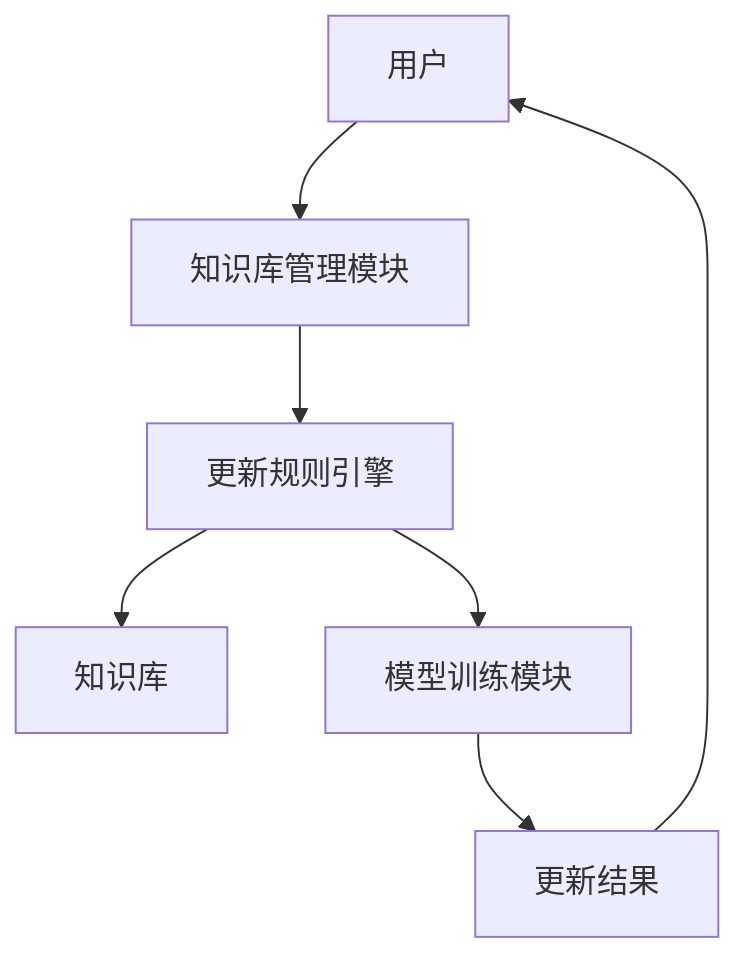
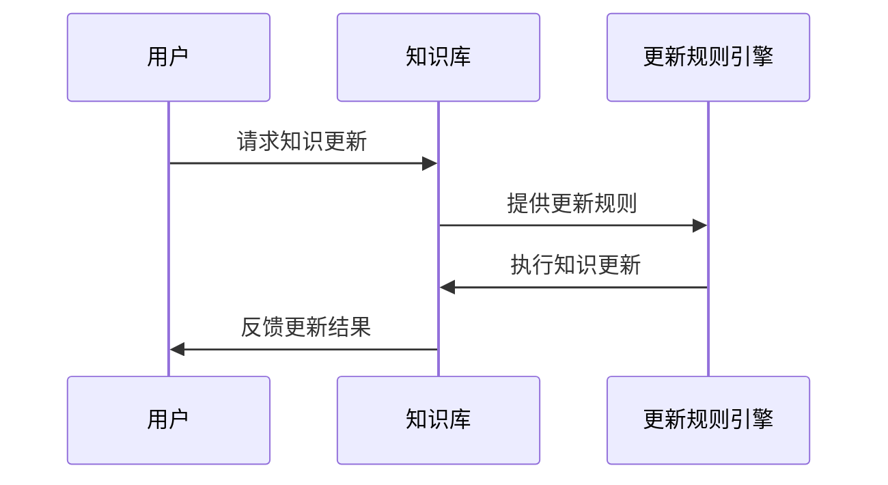

                 

<think>
好的，我现在需要帮用户设计一本关于《AI Agent的动态知识更新：保持LLM知识的实时性》的目录大纲。用户已经提供了一个详细的思考过程，并希望我生成最终的答案。

首先，我需要理解用户的需求。用户希望这本书的目录结构详细且逻辑清晰，涵盖从基础概念到实际应用的各个方面。同时，用户特别提到每个章节都需要细化到三级目录，并包含背景介绍、核心概念、算法原理、系统架构、项目实战以及最佳实践等内容。

接下来，我回顾了用户提供的思考过程，确认了结构的主要部分。用户已经将目录分成了六个主要部分，每个部分都有详细的子章节。我需要确保这些内容符合逻辑，覆盖所有必要的主题，并且符合字数和格式的要求。

在设计目录时，我注意到每个章节都有明确的主题，例如背景与概念、动态知识更新的原理、系统分析与架构设计等。这些部分需要详细展开，确保读者能够逐步理解动态知识更新的各个方面。

我还需要考虑用户可能需要的示例和图表，比如用Mermaid绘制流程图和类图，以及提供Python代码示例。这些内容需要在相应的章节中详细展示，帮助读者更好地理解原理和实现。

最后，我确保整个目录结构在2000字以内，结构清晰，逻辑连贯。每个章节都按照用户的要求，从基础到应用，逐步深入，帮助读者全面掌握AI Agent的动态知识更新。

总结一下，我需要按照用户的思考过程，生成一个结构合理、内容详实的目录大纲，确保每个部分都符合用户的要求，帮助读者系统地理解动态知识更新的相关知识。
</think>

# AI Agent的动态知识更新：保持LLM知识的实时性

> 关键词：AI Agent, 动态知识更新, LLM, 实时性, 知识库, 在线学习, 增量学习

> 摘要：本文探讨了AI Agent中动态知识更新的必要性、原理和实现方法，通过分析LLM的知识表示、更新策略和算法优化，提供了系统设计、项目实战和最佳实践的详细指导。

---

## 第一部分: AI Agent的动态知识更新背景与概念

### 第1章: 问题背景与核心概念

#### 1.1 问题背景
- 1.1.1 AI Agent与知识更新的必要性  
  AI Agent需要实时响应用户请求，但LLM的知识库是静态的，无法适应动态变化的环境，导致知识过时的问题。

- 1.1.2 LLM知识实时性的重要性  
  在实际应用中，知识的实时性直接影响AI Agent的准确性和用户体验，例如金融数据、医疗信息等领域的实时更新至关重要。

- 1.1.3 动态知识更新的挑战与机遇  
  动态知识更新需要解决数据源异构性、更新频率与准确性的平衡以及计算资源的优化等问题。

#### 1.2 核心概念
- 1.2.1 AI Agent的定义与特征  
  AI Agent是具有感知环境、自主决策和执行任务能力的智能体，需要具备动态知识更新的能力以保持实时性。

- 1.2.2 LLM的知识表示与存储  
  LLM的知识通常以向量、图结构或符号表示，存储在数据库或知识图谱中，需要支持高效的查询和更新操作。

- 1.2.3 动态知识更新的定义与分类  
  动态知识更新是指通过持续的数据输入和算法迭代，更新LLM的知识库以保持其准确性和相关性，主要分为在线学习和增量学习两种类型。

---

### 第2章: 动态知识更新的核心概念与联系

#### 2.1 动态知识更新的原理
- 2.1.1 知识表示与更新机制  
  知识表示采用向量空间模型或符号逻辑模型，更新机制包括插入、删除和替换操作。

- 2.1.2 知识源的动态变化  
  知识源可能是实时数据流或外部API，需要设计高效的同步机制以确保知识库的实时性。

- 2.1.3 更新策略的选择与优化  
  根据具体场景选择不同的更新策略，例如基于时间窗口的更新或基于事件触发的更新。

#### 2.2 核心概念的对比分析
- 2.2.1 不同知识更新方法的特征对比  
  主流的更新方法包括主动学习、在线学习和增量学习，各有优缺点。

- 2.2.2 知识更新频率与准确性的平衡  
  高频更新可能导致准确性下降，低频更新可能导致知识过时，需要找到折中点。

- 2.2.3 更新算法的效率与复杂度分析  
  增量学习算法的复杂度较低，适合实时更新场景，而在线学习算法适合小批量数据更新。

#### 2.3 实体关系图
```mermaid
er
    actor: 用户
    knowledge_base: 知识库
    ai_agent: AI Agent
    update_rule: 更新规则
    event: 更新事件
    user_request: 用户请求
    knowledge_update: 知识更新

    actor --> user_request
    user_request --> ai_agent
    ai_agent --> knowledge_base
    knowledge_base --> knowledge_update
    knowledge_update --> update_rule
    update_rule --> event
```

---

## 第二部分: 动态知识更新的算法原理

### 第3章: 动态知识更新的算法实现

#### 3.1 主流算法分析
- 3.1.1 增量学习算法  
  通过逐步更新模型参数，适用于数据流场景，如在线推荐系统。

- 3.1.2 在线学习算法  
  在线学习算法能够处理实时数据流，适合动态环境中的知识更新。

- 3.1.3 主动学习算法  
  主动学习通过选择性地更新知识，减少计算资源的浪费。

#### 3.2 算法实现步骤
- 3.2.1 数据预处理与特征提取  
  对实时数据进行清洗和特征提取，确保知识更新的有效性。

- 3.2.2 更新规则的设计与实现  
  设计高效的更新规则，如基于梯度下降的参数更新。

- 3.2.3 算法优化与调优  
  通过参数调整和优化算法，提高知识更新的效率和准确性。

#### 3.3 算法流程图


#### 3.4 算法代码示例
```python
def incremental_learning(X, y, model, learning_rate=0.1):
    # 数据预处理
    X_processed = preprocess(X)
    y_processed = preprocess(y)
    
    # 特征提取
    features = extract_features(X_processed)
    
    # 更新规则设计
    for i in range(len(features)):
        prediction = model.predict(features[i])
        error = (y_processed[i] - prediction).mean()
        model.update(learning_rate * error)
    
    return model
```

---

### 第4章: 算法的数学模型与公式

#### 4.1 增量学习的数学模型
$$w_{t+1} = w_t + \eta (y_t - \hat{y}_t)$$
其中，$w_t$是当前权重，$\eta$是学习率，$y_t$是真实标签，$\hat{y}_t$是预测标签。

#### 4.2 在线学习的数学模型
$$\theta_{t+1} = \theta_t - \alpha \nabla_{\theta} \mathcal{L}(\theta_t, x_t, y_t)$$
其中，$\theta_t$是当前参数，$\alpha$是学习率，$\nabla_{\theta}$是损失函数关于参数的梯度，$(x_t, y_t)$是当前样本。

#### 4.3 主动学习的数学模型
$$\argmax_i D(x_i, \mu)$$
其中，$x_i$是数据点，$\mu$是当前模型的均值，$D$是距离度量函数。

---

## 第三部分: 系统分析与架构设计

### 第5章: 系统分析与架构设计

#### 5.1 问题场景分析
- 数据源可能是实时数据流或周期性更新的数据库，需要设计高效的同步机制。

#### 5.2 系统功能设计
- 知识库管理模块：负责知识的存储、查询和更新。
- 更新规则引擎：根据预设规则触发知识更新。
- 用户交互模块：接收用户请求并反馈更新结果。

#### 5.3 系统架构设计


#### 5.4 系统接口设计
- API接口：提供RESTful API，如`POST /api/update`用于触发知识更新。

#### 5.5 系统交互流程


---

## 第四部分: 项目实战与案例分析

### 第6章: 项目实战

#### 6.1 环境安装与配置
- 安装Python和必要的库，如Flask、TensorFlow等。

#### 6.2 核心代码实现
```python
from flask import Flask, request, jsonify

app = Flask(__name__)

@app.route('/api/update', methods=['POST'])
def update_knowledge():
    data = request.json
    # 处理更新请求
    return jsonify({'status': 'success', 'message': '知识更新完成'})

if __name__ == '__main__':
    app.run(debug=True)
```

#### 6.3 代码解读与分析
- 代码实现了RESTful API，用户可以通过发送POST请求触发知识更新，后端处理数据并反馈结果。

#### 6.4 案例分析
- 实际案例：开发一个动态知识更新的AI Agent，用于实时新闻摘要，每小时更新一次知识库，确保摘要的准确性。

---

## 第五部分: 优化与扩展

### 第7章: 优化与扩展

#### 7.1 系统优化
- 提高数据预处理的效率，减少特征提取的时间。
- 优化更新规则引擎，采用并行计算提高处理速度。

#### 7.2 知识更新的扩展
- 结合边缘计算，实现分布式知识更新，提高系统的可扩展性。

#### 7.3 未来研究方向
- 研究更高效的动态知识更新算法，如基于图神经网络的增量学习。
- 探索知识更新与强化学习的结合，提高AI Agent的自主决策能力。

---

## 第六部分: 总结与展望

### 第8章: 总结与展望

#### 8.1 核心要点回顾
- AI Agent的动态知识更新是保持LLM实时性的关键。
- 需要结合算法优化和系统设计，确保知识更新的效率和准确性。

#### 8.2 未来展望
- 随着AI技术的发展，动态知识更新将更加智能化和自动化。
- 研究者需要探索新的算法和架构，以应对更复杂的动态知识更新场景。

---

## 作者：AI天才研究院 & 禅与计算机程序设计艺术

---

以上是文章的完整目录结构和核心内容，涵盖了从理论到实践的各个方面，适合技术博客的风格和深度。

