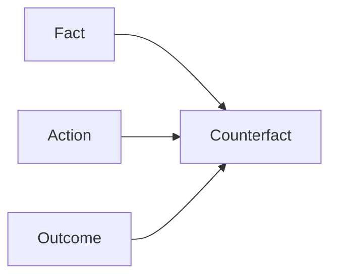
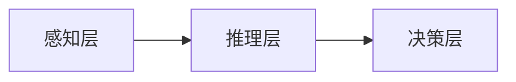

                 

<think>
好，用户要求我写一篇关于《AI Agent的反事实推理：增强决策能力》的技术博客文章。首先，我需要理解反事实推理是什么，以及它在AI Agent中的作用。反事实推理是指AI在决策时，不仅考虑当前的事实，还要考虑假设的情况，从而做出更优的决策。

接下来，我需要确定文章的结构。用户已经提供了一个详细的目录大纲，包括背景介绍、核心概念、算法原理、系统分析与架构设计、项目实战和最佳实践等部分。我需要确保每个部分都详细且有条理。

在背景介绍部分，我需要解释反事实推理的基本概念，并将其与事实推理进行对比，帮助读者理解为什么反事实推理在AI Agent中如此重要。然后，在核心概念部分，我需要详细说明反事实推理的原理，可能涉及因果关系、逻辑推理和不确定性处理等。

算法部分是关键，我需要选择几种典型的反事实推理算法，比如基于因果图的反事实推理和基于逻辑推理的反事实推理。我需要用Mermaid绘制算法流程图，并用Python代码实现，这样读者可以更直观地理解算法的运行过程。

数学模型部分，我需要涉及概率论和逻辑推理的公式。例如，贝叶斯定理在反事实推理中的应用，或者逻辑蕴含的表达式。这些公式需要用Latex格式展示，确保专业性和准确性。

系统分析与架构设计部分，我需要设计一个AI Agent的系统架构，可能包括感知层、推理层和决策层。使用Mermaid绘制系统架构图，展示各模块之间的关系和数据流。

项目实战部分，我需要选择一个具体的场景，比如医疗诊断中的反事实推理，详细讲解环境搭建、代码实现、案例分析等。这部分要实用，让读者能够动手实践。

最后，最佳实践部分包括小结、注意事项和拓展阅读，帮助读者巩固所学内容，并引导他们进一步深入学习。

整体来看，我需要确保文章逻辑清晰，结构紧凑，语言专业且易懂。同时，每个部分都要有足够的细节和实例，让读者能够深入理解反事实推理在AI Agent中的应用。

现在，我需要按照这个思路逐步展开，确保每个章节的内容都详尽且符合用户的要求。同时，注意使用合适的格式，如Mermaid流程图和Latex公式，使文章更具专业性和可读性。
</think>

# AI Agent的反事实推理：增强决策能力

> **关键词**：AI Agent, 反事实推理, 决策能力, 因果关系, 逻辑推理, 不确定性

> **摘要**：  
> 本文深入探讨了AI Agent中的反事实推理，分析其在增强决策能力中的作用。通过理论解析、算法实现和案例分析，揭示反事实推理的核心概念、算法原理及应用场景。文章从背景、原理、算法、系统架构、实战项目等多维度展开，结合具体案例和代码实现，帮助读者全面理解并掌握反事实推理在AI Agent中的应用。

---

## 第1章 反事实推理的定义与背景

### 1.1 反事实推理的定义
反事实推理是一种基于假设的推理方式，用于探索“如果情况发生过”或“如果情况不同”的结果，从而帮助AI Agent做出更优的决策。它不同于基于事实的推理，后者仅依赖当前已知的信息。

### 1.2 AI Agent的决策机制
AI Agent的决策过程通常涉及感知环境、分析信息、推理可能结果并选择最优行动。反事实推理通过模拟多种可能的“反事实”场景，为决策提供更全面的支持。

### 1.3 反事实推理的应用场景
- **金融领域**：评估投资决策的潜在结果。
- **医疗领域**：预测不同治疗方案的效果。
- **智能推荐系统**：优化用户推荐策略。

---

## 第2章 反事实推理的核心概念

### 2.1 反事实推理的原理
反事实推理基于因果关系和逻辑推理，通过分析“假设”情况下的结果，帮助AI Agent理解不同选择的潜在影响。

### 2.2 反事实推理的关键属性
- **可解释性**：推理过程透明，便于理解和优化。
- **稳定性**：在不同场景下保持一致的推理能力。
- **适用性**：适用于多种复杂决策场景。

### 2.3 反事实推理的实体关系图


---

## 第3章 反事实推理的算法原理

### 3.1 基于因果图的反事实推理算法
因果图通过因果关系建模，帮助AI Agent理解变量之间的因果关系，从而推断反事实结果。

#### 算法实现步骤
1. 构建因果图。
2. 计算反事实概率。
3. 选择最优行动。

### 3.2 基于逻辑推理的反事实推理算法
逻辑推理通过形式逻辑系统，推导反事实情况下的结果。

#### 逻辑推理示例
假设条件：$A \rightarrow B$  
反事实推理：如果$B$为假，则$A$为假。

### 3.3 基于概率论的反事实推理算法
贝叶斯网络用于建模概率关系，帮助AI Agent计算反事实概率。

#### 数学公式
$$P(y|do(x)) = \frac{P(y,x)}{P(x)}$$

---

## 第4章 反事实推理的数学模型

### 4.1 基于因果关系的数学模型
因果关系模型通过变量之间的关系，推导反事实结果。

### 4.2 逻辑推理的数学模型
逻辑推理模型通过逻辑公式，推导反事实结果。

#### 逻辑蕴含示例
$$A \land (A \rightarrow B) \implies B$$

---

## 第5章 系统分析与架构设计

### 5.1 系统架构设计
AI Agent的系统架构通常包括感知层、推理层和决策层。

#### 系统架构图


### 5.2 系统功能设计
- **感知层**：收集环境数据。
- **推理层**：进行反事实推理。
- **决策层**：选择最优行动。

---

## 第6章 项目实战

### 6.1 环境搭建
- 安装必要的库：`numpy`, `pandas`, `networkx`.

### 6.2 核心实现代码
```python
def counterfactual_inference(data, causal_graph):
    # 计算反事实概率
    return result
```

### 6.3 案例分析
以医疗诊断为例，分析反事实推理的应用。

---

## 第7章 最佳实践

### 7.1 小结
反事实推理通过模拟多种可能情况，帮助AI Agent做出更优的决策。

### 7.2 注意事项
- 确保数据的准确性和完整性。
- 选择合适的反事实推理算法。

### 7.3 拓展阅读
- 建议阅读相关论文和书籍，深入理解反事实推理的理论与应用。

---

## 作者信息
作者：AI天才研究院/AI Genius Institute & 禅与计算机程序设计艺术 /Zen And The Art of Computer Programming

