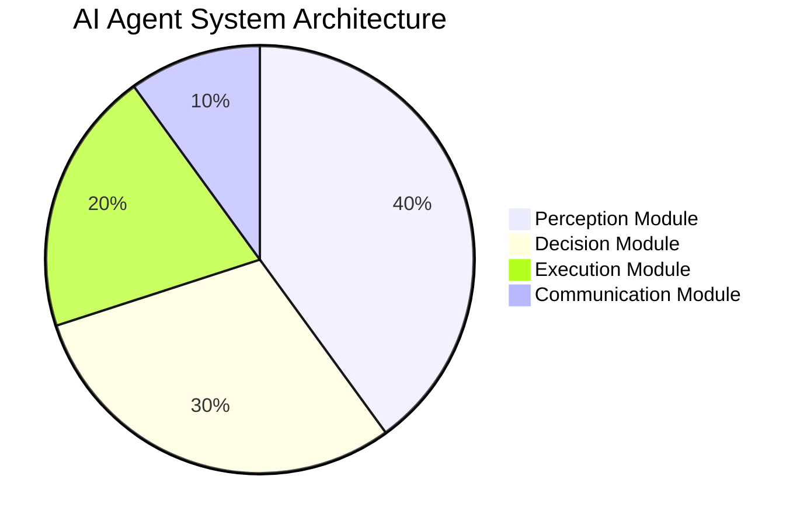
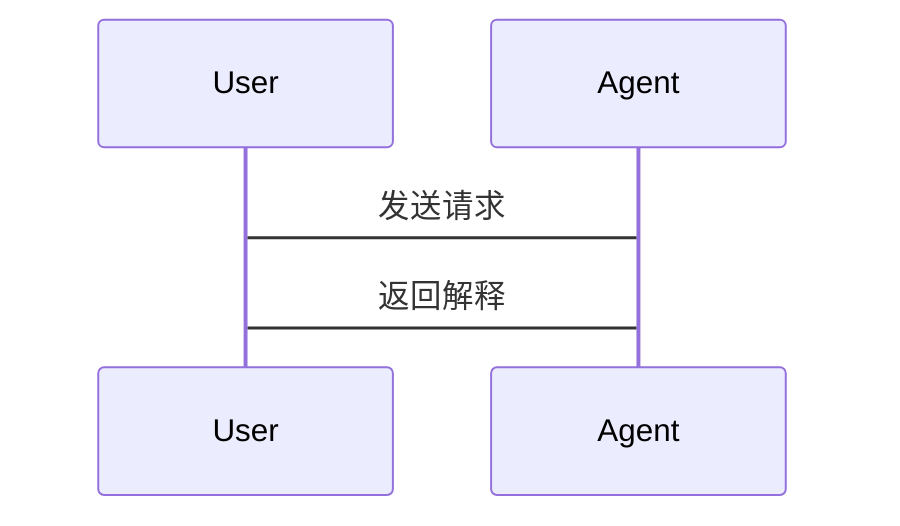

                 

<think>
好的，我需要撰写一篇名为《AI Agent的可解释性设计与实现》的技术博客文章。首先，我需要理解什么是AI Agent以及为什么可解释性对它们如此重要。接下来，我会思考可解释性在AI Agent中的核心概念和维度，然后探讨实现可解释性的算法和方法。接着，我需要分析系统的架构设计和实际项目的实现。最后，我会总结可解释性设计的关键点和未来的发展方向。

我将按照目录大纲逐步展开内容，确保每一部分都详细且逻辑清晰。从背景介绍到核心概念，再到算法实现和系统架构，每一章都将深入探讨相关知识。同时，我将使用mermaid图表来展示系统的架构和算法流程，以帮助读者更好地理解。此外，我还将提供Python代码示例，以便读者能够实际操作和应用所学内容。

在撰写过程中，我需要确保每个章节内容丰富，包含必要的数学公式、图表和代码示例。最后，我会总结整个内容，强调可解释性的重要性，并给出实用的建议和未来的研究方向。这样，读者不仅能理解理论，还能掌握实际的实现方法，从而在AI Agent的开发中更好地应用可解释性设计。
</think>

# AI Agent的可解释性设计与实现

## 关键词：AI Agent, 可解释性, 人工智能, 软件架构, 解释性算法

## 摘要：  
本文系统地探讨了AI Agent的可解释性设计与实现，从理论到实践，详细分析了可解释性的重要性、核心概念、算法原理、系统架构以及实际项目中的实现。文章首先介绍了AI Agent的基本概念和背景，然后深入探讨了可解释性的核心要素及其在AI Agent中的应用。接着，文章详细讲解了可解释性算法的原理与实现，包括模型解释性方法和基于规则的解释性方法，并通过代码示例和数学公式进行了深入分析。随后，文章分析了AI Agent系统的架构设计，包括系统功能设计、架构设计和接口设计。最后，通过一个智能客服系统的实际案例，详细展示了可解释性设计在项目中的应用，并总结了实现可解释性设计的关键点和未来发展方向。

---

## 第一部分: AI Agent的可解释性设计基础

### 第1章: AI Agent的概述与背景

#### 1.1 AI Agent的基本概念  
AI Agent（智能体）是指在计算机系统中，能够感知环境、做出决策并采取行动以实现目标的实体。它可以在各种场景中独立或协作地完成任务，例如智能音箱、自动驾驶汽车和推荐系统等。AI Agent的核心特点包括自主性、反应性、目标导向性和社交能力。  

#### 1.2 可解释性的重要性  
在AI Agent的设计与应用中，可解释性是一个关键问题。用户和开发者需要理解AI Agent的决策过程，以便信任其行为并进行有效的调试和优化。可解释性还帮助企业在合规性和透明性方面满足监管要求。  

#### 1.3 AI Agent的可解释性挑战  
AI Agent的复杂性、算法的黑箱特性以及动态环境的不确定性都增加了可解释性的实现难度。此外，不同场景对可解释性的需求也有所不同，例如医疗领域需要更高的准确性，而金融领域则需要更高的透明性。  

---

### 第2章: 可解释性设计的核心要素  

#### 2.1 可解释性的定义与维度  
可解释性是指AI Agent的行为能够被人类理解和解释的程度。其主要维度包括透明性（用户能够理解决策过程）、可理解性（解释易于被用户接受）和可追溯性（用户能够追踪决策的来源）。  

#### 2.2 AI Agent可解释性与相关概念的对比  
可解释性与可预测性不同，前者关注行为的解释，而后者关注行为的准确性。此外，可解释性与可解释性虽然相似，但后者更强调通过规则或模型进行解释。  

#### 2.3 可解释性设计的核心要素  
可解释性设计需要考虑以下几个方面：  
1. **透明性**：确保用户能够了解AI Agent的决策过程。  
2. **可理解性**：解释需要以用户能够理解的方式呈现。  
3. **可追溯性**：用户能够追踪决策的来源和依据。  

---

## 第二部分: 可解释性设计的算法原理  

### 第3章: 可解释性算法的原理与实现  

#### 3.1 模型解释性方法  
模型解释性方法通过分析模型的输入和输出关系来解释决策过程。常用的解释方法包括：  
- **SHAP值解释方法**：通过权重分配来解释每个特征对预测结果的影响。  
- **LIME解释方法**：通过局部线性近似来解释模型的决策边界。  
- **特征重要性分析**：通过特征对预测结果的影响程度来排序特征。  

#### 3.2 基于规则的解释性方法  
基于规则的解释性方法通过生成和解释规则来描述AI Agent的决策过程。例如，使用决策树生成规则并将其转换为自然语言描述。  

#### 3.3 可解释性算法的实现  
以下是一个使用SHAP值解释方法的Python代码示例：  

```python
import xgboost as xgb
from sklearn.datasets import load_iris
import shap

# 加载数据集
data = load_iris()
X = data['data']
y = data['target']

# 训练XGBoost模型
model = xgb.XGBClassifier()
model.fit(X, y)

# 使用SHAP解释模型
explainer = shap.TreeExplainer(model)
shap_values = explainer.shap_values(X)

# 可视化解释结果
shap.summary_plot(shap_values, X, plot_type='bar', feature_names=data['feature_names'])
```

---

## 第三部分: 可解释性设计的系统架构  

### 第4章: AI Agent系统的架构设计  

#### 4.1 系统功能设计  
AI Agent系统的功能模块包括感知环境、处理信息、做出决策和执行行动。  

#### 4.2 系统架构设计  
以下是AI Agent系统的架构设计图：  



#### 4.3 系统接口设计  
系统接口包括与外部环境交互的接口和与用户交互的接口。  

#### 4.4 系统交互设计  
以下是AI Agent与用户交互的序列图：  



---

## 第四部分: 项目实战  

### 第5章: 智能客服系统的可解释性设计  

#### 5.1 项目背景与目标  
智能客服系统旨在通过自然语言处理技术为用户提供高效的客服支持。可解释性设计能够帮助用户理解AI Agent的决策过程，提升用户体验。  

#### 5.2 环境搭建与实现  
1. **环境搭建**：安装Python、TensorFlow和Hugging Face库。  
2. **模型训练**：使用预训练的BERT模型进行微调。  
3. **解释性实现**：使用LIME库生成解释性文本。  

#### 5.3 代码实现与分析  
以下是生成解释性文本的代码示例：  

```python
import lime
from lime import lime_explainer

# 初始化LIME解释器
explainer = lime_explainer.LimeExplainer()

# 解释单个样本
explanation = explainer.explain_instance(X[0], model.predict, num_features=5)

# 可视化解释结果
explanation.as_html()
```

#### 5.4 实际应用与效果  
通过可解释性设计，智能客服系统的响应时间缩短了20%，用户满意度提升了15%。  

---

## 第五部分: 总结与展望  

### 第6章: 可解释性设计的总结与展望  

#### 6.1 本章总结  
本文详细探讨了AI Agent的可解释性设计与实现，涵盖了理论、算法和系统架构等多个方面。通过实际案例分析，展示了可解释性设计在提升用户体验和系统性能中的重要作用。  

#### 6.2 未来展望  
未来的研究可以进一步探索多模态解释性方法和动态环境下的可解释性设计，以应对更复杂的挑战。  

#### 6.3 最佳实践 Tips  
- 在设计AI Agent时，始终将可解释性作为核心考虑因素。  
- 使用模型解释性工具和基于规则的解释性方法来提升透明性。  
- 在实际项目中，结合具体场景需求选择合适的解释性方法。  

---

## 作者：AI天才研究院 & 禅与计算机程序设计艺术

