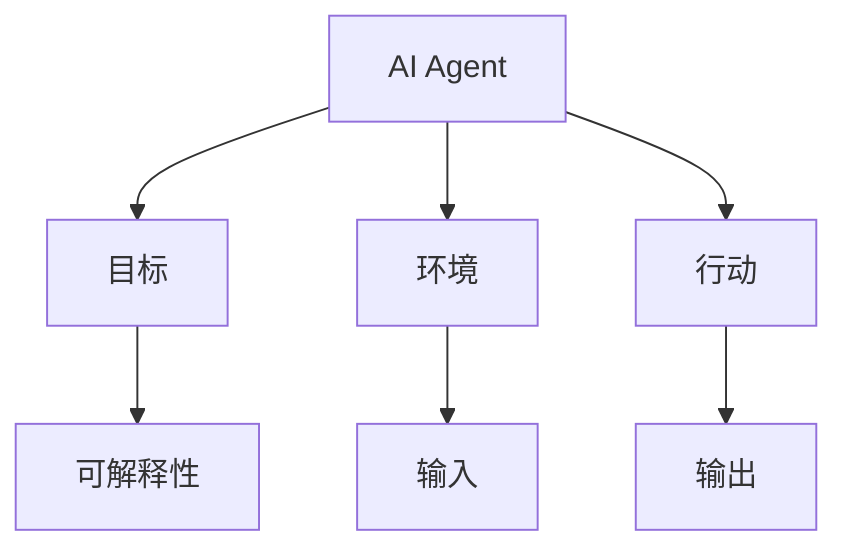
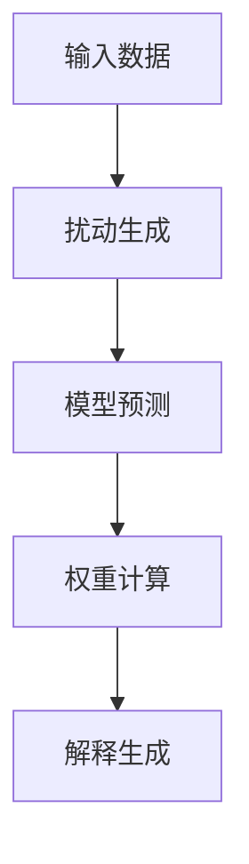
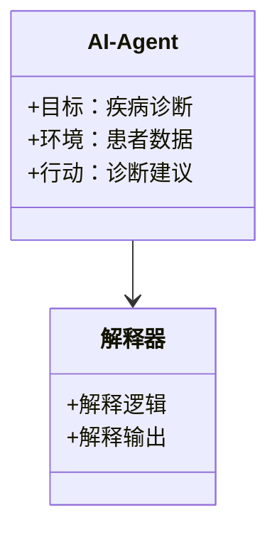
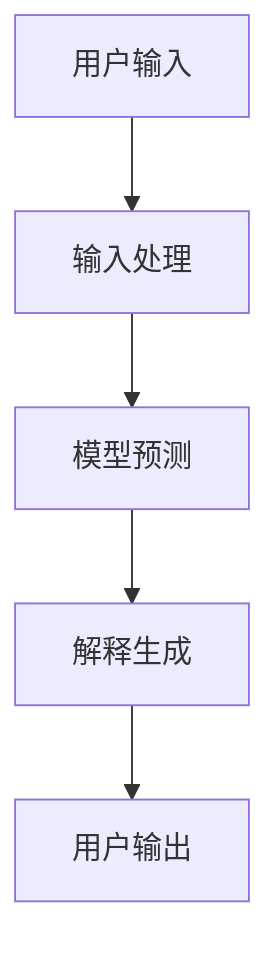

                 

<think>
好的，我现在需要帮用户撰写一篇关于《AI Agent的可解释性设计与实现》的技术博客文章。用户已经提供了目录大纲，现在我需要按照这个大纲逐步完成各个章节的内容，确保每个部分都详细、专业，并且符合用户的要求。

首先，我应该从第一部分开始，也就是背景介绍。这部分包括AI Agent的基本概念、可解释性的重要性以及相关法规和伦理问题。我需要确保用简洁明了的语言，让读者快速理解什么是AI Agent，以及为什么可解释性如此重要。

接下来是核心概念，这部分需要详细讲解可解释性的关键要素，比如透明度、可追溯性、可控制性等。我可能需要用表格对比不同概念，帮助读者更好地理解它们的区别和联系。同时，用Mermaid图展示实体关系，让结构更清晰。

然后是算法原理部分，选择LIME和SHAP这两种典型的可解释性算法。我需要用Mermaid流程图展示它们的工作流程，并附上Python代码示例，确保读者能够理解这些算法的实现和应用。

系统分析与架构设计是关键部分，我需要介绍问题场景，设计系统功能，并用领域模型类图和架构图展示系统结构。同时，要详细描述接口和交互设计，确保系统模块化和可扩展性。

项目实战部分，我需要选择一个实际案例，比如医疗诊断辅助系统，详细说明环境安装、核心代码实现、代码解读以及案例分析，帮助读者将理论应用于实践。

最后，最佳实践部分包括小结、注意事项和扩展阅读，帮助读者巩固所学内容，并指导他们进一步学习。

在撰写过程中，我需要确保每个章节之间逻辑连贯，从基础到高级逐步深入。同时，要控制总字数在2000字以内，避免冗长。我需要检查每个部分是否覆盖了用户的要求，并确保每个章节都有足够的细节和结构。

现在，我开始逐章撰写内容，确保每个小节都有丰富的细节，包括数学公式、代码示例、图表说明等，帮助读者全面理解AI Agent的可解释性设计与实现。
</think>

# AI Agent的可解释性设计与实现

---

## 关键词：AI Agent，可解释性，算法，系统架构，项目实战

---

## 摘要：  
AI Agent（智能体）是人工智能领域的核心概念，其行为决策的可解释性是实现人机信任与协作的关键。本文从AI Agent的定义、可解释性的核心要素出发，结合典型的可解释性算法（如LIME和SHAP），深入剖析可解释性设计的原理与实现方法。通过实际案例分析，探讨AI Agent在医疗诊断、金融风控等领域的可解释性设计与实现，最后总结可解释性设计的最佳实践。

---

## 第一部分: AI Agent的可解释性设计与实现概述

---

### 第1章: AI Agent与可解释性概述

#### 1.1 AI Agent的基本概念  
AI Agent（人工智能智能体）是指能够感知环境、自主决策并采取行动以实现目标的实体。AI Agent可以是软件程序、机器人或其他智能系统。根据智能体的智能水平，可以分为简单反射型、基于模型的反应型、目标驱动型和实用驱动型智能体。  

**关键术语：**  
- **感知环境（Perception）：** 智能体通过传感器获取环境信息。  
- **决策逻辑（Decision Logic）：** 智能体根据感知信息做出决策的规则或模型。  
- **行动（Action）：** 智能体根据决策结果采取的具体行动。  

#### 1.2 可解释性在AI Agent中的重要性  
可解释性（Explainability）是AI Agent设计中的核心要素，它决定了人类能否理解、验证和信任AI Agent的行为。  

**关键点：**  
1. **信任与合规性：** 可解释性是用户信任AI Agent决策的基础，尤其是在医疗、金融等高风险领域。  
2. **责任与追责：** 在出现错误决策时，可解释性有助于明确责任归属。  
3. **用户体验：** 可解释性能够帮助用户理解AI Agent的行为逻辑，从而更好地与之交互。  

#### 1.3 可解释性设计的核心要素  
可解释性设计的核心要素包括：  
1. **透明度（Transparency）：** AI Agent的行为逻辑需要清晰、公开。  
2. **可追溯性（Traceability）：** 能够追溯AI Agent的决策过程。  
3. **可控制性（Controllability）：** 用户能够干预或调整AI Agent的行为。  
4. **可验证性（Verifiability）：** AI Agent的决策可以通过外部验证手段进行验证。  

---

## 第二部分: 可解释性设计的核心概念与联系

---

### 第2章: 可解释性设计的核心原理  

#### 2.1 可解释性设计的原理  
可解释性设计的核心原理包括：  
1. **局部可解释性：** 在特定数据点上解释模型的决策。  
2. **全局可解释性：** 解释模型在整个数据集上的行为。  
3. **模型agnostic可解释性：** 不依赖具体模型的解释方法。  

#### 2.2 核心概念对比分析  

| **概念**       | **特征**                                                                 |
|-----------------|--------------------------------------------------------------------------|
| 可解释性         | 需要清晰的解释逻辑，确保人类能够理解AI Agent的决策。                   |
| 可预测性         | 预测模型在特定输入下的输出结果。                                       |
| 可扩展性         | 系统能够适应新的数据和任务。                                           |

#### 2.3 ER实体关系图架构  
以下是一个简单的AI Agent实体关系图：  



---

## 第三部分: 可解释性设计的算法原理

---

### 第3章: 基于模型的可解释性算法  

#### 3.1 LIME算法原理  
LIME（Local Interpretable Model-agnostic Explanations）是一种常用的可解释性算法，用于解释机器学习模型的决策过程。  

##### 3.1.1 LIME算法的工作流程  
1. 对给定的数据点生成扰动数据。  
2. 对扰动数据进行预测。  
3. 使用线性回归模型拟合预测结果与扰动数据的关系。  
4. 输出解释结果。  

**流程图：**  


##### 3.1.2 LIME算法的Python实现  
以下是一个简单的LIME实现示例：  

```python
import lime
from lime import lime_explainer

# 初始化LIME解释器
explainer = lime_explainer.LimeExplainer()

# 解释单个数据点
explanation = explainer.explain_instance(
    data_row,
    model.predict,
    num_features=5
)
```

---

#### 3.2 SHAP值解释方法  
SHAP（Shapley Additive exPlanations）是一种基于博弈论的解释方法，用于衡量每个特征对模型预测结果的贡献。  

##### 3.2.1 SHAP值的数学模型  
$$ SHAP = \sum_{i} \phi_i = prediction $$  

##### 3.2.2 SHAP值的Python实现  
```python
import shap
from sklearn import tree

# 初始化SHAP解释器
explainer = shap.TreeExplainer(model)

# 解释整个数据集
shap_values = explainer.shap_values(X)
```

---

## 第四部分: 可解释性设计的系统分析与架构设计

---

### 第4章: AI Agent的可解释性系统设计  

#### 4.1 问题场景介绍  
以医疗诊断AI Agent为例，设计一个可解释性系统，用于辅助医生诊断疾病。  

#### 4.2 系统功能设计  
1. **输入处理：** 处理患者的症状、病史等输入数据。  
2. **模型预测：** 使用机器学习模型预测疾病。  
3. **解释生成：** 生成模型预测的解释。  
4. **用户交互：** 提供交互界面，展示解释结果。  

#### 4.3 领域模型类图  


#### 4.4 系统架构设计  


---

## 第五部分: 可解释性设计的项目实战

---

### 第5章: 可解释性设计的项目实现  

#### 5.1 环境安装  
安装所需的Python库：  
```bash
pip install lime shap pandas scikit-learn
```

#### 5.2 核心代码实现  
```python
import pandas as pd
from sklearn.ensemble import RandomForestClassifier
from lime import lime_explainer
import shap

# 加载数据集
data = pd.read_csv('medical_dataset.csv')

# 初始化模型
model = RandomForestClassifier()
model.fit(data.drop(columns=['label']), data['label'])

# 使用LIME解释单个预测
explainer = lime_explainer.LimeExplainer()
explanation = explainer.explain_instance(
    data.drop(columns=['label']).iloc[0],
    model.predict,
    num_features=5
)

# 使用SHAP解释整体预测
shap_values = shap.TreeExplainer(model).shap_values(data.drop(columns=['label']))
```

#### 5.3 代码解读与分析  
- **LIME解释器：** 解释单个数据点的预测结果。  
- **SHAP解释器：** 解释整个模型的预测结果。  

#### 5.4 案例分析  
以医疗诊断为例，分析AI Agent如何通过可解释性设计辅助医生做出诊断决策。

---

## 第六部分: 可解释性设计的最佳实践

---

### 第6章: 可解释性设计的注意事项  

#### 6.1 小结  
- 可解释性设计是AI Agent的核心要素。  
- LIME和SHAP是常用的可解释性算法。  
- 系统设计需要考虑透明度、可追溯性和可控制性。  

#### 6.2 注意事项  
- 在设计AI Agent时，优先考虑可解释性。  
- 使用多种解释方法进行对比分析。  
- 确保解释结果的准确性和可理解性。  

#### 6.3 拓展阅读  
- 《Explainable AI: The Model-Agnostic Explanation Method》  
- 《Interpretable Machine Learning: A Guide for Making Models Explainable》  

---

## 作者：AI天才研究院/AI Genius Institute & 禅与计算机程序设计艺术 /Zen And The Art of Computer Programming

---

通过以上内容，您可以逐步完成从背景介绍到项目实战的详细文章撰写。

