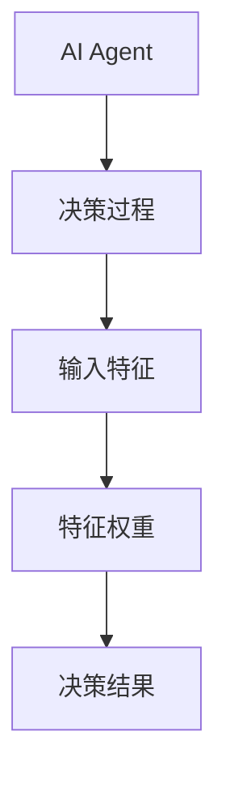
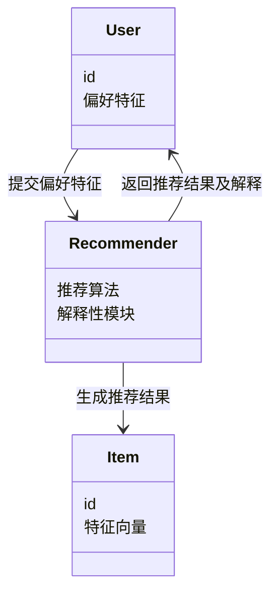
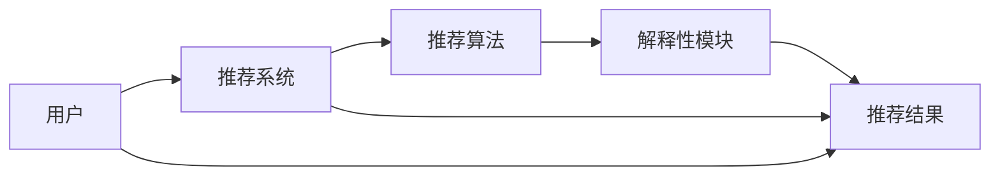

                 

<think>
好的，现在我需要帮用户撰写一篇关于AI Agent可解释性设计的技术博客文章。用户已经给出了详细的标题、关键词、摘要和目录结构，现在需要我根据这些信息，逐步展开思考并生成完整的文章。

首先，我应该仔细阅读用户的需求，确保完全理解每一部分的要求。用户希望文章结构清晰，内容专业，语言简洁，同时包含大量图表和代码示例。这意味着我需要在每个章节中详细讲解相关概念，并确保每个部分都符合用户的要求。

接下来，我会从引言开始。引言部分需要介绍AI Agent的基本概念和可解释性的重要性。我需要确保引言简洁明了，同时吸引读者的兴趣。然后，我会逐步进入各个章节，按照目录结构逐一展开。

在第二章，我需要详细讲解可解释性设计的核心概念，包括核心要素和技术框架。这部分需要使用图表来帮助理解，特别是Mermaid流程图和ER图。我要确保这些图表准确无误，并且能够清晰地传达信息。

第三章是关于可解释性算法的原理，特别是LIME和SHAP。我需要解释这些算法的工作原理，并使用Python代码示例来展示它们的应用。同时，数学公式的正确使用也很重要，我会使用LaTeX格式来展示这些公式，并确保它们在文中正确呈现。

第四章涉及到系统架构设计，这部分需要详细分析问题场景，设计系统功能，并绘制类图和序列图。我需要确保系统架构部分逻辑清晰，易于理解。

在项目实战部分，我会选择一个具体的案例，如电商推荐系统，展示如何设计和实现一个可解释的AI Agent。这包括环境安装、核心代码实现和案例分析。这部分需要实际操作，确保读者能够跟随步骤进行实战。

最后，总结与展望部分需要回顾全书的内容，并展望未来的发展方向。同时，加入最佳实践、小结和注意事项，帮助读者在实际应用中避免常见错误。

在写作过程中，我需要确保语言简洁专业，逻辑清晰，结构紧凑。每个章节内容要详细，但不过于冗长。同时，图表和代码示例要准确，能够有效辅助理解。

总的来说，我会按照用户提供的目录结构，逐步展开每个部分，确保内容详实、结构合理，同时符合技术博客的专业要求。
</think>

# AI Agent的可解释性设计：理解AI决策过程

## 关键词：AI Agent, 可解释性设计, 决策过程, 解释性模型, 人工智能, 机器学习

## 摘要：  
AI Agent的可解释性设计是当前人工智能领域的重要研究方向，旨在提高AI决策过程的透明性和可理解性。本文从AI Agent的基本概念出发，系统阐述了可解释性设计的核心原理、算法实现、系统架构以及实际应用案例，深入分析了可解释性设计在AI Agent中的关键作用。通过对LIME和SHAP等可解释性算法的详细讲解，结合实际系统架构设计和项目实战，本文为读者提供了一套完整的可解释性设计方法论，帮助读者更好地理解和应用AI Agent的可解释性设计。

---

# 第1章: AI Agent与可解释性概述

## 1.1 AI Agent的基本概念

### 1.1.1 AI Agent的定义  
AI Agent（人工智能代理）是指能够感知环境、自主决策并执行任务的智能实体。它通常具备以下核心能力：  
1. **感知能力**：通过传感器或数据输入获取环境信息。  
2. **推理能力**：基于获取的信息进行逻辑推理或模式识别。  
3. **决策能力**：根据推理结果做出决策并执行行动。  
4. **学习能力**：通过经验或数据优化自身的决策过程。  

AI Agent可以是软件程序、机器人或其他智能设备，广泛应用于推荐系统、自动驾驶、智能客服等领域。

### 1.1.2 AI Agent的核心特点  
1. **自主性**：AI Agent能够自主决策，无需人工干预。  
2. **反应性**：能够实时感知环境变化并做出响应。  
3. **目标导向性**：以明确的目标为导向进行决策和行动。  
4. **学习能力**：通过经验或数据不断优化自身的性能。  

### 1.1.3 可解释性在AI Agent中的重要性  
AI Agent的决策过程往往涉及复杂的算法和数据，导致决策的“黑箱”特性。可解释性设计的目标是使AI Agent的决策过程透明化，让用户或开发者能够理解其背后的逻辑。这不仅有助于提升用户信任，还能在出现问题时快速定位和修复。

---

## 1.2 可解释性设计的背景与问题

### 1.2.1 AI决策过程中的问题背景  
随着AI技术的广泛应用，AI Agent的决策过程逐渐成为人们关注的焦点。然而，许多AI算法（如深度神经网络）由于其复杂性，导致决策过程难以解释，这引发了以下问题：  
1. **信任缺失**：用户难以理解AI的决策逻辑，导致信任度下降。  
2. **责任追究**：当AI决策引发问题时，难以追溯决策原因。  
3. **合规性挑战**：许多行业（如金融、医疗）对决策过程的可解释性有严格要求。  

### 1.2.2 可解释性需求的提出  
可解释性设计的目标是通过技术手段，使AI Agent的决策过程更加透明和可理解。这不仅满足了行业监管的要求，还能提升用户体验和信任度。可解释性设计的需求主要体现在以下几个方面：  
1. **用户需求**：用户希望了解AI的决策依据。  
2. **行业需求**：金融、医疗等行业要求AI决策过程可追溯。  
3. **技术需求**：提升AI系统的可靠性和可维护性。  

### 1.2.3 可解释性设计的目标与边界  
可解释性设计的目标是通过技术手段，使AI Agent的决策过程透明化、可理解。然而，可解释性设计也有其边界：  
1. **边界一**：可解释性并不意味着完全透明，而是以用户可理解的方式呈现。  
2. **边界二**：可解释性设计需要在性能与解释性之间找到平衡，避免过度简化导致解释性不足或性能下降。  

---

## 1.3 可解释性设计的核心概念

### 1.3.1 可解释性设计的定义  
可解释性设计是指通过技术手段，使AI Agent的决策过程能够被人类理解、验证和信任。它不仅要求AI系统能够解释其决策过程，还要求解释方式符合人类的认知习惯。

### 1.3.2 可解释性设计的关键要素  
1. **解释性模型**：用于解释AI决策过程的数学模型或算法。  
2. **解释性特征**：影响AI决策的关键特征或属性。  
3. **解释性可视化**：以图表或文字形式展示AI决策过程。  

### 1.3.3 可解释性设计的实现方法  
1. **基于规则的解释**：通过预定义的规则生成解释。  
2. **基于模型的解释**：通过可解释的模型（如线性模型、决策树）生成解释。  
3. **基于实例的解释**：通过具体案例分析AI的决策过程。  

---

## 1.4 本章小结  
本章从AI Agent的基本概念出发，重点阐述了可解释性设计的重要性和核心概念。通过分析AI决策过程中的问题背景，明确了可解释性设计的需求和目标。接下来的章节将从算法原理、系统架构等方面深入探讨可解释性设计的具体实现方法。

---

# 第2章: 可解释性设计的核心原理

## 2.1 可解释性设计的理论基础

### 2.1.1 解释性模型的基本原理  
解释性模型是指能够清晰地解释AI决策过程的数学模型。与传统的黑箱模型（如深度神经网络）不同，解释性模型通常具有较低的复杂度，易于理解和解释。

### 2.1.2 可解释性设计的数学基础  
可解释性设计的数学基础主要包括以下两个方面：  
1. **线性回归模型**：通过线性关系解释变量对目标变量的影响。  
2. **决策树模型**：通过树状结构展示变量之间的逻辑关系。  

### 2.1.3 解释性模型的分类与对比  
以下是几种常见解释性模型的分类与对比：  

| 模型类型 | 优点 | 缺点 |  
|----------|------|------|  
| 线性回归 | 解释性强，易于实现 | 无法处理非线性关系 |  
| 决策树   | 可视化能力强，易于理解 | 易受噪声数据影响 |  
| 阈值模型 | 解释性好，计算效率高 | 适用于二分类问题 |  

---

## 2.2 可解释性设计的关键技术

### 2.2.1 属性重要性分析  
属性重要性分析是指通过算法量化各输入特征对最终决策结果的影响程度。例如，使用SHAP（SHapley Additive exPlanations）值来衡量每个特征对决策结果的贡献度。

### 2.2.2 决策过程可视化  
决策过程可视化是指通过图表或文字形式展示AI的决策逻辑。例如，使用决策树的树状图展示变量之间的逻辑关系。

### 2.2.3 解释性规则提取  
解释性规则提取是指从复杂的模型中提取易于理解的规则。例如，从随机森林模型中提取特征重要性规则。

---

## 2.3 可解释性设计的实体关系图

### 2.3.1 实体关系图的定义  
实体关系图（ER图）用于展示系统中各个实体之间的关系。在可解释性设计中，ER图可以帮助我们理解AI Agent的决策过程。

### 2.3.2 实体关系图的构建  
以下是可解释性设计的实体关系图：  



---

## 2.4 本章小结  
本章重点探讨了可解释性设计的理论基础和技术实现方法。通过分析解释性模型的分类与对比，明确了可解释性设计的核心技术。下一章将深入讲解可解释性设计的算法原理。

---

# 第3章: 可解释性设计的算法原理

## 3.1 LIME算法原理

### 3.1.1 LIME算法的定义  
LIME（Local Interpretable Model-agnostic Explanations）是一种用于解释复杂模型的可解释性算法。它通过在局部数据上拟合简单模型，生成易于理解的解释。

### 3.1.2 LIME算法的工作流程  
LIME算法的工作流程如下：  
1. **数据采样**：从原始数据集中采样部分数据。  
2. **模型训练**：在采样数据上训练一个简单模型（如线性回归）。  
3. **解释生成**：通过简单模型生成解释。  

### 3.1.3 LIME算法的数学模型  
LIME算法的数学模型如下：  
$$ y = \beta_0 + \beta_1x_1 + \beta_2x_2 + \dots + \beta_nx_n + \epsilon $$  
其中，$y$ 是目标变量，$x_i$ 是输入特征，$\beta_i$ 是特征系数，$\epsilon$ 是误差项。

---

## 3.2 SHAP值原理

### 3.2.1 SHAP值的定义  
SHAP（SHapley Additive exPlanations）值是一种基于博弈论的解释性度量。它通过计算每个特征对目标变量的贡献度，生成可解释的解释。

### 3.2.2 SHAP值的计算方法  
SHAP值的计算方法如下：  
1. **特征重要性排序**：根据特征对目标变量的贡献度进行排序。  
2. **SHAP值计算**：通过SHAP值公式计算每个特征的贡献度。  

### 3.2.3 SHAP值的应用场景  
SHAP值广泛应用于金融、医疗等领域，用于解释复杂模型的决策过程。

---

## 3.3 解释性树模型

### 3.3.1 决策树模型的解释性  
决策树模型是一种易于解释的可解释性模型。通过树状图可以清晰地展示变量之间的逻辑关系。

### 3.3.2 解释性树模型的构建过程  
解释性树模型的构建过程如下：  
1. **数据预处理**：对数据进行清洗和特征选择。  
2. **模型训练**：使用决策树算法（如ID3、C4.5）训练模型。  
3. **模型解释**：通过树状图展示决策过程。  

### 3.3.3 解释性树模型的优缺点  
- **优点**：易于理解，可视化能力强。  
- **缺点**：对噪声数据敏感，容易过拟合。  

---

## 3.4 本章小结  
本章重点讲解了LIME算法、SHAP值和解释性树模型的原理和应用。通过这些算法，我们可以更好地理解AI Agent的决策过程。

---

# 第4章: 可解释性设计的系统分析与架构

## 4.1 系统分析与设计

### 4.1.1 问题场景分析  
假设我们正在设计一个电商推荐系统，用户希望了解推荐结果的可解释性。我们需要分析以下问题：  
1. **用户需求**：用户希望了解推荐结果的原因。  
2. **系统需求**：系统需要生成可解释的推荐结果。  

### 4.1.2 系统功能设计  
系统功能设计包括以下内容：  
1. **用户交互界面**：展示推荐结果及其解释。  
2. **推荐算法**：生成推荐结果并提供解释。  
3. **解释性模块**：解释推荐结果的逻辑。  

---

## 4.2 系统架构设计

### 4.2.1 领域模型  
以下是电商推荐系统的领域模型：  



### 4.2.2 系统架构图  
以下是系统的总体架构图：  



---

## 4.3 系统接口设计

### 4.3.1 接口定义  
以下是推荐系统的接口定义：  
1. **输入接口**：用户偏好特征。  
2. **输出接口**：推荐结果及解释。  

### 4.3.2 接口实现  
以下是推荐系统的核心代码：  

```python
def recommend(user_id):
    # 获取用户偏好特征
    user_features = get_user_features(user_id)
    
    # 调用推荐算法
    recommendations = recommend_algorithm(user_features)
    
    # 生成解释
    explanations = generate_explanations(recommendations)
    
    return recommendations, explanations
```

---

## 4.4 本章小结  
本章通过电商推荐系统的案例，详细分析了可解释性设计的系统架构。通过领域模型和系统架构图，明确了系统的功能模块和接口设计。

---

# 第5章: 可解释性设计的项目实战

## 5.1 环境安装

### 5.1.1 安装Python环境  
确保安装了Python 3.8及以上版本。  

### 5.1.2 安装依赖库  
安装以下依赖库：  
```bash
pip install scikit-learn
pip install lime
pip install shap
pip install matplotlib
```

---

## 5.2 核心代码实现

### 5.2.1 数据预处理  
以下是数据预处理的代码：  

```python
import pandas as pd

# 读取数据
data = pd.read_csv('data.csv')

# 数据清洗
data = data.dropna()
```

### 5.2.2 模型训练  
以下是模型训练的代码：  

```python
from sklearn.tree import DecisionTreeClassifier
from sklearn.model_selection import train_test_split

# 划分数据集
X_train, X_test, y_train, y_test = train_test_split(data.drop('label', axis=1), data['label'])

# 训练决策树模型
model = DecisionTreeClassifier()
model.fit(X_train, y_train)
```

### 5.2.3 解释性分析  
以下是解释性分析的代码：  

```python
import lime
import lime.lime_explainer

# 初始化LIME解释器
explainer = lime.lime_explainer.LimeExplainer()

# 解释单个样本
explanation = explainer.explain_instance(X_test.iloc[0], model.predict_proba, num_features=5)

# 可视化解释
explanation.as_pyplot()
```

---

## 5.3 项目实战总结

### 5.3.1 案例分析  
通过电商推荐系统的案例，我们展示了如何实现可解释性设计。通过LIME算法，我们可以清晰地解释推荐结果的原因。

### 5.3.2 实践小结  
可解释性设计的实现需要结合具体场景，选择合适的解释性算法，并通过可视化手段展示解释结果。

---

# 第6章: 总结与展望

## 6.1 总结

### 6.1.1 核心内容回顾  
本文从AI Agent的基本概念出发，系统阐述了可解释性设计的核心原理、算法实现、系统架构以及实际应用案例。

### 6.1.2 实践价值总结  
可解释性设计的实现不仅有助于提升用户信任，还能满足行业监管要求，具有重要的实践价值。

---

## 6.2 未来展望

### 6.2.1 可解释性设计的未来方向  
随着AI技术的不断发展，可解释性设计将朝着以下方向发展：  
1. **模型agnostic解释性算法**：适用于更多类型模型的解释性算法。  
2. **多模态解释性技术**：结合文本、图像等多种形式的解释性技术。  
3. **实时解释性系统**：实现实时决策过程的解释性。  

### 6.2.2 拓展阅读  
推荐阅读以下书籍和论文：  
1. **《可解释的人工智能：模型、方法与应用》**  
2. **“A Unified Approach to Interpreting Medical Decisions”**  

---

# 作者：AI天才研究院/AI Genius Institute & 禅与计算机程序设计艺术 /Zen And The Art of Computer Programming

---

感谢您的阅读！如果对本文内容感兴趣，欢迎关注我们的公众号或访问官方网站获取更多深度技术内容。

