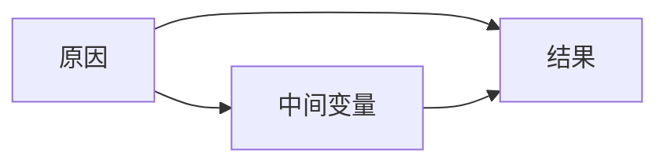
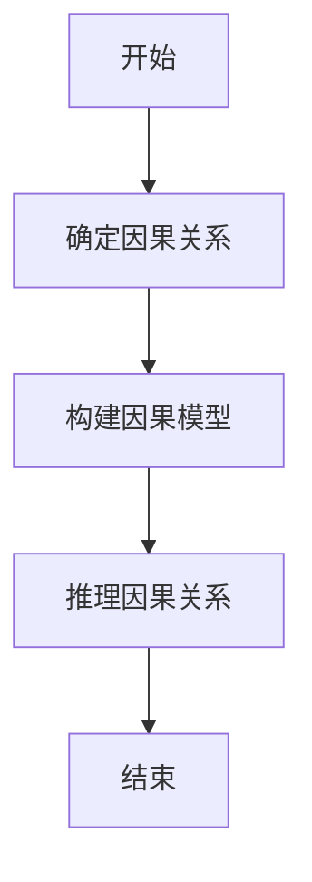
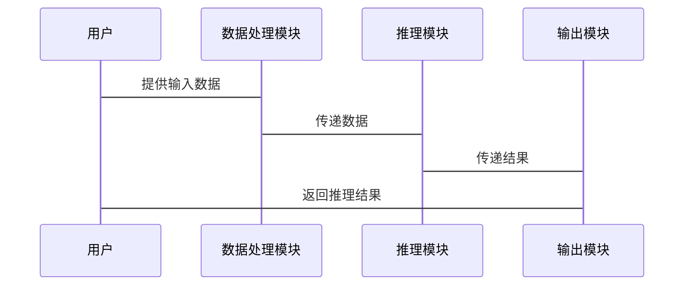

                 


# AI Agent的因果推理能力开发

## 关键词：AI Agent、因果推理、因果图、贝叶斯网络、系统架构、项目实战

## 摘要：本文将深入探讨AI Agent的因果推理能力开发，从基础概念到算法原理，再到系统架构和实际应用，全面解析如何构建具备因果推理能力的AI Agent。通过详细的技术分析和实战案例，帮助读者理解并掌握AI Agent因果推理的核心技术与开发方法。

---

# 第1章: AI Agent与因果推理概述

## 1.1 因果推理的基本概念

### 1.1.1 因果关系与相关关系的区别

- **相关关系**：变量之间的关联性，不考虑因果关系，仅反映变量之间是否存在统计上的关联。
- **因果关系**：一个变量对另一个变量的直接影响，强调“原因”与“结果”的关系。

### 1.1.2 因果推理的核心思想

- 确定因果关系的方向和强度。
- 通过观察数据或实验数据，推断因果关系。
- 在AI Agent中，因果推理用于决策、预测和解释结果。

### 1.1.3 AI Agent中的因果推理应用

- **医疗诊断**：通过症状推断病因。
- **金融风险控制**：通过历史数据预测风险因素。
- **自动驾驶**：通过环境感知做出决策。

---

## 1.2 AI Agent的基本概念

### 1.2.1 AI Agent的定义

- AI Agent是一个智能体，能够感知环境、自主决策并执行任务。
- 具备学习、推理、规划和自适应能力。

### 1.2.2 AI Agent的分类

- **简单反射型**：基于规则的反应式AI Agent。
- **基于模型的反应式**：结合内部状态和外部环境进行决策。
- **目标驱动型**：根据目标进行规划和行动。
- **实用驱动型**：基于效用函数进行优化决策。

### 1.2.3 AI Agent的核心能力

- **感知能力**：获取环境信息。
- **推理能力**：分析信息，推导因果关系。
- **决策能力**：基于推理结果做出决策。
- **学习能力**：通过经验优化自身能力。

---

## 1.3 本章小结

本章介绍了因果推理的基本概念和AI Agent的核心能力，为后续章节的深入分析奠定了基础。

---

# 第2章: 因果图模型

## 2.1 因果图的基本结构

### 2.1.1 节点与边的定义

- **节点**：表示变量。
- **边**：表示因果关系，从原因指向结果。

### 2.1.2 贝叶斯网络与因果图的关系

- 贝叶斯网络描述变量之间的概率关系。
- 因果图强调因果关系的方向性。

### 2.1.3 因果图的数学表示

- 用概率分布和因果关系表示变量之间的关系。

---

## 2.2 因果关系的属性对比

### 2.2.1 时间顺序性对比

- 原因发生在结果之前。

### 2.2.2 直接与间接因果关系对比

- **直接因果关系**：直接作用的结果。
- **间接因果关系**：通过中间变量影响结果。

### 2.2.3 因果强度对比

- 因果关系的强度可以用概率或系数衡量。

---

## 2.3 因果关系的实体关系图



---

## 2.4 本章小结

本章通过因果图模型分析了因果关系的结构和属性，为后续算法开发提供了理论基础。

---

# 第3章: 因果推理算法原理

## 3.1 因果推理的基本步骤

### 3.1.1 确定因果关系

- 通过数据和领域知识构建因果模型。

### 3.1.2 构建因果模型

- 使用因果图或贝叶斯网络表示因果关系。

### 3.1.3 推理因果关系

- 基于因果模型进行推理和预测。

---

## 3.2 因果推理的数学模型

### 3.2.1 条件概率公式

$$P(B|A)$$

### 3.2.2 贝叶斯定理

$$P(A|B) = \frac{P(B|A)P(A)}{P(B)}$$

### 3.2.3 因果效应公式

$$P(Y|do(X))$$

---

## 3.3 因果推理算法流程图



---

## 3.4 本章小结

本章详细介绍了因果推理的算法原理和流程，为后续系统设计提供了理论支持。

---

# 第4章: AI Agent因果推理系统架构

## 4.1 系统功能需求分析

### 4.1.1 数据输入模块

- 接收环境数据和历史数据。

### 4.1.2 因果模型构建模块

- 根据数据构建因果图或贝叶斯网络。

### 4.1.3 推理与结果输出模块

- 基于因果模型进行推理，输出结果。

---

## 4.2 系统架构设计


---

## 4.3 接口设计与交互流程

### 4.3.1 API接口定义

- 输入接口：接收环境数据。
- 输出接口：输出推理结果。

### 4.3.2 系统交互序列图



---

## 4.4 本章小结

本章设计了AI Agent因果推理系统的架构和交互流程，为实际开发提供了指导。

---

# 第5章: 项目实战——医疗诊断中的因果推理

## 5.1 项目背景与目标

### 5.1.1 项目背景

- 医疗诊断需要准确的因果推理能力。

### 5.1.2 项目目标

- 基于症状和检查结果，推断病因。

---

## 5.2 项目实现

### 5.2.1 数据预处理

- 收集症状和检查结果数据。

### 5.2.2 因果模型构建

- 使用贝叶斯网络构建因果图。

### 5.2.3 推理过程

- 基于因果模型进行诊断推理。

### 5.2.4 结果分析

- 输出诊断结果及置信度。

---

## 5.3 代码实现

```python
import networkx as nx
from sklearn import tree

# 数据预处理
data = [...]  # 数据集
X = [...]  # 特征
y = [...]  # 标签

# 构建决策树模型
model = tree.DecisionTreeClassifier()
model.fit(X, y)

# 推理过程
def infer_cause(effect):
    # 基于模型推断原因
    pass

# 应用推理
result = infer_cause(effect)
```

---

## 5.4 项目小结

本章通过医疗诊断案例展示了因果推理的实际应用，详细讲解了项目的实现过程和代码实现。

---

# 第6章: 最佳实践与注意事项

## 6.1 最佳实践

### 6.1.1 数据质量的重要性

- 数据应具有代表性、完整性和准确性。

### 6.1.2 模型选择的注意事项

- 根据问题类型选择合适的因果推理算法。

### 6.1.3 模型优化

- 通过实验数据验证和优化模型。

---

## 6.2 注意事项

### 6.2.1 避免过度拟合

- 使用交叉验证和正则化方法。

### 6.2.2 数据偏差问题

- 确保数据的公平性和代表性。

### 6.2.3 模型解释性

- 选择可解释性强的因果推理模型。

---

## 6.3 拓展阅读

- **推荐书籍**：《因果的发现与推断》
- **推荐论文**： Pearl, J. (1994). "Lecture Notes on Probabilistic Reasoning in Artificial Intelligence".

---

# 第7章: 小结

## 7.1 本章总结

- 本文系统介绍了AI Agent的因果推理能力开发，从基础概念到算法原理，再到系统架构和项目实战，全面解析了因果推理的核心技术。

## 7.2 未来展望

- 结合深度学习和强化学习，进一步提升AI Agent的因果推理能力。
- 探索因果推理在更多领域的应用，如金融、教育和医疗。

---

# 作者

作者：AI天才研究院/AI Genius Institute & 禅与计算机程序设计艺术 /Zen And The Art of Computer Programming

