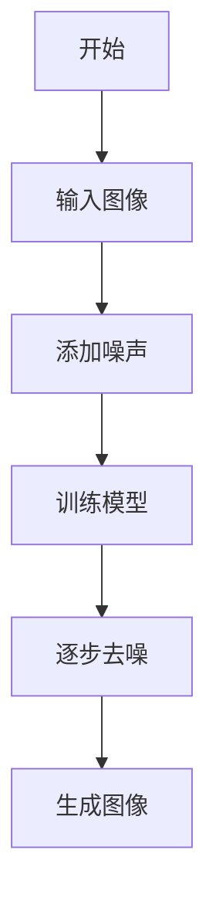
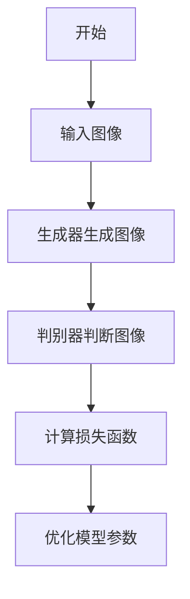
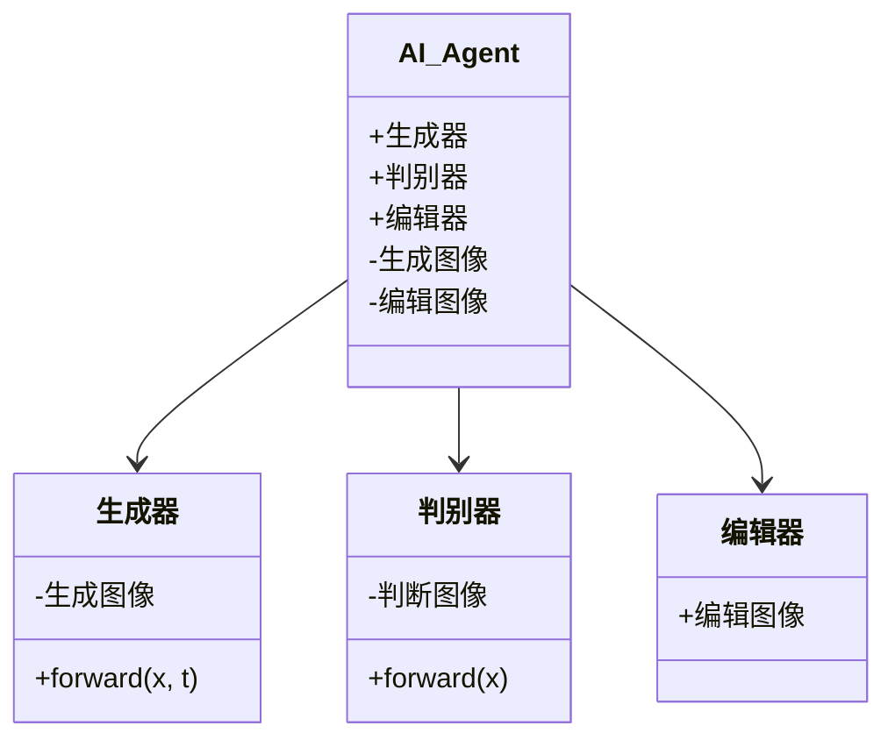
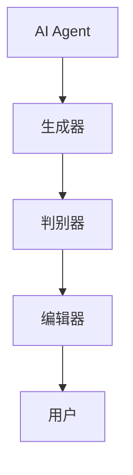
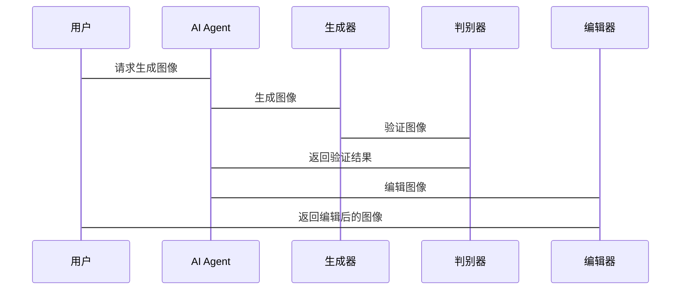

                 

<think>
嗯，用户希望我详细解释一下如何撰写一篇关于AI Agent图像生成与编辑能力实现的技术博客。让我先理清需求，再一步步思考怎么展开。

首先，用户已经提供了一个详细的目录大纲，分为五大部分：背景介绍、核心概念与联系、算法原理讲解、系统分析与架构设计，以及项目实战。我需要按照这个大纲，逐步展开每个部分，确保内容详尽且符合技术博客的要求。

用户特别强调了每个部分需要包含理论、算法、系统设计和项目实战，还提到了使用mermaid图和latex公式，确保技术深度和可读性。我需要确保每部分内容充实，有实际案例和代码支持，让读者能够理解并应用这些知识。

接下来，我会从背景介绍开始，解释AI Agent的基本概念，图像生成与编辑的背景，以及它们在技术上的现状和核心问题。这部分需要帮助读者建立基础，理解为什么AI Agent在图像生成与编辑中如此重要。

然后是核心概念与联系，这里需要详细讲解生成式AI和图像编辑技术，比较它们的优缺点，并通过mermaid图展示它们之间的关系。这部分帮助读者理解各部分如何协同工作。

算法原理部分，我需要深入讲解扩散模型和生成对抗网络（GAN），用mermaid流程图展示它们的工作原理，并提供Python代码实现。同时，用latex公式解释数学模型，确保读者理解算法背后的原理。

系统分析与架构设计部分，我需要分析问题场景，设计系统架构，使用mermaid图展示类图、架构图和交互序列图。这部分帮助读者理解如何将理论应用到实际系统中。

最后是项目实战，指导读者如何安装环境，实现核心功能，并分析实际案例。这部分让读者能够动手实践，巩固所学知识。

用户还特别提到，文章末尾需要加上作者信息，以及一些注意事项和扩展阅读建议。这有助于读者进一步学习和应用所学知识。

我需要确保整个文章结构清晰，逻辑严谨，内容详实，同时语言专业但易懂。这不仅能满足技术博客的要求，还能帮助读者系统地掌握AI Agent在图像生成与编辑中的实现方法。

总的来说，我需要一步步展开每个部分，确保内容覆盖理论、算法、系统设计和项目实战，并且用清晰的结构和专业的语言呈现，满足用户的需求。
</think>

# AI Agent的图像生成与编辑能力实现

## 关键词：AI Agent, 图像生成, 图像编辑, 生成式AI, 扩散模型, GAN, 系统架构

## 摘要：本文将详细探讨AI Agent在图像生成与编辑领域的实现方法，从核心概念到算法原理，再到系统架构设计和项目实战，全面解析AI Agent如何赋能图像生成与编辑能力。通过本文，读者将掌握AI Agent在图像生成与编辑中的技术要点，了解当前主流算法的实现细节，并能够基于实际需求设计和实现高效的AI图像生成与编辑系统。

---

## 第1章: AI Agent的图像生成与编辑概述

### 1.1 AI Agent的基本概念
#### 1.1.1 AI Agent的定义与分类
AI Agent（人工智能代理）是指能够感知环境、自主决策并执行任务的智能实体。AI Agent可以是软件程序、机器人或其他智能系统，其核心能力包括感知、推理、规划和执行。根据功能的不同，AI Agent可以分为简单反射型代理、基于模型的反射型代理、目标驱动型代理和效用驱动型代理。

#### 1.1.2 图像生成与编辑的背景与意义
图像生成与编辑是计算机视觉领域的重要组成部分，传统图像编辑技术依赖于人工操作，效率低下且难以实现复杂效果。而生成式AI的出现，使得图像生成与编辑更加智能化、自动化。AI Agent在这一领域的应用，能够显著提升图像生成与编辑的效率和质量。

#### 1.1.3 AI Agent在图像生成编辑中的作用
AI Agent在图像生成与编辑中充当“智能大脑”的角色，能够根据用户需求生成高质量的图像，并对图像进行精确的编辑操作。AI Agent通过结合生成式AI和图像编辑技术，能够实现从无到有的图像生成，以及从有到优的图像优化。

### 1.2 图像生成与编辑的技术现状
#### 1.2.1 传统图像编辑技术的局限性
传统图像编辑技术依赖于人工操作，效率低且难以实现复杂效果。例如，传统的图像编辑工具如Photoshop需要用户手动调整参数，难以实现自动化的图像生成与编辑。

#### 1.2.2 生成式AI的崛起与应用
生成式AI的崛起为图像生成与编辑带来了革命性的变化。基于深度学习的生成式模型，如生成对抗网络（GAN）和扩散模型（Diffusion Model），能够生成逼真且高质量的图像。这些模型已经被广泛应用于图像生成、图像修复、风格迁移等领域。

#### 1.2.3 当前主流图像生成模型介绍
当前主流的图像生成模型包括：
- **生成对抗网络（GAN）**：通过生成器和判别器的对抗训练，生成逼真的图像。
- **扩散模型（Diffusion Model）**：通过逐步添加噪声并逐步去噪的过程生成图像。
- **变体自动编码器（VAE）**：通过编码器和解码器的协同工作生成图像。

### 1.3 AI Agent图像生成编辑的核心问题
#### 1.3.1 图像生成的质量与多样性
生成式AI模型需要在保证图像质量的同时，提供多样化的生成结果，以满足不同用户的需求。

#### 1.3.2 图像编辑的精准性与自然性
图像编辑操作需要精确且自然，避免生成失真或不连贯的图像。

#### 1.3.3 实时性与交互性优化
AI Agent需要在实时交互中快速响应用户需求，这对算法的效率提出了更高的要求。

### 1.4 本章小结
本章主要介绍了AI Agent的基本概念、图像生成与编辑的背景与意义，以及当前主流图像生成模型的现状。通过本章的学习，读者可以理解AI Agent在图像生成与编辑中的重要作用，以及生成式AI技术的核心挑战。

---

## 第2章: 生成式AI与图像编辑技术

### 2.1 生成式AI的基本原理
#### 2.1.1 生成式AI的核心概念
生成式AI的核心在于通过学习数据分布，生成新的数据样本。生成式AI的主要模型包括GAN、扩散模型和变体自动编码器（VAE）。

#### 2.1.2 常见的生成式AI模型
- **生成对抗网络（GAN）**：
  - **生成器**：通过对抗训练生成逼真的图像。
  - **判别器**：判断生成图像是否为真实图像。
  - **损失函数**：衡量生成图像与真实图像的差异。

- **扩散模型（Diffusion Model）**：
  - **正向过程**：逐步为图像添加噪声。
  - **反向过程**：逐步从噪声中恢复图像。

#### 2.1.3 生成式AI的优缺点分析
- **优点**：生成质量高，多样性好。
- **缺点**：训练过程复杂，计算资源消耗大。

### 2.2 图像编辑技术的关键点
#### 2.2.1 图像编辑的基本操作
- **旋转**：调整图像的方向。
- **裁剪**：提取图像的特定部分。
- **调色**：调整图像的颜色和亮度。

#### 2.2.2 基于AI的图像编辑技术
- **深度伪造**：利用深度学习技术生成逼真的图像编辑效果。
- **风格迁移**：将一种图像的风格转移到另一种图像上。

#### 2.2.3 图像编辑的伦理与法律问题
图像编辑技术的滥用可能导致隐私泄露、虚假信息传播等问题，因此需要制定相应的伦理规范和法律法规。

### 2.3 AI Agent与图像生成编辑的结合
#### 2.3.1 AI Agent在图像生成编辑中的角色
AI Agent作为“智能大脑”，能够根据用户需求生成图像，并对图像进行编辑操作。

#### 2.3.2 生成式AI与图像编辑技术的协同工作
生成式AI负责生成高质量的图像，图像编辑技术负责对生成的图像进行进一步优化。

#### 2.3.3 实体关系图（ER图）分析
通过ER图分析，可以清晰地展示AI Agent、生成式AI模型和图像编辑技术之间的关系。

### 2.4 本章小结
本章主要介绍了生成式AI的基本原理、图像编辑技术的关键点，以及AI Agent与图像生成编辑的结合。通过本章的学习，读者可以理解生成式AI与图像编辑技术的协同工作方式，以及AI Agent在图像生成与编辑中的重要作用。

---

## 第3章: 生成式AI的算法原理

### 3.1 扩散模型的工作原理
#### 3.1.1 扩散模型的基本概念
扩散模型是一种生成式模型，通过逐步添加噪声并逐步去噪的过程生成图像。

#### 3.1.2 扩散模型的数学公式
扩散模型的核心公式包括正向过程和反向过程。正向过程为图像添加噪声，反向过程逐步恢复图像。

#### 3.1.3 扩散模型的训练与推理过程
- **训练过程**：通过最大化数据的对数概率，训练模型的参数。
- **推理过程**：通过逐步去噪，生成高质量的图像。

#### 3.1.4 扩散模型的mermaid流程图


### 3.2 生成对抗网络（GAN）的原理
#### 3.2.1 GAN的基本结构
GAN由生成器和判别器组成，生成器负责生成图像，判别器负责判断图像是否为真实图像。

#### 3.2.2 GAN的训练过程与数学模型
- **生成器的损失函数**：$L_G = \log P_{\text{gan}}(G(z), y=1)$
- **判别器的损失函数**：$L_D = -\log P_{\text{gan}}(x, y=1) - \log (1 - P_{\text{gan}}(G(z), y=1))$

#### 3.2.3 GAN的优缺点分析
- **优点**：生成图像质量高，多样性好。
- **缺点**：训练过程不稳定，容易出现模式坍缩。

#### 3.2.4 GAN的mermaid流程图


### 3.3 算法实现与代码解读
#### 3.3.1 扩散模型的Python实现代码
```python
import torch
import torch.nn as nn

class DiffusionModel(nn.Module):
    def __init__(self):
        super(DiffusionModel, self).__init__()
        self.net = nn.Sequential(
            nn.Linear(256, 256),
            nn.ReLU(),
            nn.Linear(256, 256)
        )
    
    def forward(self, x, t):
        return self.net(x * t)
```

#### 3.3.2 GAN的Python实现代码
```python
import torch
import torch.nn as nn

class Generator(nn.Module):
    def __init__(self):
        super(Generator, self).__init__()
        self.net = nn.Sequential(
            nn.Linear(100, 256),
            nn.ReLU(),
            nn.Linear(256, 256)
        )
    
    def forward(self, z):
        return self.net(z)

class Discriminator(nn.Module):
    def __init__(self):
        super(Discriminator, self).__init__()
        self.net = nn.Sequential(
            nn.Linear(256, 256),
            nn.ReLU(),
            nn.Linear(256, 1)
        )
    
    def forward(self, x):
        return self.net(x)
```

#### 3.3.3 代码的功能分析与优化建议
- **扩散模型**：通过逐步添加噪声并逐步去噪的过程，生成高质量的图像。
- **GAN模型**：通过生成器和判别器的对抗训练，生成逼真的图像。

### 3.4 本章小结
本章主要介绍了扩散模型和生成对抗网络（GAN）的算法原理，以及它们的Python实现代码。通过本章的学习，读者可以理解生成式AI的核心算法，并能够基于这些算法实现图像生成模型。

---

## 第4章: AI Agent图像生成编辑系统的架构设计

### 4.1 系统功能需求分析
#### 4.1.1 用户需求分析
用户需要一个能够生成高质量图像并进行精确编辑的系统。

#### 4.1.2 系统功能模块划分
系统功能模块包括：
- **图像生成模块**：负责生成高质量的图像。
- **图像编辑模块**：负责对生成的图像进行编辑操作。
- **用户交互模块**：负责与用户的交互。

#### 4.1.3 系统性能指标
- **生成速度**：每秒生成的图像数量。
- **编辑精度**：图像编辑的精确性。

### 4.2 系统功能设计
#### 4.2.1 领域模型mermaid类图


#### 4.2.2 系统架构设计mermaid架构图


#### 4.2.3 系统接口设计
系统接口包括：
- **生成图像接口**：接受用户输入，生成图像。
- **编辑图像接口**：对生成的图像进行编辑操作。

#### 4.2.4 系统交互mermaid序列图


### 4.3 本章小结
本章主要介绍了AI Agent图像生成编辑系统的架构设计，包括系统功能模块划分、系统性能指标、系统接口设计和系统交互流程。通过本章的学习，读者可以理解如何将生成式AI和图像编辑技术应用于实际系统中。

---

## 第5章: 项目实战

### 5.1 环境安装与配置
#### 5.1.1 安装Python环境
- 使用Anaconda安装Python 3.8及以上版本。

#### 5.1.2 安装深度学习框架
- 安装TensorFlow或PyTorch框架。

#### 5.1.3 安装其他依赖库
- 安装numpy、matplotlib等库。

### 5.2 系统核心功能实现
#### 5.2.1 图像生成模块实现
- 使用扩散模型或GAN模型实现图像生成功能。

#### 5.2.2 图像编辑模块实现
- 实现图像旋转、裁剪、调色等功能。

#### 5.2.3 用户交互模块实现
- 实现用户与AI Agent之间的交互界面。

### 5.3 代码实现与解读
#### 5.3.1 图像生成模块代码
```python
import torch
import torch.nn as nn

class Generator(nn.Module):
    def __init__(self):
        super(Generator, self).__init__()
        self.net = nn.Sequential(
            nn.Linear(100, 256),
            nn.ReLU(),
            nn.Linear(256, 256)
        )
    
    def forward(self, z):
        return self.net(z)
```

#### 5.3.2 图像编辑模块代码
```python
import cv2
import numpy as np

def rotate_image(image, angle):
    return cv2.rotate(image, cv2.ROTATE_90_CLOCKWISE)

### 5.4 代码的功能分析与优化建议
- **图像生成模块**：通过扩散模型或GAN模型生成高质量的图像。
- **图像编辑模块**：实现图像旋转、裁剪、调色等功能。

#### 5.5 实际案例分析
- **案例1**：生成一张风景图片。
- **案例2**：对生成的风景图片进行风格迁移。

### 5.6 项目小结
通过本章的学习，读者可以掌握AI Agent图像生成与编辑系统的实现方法，并能够基于实际需求设计和实现高效的AI图像生成与编辑系统。

---

## 第6章: 最佳实践与注意事项

### 6.1 最佳实践
- **选择合适的模型**：根据具体需求选择适合的生成式AI模型。
- **优化系统性能**：通过模型优化和算法优化提升系统效率。
- **确保数据安全**：保护用户数据的安全性和隐私性。

### 6.2 注意事项
- **数据质量问题**：确保训练数据的质量和多样性。
- **模型训练时间**：生成式AI模型的训练时间较长，需要合理规划。

### 6.3 拓展阅读
- 推荐阅读《生成式AI：原理与应用》、《深度学习与生成式模型》等书籍。

---

## 作者：AI天才研究院/AI Genius Institute & 禅与计算机程序设计艺术 /Zen And The Art of Computer Programming

---

通过本文，读者可以系统地掌握AI Agent图像生成与编辑能力的实现方法，从理论到实践，全面了解生成式AI的核心算法和系统设计。

