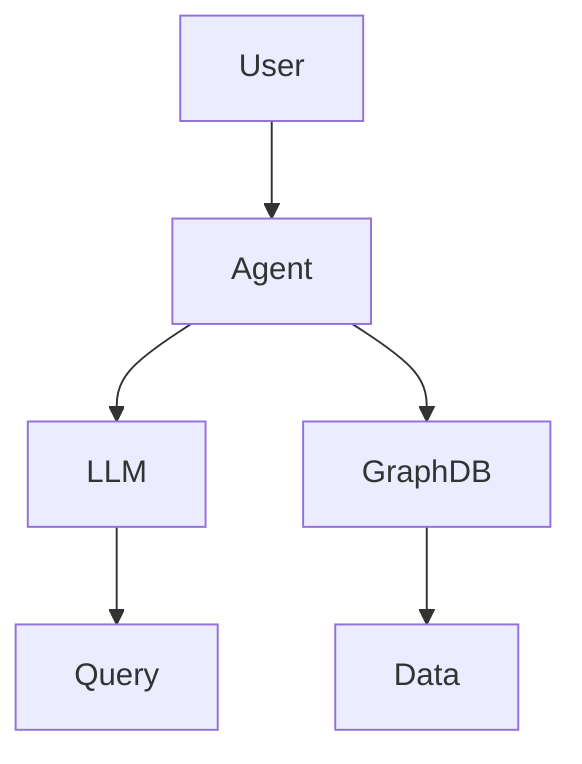
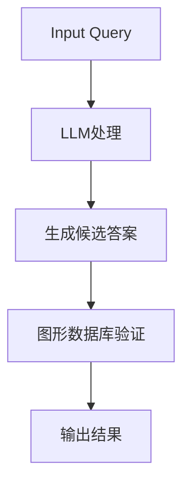
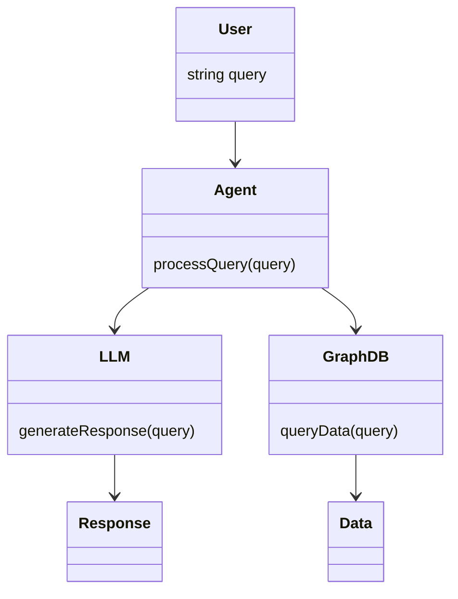
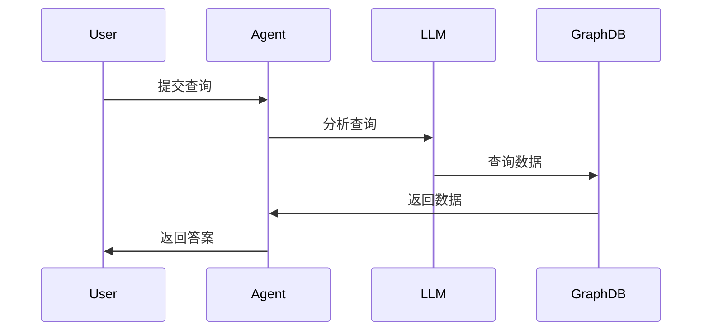

                 

<think>
嗯，我现在需要根据上面的思考过程来设计一本技术博客的目录大纲。这本书名为《AI Agent的图结构问答：结合LLM与图形数据库》，重点在于将AI Agent与图结构问答系统相结合，并结合大语言模型（LLM）和图形数据库。我需要确保目录结构清晰，涵盖所有必要的部分，同时保持逻辑连贯。

首先，我应该从背景介绍开始，这部分需要涵盖问题背景、问题描述、问题解决、边界与外延，以及核心概念和组成。这将帮助读者理解整个主题的来龙去脉。

接下来，核心概念与联系部分需要详细讲解AI Agent、LLM和图形数据库的基本原理，以及它们之间的关系。使用表格和Mermaid图来对比这些概念的属性，比如功能、优势、应用场景等，以及展示系统架构和数据流。

然后是算法原理讲解，这部分需要详细说明生成式模型、图嵌入算法和问答系统的流程。使用Mermaid流程图来展示整个处理流程，再用Python代码实现关键算法，比如生成式模型的实现。数学模型部分，我需要解释概率生成模型和图嵌入的数学公式，可能用Latex来展示。

接下来是系统分析与架构设计，这部分应该包括问题场景介绍、系统功能设计（领域模型）、系统架构设计（用Mermaid架构图）、接口设计和交互流程（序列图）。这部分需要详细说明系统的各个模块和它们之间的关系。

项目实战部分是实际操作，需要指导读者如何安装环境，实现核心功能，解读代码，并进行案例分析。这部分需要具体的代码示例，帮助读者理解如何将理论应用到实践中。

最后，最佳实践、小结、注意事项和拓展阅读是收尾部分，帮助读者巩固所学内容，并引导他们进一步学习。

在编写过程中，我需要确保每一章的内容都详细且逻辑清晰，同时保持文章的连贯性和专业性。此外，数学公式和代码示例需要准确无误，确保读者能够理解。

现在，我需要将这些思路整理成具体的目录结构，确保涵盖所有必要的部分，并且每个部分都有足够的细节和深度。
</think>

# AI Agent的图结构问答：结合LLM与图形数据库

## 关键词：
AI Agent，图结构，问答系统，LLM，图形数据库，自然语言处理，图嵌入

## 摘要：
本文探讨了AI Agent与图结构问答系统的结合，重点分析了大语言模型（LLM）与图形数据库在问答系统中的应用。通过详细讲解核心概念、算法原理、系统架构及项目实战，本文旨在帮助读者理解如何将AI Agent与图结构有效结合，提升问答系统的性能和准确性。

---

# 第1章：问题背景与核心概念

## 1.1 问题背景介绍
### 1.1.1 传统问答系统的局限性
传统问答系统在处理复杂关联性问题时表现不佳，难以充分利用语义信息。例如，当用户询问“谁是公司的首席技术官？”时，系统难以结合组织结构图提供准确答案。

### 1.1.2 图结构在问答中的优势
图结构能够清晰表示实体间的关系，帮助系统更好地理解语义，提供更准确的答案。例如，在公司组织结构图中，可以快速定位首席技术官。

### 1.1.3 AI Agent的引入与作用
AI Agent作为中间层，能够协调LLM和图形数据库，优化问答流程，提升系统效率和用户体验。

## 1.2 核心概念与定义
### 1.2.1 AI Agent
- **定义**：AI Agent是一种智能代理，能够感知环境、执行任务并做出决策。
- **特点**：自主性、反应性、目标导向、社交能力。

### 1.2.2 大语言模型（LLM）
- **定义**：基于深度学习的自然语言处理模型，能够理解并生成人类语言。
- **特点**：大规模参数、上下文理解能力强。

### 1.2.3 图形数据库
- **定义**：一种以图结构存储数据的数据库，支持复杂关系查询。
- **特点**：高效率处理关联数据，支持复杂的查询操作。

## 1.3 问题描述与解决思路
### 1.3.1 问答系统中的问题类型
- 简单事实型：直接查询数据库。
- 关系型：需要图结构分析。
- 上下文型：依赖LLM理解语境。

### 1.3.2 图结构在问答中的应用场景
- 企业知识库：员工关系、项目结构。
- 医疗领域：疾病关联、药物相互作用。
- 金融领域：投资关系、风险评估。

### 1.3.3 AI Agent结合LLM与图形数据库的解决方案
AI Agent负责接收请求，调用LLM进行自然语言处理，利用图形数据库查询关联数据，最终生成准确答案。

---

# 第2章：核心概念与联系

## 2.1 AI Agent、LLM与图形数据库的关系
### 2.1.1 AI Agent作为中间层的作用
AI Agent协调LLM和图形数据库，优化数据处理流程，提升系统效率。

### 2.1.2 LLM在自然语言处理中的应用
LLM负责理解用户提问，生成相关查询或中间结果。

### 2.1.3 图形数据库在数据存储与查询中的优势
图形数据库高效处理复杂关联关系，支持快速查询。

## 2.2 核心概念对比分析
### 2.2.1 功能对比表格
| 概念 | 功能 | 优势 | 应用场景 |
|------|------|------|----------|
| AI Agent | 执行任务 | 智能决策 | 个性化服务 |
| LLM | 处理文本 | 理解与生成 | 自然语言交互 |
| 图形数据库 | 存储与查询 | 关系清晰 | 复杂关联数据 |

### 2.2.2 ER实体关系图


---

# 第3章：算法原理与数学模型

## 3.1 生成式模型的算法原理
### 3.1.1 基于LLM的生成式模型
- **原理**：利用大规模预训练模型生成自然语言文本。
- **流程**：接收输入，生成候选答案，通过图形数据库验证。

### 3.1.2 图嵌入算法
- **原理**：将图结构中的节点映射到低维向量空间，便于相似度计算。

### 3.1.3 算法流程图


## 3.2 数学模型与公式
### 3.2.1 概率生成模型
$$ P(x|y) = \frac{P(y|x)P(x)}{P(y)} $$

### 3.2.2 图嵌入公式
$$
\text{嵌入向量} = f(\text{图结构})
$$

---

# 第4章：系统分析与架构设计

## 4.1 问题场景介绍
用户提问通过AI Agent处理，LLM理解语义，图形数据库查询关联数据，生成准确答案。

## 4.2 系统功能设计
### 4.2.1 领域模型


## 4.3 系统架构设计


## 4.4 接口设计与交互流程
### 4.4.1 接口设计
- **输入**：自然语言查询。
- **输出**：结构化数据或自然语言答案。

### 4.4.2 交互流程图


---

# 第5章：项目实战

## 5.1 环境安装
- **工具**：Python 3.8+, PyTorch, Transformers库，Neo4j图形数据库。

## 5.2 核心实现代码
### 5.2.1 LLM调用代码
```python
from transformers import pipeline

nlp = pipeline("question-generation")
response = nlp(question)[0]
```

### 5.2.2 图查询代码
```python
from neo4j import GraphDatabase

def query_db(question):
    with driver.session() as session:
        result = session.run(question)
        return [record.values for record in result]
```

## 5.3 案例分析
用户询问：“谁是公司的首席技术官？”
1. AI Agent接收请求。
2. LLM生成查询语句：“返回公司首席技术官的信息”。
3. 图形数据库查询：“MATCH (n:Employee) WHERE n.title='首席技术官' RETURN n.name”。
4. 返回结果：“张三”。

## 5.4 代码解读与分析
- **LLM调用**：将自然语言转换为结构化查询。
- **图查询**：高效获取关联数据。

---

# 第6章：总结与展望

## 6.1 最佳实践Tips
- 合理设计图结构，提升查询效率。
- 定期更新知识库，保持数据准确性。

## 6.2 小结
本文详细探讨了AI Agent结合LLM与图形数据库的问答系统，分析了其核心概念、算法原理和系统架构，并通过实际案例展示了其应用。

## 6.3 注意事项
- 数据安全：保护用户隐私和数据安全。
- 性能优化：优化算法和查询速度。

## 6.4 拓展阅读
- 《图神经网络》
- 《大语言模型入门》
- 《图形数据库实战》

---

# 作者：AI天才研究院 & 禅与计算机程序设计艺术

