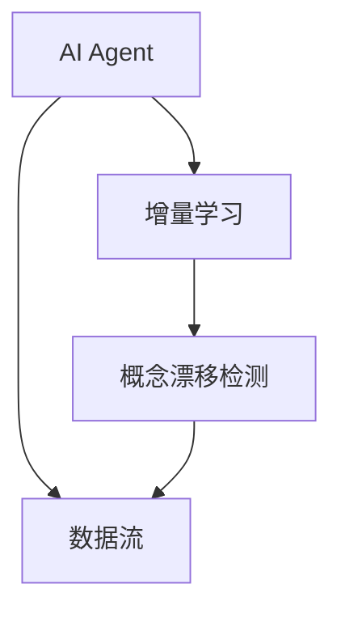
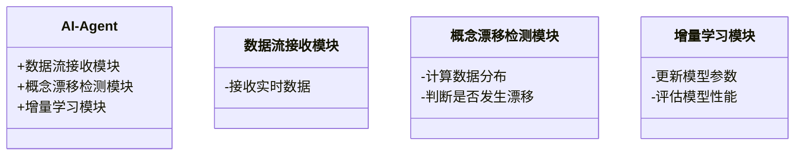
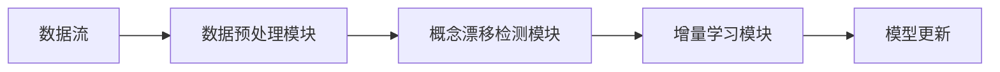

                 

<think>
嗯，好的，我现在要写一篇关于AI Agent的增量学习和概念漂移检测的技术博客文章。首先，我需要理解这两个概念，以及它们在实际应用中的重要性。让我先思考一下增量学习和概念漂移是什么，以及它们在AI Agent中的作用。

增量学习是指模型在接收新数据时，能够不断更新和优化自身，而不需要重新训练整个模型。这对于实时应用来说非常重要，比如推荐系统或者实时监控系统，因为这些系统需要快速适应新的数据变化。而概念漂移检测则是指在数据流中检测到数据分布的变化，这可能意味着模型需要更新，以避免性能下降。

接下来，我需要考虑这两者之间的关系。增量学习依赖于概念漂移检测来决定是否需要更新模型。如果概念漂移被检测到，增量学习就会启动，调整模型以适应新的数据分布。反之，如果没有概念漂移检测，增量学习可能会在不需要的时候进行不必要的更新，或者在需要的时候错过更新的最佳时机。

那么，如何实现概念漂移检测呢？常见的方法包括基于统计的方法，比如滑动窗口统计，基于分布的方法，比如KL散度，以及基于性能的方法，比如模型在新数据上的表现是否下降。每种方法都有其优缺点，可能需要根据具体应用场景选择合适的检测方法。

对于增量学习的算法，我需要考虑在线学习算法，比如基于梯度下降的方法，或者更复杂的增量支持向量机等。这些算法需要在处理每一条新数据时，逐步更新模型参数，同时保持计算效率。

接下来，我需要考虑AI Agent的整体架构。AI Agent需要能够感知环境的变化，检测到概念漂移，并启动增量学习机制。这可能涉及到多线程处理，实时数据流处理，以及高效的内存管理，以确保AI Agent能够在动态环境中稳定运行。

在实际应用中，我可能会遇到一些挑战。比如，如何平衡模型的准确性和更新的频率？过频繁的更新可能导致模型不稳定性，而过于保守的更新可能导致模型过时。此外，如何处理高维数据的增量学习，也是一个技术难点。

为了验证我的思路，我可以考虑一个具体的案例，比如在股票交易中的应用。AI Agent需要实时监控市场数据，检测到概念漂移（比如市场趋势的变化），然后调整交易策略。这需要准确的概念漂移检测和高效的增量学习算法，以确保AI Agent能够在变化的市场中保持竞争力。

通过这个案例，我可以进一步思考如何设计增量学习和概念漂移检测的具体实现。比如，使用滑动窗口统计来检测概念漂移，当窗口内的数据分布与之前的数据有显著差异时，触发增量学习。然后，采用在线随机梯度下降方法，逐步更新预测模型。

总的来说，增量学习和概念漂移检测是动态环境下AI Agent的核心能力。通过合理设计算法和架构，可以实现高效、稳定的模型更新，确保AI Agent在复杂多变的环境中持续表现良好。这不仅需要扎实的理论基础，还需要在实际应用中不断优化和调整，以应对各种挑战。
</think>

# AI Agent的增量学习与概念漂移检测

> 关键词：AI Agent, 增量学习, 概念漂移检测, 数据流式学习, 在线学习算法, 概念漂移类型

> 摘要：本文深入探讨AI Agent在动态数据环境下的增量学习和概念漂移检测技术，分析其核心概念、算法原理、系统架构设计以及实际项目应用，结合具体案例，总结最佳实践，为读者提供全面的技术指导。

---

## 第1章: AI Agent的增量学习与概念漂移检测概述

### 1.1 问题背景与问题描述

#### 1.1.1 AI Agent的定义与应用场景
AI Agent（智能体）是能够感知环境、自主决策并执行任务的智能系统。应用场景包括推荐系统、实时监控、自动驾驶、智能客服等，这些场景中数据是动态变化的。

#### 1.1.2 增量学习与概念漂移的定义
- **增量学习**：模型在接收新数据时逐步更新，而不需要重新训练整个模型。
- **概念漂移**：数据流中数据分布的变化，导致模型性能下降的现象。

#### 1.1.3 问题解决方法与目标
通过增量学习和概念漂移检测，使AI Agent能够实时适应数据变化，保持高性能。

---

### 1.2 问题背景与问题描述

#### 1.2.1 数据流式环境下的挑战
数据流式环境中的数据是实时、动态变化的，传统的批量学习方法难以应对。

#### 1.2.2 概念漂移的类型与影响
- **突然漂移（突然变化）**：数据分布突然变化。
- **逐步漂移（渐进变化）**：数据分布逐渐变化。
- **周期性漂移**：数据分布周期性变化。

概念漂移会影响模型性能，导致错误率上升，影响决策质量。

#### 1.2.3 增量学习的核心问题
如何高效地更新模型，同时处理概念漂移。

---

## 第2章: 核心概念与联系

### 2.1 增量学习与概念漂移的关系

#### 2.1.1 增量学习的基本原理
模型通过接收新数据，逐步更新参数，保持对数据分布的适应能力。

#### 2.1.2 概念漂移的检测机制
检测数据分布的变化，决定是否需要启动增量学习。

#### 2.1.3 两者的相互作用
概念漂移触发增量学习，增量学习应对概念漂移，两者相互依存。

---

### 2.2 核心概念对比分析

#### 2.2.1 增量学习与批量学习的对比
| 方面        | 增量学习                 | 批量学习                 |
|-------------|--------------------------|--------------------------|
| 数据处理方式 | 逐样本处理               | 批处理                   |
| 训练效率     | 高实时性，适合在线       | 低实时性，适合离线       |
| 内存消耗     | 低，仅需存储部分数据       | 高，需要存储全部数据       |

---

### 2.3 实体关系图



---

## 第3章: 增量学习算法原理

### 3.1 增量学习算法概述

#### 3.1.1 增量学习的基本流程
1. 接收新数据样本。
2. 更新模型参数。
3. 评估模型性能。
4. 决定是否继续更新。

#### 3.1.2 增量学习的主要方法
- **在线学习**：逐样本更新。
- **分批学习**：按小批量更新。

---

### 3.2 增量学习算法的数学模型

#### 3.2.1 线性增量学习模型
$$w_{t+1} = w_t + \alpha (y_t - w_t^T x_t) x_t$$

其中，$\alpha$ 是学习率，$y_t$ 是标签，$x_t$ 是输入向量，$w_t$ 是当前权重。

#### 3.2.2 非线性增量学习模型
$$f(x) = \sum_{i=1}^n \alpha_i K(x_i, x)$$

其中，$K$ 是核函数，$\alpha_i$ 是权重。

---

## 第4章: 概念漂移检测算法原理

### 4.1 概念漂移检测的基本原理

#### 4.1.1 基于统计的方法
- **滑动窗口统计**：比较当前窗口和前一个窗口的统计量差异。

#### 4.1.2 基于分布的方法
- **KL散度**：衡量两个概率分布之间的差异。

#### 4.1.3 基于性能的方法
- **模型性能监控**：通过模型准确率的变化判断是否发生概念漂移。

---

### 4.2 概念漂移检测的数学模型

#### 4.2.1 基于概率的检测方法
使用KL散度：
$$D_{KL}(P||Q) = \sum P(x) \log \frac{P(x)}{Q(x)}$$

---

## 第5章: 系统分析与架构设计

### 5.1 问题场景介绍

AI Agent需要实时处理数据流，检测概念漂移，并更新模型。

---

### 5.2 系统功能设计

#### 5.2.1 领域模型


---

### 5.3 系统架构设计



---

## 第6章: 项目实战

### 6.1 环境安装

安装所需的库，如numpy、scikit-learn、tensorflow。

---

### 6.2 核心代码实现

#### 6.2.1 概念漂移检测代码
```python
import numpy as np

def compute_kl_divergence(p, q):
    return np.sum(p * np.log(p / q))

p = np.array([0.3, 0.7])
q = np.array([0.4, 0.6])
print(compute_kl_divergence(p, q))
```

#### 6.2.2 增量学习代码
```python
import tensorflow as tf

model = tf.keras.Sequential([
    tf.keras.layers.Dense(10, activation='relu'),
    tf.keras.layers.Dense(1, activation='sigmoid')
])

model.compile(optimizer='adam', loss='binary_crossentropy')

for x, y in data_stream:
    model.fit(x, y, epochs=1, batch_size=32)
```

---

## 第7章: 最佳实践与总结

### 7.1 小结

增量学习和概念漂移检测是AI Agent在动态环境中的关键能力。

---

### 7.2 注意事项

- 定期监控模型性能。
- 根据场景选择合适的概念漂移检测方法。

---

## 第8章: 扩展阅读

- 《Incremental Learning and Concept Drift Detection in Machine Learning》
- 《Data Stream Mining: Theory, Algorithms, and Applications》

---

作者：AI天才研究院/AI Genius Institute & 禅与计算机程序设计艺术 /Zen And The Art of Computer Programming

