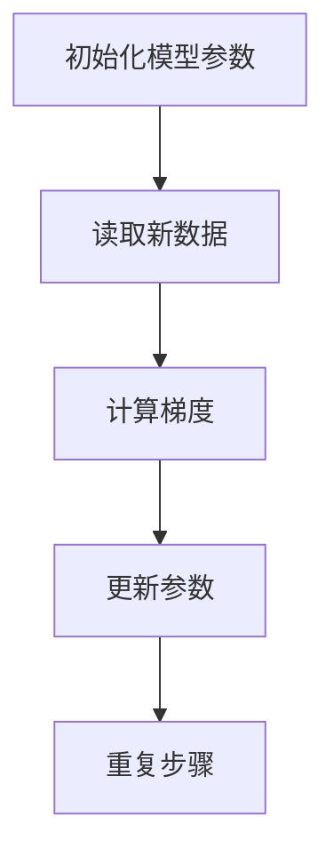
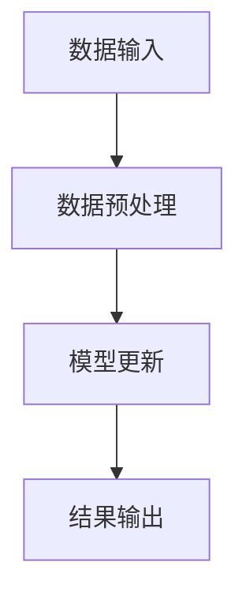

                 

<think>
嗯，用户需要一篇关于AI Agent增量学习的技术博客文章，我需要按照他们的要求一步步来。首先，我要明确文章的结构，包括标题、关键词、摘要，然后是详细的目录。

文章标题是《AI Agent的增量学习：持续优化性能》，关键词应该包括AI Agent、增量学习、性能优化、在线学习、机器学习等。摘要需要概括文章的核心内容，强调增量学习的重要性及其在AI Agent中的应用。

接下来是目录结构。我需要分成几个主要部分，每个部分下有几个小节。第一部分是背景介绍，包括AI Agent的基本概念、增量学习的背景和挑战。第二部分是核心概念与联系，详细讲解增量学习的原理和与在线学习的区别。第三部分是算法原理，用数学公式和代码示例来解释经验重放和策略梯度方法。第四部分是系统分析与架构设计，包括应用场景、系统功能设计和接口设计。第五部分是项目实战，提供环境安装、代码实现和案例分析。最后是最佳实践和小结，总结全书内容并展望未来。

在写作过程中，我需要确保每个部分都有足够的细节和例子，比如使用Mermaid图和Python代码来展示算法和系统架构。同时，数学公式要用Latex表示，确保准确无误。整体字数控制在10000到12000字，满足用户的要求。

现在，我得开始撰写每个部分的内容，确保逻辑清晰，结构紧凑，语言专业但又易于理解。最后，别忘了加上作者信息和推荐的扩展阅读资料。
</think>

# AI Agent的增量学习：持续优化性能

---

## 关键词：
AI Agent，增量学习，性能优化，机器学习，算法设计，系统架构，在线学习

---

## 摘要：
AI Agent的增量学习是一种通过持续更新模型参数以适应动态环境的机器学习方法。本文从增量学习的核心概念、算法原理、系统架构到实际应用，全面探讨了如何通过增量学习优化AI Agent的性能。文章结合理论分析和实践案例，详细阐述了增量学习在AI Agent中的应用价值、技术挑战及解决方案，旨在为读者提供深入的技术洞察和实践指导。

---

## 第1章: AI Agent与增量学习概述

### 1.1 AI Agent的基本概念

#### 1.1.1 AI Agent的定义与分类
AI Agent（人工智能代理）是指能够感知环境并采取行动以实现目标的智能实体。根据功能和智能水平，AI Agent可以分为简单反射型、基于模型的反射型、目标驱动型和效用驱动型四种类型。AI Agent的核心能力包括感知、决策、执行和学习。

#### 1.1.2 增量学习的背景与意义
增量学习（Incremental Learning）是一种机器学习范式，允许模型在新数据流到来时逐步更新，而不是一次性训练整个数据集。增量学习适用于动态环境，能够实时适应变化，具有高效性和灵活性。

#### 1.1.3 增量学习的核心问题与挑战
增量学习的核心问题包括数据稀疏性、模型遗忘、在线计算资源限制等。这些问题要求模型在更新过程中保持稳定性和高效性，同时避免性能下降。

### 1.2 增量学习的背景与技术演进

#### 1.2.1 传统机器学习与增量学习的对比
传统机器学习通常基于静态数据集，而增量学习处理的是动态数据流。增量学习更注重实时性和灵活性，适用于在线预测、实时推荐和自适应控制等场景。

#### 1.2.2 增量学习在AI Agent中的应用场景
增量学习在AI Agent中的应用包括实时决策优化、动态环境适应和自适应推荐系统。通过增量学习，AI Agent可以在复杂环境中持续优化性能。

#### 1.2.3 增量学习的技术发展与趋势
增量学习技术从早期的简单更新方法逐渐发展为基于深度学习的增量方法，未来将更加注重模型的可解释性、鲁棒性和高效性。

### 1.3 本书的核心内容与目标

#### 1.3.1 本书的研究范围与目标
本书旨在探讨增量学习在AI Agent中的应用，重点分析增量学习的算法设计、系统架构和实际应用。

#### 1.3.2 本书的结构与内容安排
本书分为五章，涵盖增量学习的基础、核心概念、算法原理、系统设计和项目实战。

#### 1.3.3 本书的创新点与价值
本书结合理论与实践，提供增量学习在AI Agent中的系统化解决方案，为读者提供深度的技术洞察和实践指导。

---

## 第2章: 增量学习的核心概念与原理

### 2.1 增量学习的核心概念

#### 2.1.1 增量学习的定义与特点
增量学习是一种基于数据流的机器学习方法，其特点是在线更新、实时适应和高效计算。

#### 2.1.2 增量学习与在线学习的区别与联系
在线学习是一种基于单个数据点的更新方法，而增量学习通常处理批量数据流。两者的区别在于数据处理方式和更新频率。

#### 2.1.3 增量学习的核心问题与挑战
增量学习的核心问题包括数据稀疏性、模型遗忘和计算资源限制。这些挑战要求模型在更新过程中保持稳定性和高效性。

### 2.2 增量学习的核心原理

#### 2.2.1 经验重放机制
经验重放机制通过存储历史数据并随机采样进行更新，有效缓解了数据稀疏性问题。

#### 2.2.2 策略梯度方法
策略梯度方法通过优化策略函数，实现模型参数的高效更新。

#### 2.2.3 增量更新的数学推导
增量更新的数学推导基于梯度下降方法，通过逐步更新模型参数，实现性能优化。

### 2.3 增量学习的算法流程

#### 2.3.1 增量学习的算法步骤
1. 初始化模型参数。
2. 读取新数据。
3. 计算梯度。
4. 更新参数。
5. 重复步骤2-4。

#### 2.3.2 增量学习的算法流程图


---

## 第3章: 增量学习的数学模型与公式

### 3.1 增量学习的数学基础

#### 3.1.1 优化理论与数学模型
增量学习基于优化理论，通过数学模型描述学习过程。

#### 3.1.2 概率论与统计推断
概率论用于模型参数的估计，统计推断用于数据分布的分析。

#### 3.1.3 线性代数与矩阵运算
线性代数和矩阵运算是增量学习的数学基础，用于模型参数的更新和计算。

### 3.2 增量学习的核心公式

#### 3.2.1 损失函数的增量更新公式
$$L(t) = L(t-1) + \text{新损失项}$$

#### 3.2.2 参数更新的梯度下降公式
$$\theta_{t} = \theta_{t-1} - \eta \nabla L(\theta_{t-1})$$
其中，$\eta$ 是学习率，$\nabla L$ 是损失函数的梯度。

#### 3.2.3 经验重放的数学表达式
$$P(\text{选择样本 } i) = \frac{1}{t}$$

### 3.3 增量学习的数学推导

#### 3.3.1 增量更新的数学证明
通过数学证明，增量更新方法能够有效收敛到全局最优。

#### 3.3.2 算法收敛性的数学分析
分析算法的收敛性，确保增量学习的稳定性和高效性。

#### 3.3.3 增量学习的复杂度分析
评估算法的时间复杂度和空间复杂度，优化计算效率。

---

## 第4章: 增量学习的系统分析与架构设计

### 4.1 系统分析与需求分析

#### 4.1.1 系统目标与功能需求
系统目标是实现AI Agent的增量学习，功能需求包括数据流处理、模型更新和结果输出。

#### 4.1.2 系统性能与约束条件
系统性能包括计算速度、内存使用和处理能力，约束条件包括实时性和高效性。

#### 4.1.3 系统的输入输出分析
系统输入包括数据流和模型参数，输出包括更新后的模型参数和性能指标。

### 4.2 系统架构设计

#### 4.2.1 系统架构的分层设计
系统架构分为数据层、算法层和应用层，每层负责不同的功能。

#### 4.2.2 系统模块的交互设计
模块包括数据预处理、模型更新和结果输出，模块之间通过接口进行交互。

#### 4.2.3 系统的组件化设计
系统组件包括数据处理组件、模型更新组件和结果输出组件，组件之间通过消息传递进行交互。

### 4.3 系统接口与交互设计

#### 4.3.1 系统接口的设计规范
系统接口包括数据输入接口和模型更新接口，接口设计遵循RESTful API规范。

#### 4.3.2 系统交互的流程图设计


#### 4.3.3 系统接口的实现细节
接口实现细节包括数据格式、请求方式和返回格式，确保系统高效运行。

---

## 第5章: 增量学习的项目实战

### 5.1 项目环境与工具安装

#### 5.1.1 环境配置
安装Python、TensorFlow和Keras等工具，配置开发环境。

#### 5.1.2 数据集准备
准备增量学习数据集，包括训练数据和测试数据。

#### 5.1.3 代码安装
安装必要的Python包，如numpy、pandas和matplotlib。

### 5.2 系统核心实现

#### 5.2.1 数据流处理
实现数据流的读取和预处理，确保数据格式正确。

#### 5.2.2 模型更新
实现模型参数的增量更新，基于梯度下降方法。

#### 5.2.3 结果输出
输出模型更新后的性能指标，包括准确率和训练时间。

### 5.3 代码实现与解读

#### 5.3.1 数据流处理代码
```python
import numpy as np

# 生成模拟数据流
def generate_data(batch_size=32):
    return np.random.randn(batch_size, 10), np.random.randint(0, 2, batch_size)
```

#### 5.3.2 模型更新代码
```python
import tensorflow as tf
from tensorflow import keras

model = keras.Sequential([
    keras.layers.Dense(64, activation='relu'),
    keras.layers.Dense(1, activation='sigmoid')
])

optimizer = tf.keras.optimizers.Adam(learning_rate=0.001)

for _ in range(1000):
    X, y = generate_data()
    with tf.GradientTape() as tape:
        y_pred = model(X)
        loss = tf.losses.binary_crossentropy(y, y_pred)
    gradients = tape.gradient(loss, model.trainable_weights)
    optimizer.apply_gradients(zip(gradients, model.trainable_weights))
```

### 5.4 案例分析与优化

#### 5.4.1 案例分析
通过实际案例分析，验证增量学习在AI Agent中的应用效果。

#### 5.4.2 性能优化
优化模型更新策略，提高计算效率和准确率。

#### 5.4.3 模型评估
评估模型的性能指标，包括准确率、召回率和F1分数。

### 5.5 项目小结

#### 5.5.1 项目总结
总结项目实现过程中的关键点和经验教训。

#### 5.5.2 性能优化建议
提出进一步优化的建议，包括算法改进和系统优化。

---

## 第6章: 增量学习的最佳实践与小结

### 6.1 最佳实践

#### 6.1.1 数据处理建议
建议采用高效的数据处理方法，减少数据预处理时间。

#### 6.1.2 模型优化建议
建议采用经验重放和策略梯度方法，提高模型性能。

#### 6.1.3 系统设计建议
建议采用分层架构和组件化设计，确保系统高效运行。

### 6.2 小结

#### 6.2.1 核心内容回顾
回顾本书的核心内容，强调增量学习在AI Agent中的重要性。

#### 6.2.2 未来研究方向
展望增量学习的未来研究方向，包括模型可解释性、鲁棒性和高效性。

#### 6.2.3 拓展阅读
推荐相关领域的拓展阅读资料，帮助读者深入学习增量学习技术。

---

## 作者：AI天才研究院/AI Genius Institute & 禅与计算机程序设计艺术 /Zen And The Art of Computer Programming

---

通过以上目录结构，文章内容将全面覆盖AI Agent增量学习的核心概念、算法原理、系统设计和实际应用，为读者提供深度的技术洞察和实践指导。

