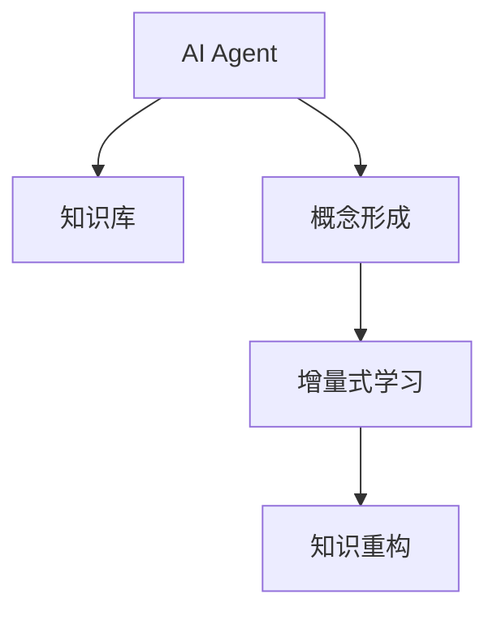
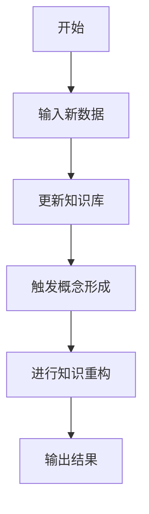
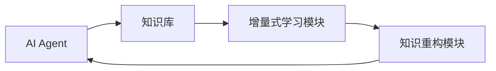
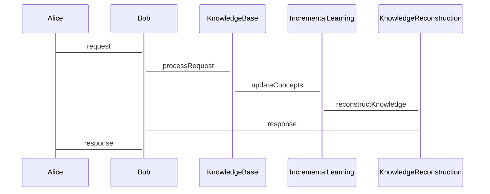

                 


# AI Agent的增量式概念形成与知识重构

**关键词：** AI Agent, 增量式学习, 知识重构, 概念形成, 系统架构

**摘要：**  
本文深入探讨了AI Agent在增量式概念形成与知识重构领域的核心原理与实际应用。通过分析AI Agent的知识表示、增量式学习机制以及知识重构算法，结合具体的系统架构设计和项目实战案例，本文为读者提供了一种系统化的方法来理解和实现AI Agent的增量式概念形成与知识重构。文章还结合实际应用场景，提出了相应的解决方案和最佳实践。

---

# 第1章: AI Agent的背景与概念背景介绍

## 1.1 AI Agent的基本概念

### 1.1.1 AI Agent的定义与特点  
AI Agent（人工智能代理）是指能够感知环境、自主决策并执行任务的智能实体。AI Agent的核心特点包括：  
1. **自主性**：能够自主决策，无需外部干预。  
2. **反应性**：能够实时感知环境并做出反应。  
3. **目标导向**：具有明确的目标，通过行为实现目标。  
4. **学习能力**：能够通过经验改进自身行为。  

### 1.1.2 增量式学习的背景与意义  
增量式学习是指AI Agent在学习过程中逐步更新知识，而非一次性完成学习。其背景来源于以下几点：  
1. **动态环境**：现实环境复杂多变，知识需要不断更新。  
2. **数据稀疏性**：数据可能不足，需要逐步积累。  
3. **效率要求**：增量式学习能够减少计算资源的浪费。  

### 1.1.3 知识重构的核心思想与目标  
知识重构是指对已有知识进行重新组织和优化，以适应新的任务或环境。其核心思想是通过动态更新知识结构，提升AI Agent的适应性和智能性。目标包括：  
1. **提高知识表示的准确性**。  
2. **优化知识推理的效率**。  
3. **增强知识的可解释性**。  

## 1.2 问题背景与问题描述

### 1.2.1 AI Agent面临的知识更新挑战  
AI Agent在动态环境中面临以下知识更新挑战：  
1. **知识的不一致性**：新知识可能与已有知识冲突。  
2. **知识的不完备性**：新信息可能不完整，需要逐步补充。  
3. **知识的复杂性**：知识结构可能复杂，需要高效重构。  

### 1.2.2 增量式概念形成的问题域  
增量式概念形成涉及以下关键问题：  
1. **概念的动态更新**：如何在新数据输入时更新概念。  
2. **概念的粒度控制**：如何确定概念的细化程度。  
3. **概念的可扩展性**：如何在新数据中扩展概念。  

### 1.2.3 知识重构的必要性与应用场景  
知识重构的必要性体现在以下场景中：  
1. **实时任务处理**：在动态任务中，知识重构能够快速调整策略。  
2. **领域知识迁移**：将知识迁移到新的领域时，需要重构知识结构。  
3. **错误修正**：当知识出现错误时，通过重构修正错误。  

## 1.3 问题解决与边界外延

### 1.3.1 增量式概念形成的解决方案  
增量式概念形成的解决方案包括：  
1. **基于概率的方法**：利用概率论更新概念。  
2. **基于规则的方法**：通过预定义规则更新概念。  
3. **基于深度学习的方法**：利用神经网络动态更新概念。  

### 1.3.2 知识重构的边界与限制  
知识重构的边界与限制包括：  
1. **计算资源限制**：重构过程需要消耗计算资源。  
2. **知识复杂性限制**：复杂知识的重构可能需要大量时间。  
3. **领域知识限制**：知识重构依赖于领域知识的完整性。  

### 1.3.3 相关概念的结构与核心要素  
相关概念的结构包括：  
1. **知识表示**：知识的表示方式，如符号表示、语义网络等。  
2. **概念形成**：概念的形成过程，如聚类、分类等。  
3. **知识重构**：知识的重构方式，如基于规则的重构、基于概率的重构等。  

## 1.4 本章小结

### 1.4.1 核心问题总结  
本章主要探讨了AI Agent在增量式概念形成与知识重构中的基本概念、问题背景和解决方案。  

### 1.4.2 下文展开提示  
下文将从核心概念、算法原理、系统架构等角度深入分析AI Agent的增量式概念形成与知识重构。  

---

# 第2章: AI Agent的核心概念与联系

## 2.1 核心概念原理

### 2.1.1 增量式概念形成的原理  
增量式概念形成基于以下原理：  
1. **逐步更新**：每次输入新数据时，更新现有概念。  
2. **动态调整**：根据新数据调整概念的边界和属性。  
3. **自适应学习**：通过反馈机制自适应调整概念。  

### 2.1.2 知识重构的机制  
知识重构的机制包括：  
1. **知识提取**：从现有知识中提取关键信息。  
2. **知识重组**：重新组织知识，形成新的知识结构。  
3. **知识优化**：优化知识结构，提升可解释性和准确性。  

### 2.1.3 AI Agent的知识表示与推理  
AI Agent的知识表示包括符号表示、语义网络等方法。知识推理基于逻辑推理和概率推理。  

## 2.2 核心概念属性特征对比

### 2.2.1 概念形成的速度与效率对比  
| 概念形成方法 | 速度 | 效率 |  
|--------------|------|------|  
| 基于规则的方法 | 中等 | 高 |  
| 基于概率的方法 | 较慢 | 中等 |  
| 基于深度学习的方法 | 较快 | 低 |  

### 2.2.2 知识重构的粒度与深度分析  
知识重构的粒度包括粗粒度重构和细粒度重构。深度包括浅层重构和深层重构。  

### 2.2.3 不同增量式方法的优缺点

| 方法 | 优点 | 缺点 |  
|------|------|------|  
| 基于规则的方法 | 易解释 | 需大量人工规则 |  
| 基于概率的方法 | 高准确性 | 计算复杂 |  
| 基于深度学习的方法 | 强大学习能力 | 需大量数据 |  

## 2.3 ER实体关系图架构



## 2.4 本章小结

### 2.4.1 核心概念总结  
本章分析了AI Agent的核心概念，包括增量式概念形成和知识重构的原理、机制和方法。  

### 2.4.2 下文算法实现提示  
下文将从算法原理的角度，详细分析增量式概念形成与知识重构的具体实现方法。  

---

# 第3章: 增量式概念形成算法原理

## 3.1 算法原理概述

### 3.1.1 增量式学习的基本流程  
增量式学习的基本流程包括：  
1. 初始化知识库。  
2. 输入新数据。  
3. 更新概念。  
4. 输出结果。  

### 3.1.2 概念形成的关键步骤  
概念形成的关键步骤包括：  
1. 数据预处理：清洗和归一化数据。  
2. 数据分类：将数据划分为不同类别。  
3. 概念更新：根据新数据更新概念。  

### 3.1.3 知识重构的算法框架  
知识重构的算法框架包括：  
1. 知识提取：从知识库中提取关键信息。  
2. 知识重组：重新组织知识结构。  
3. 知识优化：优化知识结构。  

## 3.2 算法实现流程



## 3.3 算法实现细节

### 3.3.1 数据预处理  
数据预处理包括：  
- 数据清洗：去除噪声数据。  
- 数据归一化：将数据标准化。  

### 3.3.2 概念更新算法  
基于概率的增量式概念更新算法如下：  
$$ P(c|x) = \frac{P(x|c)P(c)}{P(x)} $$  

### 3.3.3 知识重构算法  
知识重构的算法步骤：  
1. 从知识库中提取关键信息。  
2. 使用聚类算法重组知识结构。  
3. 优化知识结构，提升准确性。  

## 3.4 本章小结

### 3.4.1 核心算法总结  
本章详细分析了增量式概念形成与知识重构的算法原理，包括数据预处理、概念更新和知识重构的具体实现。  

### 3.4.2 下文系统设计提示  
下文将从系统架构的角度，详细分析AI Agent的知识管理系统的实现方案。  

---

# 第4章: 系统分析与架构设计

## 4.1 问题场景介绍

### 4.1.1 问题场景描述  
假设我们正在开发一个智能客服AI Agent，需要通过增量式学习不断优化其知识库。  

## 4.2 系统功能设计

### 4.2.1 领域模型设计  
领域模型的类图如下：  

```mermaid
classDiagram
class KnowledgeBase {
    + data: Map<String, List<Object>>
    + methods: {
        addData(Object),
        updateConcepts(),
        reconstructKnowledge()
    }
}
class Concept {
    + name: String
    + attributes: Map<String, Object>
    + relations: List<String>
}
class Agent {
    + knowledgeBase: KnowledgeBase
    + methods: {
        processRequest(String),
        updateKnowledge(),
        retrieveConcept(String)
    }
}
```

### 4.2.2 系统架构设计  
系统架构图如下：  



### 4.2.3 接口设计与交互流程  

#### 4.2.3.1 接口设计


---

# 第5章: 项目实战

## 5.1 环境安装与配置

### 5.1.1 环境要求  
- Python 3.8+  
- Java 8+  
- 数据库：MySQL 5.7+  

### 5.1.2 依赖管理  
- Python：使用pip安装numpy、pandas、scikit-learn。  
- Java：使用Maven管理依赖。  

## 5.2 核心代码实现

### 5.2.1 知识库管理模块  
```python
class KnowledgeBase:
    def __init__(self):
        self.data = {}

    def add_data(self, key, value):
        if key not in self.data:
            self.data[key] = []
        self.data[key].append(value)

    def update_concepts(self):
        # 实现增量式概念更新逻辑
        pass

    def reconstruct_knowledge(self):
        # 实现知识重构逻辑
        pass
```

### 5.2.2 概念更新模块  
```python
def incremental_learning(data_point, knowledge_base):
    # 数据预处理
    processed_data = preprocess(data_point)
    # 更新概念
    updated_concepts = update_concepts(processed_data, knowledge_base)
    return updated_concepts
```

### 5.2.3 知识重构模块  
```python
def knowledge_reconstruction(knowledge_base):
    # 知识提取
    extracted_knowledge = extract_knowledge(knowledge_base)
    # 知识重组
    reconstructed_knowledge = reconstruct(extracted_knowledge)
    return reconstructed_knowledge
```

## 5.3 实际案例分析与代码解读

### 5.3.1 案例背景  
假设我们正在开发一个智能客服系统，需要通过增量式学习优化其知识库。  

### 5.3.2 代码实现  
```python
# 初始化知识库
knowledge_base = KnowledgeBase()
# 添加新数据
knowledge_base.add_data("intent", "query")
# 触发概念更新
knowledge_base.update_concepts()
# 进行知识重构
knowledge_base.reconstruct_knowledge()
```

### 5.3.3 功能实现解读  
1. **知识库初始化**：创建空知识库。  
2. **数据添加**：将新的意图识别数据添加到知识库。  
3. **概念更新**：根据新数据更新概念。  
4. **知识重构**：对知识库进行重构，优化知识结构。  

## 5.4 本章小结

### 5.4.1 核心代码总结  
本章通过具体的代码实现，展示了AI Agent增量式概念形成与知识重构的实际应用。  

### 5.4.2 下文最佳实践提示  
下文将从最佳实践的角度，总结AI Agent增量式概念形成与知识重构的实施经验。  

---

# 第6章: 最佳实践与总结

## 6.1 小结

### 6.1.1 核心问题总结  
本文深入分析了AI Agent的增量式概念形成与知识重构的核心原理与实际应用。  

### 6.1.2 重要结论  
- 增量式学习能够有效应对动态环境中的知识更新挑战。  
- 知识重构是提升AI Agent智能性的关键步骤。  

## 6.2 注意事项与建议

### 6.2.1 实施中的注意事项  
1. **数据质量**：确保输入数据的准确性和完整性。  
2. **计算资源**：增量式学习和知识重构需要充足的计算资源。  
3. **算法选择**：根据具体场景选择合适的增量式学习和知识重构算法。  

### 6.2.2 维护与优化建议  
1. **定期更新**：定期更新知识库，确保知识的准确性。  
2. **性能优化**：优化算法性能，提升处理效率。  
3. **可解释性**：注重知识重构的可解释性，便于调试和优化。  

## 6.3 拓展阅读

### 6.3.1 推荐书籍  
1. 《机器学习实战》  
2. 《深度学习》  

### 6.3.2 技术博客与资源  
1. [Towards Data Science](https://towardsdatascience.com/)  
2. [Medium - AI & Machine Learning](https://medium.com/ai-and-machine-learning)  

## 6.4 本章总结  
通过本文的分析与实践，读者能够系统地理解AI Agent的增量式概念形成与知识重构的核心原理与实际应用。  

---

# 附录

## 附录A: 术语表  
- **AI Agent**：人工智能代理。  
- **增量式学习**：逐步学习的方法。  
- **知识重构**：重新组织知识结构的过程。  

## 附录B: 参考文献  
1. Russell, S., & Norvig, P. (2010). *Artificial Intelligence: A Modern Approach*.  
2. Bishop, C. M. (2006). *Pattern Recognition and Machine Learning*.  

---

# 索引  
（根据需要添加具体索引内容）

---

**作者：AI天才研究院/AI Genius Institute & 禅与计算机程序设计艺术 /Zen And The Art of Computer Programming**

