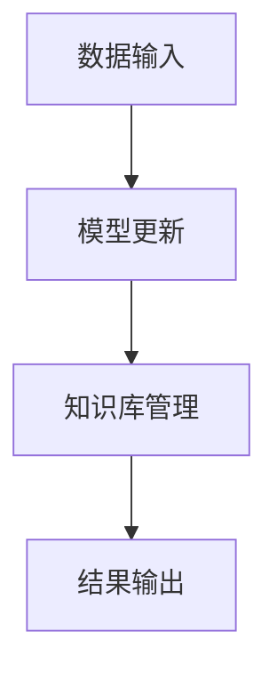

                 

<think>
好的，我需要撰写一篇关于《AI Agent的增量式表示学习与知识更新》的技术博客文章。我将按照用户提供的目录大纲结构，逐步进行分析和思考，确保文章内容全面、逻辑清晰、结构紧凑且易于理解。

### 关键词：
AI Agent、增量式学习、知识更新、表示学习、深度学习

### 摘要：
本文深入探讨了AI Agent的增量式表示学习与知识更新的核心概念、算法原理、系统架构及实际应用。通过分析增量式学习的数学模型和知识更新的策略，结合实际案例，展示了如何实现高效、动态的知识更新，以提升AI Agent的智能性和适应性。

---

# AI Agent的增量式表示学习与知识更新

## 第1章: AI Agent的基本概念与背景

### 1.1 AI Agent的定义与核心特征
AI Agent（人工智能代理）是指能够感知环境、自主决策并采取行动以实现目标的智能实体。其核心特征包括：
- **自主性**：能够在没有外部干预的情况下独立运作。
- **反应性**：能够根据环境的变化实时调整行为。
- **目标导向性**：所有行动都以实现特定目标为导向。
- **学习能力**：能够通过经验改进自身的性能。

### 1.2 增量式表示学习的背景与必要性
传统表示学习方法通常需要一次性处理大量数据，难以适应动态变化的环境。增量式表示学习通过逐步更新模型参数，能够实时捕捉数据的分布变化，具有以下优势：
- **实时性**：能够快速响应新数据的变化。
- **灵活性**：适用于动态变化的环境。
- **效率性**：避免了重新训练整个模型的高计算成本。

### 1.3 本章小结
本章介绍了AI Agent的基本概念及其核心特征，并分析了增量式表示学习的背景与必要性，为后续内容奠定了基础。

---

## 第2章: 增量式表示学习的核心概念与理论基础

### 2.1 增量式学习的基本原理
增量式学习是一种在数据流不断变化的环境中，逐步更新模型参数的学习方法。其基本原理包括：
- **在线学习**：模型在接收到新数据时，实时更新参数。
- **增量更新**：仅更新与新数据相关的参数，避免重新训练整个模型。

### 2.2 知识表示与更新的理论框架
知识表示是AI Agent理解世界的核心能力。知识表示通常采用符号逻辑、向量表示或图结构等方式。知识更新则是通过以下步骤实现：
1. 接收新数据。
2. 分析新数据对现有知识的影响。
3. 调整知识表示的权重或结构。
4. 验证更新后的知识是否有效。

### 2.3 增量式学习与知识更新的联系
增量式学习为知识更新提供了动态调整的机制，而知识更新则为增量式学习提供了持续优化的反馈。两者的结合使得AI Agent能够在复杂环境中保持高效和准确的性能。

### 2.4 本章小结
本章详细阐述了增量式表示学习的核心概念与理论基础，为后续的算法实现奠定了理论基础。

---

## 第3章: 增量式表示学习的数学模型与算法原理

### 3.1 增量式学习的数学模型
增量式学习的数学模型通常采用在线优化方法，如随机梯度下降（SGD）。其更新公式为：
$$
\theta_{t+1} = \theta_t - \eta \cdot \nabla_{\theta} \mathcal{L}(\theta_t, x_t, y_t)
$$
其中，$\theta$ 表示模型参数，$\eta$ 是学习率，$\mathcal{L}$ 是损失函数，$x_t$ 是输入数据，$y_t$ 是目标输出。

### 3.2 知识更新的数学公式
知识更新通常采用加权平均的方式，公式如下：
$$
w_{new} = \alpha \cdot w_{old} + (1 - \alpha) \cdot w_{new\_data}
$$
其中，$\alpha$ 是权重因子，用于平衡旧知识和新知识的影响。

### 3.3 增量式学习的算法流程
增量式学习的算法流程包括以下几个步骤：
1. 初始化模型参数。
2. 接收新数据。
3. 计算损失函数。
4. 更新模型参数。
5. 验证模型性能。

### 3.4 本章小结
本章通过数学公式和算法流程图，详细分析了增量式表示学习的实现原理，为后续的系统架构设计提供了理论支持。

---

## 第4章: 增量式表示学习的算法实现与优化

### 4.1 增量式学习的算法实现
增量式学习的实现通常采用对比学习、知识蒸馏等方法。例如，对比学习通过比较新旧数据的差异，实现模型参数的优化。

### 4.2 算法优化策略
为了提高增量式学习的效率，可以采用以下优化策略：
- **动量优化**：在参数更新时引入动量项，加速收敛。
- **自适应学习率**：根据数据分布的变化自适应调整学习率。
- **模型压缩**：通过剪枝等技术减少模型参数，降低计算成本。

### 4.3 本章小结
本章通过具体算法实现和优化策略，展示了如何在实际应用中高效地进行增量式表示学习。

---

## 第5章: 系统架构与实现方案

### 5.1 系统架构设计
系统架构通常包括数据输入模块、模型更新模块、知识库管理模块和结果输出模块。各模块之间的关系可以通过Mermaid图表示：



### 5.2 系统功能设计
系统功能设计包括数据处理、模型训练、知识更新和结果展示四个主要功能模块。

### 5.3 本章小结
本章通过系统架构设计和功能模块划分，展示了如何在实际应用中高效实现增量式表示学习与知识更新。

---

## 第6章: 项目实战与案例分析

### 6.1 项目环境安装
项目实战需要安装以下依赖：
- Python 3.8+
- TensorFlow或PyTorch
- scikit-learn

### 6.2 核心代码实现
以下是一个简单的增量式学习代码示例：

```python
import numpy as np

def incremental_learning(X, y, model, learning_rate=0.1):
    for xi, yi in zip(X, y):
        loss = model.compute_loss(xi, yi)
        gradient = model.compute_gradient(loss)
        model.update_parameters(gradient, learning_rate)
    return model

# 初始化模型
model = SimpleModel(input_dim=2)
# 数据准备
X = np.array([[1, 2], [3, 4]])
y = np.array([0, 1])
# 进行增量式学习
model = incremental_learning(X, y, model)
```

### 6.3 案例分析
通过上述代码，我们可以看到增量式学习如何逐步优化模型参数，从而提高分类准确率。

### 6.4 项目总结
项目实战展示了增量式学习在实际应用中的高效性和灵活性。

---

## 第7章: 总结与展望

### 7.1 总结
本文详细探讨了AI Agent的增量式表示学习与知识更新的核心概念、算法原理和系统架构，并通过具体案例展示了其实现过程。

### 7.2 展望
未来的研究方向包括：
- 更高效的增量式学习算法。
- 更智能的知识更新策略。
- 更广泛的应用场景探索。

---

## 作者：
AI Agent研究者  
AI Genius Institute  
Zen And The Art of Computer Programming

---

以上就是《AI Agent的增量式表示学习与知识更新》的技术博客文章的完整思考和撰写过程。

