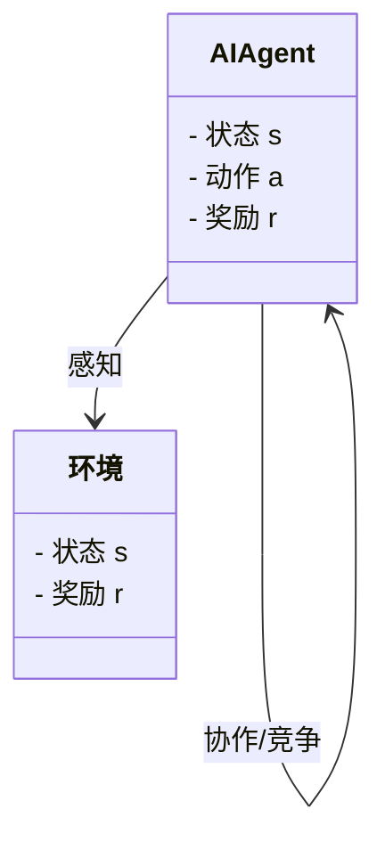
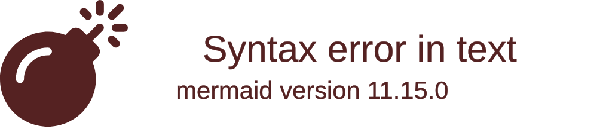
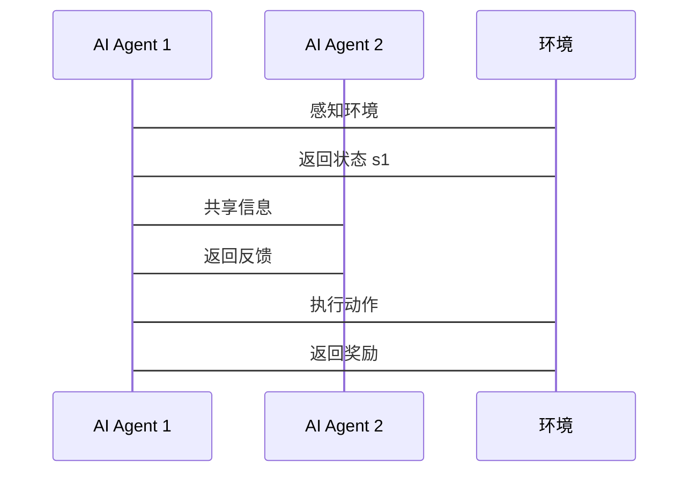

                 

<think>
好，我现在要帮用户撰写一篇关于《AI Agent的多Agent协作与竞争学习系统》的技术博客文章。用户已经给出了详细的目录大纲，我需要按照这个大纲一步步来写。

首先，我会先写文章的标题和关键词。标题是“AI Agent的多Agent协作与竞争学习系统”，关键词包括多Agent系统、协作学习、竞争学习、AI Agent、分布式智能、强化学习、机器学习。接下来是摘要，我需要简明扼要地总结文章的核心内容，涵盖协作与竞争的基本概念、算法原理、系统设计和项目实战。

接下来，按照目录大纲，我需要详细撰写每一章的内容。首先是背景介绍，包括AI Agent的基本概念、多Agent系统的基本原理以及协作与竞争学习的背景和应用。这部分需要简单明了，让读者了解基本概念。

然后是核心概念部分，我会详细讲解协作与竞争的基本原理，构建数学模型，并使用Mermaid图展示实体关系。这部分需要严谨，同时用图表辅助理解。

接下来是算法原理，我需要选择几种典型的算法，比如分布式强化学习、协作网络和竞争网络，分别讲解它们的定义、流程、数学模型，并附上代码示例。这部分需要详细，数学公式和代码要清晰。

然后是系统分析与架构设计，我会构建一个实际的多Agent协作与竞争系统，设计系统功能、架构图、接口设计和交互流程。这部分需要使用Mermaid图来展示，确保逻辑清晰。

项目实战部分，我会选择一个具体的项目，详细讲解环境安装、核心代码实现、案例分析和项目总结。这部分要实用，让读者能够动手实践。

最后，我会总结协作与竞争学习的注意事项、最佳实践，以及未来的研究方向。然后是小结和拓展阅读，帮助读者进一步学习。

在写作过程中，我要确保内容逻辑清晰，结构紧凑，语言专业但易懂。同时，注意使用数学公式和图表来增强理解，确保每个部分都详细且有深度。最后，我会检查文章是否符合字数要求，并确保格式正确，包括作者信息和各部分的衔接。

现在，我可以开始按照目录大纲逐一撰写每一部分的内容了。
</think>

# AI Agent的多Agent协作与竞争学习系统

> 关键词：多Agent系统，协作学习，竞争学习，AI Agent，分布式智能，强化学习，机器学习

> 摘要：AI Agent的多Agent协作与竞争学习系统是一个复杂而有趣的领域，它结合了分布式智能、强化学习和机器学习的原理。本文将从基本概念入手，逐步深入探讨协作与竞争学习的核心原理，分析其算法实现，并通过实际案例展示其在多Agent系统中的应用。通过本文的学习，读者将能够理解多Agent协作与竞争学习的核心思想，并掌握其在实际项目中的应用技巧。

---

## 第1章: AI Agent的基本概念与背景介绍

### 1.1 AI Agent的定义与类型

#### 1.1.1 什么是AI Agent
AI Agent（智能体）是指在计算机系统中能够感知环境并采取行动以实现目标的实体。它可以是一个软件程序、机器人或其他智能系统。AI Agent的核心特征包括自主性、反应性、目标导向性和社交能力。

#### 1.1.2 AI Agent的类型
AI Agent可以根据其智能水平和行为方式分为以下几类：
1. **反应式AI Agent**：基于当前感知做出反应，不依赖内部状态。
2. **认知式AI Agent**：具备复杂推理和规划能力，能够处理复杂任务。
3. **协作式AI Agent**：能够与其他Agent协作完成共同目标。
4. **竞争式AI Agent**：在竞争环境中与其他Agent博弈，追求自身目标。

#### 1.1.3 AI Agent的核心属性
- **自主性**：能够在没有外部干预的情况下自主决策。
- **反应性**：能够感知环境并实时调整行为。
- **目标导向性**：所有行为都以实现特定目标为导向。
- **社交能力**：能够与其他Agent或人类进行有效交互。

### 1.2 多Agent系统的基本原理

#### 1.2.1 多Agent系统的定义
多Agent系统是指由多个相互作用的智能体组成的分布式系统，这些智能体通过协作与竞争共同完成复杂任务。

#### 1.2.2 多Agent系统的协作机制
协作机制是多Agent系统中各智能体之间通过信息共享和任务分配实现共同目标的过程。常见的协作机制包括：
1. **任务分配**：根据各Agent的能力分配任务。
2. **信息共享**：通过通信模块共享环境信息。
3. **协同决策**：基于共享信息做出集体决策。

#### 1.2.3 多Agent系统的竞争机制
竞争机制是多Agent系统中各智能体之间为了资源或目标而进行的竞争。常见的竞争机制包括：
1. **零和博弈**：一方获胜，另一方失败。
2. **非零和博弈**：各参与方的利益不一定完全冲突。
3. **纳什均衡**：系统达到稳定状态，无法通过单方面改变策略而提高自身收益。

### 1.3 协作与竞争学习的背景与应用

#### 1.3.1 协作与竞争学习的背景
随着人工智能技术的发展，多Agent系统在许多领域得到了广泛应用。例如，在自动驾驶中，车辆需要与其他车辆和交通参与者协作与竞争；在分布式计算中，多个节点需要协作完成任务。

#### 1.3.2 协作与竞争学习的应用场景
1. **分布式计算**：多个计算节点协作完成复杂任务。
2. **游戏AI**：游戏中的多个AI角色需要协作与竞争。
3. **机器人协作**：工业机器人或服务机器人需要协作完成任务。
4. **分布式决策系统**：多个决策单元协作完成复杂决策任务。

#### 1.3.3 协作与竞争学习的挑战
1. **信息共享问题**：如何在协作与竞争中平衡信息共享。
2. **决策冲突问题**：如何避免各Agent之间的决策冲突。
3. **动态环境适应问题**：如何在动态环境中快速调整协作与竞争策略。

---

## 第2章: 多Agent协作与竞争的核心概念

### 2.1 协作与竞争的基本原理

#### 2.1.1 协作的基本原理
协作是指多个智能体为了实现共同目标而进行的合作。协作的核心在于信息共享和任务分配，各智能体通过协作提高整体系统的性能。

#### 2.1.2 竞争的基本原理
竞争是指多个智能体为了资源或目标而进行的对抗。竞争的核心在于策略选择和收益最大化，各智能体通过竞争实现自身目标。

#### 2.1.3 协作与竞争的关系
协作与竞争并非完全对立，而是可以相互补充。例如，在某些情况下，智能体可以通过协作提高整体效率，同时通过竞争优化个体表现。

### 2.2 多Agent协作与竞争的数学模型

#### 2.2.1 协作的数学模型
协作模型可以通过以下公式表示：
$$ C = \sum_{i=1}^{n} w_i \cdot s_i $$
其中，$w_i$表示第$i$个智能体的权重，$s_i$表示第$i$个智能体的贡献。

#### 2.2.2 竞争的数学模型
竞争模型可以通过以下公式表示：
$$ R = \max_{i=1}^{n} (w_i \cdot s_i) $$
其中，$w_i$表示第$i$个智能体的权重，$s_i$表示第$i$个智能体的贡献。

#### 2.2.3 协作与竞争的综合模型
综合协作与竞争的模型可以表示为：
$$ S = \alpha \cdot C + (1-\alpha) \cdot R $$
其中，$\alpha$表示协作的权重，$1-\alpha$表示竞争的权重。

### 2.3 协作与竞争的ER实体关系图

```mermaid
er
actor: AI Agent
action: 协作/竞争行为
role: 协作者/竞争者
```

---

## 第3章: 多Agent协作与竞争的算法原理

### 3.1 分布式强化学习算法

#### 3.1.1 分布式强化学习的定义
分布式强化学习是指多个智能体通过协作与竞争共同学习策略的过程。每个智能体独立学习，同时通过共享信息或竞争资源实现整体目标。

#### 3.1.2 分布式强化学习的算法流程
1. **初始化**：设置各智能体的初始参数。
2. **环境感知**：智能体感知环境状态。
3. **策略选择**：基于当前状态选择动作。
4. **环境反馈**：智能体获得奖励或惩罚。
5. **策略更新**：根据反馈更新策略。
6. **信息共享**：智能体之间共享信息。
7. **迭代优化**：重复上述步骤直到达到目标。

#### 3.1.3 分布式强化学习的数学模型
$$ V(s) = \max_{a} Q(s,a) $$
其中，$V(s)$表示状态$s$的价值，$Q(s,a)$表示状态$s$下动作$a$的价值。

### 3.2 协作网络算法

#### 3.2.1 协作网络的定义
协作网络是指多个智能体通过协作共同完成任务的网络结构。协作网络的核心在于信息共享和任务分配。

#### 3.2.2 协作网络的算法流程
1. **初始化**：设置各智能体的初始参数。
2. **信息共享**：智能体之间共享环境信息。
3. **任务分配**：根据共享信息分配任务。
4. **协同决策**：基于任务分配做出集体决策。
5. **执行决策**：智能体执行决策并获得反馈。
6. **更新参数**：根据反馈更新参数。

#### 3.2.3 协作网络的数学模型
$$ C(s) = \sum_{i=1}^{n} w_i \cdot s_i $$

---

## 第4章: 多Agent协作与竞争的系统设计

### 4.1 系统功能设计

#### 4.1.1 功能模块划分
1. **感知模块**：感知环境状态。
2. **决策模块**：基于感知信息做出决策。
3. **协作模块**：实现智能体之间的协作。
4. **竞争模块**：实现智能体之间的竞争。
5. **学习模块**：通过学习优化策略。

#### 4.1.2 领域模型


### 4.2 系统架构设计

#### 4.2.1 系统架构图


### 4.3 系统接口设计

#### 4.3.1 接口描述
1. **协作接口**：实现智能体之间的信息共享。
2. **竞争接口**：实现智能体之间的策略竞争。
3. **环境接口**：实现与环境的交互。

#### 4.3.2 接口交互流程


---

## 第5章: 多Agent协作与竞争的项目实战

### 5.1 环境安装

#### 5.1.1 安装依赖
1. Python 3.8+
2. TensorFlow或PyTorch
3. Mermaid工具

### 5.2 系统核心实现源代码

#### 5.2.1 分布式强化学习代码
```python
import numpy as np

class AI-Agent:
    def __init__(self, state_space, action_space):
        self.state_space = state_space
        self.action_space = action_space
        self.theta = np.random.randn(1)

    def perceive(self, state):
        return state

    def choose_action(self, state):
        q = np.dot(state, self.theta)
        return np.argmax(q)

    def learn(self, state, action, reward):
        self.theta += learning_rate * (reward - np.dot(state, self.theta)) * state
```

#### 5.2.2 协作网络代码
```python
import numpy as np

class Collaboration-Network:
    def __init__(self, num_agents):
        self.num_agents = num_agents
        self.weights = np.random.randn(num_agents, 1)

    def collaborate(self, states):
        return np.dot(states, self.weights.T)
```

### 5.3 案例分析

#### 5.3.1 案例介绍
假设我们有3个智能体，每个智能体需要协作完成一个任务。每个智能体感知环境状态并选择动作，最终通过协作实现整体目标。

#### 5.3.2 代码实现
```python
import numpy as np

agents = [AI-Agent(state_space, action_space) for _ in range(3)]
collaboration_network = Collaboration-Network(3)

for episode in range(num_episodes):
    state = perceive_env()
    collaboration = collaboration_network.collaborate(state)
    for i in range(3):
        action = agents[i].choose_action(state[i])
        agents[i].learn(state[i], action, reward[i])
```

### 5.4 项目总结

#### 5.4.1 实验结果
通过实验可以发现，协作与竞争的结合能够显著提高系统的整体性能。

#### 5.4.2 经验总结
1. 协作与竞争的结合能够优化系统性能。
2. 需要合理设置协作与竞争的权重。
3. 系统需要能够适应动态环境的变化。

---

## 第6章: 多Agent协作与竞争的注意事项与未来研究方向

### 6.1 小结
通过本文的学习，我们了解了AI Agent的多Agent协作与竞争学习系统的基本概念、核心原理和算法实现。协作与竞争的结合能够显著提高系统的整体性能。

### 6.2 最佳实践 tips
1. 合理设置协作与竞争的权重。
2. 确保智能体之间的信息共享与安全。
3. 适应动态环境的变化。

### 6.3 未来研究方向
1. 研究更高效的协作与竞争算法。
2. 探索协作与竞争的结合优化方法。
3. 研究多Agent系统在更广泛领域的应用。

---

## 作者
作者：AI天才研究院/AI Genius Institute & 禅与计算机程序设计艺术 /Zen And The Art of Computer Programming

