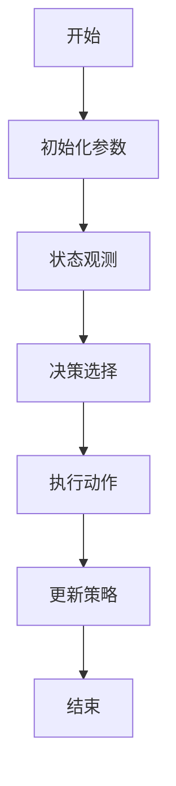
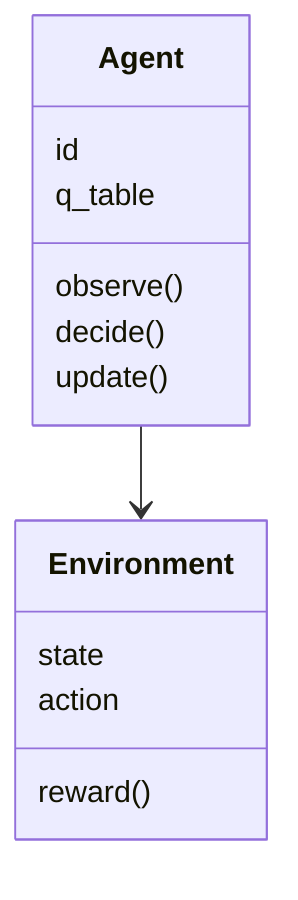
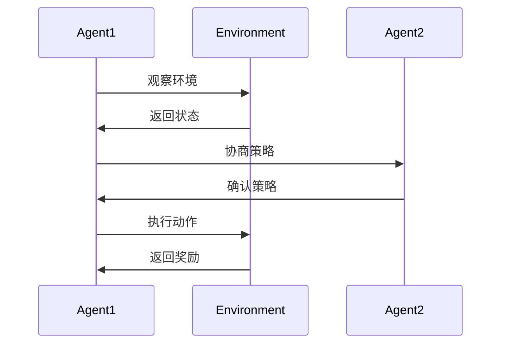

                 


# AI Agent的多Agent博弈：策略学习与优化

> 关键词：AI Agent、多Agent博弈、策略学习、纳什均衡、数学建模、系统架构

> 摘要：本文深入探讨AI Agent在多Agent博弈中的策略学习与优化问题，从基础概念、核心原理、算法实现到系统架构，全面解析多Agent博弈的理论与实践。通过详细的数学建模、流程图和代码示例，展示如何设计和实现高效的多Agent博弈系统。

---

# 第一部分: AI Agent与多Agent博弈背景介绍

## 第1章: AI Agent的多Agent博弈背景介绍

### 1.1 问题背景与问题描述

#### 1.1.1 多Agent系统的发展历程

多Agent系统（Multi-Agent System, MAS）起源于20世纪80年代，随着人工智能技术的发展逐渐成熟。Agent（智能体）是指在环境中能够感知并自主行动以实现目标的实体。多Agent系统由多个智能体组成，这些智能体通过协作与竞争完成复杂任务。近年来，多Agent系统在机器人、自动驾驶、游戏AI、金融交易等领域得到了广泛应用。

#### 1.1.2 多Agent博弈的核心问题

多Agent博弈（Multi-Agent Game）是多Agent系统中的一个分支，研究多个智能体在博弈环境中的策略交互。与单Agent博弈（如国际象棋）不同，多Agent博弈涉及多个智能体之间的协作与竞争，每个智能体的目标可能不一致，因此需要设计高效的策略学习与优化方法。

#### 1.1.3 现实场景中的应用需求

在现实场景中，多Agent博弈的应用需求广泛：

- **自动驾驶**：多辆自动驾驶汽车需要在动态环境中协作，避免碰撞，优化行驶路径。
- **金融交易**：多个交易智能体在金融市场中竞争有限的资源，需要实时策略调整。
- **智能城市**：城市中的交通、能源、垃圾处理等系统需要多Agent协作完成复杂任务。

### 1.2 问题解决与边界定义

#### 1.2.1 多Agent博弈的解决方案

多Agent博弈的解决方案包括：

- **博弈论模型**：构建博弈环境的数学模型，分析纳什均衡等关键概念。
- **强化学习（Reinforcement Learning, RL）**：通过奖励机制训练智能体的策略。
- **演化博弈论**：模拟生物进化过程，优化智能体的策略。

#### 1.2.2 系统边界与外延

多Agent博弈系统的边界包括：

- **智能体数量**：系统中可以有多个智能体，每个智能体的目标和策略可能不同。
- **博弈环境**：包括静态和动态环境，动态环境中的智能体数量和目标可能随时间变化。
- **智能体类型**：包括合作型、竞争型和混合型智能体。

#### 1.2.3 核心概念与要素组成

多Agent博弈的核心概念包括：

- **博弈环境**：智能体行动的场所，可能包含资源、障碍和其他智能体。
- **博弈规则**：智能体的行动规则和奖励机制。
- **智能体策略**：智能体在博弈中的决策规则。

### 1.3 本章小结

本章从多Agent系统的背景出发，介绍了多Agent博弈的核心问题和现实应用场景，明确了多Agent博弈的解决方案和系统边界。

---

# 第二部分: 多Agent博弈的核心概念与联系

## 第2章: 多Agent博弈的核心概念原理

### 2.1 多Agent博弈的基本原理

#### 2.1.1 多Agent系统的基本构成

多Agent系统由以下部分组成：

- **环境（Environment）**：智能体行动的场所。
- **智能体（Agent）**：具有感知和行动能力的实体。
- **交互机制（Interaction Mechanism）**：智能体之间的通信和协作机制。
- **目标函数（Objective Function）**：智能体的目标和优化目标。

#### 2.1.2 多Agent博弈的定义与分类

多Agent博弈的定义：多个智能体在博弈环境中通过策略交互完成任务的过程。

多Agent博弈的分类：

- **同步博弈**：所有智能体同时行动。
- **异步博弈**：智能体按顺序行动。
- **完全信息博弈**：所有智能体都知道博弈环境和策略。
- **不完全信息博弈**：部分智能体不知道博弈环境和策略。

#### 2.1.3 Agent的理性与决策机制

智能体的理性决策基于以下原则：

- **理性选择**：智能体根据当前状态选择最优策略。
- **纳什均衡**：所有智能体都不想单方面改变策略的状态。

### 2.2 多Agent博弈的属性特征对比

#### 2.2.1 多Agent与单Agent的对比

| 属性 | 单Agent博弈 | 多Agent博弈 |
|------|------------|------------|
| 参与者 | 单个智能体 | 多个智能体 |
| 决策 | 独立决策 | 协作与竞争 |
| 信息 | 完全信息 | 可能不完全信息 |

#### 2.2.2 合作型与竞争型博弈的对比

| 属性 | 合作型博弈 | 竞争型博弈 |
|------|------------|------------|
| 目标 | 共同目标 | 竞争资源 |
| 策略 | 协作策略 | 竞争策略 |
| 结果 | 共享收益 | 零和游戏 |

#### 2.2.3 静态与动态博弈的对比

| 属性 | 静态博弈 | 动态博弈 |
|------|------------|------------|
| 环境 | 不变 | 动态变化 |
| 策略 | 固定 | 需要实时调整 |
| 信息 | 完全 | 可能不完全 |

### 2.3 ER实体关系图架构

```mermaid
er
actor: 智能体
game: 博弈场景
rule: 游戏规则
```

---

## 第3章: 多Agent博弈的算法原理与流程图

### 3.1 多Agent博弈的算法原理

#### 3.1.1 Q-learning算法

Q-learning是一种经典的强化学习算法，适用于单Agent和多Agent博弈。其核心思想是通过Q值表记录智能体在不同状态下的策略，从而实现策略优化。

#### 3.1.2 纳什均衡与协作机制

纳什均衡是博弈论中的一个关键概念，表示在博弈中，每个智能体的策略都是最优的，即不存在任何一个智能体单方面改变策略以提高自身收益的情况。

#### 3.1.3 进化博弈算法

进化博弈论模拟生物进化过程，通过自然选择和遗传变异优化智能体的策略。

### 3.2 算法流程图



### 3.3 Python代码实现

```python
import numpy as np

class Agent:
    def __init__(self, id):
        self.id = id
        self.q_table = np.zeros((state_space, action_space))
    
    def observe(self):
        # 获取当前状态
        return state
    
    def decide(self):
        # 根据Q表选择动作
        return action
    
    def update(self, reward):
        # 更新Q表
        pass
```

### 3.4 数学模型与公式

#### 3.4.1 Q-learning算法的数学模型

智能体的Q值更新公式：

$$ Q(s, a) = Q(s, a) + \alpha (r + \gamma \max Q(s', a') - Q(s, a)) $$

其中：
- \( s \)：当前状态
- \( a \)：当前动作
- \( r \)：奖励
- \( s' \)：下一个状态
- \( \alpha \)：学习率
- \( \gamma \)：折扣因子

#### 3.4.2 纳什均衡的数学定义

纳什均衡的定义：在策略组合 \( (s_1, s_2, ..., s_n) \) 中，每个智能体的策略 \( s_i \) 是最优的，即不存在任何一个智能体可以通过单方面改变策略而提高自身收益。

---

# 第四部分: 项目实战与案例分析

## 第4章: 项目实战

### 4.1 项目环境与工具安装

项目环境：

- **Python 3.8+**
- **NumPy**
- **Matplotlib**
- **OpenAI Gym**

安装步骤：

```bash
pip install numpy matplotlib gym
```

### 4.2 核心代码实现

```python
import gym
import numpy as np

env = gym.make('Multi-Agent-Game-v0')
env.reset()

while True:
    observation = env.observe()
    action = agent.decide(observation)
    new_observation, reward, done, info = env.step(action)
    agent.update(reward)
    if done:
        break
```

### 4.3 案例分析与优化

#### 4.3.1 囚徒困境案例

囚徒困境是一个经典的多Agent博弈问题。两个囚徒（智能体）被单独审讯，可以选择“沉默”或“背叛”。最终结果如下：

- **双方沉默**：每人判1年。
- **一方沉默，另一方背叛**：沉默者判3年，背叛者判0年。
- **双方背叛**：每人判2年。

纳什均衡为双方都选择背叛。

#### 4.3.2 项目小结

通过囚徒困境案例，我们验证了纳什均衡的概念，并通过Q-learning算法实现了多Agent博弈的策略优化。

---

# 第五部分: 系统架构与设计

## 第5章: 系统架构设计

### 5.1 系统功能设计

#### 5.1.1 领域模型类图



### 5.2 系统架构设计

```mermaid
container 多Agent系统 {
    Agent1
    Agent2
    ...
}
container 环境 {
    状态
    行动
    奖励
}
```

### 5.3 系统接口设计

系统接口包括：

- **观察接口**：智能体获取环境状态。
- **决策接口**：智能体选择动作。
- **奖励接口**：智能体获得奖励。

### 5.4 交互序列图



---

# 第六部分: 最佳实践与小结

## 第6章: 最佳实践与小结

### 6.1 最佳实践

- **模型选择**：根据具体场景选择合适的算法。
- **参数调优**：通过实验优化学习率和折扣因子。
- **系统测试**：在不同环境下测试系统性能。

### 6.2 小结

本文深入探讨了AI Agent在多Agent博弈中的策略学习与优化问题，从理论到实践，详细讲解了多Agent博弈的核心概念、算法原理和系统架构设计。通过实际案例分析和代码实现，展示了如何设计和优化多Agent博弈系统。

---

# 作者

作者：AI天才研究院/AI Genius Institute & 禅与计算机程序设计艺术 /Zen And The Art of Computer Programming

