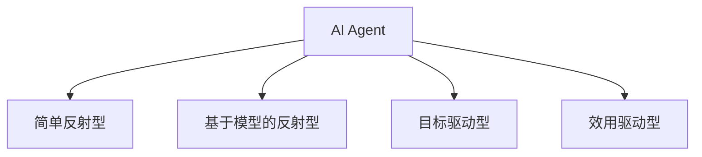
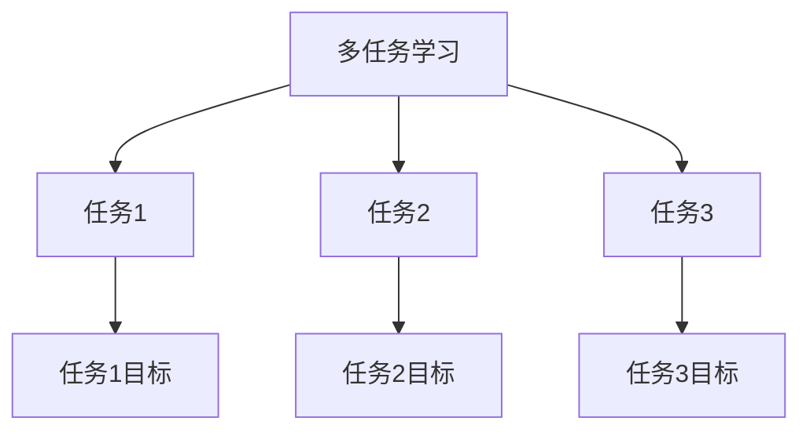
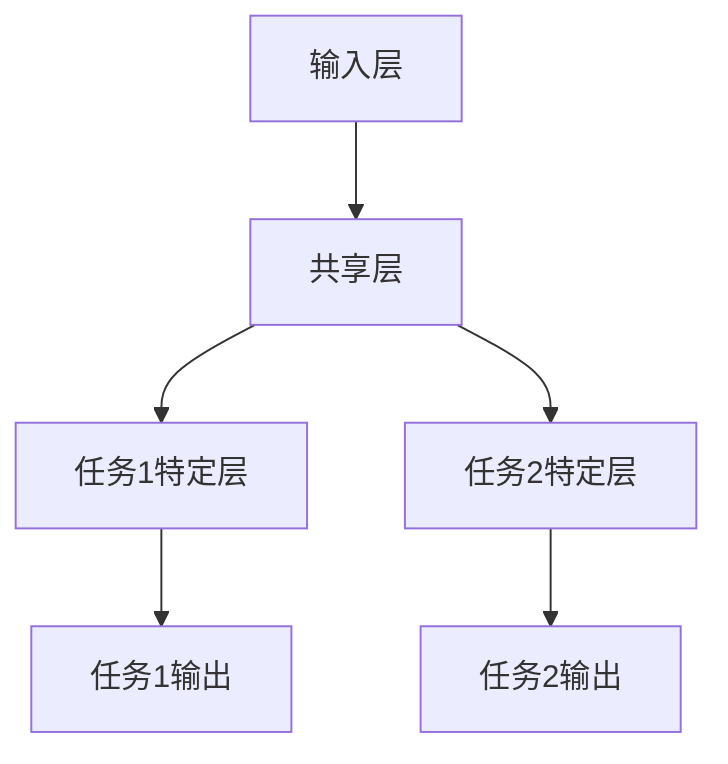
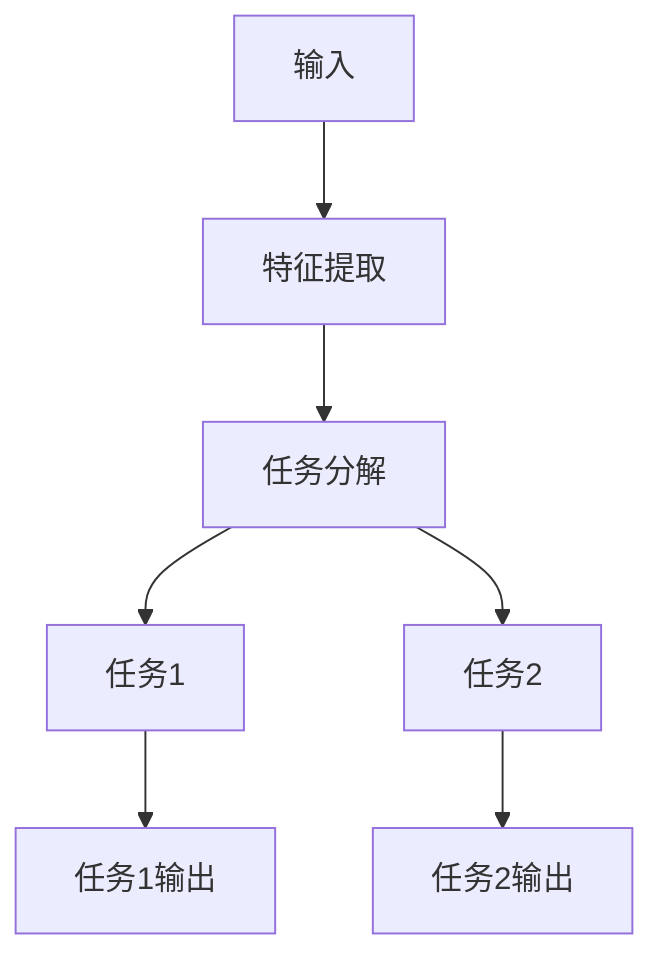
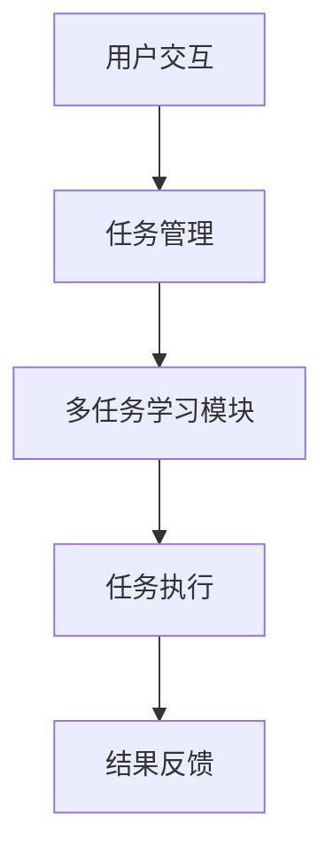
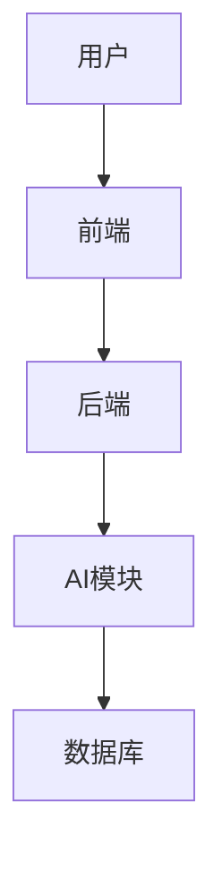
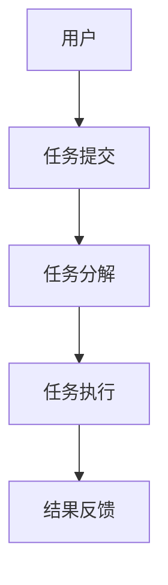

                 

<think>
好的，现在我需要为《AI Agent的多任务学习：构建通用智能助手》这本书撰写一个详细的大纲。这本书的目标是帮助读者理解AI Agent的多任务学习，以及如何构建通用智能助手。考虑到用户的需求，我需要确保大纲覆盖从基础到高级的各个方面，包括背景、核心概念、算法原理、系统架构、项目实战以及最佳实践。

首先，我会从背景介绍开始。这部分需要涵盖AI Agent的基本概念、多任务学习的重要性，以及构建通用智能助手的意义。接下来，核心概念与原理部分要详细讲解AI Agent和多任务学习的定义、原理以及它们之间的关系。这部分需要使用对比表格和Mermaid图来帮助读者理解。

然后是算法原理部分。这里需要详细分析多任务学习的算法，比如联合学习和任务分解，同时用数学公式和代码示例来说明。系统架构部分则需要介绍如何构建AI Agent的系统，包括功能设计、架构图和交互流程图。项目实战部分将通过实际案例展示如何从环境安装到代码实现，最后总结最佳实践和注意事项。

现在，我需要细化每个章节，确保涵盖所有必要的内容。同时，保持逻辑清晰，结构紧凑。每个部分都需要详细的子部分，比如在算法部分，使用数学公式和代码示例，帮助读者理解。系统架构部分需要用Mermaid图展示结构，使内容更直观。

最后，检查整个大纲是否符合用户的要求，确保没有遗漏任何关键点。同时，保持整体结构简洁明了，不超过2000字，但内容详实，帮助读者逐步理解AI Agent的多任务学习。

通过这样的思考过程，我能够系统地构建一个全面而详细的大纲，确保读者能够从基础到高级，逐步掌握AI Agent的多任务学习，并成功构建通用智能助手。
</think>

```markdown
# AI Agent的多任务学习：构建通用智能助手

> 关键词：AI Agent，多任务学习，通用智能助手，系统架构，算法原理，项目实战，最佳实践

> 摘要：本文深入探讨AI Agent的多任务学习，从核心概念到算法原理，再到系统架构和项目实战，详细讲解如何构建通用智能助手。通过丰富具体详细的讲解，结合数学公式、Mermaid图和代码示例，帮助读者掌握AI Agent多任务学习的关键技术。

---

# 第一部分: AI Agent的多任务学习概述

# 第1章: AI Agent与多任务学习概述

## 1.1 AI Agent的基本概念
### 1.1.1 AI Agent的定义与特点
- AI Agent（智能代理）的定义
- AI Agent的核心特点：自主性、反应性、目标导向、社交能力
- AI Agent的分类：简单反射型、基于模型的反射型、目标驱动型、效用驱动型

### 1.1.2 多任务学习的背景
- 多任务学习的定义
- 多任务学习的动机：提升模型泛化能力、减少数据需求、提高效率
- 多任务学习的应用场景：自然语言处理、计算机视觉、机器人控制

### 1.1.3 通用智能助手的目标与意义
- 通用智能助手的目标：具备广泛的任务处理能力，适应多种应用场景
- 多任务学习在通用智能助手中的重要性：提高效率、降低资源消耗、增强用户体验

---

## 1.2 多任务学习的背景与挑战
### 1.2.1 多任务学习的背景
- 传统单任务学习的局限性
- 多任务学习的优势：知识共享、减少数据需求、提升模型鲁棒性

### 1.2.2 多任务学习的核心挑战
- 任务之间的相互干扰：任务间权重分配问题
- 数据不平衡问题：不同任务的数据量差异
- 算法设计的复杂性：如何平衡不同任务的学习目标

### 1.2.3 通用智能助手的应用场景
- 日常生活助手：日程管理、信息检索、任务提醒
- 工作辅助：自动化办公、数据分析、决策支持
- 特定领域应用：医疗诊断、金融分析、智能客服

---

## 1.3 本书的核心目标与结构
### 1.3.1 本书的核心目标
- 深入理解AI Agent的多任务学习原理
- 掌握构建通用智能助手的关键技术
- 学习实际项目中的系统设计与实现

### 1.3.2 本书的结构安排
- 分为三个主要部分：理论基础、算法原理、系统设计与实战
- 每一部分均包含详细的概念讲解、算法分析和实战案例

### 1.3.3 本书的阅读方法
- 建议读者按章节顺序阅读，结合数学公式、代码示例和系统架构图进行理解
- 配合实际项目进行实践，巩固所学知识

---

# 第二部分: AI Agent的核心概念与原理

# 第2章: AI Agent的核心概念

## 2.1 AI Agent的定义与分类
### 2.1.1 AI Agent的定义与特点
- 详细分析AI Agent的定义和核心特点，结合实际案例说明其应用场景
- 使用Mermaid图展示AI Agent的分类体系



### 2.1.2 多任务学习的原理
- 解释多任务学习的基本原理，包括知识共享和任务间关系
- 使用对比表格分析不同多任务学习方法的优缺点

| 方法         | 优点                           | 缺点                           |
|--------------|--------------------------------|--------------------------------|
| 联合学习      | 任务间共享参数，提升泛化能力   | 需要平衡任务权重，计算复杂     |
| 任务分解     | 适合任务差异较大的场景         | 分解任务可能损失部分信息       |

### 2.1.3 AI Agent与多任务学习的关系
- 分析AI Agent多任务学习的独特优势
- 使用Mermaid图展示AI Agent多任务学习的架构



---

## 2.2 多任务学习的原理
### 2.2.1 多任务学习的核心要素
- 任务目标：每个任务的具体目标和优化函数
- 参数共享：任务间共享的参数和独立的参数
- 优化策略：如何平衡不同任务的学习进度

### 2.2.2 多任务学习的核心挑战
- 任务间干扰：如何避免任务间的相互抑制
- 数据不平衡：如何处理不同任务数据量差异
- 算法设计：如何平衡任务间的权重和优化目标

### 2.2.3 多任务学习的优化策略
- 参数分离：为每个任务分配独立的参数
- 参数共享：任务间共享部分参数，提升知识复用
- 动态权重分配：根据任务重要性动态调整权重

---

## 2.3 AI Agent的多任务学习架构
### 2.3.1 多任务学习的网络架构设计
- 详细分析多任务学习的网络架构，包括共享层和任务特定层
- 使用Mermaid图展示典型的多任务学习网络结构



### 2.3.2 多任务学习的优化算法
- 解释常用的多任务优化算法，如联合学习和任务分解
- 使用数学公式展示优化目标函数

$$ \min_{\theta} \sum_{i=1}^{n} \lambda_i L_i(\theta) $$

其中，$\lambda_i$ 是任务 $i$ 的权重，$L_i$ 是任务 $i$ 的损失函数。

### 2.3.3 多任务学习的评估指标
- 常用的评估指标：平均准确率、F1分数、精确率和召回率
- 如何平衡不同任务的评估指标，确保整体性能

---

# 第三部分: AI Agent的算法原理

# 第3章: 多任务学习的算法原理

## 3.1 多任务学习的核心算法
### 3.1.1 联合学习
- 联合学习的基本原理和实现方法
- 使用数学公式展示联合学习的优化目标

$$ \min_{\theta} \sum_{i=1}^{n} L_i(\theta) $$

### 3.1.2 任务分解
- 任务分解的核心思想和实现步骤
- 使用Mermaid图展示任务分解的流程



### 3.1.3 任务权重分配
- 动态权重分配的核心思想和实现方法
- 如何根据任务的重要性动态调整权重

$$ \lambda_i = \frac{1}{1 + e^{-t_i}} $$

其中，$t_i$ 是任务 $i$ 的时间步，$\lambda_i$ 是任务 $i$ 的权重。

---

## 3.2 基于深度学习的多任务学习
### 3.2.1 深度神经网络在多任务学习中的应用
- 详细分析深度神经网络在多任务学习中的优势
- 使用Mermaid图展示深度神经网络的多任务学习架构


### 3.2.2 多任务学习的网络架构设计
- 详细分析多任务学习的网络架构设计，包括共享层和任务特定层
- 使用数学公式展示网络的前向传播过程

$$ h = f(x; \theta_{\text{共享}}) $$

$$ y_i = g(h; \theta_{\text{任务}i}) $$

其中，$\theta_{\text{共享}}$ 是共享层的参数，$\theta_{\text{任务}i}$ 是任务特定层的参数。

### 3.2.3 多任务学习的优化策略
- 详细分析多任务学习的优化策略，包括参数更新和任务权重分配
- 使用数学公式展示优化过程

$$ \theta_{\text{更新}} = \theta_{\text{旧}} - \eta \nabla_{\theta_{\text{旧}}} \sum_{i=1}^{n} \lambda_i L_i(\theta_{\text{旧}}) $$

---

## 3.3 多任务学习的数学模型
### 3.3.1 联合学习的数学模型
- 详细分析联合学习的数学模型，包括损失函数和优化目标
- 使用数学公式展示联合学习的优化过程

$$ \min_{\theta} \sum_{i=1}^{n} L_i(\theta) $$

### 3.3.2 任务分解的数学模型
- 详细分析任务分解的数学模型，包括特征提取和任务特定层的优化
- 使用数学公式展示任务分解的前向传播过程

$$ h = f(x; \theta_{\text{共享}}) $$

$$ y_i = g(h; \theta_{\text{任务}i}) $$

### 3.3.3 动态权重分配的数学模型
- 详细分析动态权重分配的数学模型，包括权重更新和任务优化
- 使用数学公式展示权重更新过程

$$ \lambda_i = \frac{1}{1 + e^{-t_i}} $$

---

# 第四部分: AI Agent的系统架构与设计

# 第4章: AI Agent的系统架构设计

## 4.1 问题场景介绍
### 4.1.1 系统目标
- 构建一个通用智能助手，能够处理多种任务
- 系统设计的核心目标和主要功能

### 4.1.2 项目介绍
- 项目名称：通用智能助手
- 项目目标：实现多任务学习的AI Agent，能够处理多种任务
- 项目范围：包括任务识别、任务分解、任务执行和结果反馈

---

## 4.2 系统功能设计
### 4.2.1 领域模型设计
- 使用Mermaid图展示领域模型，包括用户交互、任务管理、多任务学习模块和结果反馈



### 4.2.2 系统功能模块
- 用户交互模块：接收用户指令，解析任务需求
- 任务管理模块：分解任务，分配资源
- 多任务学习模块：执行多任务学习，输出结果
- 结果反馈模块：向用户反馈结果，处理异常情况

---

## 4.3 系统架构设计
### 4.3.1 系统架构图
- 使用Mermaid图展示系统架构，包括前端、后端和AI模块



### 4.3.2 系统接口设计
- 用户交互接口：API接口设计，包括任务提交、状态查询和结果获取
- 多任务学习模块接口：任务分解、任务执行和结果反馈

### 4.3.3 系统交互流程图
- 使用Mermaid图展示系统交互流程，包括用户请求、任务分解、任务执行和结果反馈



---

## 4.4 系统实现细节
### 4.4.1 环境安装
- 需要安装的软件和工具：Python、深度学习框架（如TensorFlow或PyTorch）、开发环境（如Jupyter Notebook）
- 安装命令示例：
  ```bash
  pip install numpy
  pip install tensorflow
  pip install matplotlib
  ```

### 4.4.2 核心实现源代码
- 详细分析核心实现源代码，包括任务分解、任务执行和结果反馈模块
- 使用Python代码展示多任务学习模块的实现

```python
import tensorflow as tf
from tensorflow import keras

# 定义共享层
shared_layer = keras.layers.Dense(64, activation='relu')

# 定义任务特定层
task1_layer = keras.layers.Dense(32, activation='relu')
task2_layer = keras.layers.Dense(32, activation='relu')

# 构建模型
input_layer = keras.Input(shape=(input_dim,))
shared_output = shared_layer(input_layer)
task1_output = task1_layer(shared_output)
task2_output = task2_layer(shared_output)

# 编译模型
model = keras.Model(inputs=input_layer, outputs=[task1_output, task2_output])
model.compile(optimizer='adam', loss={'task1': 'binary_crossentropy', 'task2': 'categorical_crossentropy'})
```

### 4.4.3 系统实现的关键点
- 任务分解的实现细节：如何将复杂任务分解为多个子任务
- 多任务学习模块的实现：如何平衡不同任务的学习目标
- 系统交互的实现：如何处理用户指令和反馈结果

---

## 4.5 系统测试与优化
### 4.5.1 系统测试
- 功能测试：测试系统是否能够正确分解任务并执行
- 性能测试：测试系统在高负载下的表现
- 安全测试：测试系统是否能够处理异常情况

### 4.5.2 系统优化
- 优化算法：调整任务权重和优化策略，提升系统性能
- 优化架构：优化系统架构，提高处理效率
- 优化接口：优化系统接口，提升用户体验

---

# 第五部分: 项目实战与最佳实践

# 第5章: 项目实战：通用智能助手的实现

## 5.1 环境安装
### 5.1.1 安装Python和必要的库
- Python版本：3.8以上
- 安装库：numpy、pandas、tensorflow、jupyter notebook

### 5.1.2 安装开发环境
- 安装Jupyter Notebook
- 配置开发环境

```bash
pip install numpy
pip install pandas
pip install tensorflow
pip install jupyter
```

---

## 5.2 系统核心实现
### 5.2.1 多任务学习模块的实现
- 使用PyTorch实现多任务学习模块
- 代码示例：

```python
import torch
import torch.nn as nn
import torch.optim as optim

# 定义共享层
shared_layer = nn.Linear(input_dim, 64)

# 定义任务特定层
task1_layer = nn.Linear(64, output_dim1)
task2_layer = nn.Linear(64, output_dim2)

# 构建模型
model = nn.Sequential(
    shared_layer,
    nn.ReLU(),
    task1_layer,
    nn.ReLU(),
    task2_layer
)

# 编译模型
criterion = nn.CrossEntropyLoss()
optimizer = optim.Adam(model.parameters())
```

### 5.2.2 任务分解与执行
- 详细分析任务分解和执行的实现细节
- 使用Python代码展示任务分解过程

```python
def decompose_task(task):
    # 分解任务为多个子任务
    sub_tasks = []
    for sub_task in task:
        sub_tasks.append(sub_task)
    return sub_tasks

# 示例
task = ['search', 'schedule', 'notification']
sub_tasks = decompose_task(task)
print(sub_tasks)  # 输出：['search', 'schedule', 'notification']
```

### 5.2.3 系统交互与反馈
- 详细分析系统交互与反馈的实现细节
- 使用Python代码展示用户交互过程

```python
def user_interaction():
    while True:
        user_input = input("请输入任务：")
        if user_input == 'exit':
            break
        # 处理用户输入
        process_task(user_input)
```

---

## 5.3 项目小结
### 5.3.1 实战经验总结
- 实战中遇到的问题及解决方案
- 系统设计的关键点和注意事项

### 5.3.2 项目优化建议
- 如何优化系统性能和用户体验
- 如何扩展系统功能和应用场景

---

## 5.4 最佳实践 Tips
### 5.4.1 系统设计 Tips
- 如何设计高效的系统架构
- 如何处理任务分解和执行中的问题

### 5.4.2 系统实现 Tips
- 如何选择合适的深度学习框架
- 如何优化模型参数和训练策略

### 5.4.3 系统测试 Tips
- 如何进行系统测试和优化
- 如何处理异常情况和错误

---

# 第六部分: 总结与展望

# 第6章: 总结与展望

## 6.1 本章总结
### 6.1.1 核心知识点回顾
- AI Agent的基本概念和多任务学习的原理
- 通用智能助手的系统架构和实现方法

### 6.1.2 实战经验总结
- 项目实战中的关键点和注意事项
- 系统优化和性能提升的技巧

---

## 6.2 未来展望
### 6.2.1 多任务学习的发展趋势
- 多任务学习在AI Agent中的应用前景
- 未来可能出现的新算法和新技术

### 6.2.2 通用智能助手的未来方向
- 更智能化和个性化的助手
- 更广泛的应用场景和更高的用户体验

---

# 作者：AI天才研究院/AI Genius Institute & 禅与计算机程序设计艺术 /Zen And The Art of Computer Programming
```

