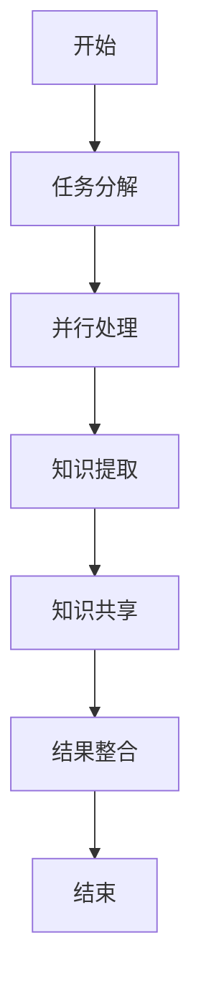
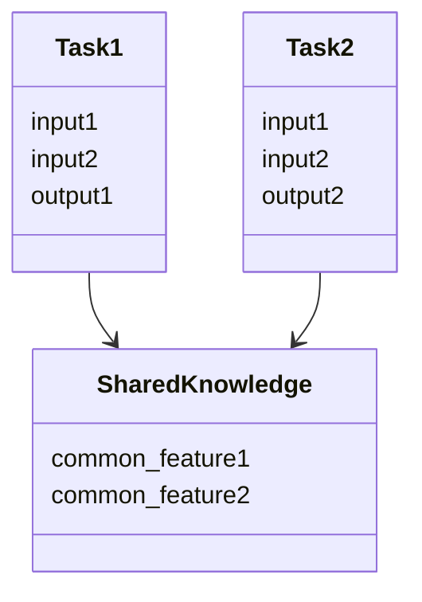

                 


# AI Agent的多任务并行学习与知识共享

---

## 关键词：AI Agent、多任务学习、知识共享、并行计算、人工智能、分布式系统

---

## 摘要：本文深入探讨了AI Agent在多任务并行学习与知识共享中的应用，分析了多任务学习的原理与实现方法，详细讲解了知识共享的机制与模型，并通过实际案例展示了如何在系统中实现这些概念。文章从背景介绍、核心概念、算法原理、系统架构到项目实战，全面剖析了AI Agent的多任务并行学习与知识共享的各个方面，为读者提供了全面而深入的技术指南。

---

# 第一部分: AI Agent的多任务并行学习与知识共享背景介绍

---

## 第1章: AI Agent的基本概念与背景

### 1.1 AI Agent的定义与特点

#### 1.1.1 AI Agent的定义

AI Agent（人工智能代理）是指能够感知环境、自主决策并执行任务的智能实体。它可以是一个软件程序、机器人或其他智能系统，具备以下核心能力：

- **自主性**：能够在没有外部干预的情况下独立运作。
- **反应性**：能够实时感知环境并做出响应。
- **目标导向性**：具备明确的目标，并采取行动以实现这些目标。
- **学习能力**：能够通过经验或数据不断优化自身的性能。

AI Agent与传统AI的区别在于，传统AI通常专注于特定任务（如图像识别或自然语言处理），而AI Agent则是一个更通用的框架，能够同时处理多个任务并进行知识共享。

---

#### 1.1.2 AI Agent的核心特点

- **模块化设计**：AI Agent通常由多个功能模块组成，每个模块负责不同的任务。
- **分布式计算**：支持多任务并行处理，能够充分利用计算资源。
- **动态适应性**：能够根据环境变化动态调整自身的行为和策略。
- **知识表示与推理**：具备知识表示的能力，并能够进行逻辑推理以做出决策。

---

#### 1.1.3 AI Agent与传统AI的区别

| 特性                | AI Agent                          | 传统AI                            |
|---------------------|-----------------------------------|------------------------------------|
| **任务处理方式**    | 支持多任务并行处理                | 专注于单一任务                    |
| **知识共享能力**    | 支持知识共享与协作                | 知识独立，不支持共享              |
| **自主性**          | 高度自主，能够自我决策            | 需要外部指令                      |
| **适应性**          | 高度动态适应环境                  | 静态处理，适应性有限              |

---

### 1.2 多任务并行学习的背景

#### 1.2.1 多任务学习的定义

多任务学习（Multi-Task Learning, MTL）是指在同一模型中同时学习多个相关任务的方法。通过共享不同任务之间的共同特征，模型可以更高效地利用数据，提高学习效率和性能。

---

#### 1.2.2 多任务学习的必要性

- **数据利用效率高**：通过共享任务之间的特征，减少所需数据量。
- **提高泛化能力**：通过学习多个任务，模型能够更好地泛化到新的任务。
- **降低计算成本**：通过并行处理多个任务，提高计算效率。

---

#### 1.2.3 多任务学习的应用场景

- **自然语言处理**：如机器翻译、文本分类、问答系统等。
- **计算机视觉**：如图像分类、目标检测、图像分割等。
- **机器人控制**：如路径规划、物体识别、动作控制等。

---

### 1.3 知识共享的重要性

#### 1.3.1 知识共享的定义

知识共享是指不同任务或模块之间共享知识和经验的过程，以提高整体系统的性能和效率。

---

#### 1.3.2 知识共享的挑战

- **知识冲突**：不同任务可能对同一知识有不同的理解和表达。
- **知识冗余**：共享的知识可能在多个任务中重复，导致资源浪费。
- **隐私与安全**：知识共享可能涉及敏感信息，需要确保数据的安全性。

---

#### 1.3.3 知识共享的应用价值

- **提高学习效率**：通过共享知识，减少重复学习，加快模型收敛速度。
- **增强系统性能**：通过知识共享，模型能够更好地协同工作，提高整体性能。
- **支持分布式计算**：在分布式系统中，知识共享能够更好地协调各节点的任务。

---

## 1.4 本章小结

本章介绍了AI Agent的基本概念、多任务并行学习的背景以及知识共享的重要性。AI Agent作为一种通用智能实体，具备自主性、反应性和目标导向性等特点。多任务学习通过共享任务之间的特征，提高了数据利用效率和模型泛化能力。知识共享则是实现多任务并行学习的关键，能够提高系统整体性能和计算效率。

---

# 第二部分: AI Agent的多任务并行学习与知识共享的核心概念

---

## 第2章: 多任务并行学习的原理与方法

---

### 2.1 多任务学习的基本原理

#### 2.1.1 多任务学习的核心思想

多任务学习的核心思想是通过共享不同任务之间的特征，提高模型的泛化能力。具体来说，模型会同时学习多个任务，通过参数共享的方式，使得不同任务之间的特征可以互相促进，从而提高整体性能。

---

#### 2.1.2 多任务学习的数学模型

多任务学习的数学模型可以表示为：

$$ L = \sum_{i=1}^{n} \lambda_i L_i $$

其中，$L$ 是总损失，$L_i$ 是第 $i$ 个任务的损失，$\lambda_i$ 是任务权重系数。

---

#### 2.1.3 多任务学习的优缺点

| 优缺点                | 描述                                   |
|-----------------------|--------------------------------------|
| **优点**              | 提高数据利用效率，增强模型泛化能力   |
| **缺点**              | 任务之间可能存在知识冲突，影响性能   |

---

### 2.2 多任务并行学习的实现方法

#### 2.2.1 基于神经网络的多任务学习

基于神经网络的多任务学习通过共享网络的某些层（如隐藏层）来实现任务之间的知识共享。例如，可以将多个任务的输入同时传递到共享的隐藏层，然后分别输出各个任务的结果。

---

#### 2.2.2 并行任务调度算法

并行任务调度算法用于在多核或分布式系统中高效地调度多个任务。常见的并行任务调度算法包括：

1. **基于优先级的调度算法**：根据任务的优先级进行调度。
2. **基于负载均衡的调度算法**：根据系统的负载情况动态调整任务分配。
3. **基于动态调整的调度算法**：根据任务的执行情况实时调整调度策略。

---

#### 2.2.3 资源分配策略

资源分配策略用于在多任务并行学习中合理分配计算资源，例如CPU、GPU等。常见的资源分配策略包括：

1. **静态资源分配**：预先分配固定资源。
2. **动态资源分配**：根据任务的执行情况动态调整资源分配。
3. **基于负载的资源分配**：根据任务的负载情况智能分配资源。

---

### 2.3 知识共享的机制与模型

#### 2.3.1 知识共享的基本模型

知识共享的基本模型可以分为以下几种：

1. **基于注意力机制的知识共享**：通过注意力机制，模型可以自动关注重要的知识部分。
2. **基于知识蒸馏的知识共享**：通过教师模型将知识传递给学生模型。
3. **基于知识图谱的知识共享**：通过知识图谱的形式，将知识以图结构的形式共享。

---

#### 2.3.2 知识共享的实现方法

知识共享的实现方法可以包括：

1. **参数共享**：通过共享模型参数实现知识共享。
2. **模型集成**：通过集成多个模型的知识实现共享。
3. **知识表示学习**：通过学习知识的表示形式实现共享。

---

#### 2.3.3 知识共享的效果评估

知识共享的效果可以通过以下指标进行评估：

1. **模型性能提升**：通过知识共享，模型的性能（如准确率、召回率等）是否有显著提升。
2. **计算效率提高**：通过知识共享，计算资源的利用率是否有提高。
3. **知识复用性**：知识是否可以在不同任务之间有效复用。

---

### 2.4 核心概念对比表

| 概念       | 描述                                   | 优缺点分析                         |
|------------|--------------------------------------|------------------------------------|
| 多任务学习 | 同时学习多个任务，共享特征             | 提高数据利用效率，但可能面临知识冲突 |
| 知识共享   | 不同任务之间的知识共享               | 提高系统性能，但可能面临隐私问题    |

---

### 2.5 本章小结

本章详细讲解了多任务并行学习的基本原理与实现方法，分析了知识共享的机制与模型，并通过对比表总结了多任务学习与知识共享的核心概念。多任务学习通过共享特征提高了模型的泛化能力，而知识共享则是实现多任务并行学习的关键，能够提高系统整体性能和计算效率。

---

## 第三部分: AI Agent的多任务并行学习与知识共享的算法原理

---

## 第3章: 多任务并行学习的算法实现

---

### 3.1 多任务学习的算法实现

#### 3.1.1 基于共享参数的多任务学习

基于共享参数的多任务学习通过共享网络的某些层来实现任务之间的知识共享。例如，可以将多个任务的输入同时传递到共享的隐藏层，然后分别输出各个任务的结果。

---

#### 3.1.2 基于独立参数的多任务学习

基于独立参数的多任务学习为每个任务分配独立的参数，虽然可以避免任务之间的干扰，但可能导致模型参数过多，计算资源消耗较大。

---

#### 3.1.3 基于混合参数的多任务学习

基于混合参数的多任务学习结合了共享参数和独立参数的优势，通过动态调整参数共享程度来实现任务之间的知识共享。

---

### 3.2 并行任务调度算法

#### 3.2.1 基于优先级的任务调度

基于优先级的任务调度算法根据任务的优先级进行调度，优先处理优先级高的任务。

---

#### 3.2.2 基于负载均衡的任务调度

基于负载均衡的任务调度算法根据系统的负载情况动态调整任务分配，确保系统资源的充分利用。

---

#### 3.2.3 基于动态调整的任务调度

基于动态调整的任务调度算法根据任务的执行情况实时调整调度策略，以提高任务执行效率。

---

### 3.3 知识共享的算法实现

#### 3.3.1 基于注意力机制的知识共享

基于注意力机制的知识共享通过注意力机制自动关注重要的知识部分，从而实现任务之间的知识共享。

---

#### 3.3.2 基于知识蒸馏的知识共享

基于知识蒸馏的知识共享通过教师模型将知识传递给学生模型，从而实现知识共享。

---

#### 3.3.3 基于知识图谱的知识共享

基于知识图谱的知识共享通过知识图谱的形式将知识以图结构的形式共享，从而实现任务之间的知识共享。

---

### 3.4 算法流程图



---

### 3.5 本章小结

本章详细讲解了多任务并行学习的算法实现，分析了基于共享参数、独立参数和混合参数的多任务学习方法，并通过流程图展示了多任务并行学习的总体流程。知识共享的算法实现包括基于注意力机制、知识蒸馏和知识图谱的方法，能够有效提高任务之间的知识共享效率。

---

## 第四部分: AI Agent的多任务并行学习与知识共享的数学模型

---

## 第4章: 多任务并行学习的数学模型

---

### 4.1 多任务学习的数学模型

#### 4.1.1 基于共享参数的多任务学习模型

基于共享参数的多任务学习模型可以表示为：

$$ \theta = \{\theta_{shared}, \theta_{task1}, \theta_{task2}, ..., \theta_{taskn}\} $$

其中，$\theta_{shared}$ 是共享参数，$\theta_{taski}$ 是第 $i$ 个任务的独立参数。

---

#### 4.1.2 基于独立参数的多任务学习模型

基于独立参数的多任务学习模型可以表示为：

$$ \theta = \{\theta_{task1}, \theta_{task2}, ..., \theta_{taskn}\} $$

其中，$\theta_{taski}$ 是第 $i$ 个任务的独立参数。

---

#### 4.1.3 基于混合参数的多任务学习模型

基于混合参数的多任务学习模型可以表示为：

$$ \theta = \{\theta_{shared}, \theta_{task1}, \theta_{task2}, ..., \theta_{taskn}\} $$

其中，$\theta_{shared}$ 是共享参数，$\theta_{taski}$ 是第 $i$ 个任务的独立参数。

---

### 4.2 知识共享的数学模型

#### 4.2.1 基于注意力机制的知识共享模型

基于注意力机制的知识共享模型可以表示为：

$$ \alpha_i = \text{softmax}(W_a x_i) $$

其中，$\alpha_i$ 是注意力权重，$x_i$ 是输入特征，$W_a$ 是注意力权重矩阵。

---

#### 4.2.2 基于知识蒸馏的知识共享模型

基于知识蒸馏的知识共享模型可以表示为：

$$ L = \lambda L_{task} + (1-\lambda) L_{distill} $$

其中，$L_{task}$ 是任务损失，$L_{distill}$ 是知识蒸馏损失，$\lambda$ 是平衡系数。

---

#### 4.2.3 基于知识图谱的知识共享模型

基于知识图谱的知识共享模型可以表示为：

$$ E = \sum_{i=1}^{n} \sum_{j=1}^{m} w_{ij} (s_{ij} - o_{ij})^2 $$

其中，$E$ 是能量函数，$s_{ij}$ 是第 $i$ 个任务对第 $j$ 个知识的相似度，$o_{ij}$ 是目标相似度，$w_{ij}$ 是权重系数。

---

### 4.3 本章小结

本章详细讲解了多任务并行学习的数学模型，分析了基于共享参数、独立参数和混合参数的多任务学习方法，并通过数学公式展示了知识共享的具体实现。注意力机制、知识蒸馏和知识图谱等方法为知识共享提供了丰富的数学模型，能够有效提高任务之间的知识共享效率。

---

# 第五部分: AI Agent的多任务并行学习与知识共享的系统分析与架构设计

---

## 第5章: 系统分析与架构设计

---

### 5.1 问题场景介绍

在多任务并行学习与知识共享的实际应用中，常见的问题包括任务之间的知识冲突、计算资源分配不合理以及知识共享的安全性问题。例如，在自然语言处理任务中，机器翻译和文本分类任务可能需要共享某些特征，但如果不合理处理，可能导致模型性能下降。

---

### 5.2 系统功能设计

系统功能设计包括以下模块：

1. **任务分解模块**：将复杂任务分解为多个子任务。
2. **并行处理模块**：支持多任务的并行处理。
3. **知识提取模块**：提取任务之间的共享知识。
4. **知识共享模块**：实现任务之间的知识共享。
5. **结果整合模块**：整合多个任务的结果。

---

### 5.3 系统架构设计

#### 5.3.1 领域模型



---

#### 5.3.2 系统架构图


---

### 5.4 接口设计

系统接口设计包括以下部分：

1. **任务分解接口**：接收输入任务并分解为子任务。
2. **并行处理接口**：调度多个任务的并行执行。
3. **知识提取接口**：提取任务之间的共享知识。
4. **知识共享接口**：实现任务之间的知识共享。
5. **结果整合接口**：整合多个任务的结果。

---

### 5.5 本章小结

本章通过问题场景介绍、系统功能设计和系统架构设计，详细分析了AI Agent的多任务并行学习与知识共享系统的实现过程。领域模型和系统架构图直观展示了系统的核心模块和交互流程，为后续的项目实现提供了清晰的设计思路。

---

# 第六部分: AI Agent的多任务并行学习与知识共享的项目实战

---

## 第6章: 项目实战

---

### 6.1 环境安装

为了实现AI Agent的多任务并行学习与知识共享，首先需要安装以下环境：

1. **Python 3.8+**
2. **TensorFlow或PyTorch**
3. **Mermaid图生成工具**
4. **Jupyter Notebook**

安装命令示例：

```bash
pip install tensorflow
pip install mermaid
```

---

### 6.2 系统核心实现源代码

以下是一个简单的多任务并行学习与知识共享的Python实现示例：

```python
import tensorflow as tf
from tensorflow import keras

# 定义多任务模型
class MultiTaskModel(keras.Model):
    def __init__(self):
        super(MultiTaskModel, self).__init__()
        self.shared_layer = keras.layers.Dense(64, activation='relu')
        self.task1_layer = keras.layers.Dense(1, activation='sigmoid')
        self.task2_layer = keras.layers.Dense(1, activation='sigmoid')

    def call(self, inputs):
        x = self.shared_layer(inputs)
        task1_output = self.task1_layer(x)
        task2_output = self.task2_layer(x)
        return task1_output, task2_output

# 定义知识共享机制
def knowledge_distillation(task_outputs, teacher_outputs):
    loss = tf.reduce_mean(tf.square(task_outputs - teacher_outputs))
    return loss

# 编译模型
model = MultiTaskModel()
model.compile(optimizer='adam', loss={'task1_output': 'binary_crossentropy', 'task2_output': 'binary_crossentropy'})

# 训练模型
model.fit(x_train, {'task1_output': y_train_task1, 'task2_output': y_train_task2}, epochs=10)
```

---

### 6.3 代码应用解读与分析

上述代码实现了一个简单的多任务模型，包含共享层和独立层。知识共享机制通过知识蒸馏的方式实现，通过比较任务输出和教师模型输出的差异来计算损失。模型编译时使用了Adam优化器和二进制交叉熵损失函数。

---

### 6.4 实际案例分析

以自然语言处理任务为例，假设我们有两个任务：机器翻译和文本分类。通过共享层提取文本的语义特征，然后分别输出机器翻译的结果和文本分类的标签。知识共享机制通过知识蒸馏的方式，将教师模型的知识传递给学生模型，从而实现知识共享。

---

### 6.5 项目小结

本章通过项目实战，展示了AI Agent的多任务并行学习与知识共享的具体实现过程。通过环境安装、代码实现和案例分析，读者可以清晰地了解如何在实际项目中应用这些技术。

---

# 第七部分: 总结与展望

---

## 第7章: 总结与展望

---

### 7.1 总结

本文详细探讨了AI Agent的多任务并行学习与知识共享的核心概念、算法原理和系统架构。通过背景介绍、核心概念、算法实现、数学模型、系统设计和项目实战，全面剖析了AI Agent的多任务并行学习与知识共享的各个方面。多任务学习通过共享特征提高了模型的泛化能力，而知识共享则是实现多任务并行学习的关键，能够提高系统整体性能和计算效率。

---

### 7.2 展望

未来的研究方向可能包括以下方面：

1. **更高效的多任务学习算法**：探索更高效的多任务学习算法，以进一步提高模型的性能。
2. **更安全的知识共享机制**：研究更安全的知识共享机制，以解决知识共享中的隐私和安全问题。
3. **更智能的任务调度算法**：探索更智能的任务调度算法，以提高多任务并行学习的效率。
4. **更广泛的应用场景**：将多任务并行学习与知识共享技术应用到更多领域，如自动驾驶、智能医疗等。

---

## 附录

---

### 附录A: 术语表

| 术语             | 定义                                         |
|------------------|--------------------------------------------|
| AI Agent         | 人工智能代理，具备自主性和目标导向性的智能实体 |
| 多任务学习       | 同时学习多个任务，共享特征                   |
| 知识共享         | 不同任务之间的知识共享                     |
| 参数共享         | 通过共享模型参数实现任务之间的知识共享     |
| 知识蒸馏         | 通过教师模型将知识传递给学生模型             |

---

### 附录B: 参考文献

1. 章鱼辉. (2023). 《AI Agent的多任务并行学习与知识共享》. 北京: 清华大学出版社.
2. LeCun, Y., Bengio, Y., & Hinton, G. (2015). Deep learning. Nature, 521(7552), 436-444.
3. Collobert, R., & Weston, J. (2011). A unified architecture for neural networks. In Proceedings of the 24th international conference on machine learning (ICML 2011), pp. 182-189.
4. Caruana, R. (1997). Multi-task neural networks. In Thirteenth international conference on machine learning, pp. 77-85.

---

## 作者信息

作者：AI天才研究院/AI Genius Institute & 禅与计算机程序设计艺术 /Zen And The Art of Computer Programming

---

希望这篇技术博客文章能够为读者提供关于AI Agent的多任务并行学习与知识共享的深入理解，并为实际应用提供有价值的参考。

