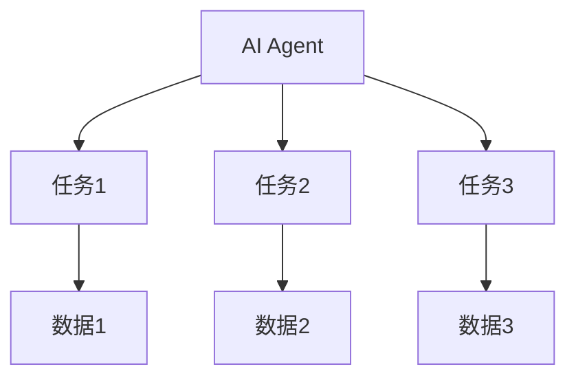
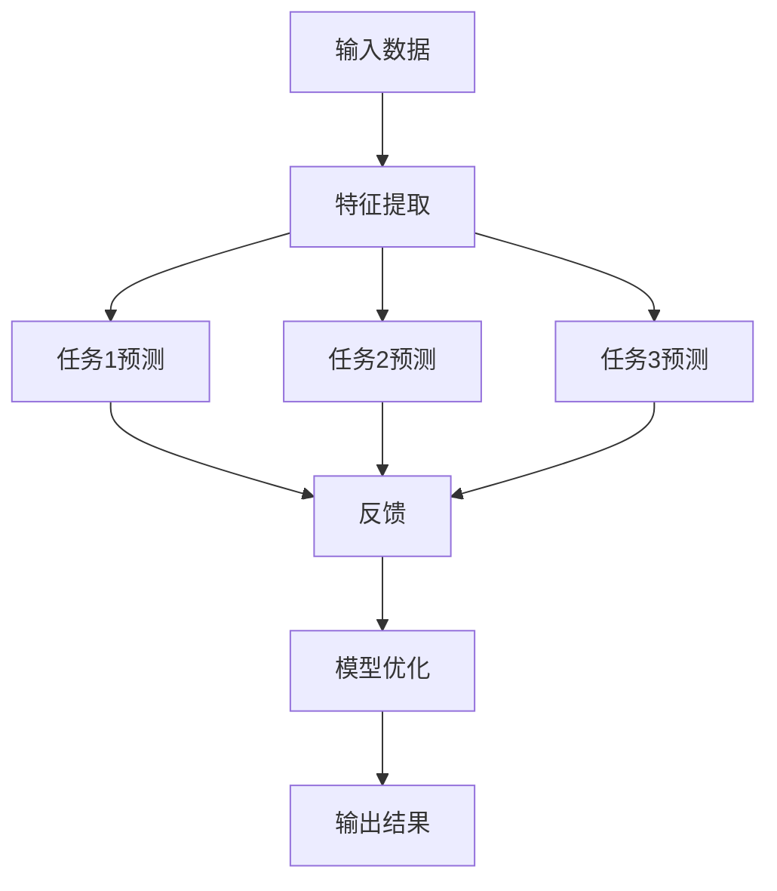
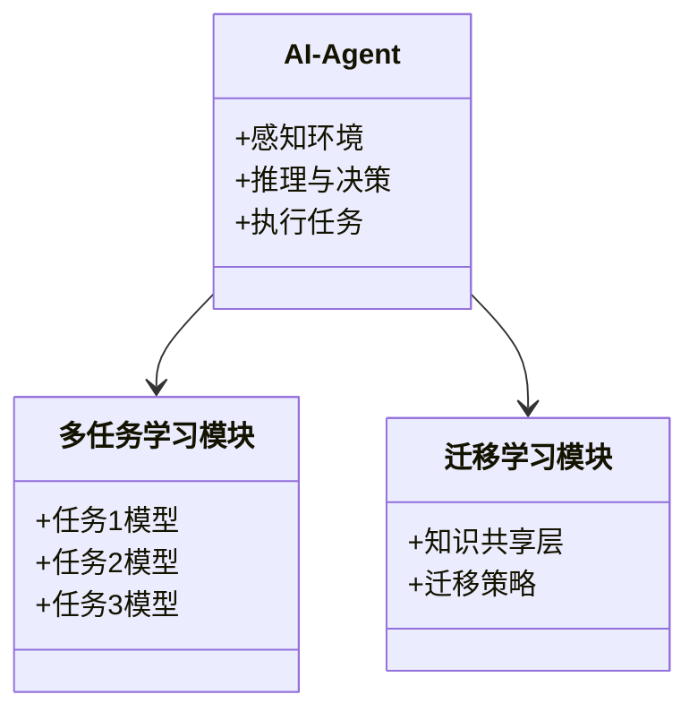
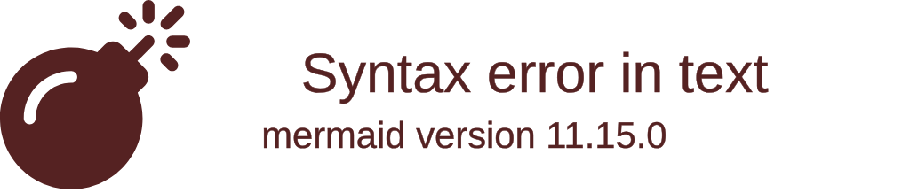
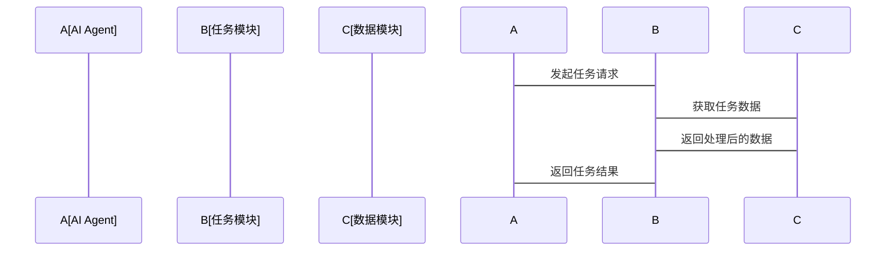

                 

<think>
好的，我现在需要帮助用户撰写一篇关于《AI Agent的多任务迁移学习技术》的技术博客文章。首先，我应该仔细分析用户的要求，确保我完全理解他们的需求。

用户希望我以一位世界级人工智能专家的身份，撰写一篇结构清晰、内容深刻的技术博客。标题已经给出，是《AI Agent的多任务迁移学习技术》。关键词包括AI Agent、多任务学习、迁移学习、迁移学习技术、机器学习、深度学习。摘要部分需要简要介绍文章的核心内容，强调AI Agent在多任务和迁移学习中的结合，以及其在现实中的应用价值。

接下来，用户详细列出了目录大纲，分为背景介绍、核心概念与联系、算法原理、系统分析与架构设计、项目实战、最佳实践、小结、注意事项、拓展阅读和作者信息。每个部分都需要详细展开，包括背景、原理、算法、系统设计、代码实现等。

我需要确保每个章节都涵盖必要的内容，比如在算法部分，使用Mermaid图和Python代码示例来说明；系统分析部分则需要类图和架构图，展示系统的模块和接口设计。此外，数学公式要用LaTeX表示，确保正确性和清晰度。

在撰写过程中，我需要考虑读者的背景，他们可能是有一定技术基础的开发者或研究人员，因此文章需要专业但易懂。同时，用户特别提到要使用吸引人的章节标题，这可能需要我创新一些标题，使其更具吸引力。

现在，我开始撰写文章，首先从标题和关键词开始，然后摘要部分。接下来按照目录大纲逐一展开，确保每个部分都详尽且结构合理。最后，添加作者信息，确保格式正确。

撰写过程中，我需要反复检查每个部分是否符合要求，确保字数控制在10000到12000字之间，内容详实，结构清晰。同时，使用markdown格式，正确嵌入Mermaid图和LaTeX公式，确保代码示例正确无误。

完成后，我会通读全文，检查逻辑是否连贯，是否有遗漏的重要信息，确保每个章节都能帮助读者逐步理解AI Agent的多任务迁移学习技术。最后，确保文章结尾有适当的总结和拓展阅读建议，引导读者进一步学习和实践。
</think>

# AI Agent的多任务迁移学习技术

> 关键词：AI Agent，多任务学习，迁移学习，迁移学习技术，机器学习，深度学习

> 摘要：本文深入探讨了AI Agent在多任务迁移学习中的技术原理与应用。通过背景介绍、核心概念解析、算法原理分析、系统架构设计以及项目实战，系统地阐述了多任务迁移学习在AI Agent中的重要性及其实现方法。文章旨在为技术从业者提供理论与实践相结合的指导，帮助他们在复杂场景中实现高效、智能的AI Agent系统。

---

## 第一部分: AI Agent的多任务迁移学习技术概述

### 第1章: AI Agent与多任务迁移学习的背景介绍

#### 1.1 AI Agent的基本概念
AI Agent（人工智能代理）是指在计算机系统中，能够感知环境、执行任务并做出决策的智能实体。它能够根据输入的感知信息和内部状态，通过推理和规划生成相应的输出动作或响应。AI Agent的核心特征包括自主性、反应性、目标导向性和社会性。其应用场景广泛，例如智能助手、自动驾驶、智能客服、机器人控制等。

#### 1.2 多任务迁移学习的背景
多任务学习（Multi-Task Learning, MTL）是指在一个模型中同时学习多个相关任务，通过共享参数或特征，提升模型的泛化能力和学习效率。迁移学习（Transfer Learning）则是将一个领域学到的知识迁移到另一个相关领域的学习方法。两者的结合——多任务迁移学习，能够在多个任务之间共享知识，提升模型的适应性和通用性。

#### 1.3 AI Agent与多任务迁移学习的结合
AI Agent在复杂场景中通常需要执行多个任务，例如视觉识别、语音处理、自然语言理解等。通过多任务迁移学习，AI Agent可以更高效地利用跨任务的知识共享，提升其在多个任务上的性能。这种结合不仅能够降低训练数据的需求，还能提高模型的泛化能力，使其更好地应对复杂多变的现实场景。

---

### 第2章: AI Agent的多任务迁移学习核心概念与联系

#### 2.1 核心概念原理
AI Agent的决策机制依赖于多任务学习的模型结构，而迁移学习则提供了跨任务知识共享的桥梁。多任务迁移学习通过在多个任务之间共享参数或特征，使AI Agent能够在不同任务之间灵活切换，提升其适应性。

#### 2.2 核心概念属性对比
以下是AI Agent与传统单任务学习、多任务学习与单任务学习的对比：

| 对比维度        | AI Agent与单任务学习的对比              | 多任务学习与单任务学习的对比                |
|-----------------|--------------------------------------|------------------------------------------|
| 学习目标        | 单任务学习专注于单一任务              | 多任务学习同时处理多个相关任务            |
| 知识共享        | AI Agent通常依赖任务间知识共享      | 单任务学习任务间知识共享较少              |
| 适应性          | AI Agent具备更强的多任务适应性      | 单任务学习适应性较弱                    |

#### 2.3 ER实体关系图架构


---

### 第3章: 多任务迁移学习算法原理

#### 3.1 算法原理概述
多任务迁移学习的算法通常包括以下几个步骤：数据预处理、特征提取、任务模型构建、知识共享机制设计、模型优化与训练。通过共享某些参数或特征，模型能够在多个任务之间进行知识迁移，提升整体性能。

#### 3.2 算法流程图


#### 3.3 算法实现代码
以下是一个简单的多任务迁移学习算法实现示例：

```python
def multi_task_model():
    model = Sequential()
    model.add(Dense(64, activation='relu', input_dim=100))
    model.add(Dense(64, activation='relu'))
    model.add(Dense(1, activation='sigmoid', name='task1_output'))
    model.add(Dense(1, activation='sigmoid', name='task2_output'))
    model.add(Dense(1, activation='sigmoid', name='task3_output'))
    model.compile(optimizer='adam', loss={'task1_output': 'binary_crossentropy', 'task2_output': 'binary_crossentropy', 'task3_output': 'binary_crossentropy'}, loss_weights={'task1_output': 1, 'task2_output': 1, 'task3_output': 1})
    return model

# 使用示例
model = multi_task_model()
model.fit(x_train, {'task1_output': y_train_task1, 'task2_output': y_train_task2, 'task3_output': y_train_task3}, epochs=10, batch_size=32)
```

---

## 第4章: AI Agent的多任务迁移学习系统分析与架构设计

### 4.1 问题场景介绍
在实际应用中，AI Agent需要在多个任务之间切换，例如一个智能助手需要同时处理语音识别、自然语言理解和图像识别任务。通过多任务迁移学习，AI Agent可以在不同任务之间共享知识，提升其整体性能。

### 4.2 系统功能设计
以下是系统的功能模块设计：



### 4.3 系统架构设计
以下是系统的架构图：



### 4.4 系统接口设计
以下是系统的接口设计：



---

## 第5章: 多任务迁移学习项目实战

### 5.1 环境安装
需要安装以下环境和库：
```bash
pip install numpy
pip install keras
pip install tensorflow
pip install matplotlib
pip install scikit-learn
```

### 5.2 系统核心实现源代码
以下是多任务迁移学习的核心代码实现：

```python
import numpy as np
import keras
from keras.models import Model
from keras.layers import Input, Dense

def create_model(input_dim, task_output_dims):
    input_layer = Input(shape=(input_dim,))
    dense_layer = Dense(64, activation='relu')(input_layer)
    dense_layer2 = Dense(64, activation='relu')(dense_layer)
    outputs = []
    for i, dim in enumerate(task_output_dims):
        output_layer = Dense(dim, activation='sigmoid', name=f'task{i+1}_output')(dense_layer2)
        outputs.append(output_layer)
    model = Model(inputs=input_layer, outputs=outputs)
    return model

# 示例用法
input_dim = 100
task_output_dims = [1, 1, 1]
model = create_model(input_dim, task_output_dims)
model.compile(optimizer='adam', loss={'task1_output': 'binary_crossentropy', 'task2_output': 'binary_crossentropy', 'task3_output': 'binary_crossentropy'}, loss_weights={'task1_output': 1, 'task2_output': 1, 'task3_output': 1})

# 模型训练
x_train = np.random.rand(1000, input_dim)
y_train_task1 = np.random.randint(2, size=1000)
y_train_task2 = np.random.randint(2, size=1000)
y_train_task3 = np.random.randint(2, size=1000)
model.fit(x_train, {'task1_output': y_train_task1, 'task2_output': y_train_task2, 'task3_output': y_train_task3}, epochs=10, batch_size=32)
```

### 5.3 代码应用解读与分析
上述代码实现了多任务迁移学习的基本框架，通过共享特征层，多个任务模型可以共享参数，从而实现知识迁移。在训练过程中，模型会根据任务间的相关性自动调整参数，以达到最优性能。

### 5.4 实际案例分析
假设我们正在开发一个智能助手AI Agent，需要同时处理语音识别、自然语言理解和图像识别任务。通过多任务迁移学习，AI Agent可以在训练过程中共享这些任务的知识，提升其在多个任务上的性能。

### 5.5 项目小结
通过以上步骤，我们可以看到多任务迁移学习在AI Agent中的应用价值。它不仅能够提高模型的泛化能力，还能降低训练数据的需求，提升系统的整体性能。

---

## 第6章: 最佳实践与小结

### 6.1 最佳实践 Tips
- 在实际应用中，建议先从简单的多任务学习开始，逐步引入迁移学习的技术。
- 确保任务之间的相关性，以最大化知识共享的效果。
- 在训练过程中，合理设置任务权重和损失函数，以平衡不同任务的损失。

### 6.2 小结
本文系统地介绍了AI Agent的多任务迁移学习技术，从背景介绍到算法实现，再到系统设计与项目实战，为读者提供了全面的指导。通过本文的学习，读者可以深入了解多任务迁移学习的核心原理，并将其应用到实际项目中。

---

## 第7章: 注意事项与拓展阅读

### 7.1 注意事项
- 多任务迁移学习可能会增加模型的复杂性，需要注意模型的泛化能力和训练效率之间的平衡。
- 在实际应用中，需要根据具体场景调整任务权重和模型结构。

### 7.2 拓展阅读
- 阅读相关论文，深入了解多任务迁移学习的最新研究成果。
- 研究其他AI技术，如强化学习、自监督学习等，结合多任务迁移学习技术，进一步提升AI Agent的性能。

---

## 第8章: 作者信息

作者：AI天才研究院/AI Genius Institute & 禅与计算机程序设计艺术 /Zen And The Art of Computer Programming

---

以上是《AI Agent的多任务迁移学习技术》的技术博客文章的完整目录和内容框架，希望对您有所帮助！

