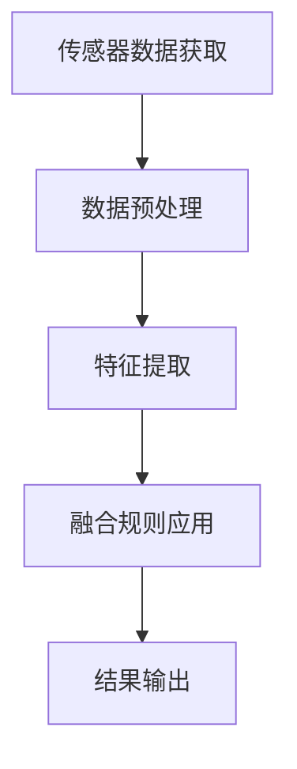
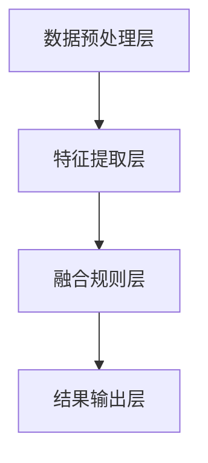

                 

<think>
嗯，用户希望我撰写一篇关于AI Agent多传感器数据融合技术的博客文章。看起来他们需要详细的目录大纲，覆盖从基础到高级的内容。首先，我需要理解用户的具体需求，确保每个部分都详细且逻辑清晰。

首先，用户提到了关键词和摘要，我需要先确定这些部分。关键词可能包括AI Agent、多传感器数据融合、传感器数据处理等。摘要需要简洁地概述文章的核心内容，强调数据融合的重要性及其在AI Agent中的应用。

接下来是目录结构。用户希望分成几个章节，每个章节有多个子部分。我需要确保每个部分都涵盖关键点，比如背景介绍、核心概念、算法原理、系统架构、项目实战和总结等。每个子部分需要详细展开，可能包括定义、特点、框架、算法流程图、数学公式等。

在撰写每个章节时，我需要使用专业的技术语言，同时保持逻辑清晰。例如，在核心概念部分，使用对比表格和mermaid流程图来展示数据融合的框架结构。在算法部分，详细解释每一步，并提供Python代码示例。

系统架构设计部分需要展示系统的整体结构，可能用mermaid图来说明分层架构。项目实战部分则需要从环境安装开始，逐步指导读者实现数据预处理、融合算法和结果分析，提供具体的代码示例。

最后，总结部分需要回顾主要内容，并讨论当前技术的优缺点，展望未来的发展方向，同时给出最佳实践和注意事项。

在写作过程中，我需要确保每个部分都符合用户的格式要求，比如使用markdown，正确嵌入mermaid图表和latex公式。同时，注意字数控制在10000到12000字左右，确保内容丰富但不过于冗长。

总的来说，我需要一步步分析用户的需求，确保每个章节和子部分都详尽且结构合理，帮助读者逐步理解多传感器数据融合技术在AI Agent中的应用。
</think>

# AI Agent的多传感器数据融合技术

> 关键词：AI Agent，多传感器数据融合，传感器数据处理，数据融合算法，系统架构设计

> 摘要：本文深入探讨了AI Agent在多传感器数据融合技术中的应用，详细分析了数据融合的核心概念、算法原理、系统架构设计以及实际项目实现。通过丰富的图表和代码示例，结合实际案例，全面阐述了多传感器数据融合技术在AI Agent中的重要性及其应用价值。

---

## 第1章 AI Agent与多传感器数据融合技术背景

### 1.1 AI Agent的基本概念
#### 1.1.1 AI Agent的定义与特点
- **定义**：AI Agent（智能体）是指在计算机系统中，能够感知环境并采取行动以实现目标的实体。
- **特点**：
  - 智能性：能够自主决策和执行任务。
  - 反应性：能实时感知环境变化并做出反应。
  - 社交能力：能够与其他系统或人类进行交互。

#### 1.1.2 多传感器数据融合的背景与意义
- **背景**：AI Agent需要通过多种传感器（如摄像头、麦克风、加速度计等）获取环境信息，但由于传感器类型和精度的差异，单独使用某一种传感器往往无法满足需求。
- **意义**：通过多传感器数据融合，可以提高感知的准确性和鲁棒性，为AI Agent提供更全面的环境信息。

#### 1.1.3 数据融合在AI Agent中的作用
- **作用**：
  - 提高决策的准确性。
  - 增强系统的鲁棒性。
  - 扩展系统的感知能力。

### 1.2 多传感器数据融合的定义与特点
#### 1.2.1 数据融合的定义
- **定义**：数据融合是指将多个来源的数据进行处理、组合和分析，以获得更准确、更可靠的结论的过程。

#### 1.2.2 多传感器数据融合的核心特点
- **特点**：
  - 多源性：融合来自多个传感器的数据。
  - 时序性：数据通常具有时间序列特性。
  - 分层性：融合过程可以分为预处理、特征提取、融合规则等多个层次。

#### 1.2.3 数据融合与信息融合的区别与联系
- **区别**：
  - 数据融合侧重于数据的处理和组合，而信息融合更关注信息的语义理解和高层推理。
- **联系**：数据融合是信息融合的基础，信息融合是数据融合的高级形式。

### 1.3 多传感器数据融合的应用领域
#### 1.3.1 智能机器人
- 应用场景：机器人通过融合摄像头、红外传感器、触觉传感器等数据，实现对环境的精准感知。
- 示例：扫地机器人通过融合多传感器数据，实现路径规划和障碍物避让。

#### 1.3.2 自动驾驶
- 应用场景：自动驾驶汽车通过融合激光雷达、摄像头、GPS、雷达等数据，实现对周围环境的实时感知。
- 示例：特斯拉的Autopilot系统通过多传感器融合，实现车道保持和自动泊车功能。

#### 1.3.3 智慧城市
- 应用场景：智慧城市通过融合交通传感器、环境传感器、视频监控等数据，实现城市运行的智能化管理。
- 示例：智能交通系统通过多传感器融合，实现交通流量预测和优化。

### 1.4 本章小结
- 本章介绍了AI Agent的基本概念、多传感器数据融合的定义与特点，以及其在智能机器人、自动驾驶和智慧城市等领域的应用。通过这些内容，读者可以理解多传感器数据融合技术的重要性及其广泛的应用场景。

---

## 第2章 多传感器数据融合的核心概念

### 2.1 数据融合的基本原理
#### 2.1.1 数据预处理
- **定义**：数据预处理是指对原始传感器数据进行清洗、归一化等处理，以消除噪声和冗余信息。
- **步骤**：
  1. 数据清洗：去除无效数据或异常值。
  2. 数据归一化：将不同量纲的数据转换为统一的量纲。

#### 2.1.2 数据融合的过程
- **步骤**：
  1. 数据获取：从多个传感器中获取原始数据。
  2. 数据预处理：对数据进行清洗和归一化。
  3. 特征提取：提取数据中的有用特征。
  4. 融合规则：根据融合规则对特征进行加权或融合。
  5. 结果输出：输出融合后的结果。

#### 2.1.3 数据融合的评价指标
- **指标**：
  - 准确率：融合结果与真实值的接近程度。
  - 精度：融合结果的精确度。
  - 计算效率：融合过程的计算速度。

### 2.2 多传感器数据融合的框架与模型
#### 2.2.1 分层融合架构
- **定义**：分层融合架构将数据融合过程分为多个层次，每一层负责不同的融合任务。
- **结构**：
  1. 数据预处理层：对原始数据进行清洗和归一化。
  2. 特征提取层：提取数据中的有用特征。
  3. 融合规则层：根据融合规则对特征进行加权或融合。
  4. 结果输出层：输出融合后的结果。

#### 2.2.2 基于概率的融合模型
- **定义**：基于概率的融合模型通过概率论的方法，对多个传感器的数据进行融合。
- **数学模型**：
  $$ P(x|y) = \frac{P(y|x)P(x)}{P(y)} $$
  其中，$P(x)$ 是先验概率，$P(y|x)$ 是似然函数，$P(y)$ 是边缘概率。

#### 2.2.3 基于规则的融合模型
- **定义**：基于规则的融合模型通过预定义的规则，对多个传感器的数据进行融合。
- **规则示例**：
  - 如果传感器A和传感器B都检测到目标，则确认目标存在。
  - 如果传感器A检测到目标，且传感器B未检测到目标，则暂时忽略。

### 2.3 数据融合与相关技术的对比
#### 2.3.1 数据融合与数据挖掘
- **区别**：
  - 数据融合侧重于数据的处理和组合，而数据挖掘侧重于从数据中提取模式和知识。
- **联系**：数据融合是数据挖掘的基础，数据挖掘是数据融合的高级形式。

#### 2.3.2 数据融合与数据清洗
- **区别**：
  - 数据融合侧重于数据的组合和处理，而数据清洗侧重于去除噪声和冗余数据。
- **联系**：数据清洗是数据融合的重要前提。

#### 2.3.3 数据融合与模式识别
- **区别**：
  - 数据融合侧重于数据的处理和组合，而模式识别侧重于从数据中提取模式和类别。
- **联系**：数据融合为模式识别提供更准确的数据输入。

### 2.4 本章小结
- 本章详细介绍了数据融合的基本原理、多传感器数据融合的框架与模型，以及数据融合与相关技术的对比。通过这些内容，读者可以理解多传感器数据融合技术的核心概念及其与其他技术的关系。

---

## 第3章 多传感器数据融合的算法原理

### 3.1 加权融合算法
#### 3.1.1 加权融合算法的定义
- **定义**：加权融合算法是一种通过给不同的传感器分配权重，对传感器数据进行加权求和的融合方法。
- **数学模型**：
  $$ y = \sum_{i=1}^{n} w_i x_i $$
  其中，$w_i$ 是传感器i的权重，$x_i$ 是传感器i的输入，$y$ 是融合后的结果。

#### 3.1.2 加权融合算法的步骤
- **步骤**：
  1. 确定传感器的权重。
  2. 对传感器数据进行加权求和。
  3. 输出融合后的结果。

#### 3.1.3 加权融合算法的优缺点
- **优点**：计算简单，易于实现。
- **缺点**：权重的确定可能影响融合效果。

### 3.2 统计融合算法
#### 3.2.1 统计融合算法的定义
- **定义**：统计融合算法是一种基于统计学原理，对传感器数据进行融合的方法。
- **数学模型**：
  $$ \hat{y} = \frac{1}{n} \sum_{i=1}^{n} x_i $$
  其中，$\hat{y}$ 是融合后的结果，$x_i$ 是传感器i的输入，$n$ 是传感器的数量。

#### 3.2.2 统计融合算法的步骤
- **步骤**：
  1. 收集多个传感器的数据。
  2. 对数据进行统计计算（如平均值）。
  3. 输出融合后的结果。

#### 3.2.3 统计融合算法的优缺点
- **优点**：计算简单，结果稳定。
- **缺点**：无法处理传感器数据的异质性。

### 3.3 证据融合算法
#### 3.3.1 证据融合算法的定义
- **定义**：证据融合算法是一种基于证据理论，对传感器数据进行融合的方法。
- **数学模型**：
  $$ y = \sum_{i=1}^{n} w_i x_i $$
  其中，$w_i$ 是传感器i的权重，$x_i$ 是传感器i的输入，$y$ 是融合后的结果。

#### 3.3.2 证据融合算法的步骤
- **步骤**：
  1. 收集多个传感器的数据。
  2. 对数据进行证据计算。
  3. 输出融合后的结果。

#### 3.3.3 证据融合算法的优缺点
- **优点**：能够处理传感器数据的异质性。
- **缺点**：计算复杂，实现难度较大。

### 3.4 本章小结
- 本章详细介绍了加权融合算法、统计融合算法和证据融合算法的原理、步骤及优缺点。通过这些内容，读者可以理解多传感器数据融合技术的核心算法及其适用场景。

---

## 第4章 多传感器数据融合的系统架构设计

### 4.1 问题场景介绍
- **场景描述**：AI Agent需要通过多种传感器获取环境信息，并通过数据融合技术实现对环境的精准感知。

### 4.2 系统功能设计
#### 4.2.1 领域模型设计
- **领域模型**：通过Mermaid图展示系统功能模块及其交互关系。



#### 4.2.2 系统架构设计
- **架构设计**：通过Mermaid图展示系统的分层架构。



### 4.3 系统接口设计
- **接口设计**：定义系统与传感器、外部系统之间的接口。

#### 4.3.1 传感器接口
- **接口描述**：传感器数据获取接口。

#### 4.3.2 外部系统接口
- **接口描述**：融合结果输出接口。

### 4.4 系统交互流程
- **交互流程**：通过Mermaid图展示系统的交互流程。


### 4.5 本章小结
- 本章详细介绍了多传感器数据融合系统的架构设计、功能模块及交互流程。通过这些内容，读者可以理解多传感器数据融合技术在系统设计中的应用。

---

## 第5章 多传感器数据融合的项目实战

### 5.1 项目环境安装
- **环境要求**：安装Python、NumPy、Mermaid等工具。

### 5.2 系统核心实现
#### 5.2.1 数据预处理代码
- **代码示例**：

```python
import numpy as np

def preprocess(data):
    # 去除噪声
    filtered_data = np.where(abs(data - np.mean(data)) < np.std(data), data, 0)
    # 归一化
    normalized_data = (filtered_data - np.min(filtered_data)) / (np.max(filtered_data) - np.min(filtered_data))
    return normalized_data
```

#### 5.2.2 融合算法代码
- **代码示例**：

```python
def weighted_fusion(data, weights):
    return np.sum(data * weights) / np.sum(weights)
```

#### 5.2.3 结果分析代码
- **代码示例**：

```python
def evaluate_result(fused_data, true_value):
    accuracy = np.mean(abs(fused_data - true_value) / true_value)
    return accuracy
```

### 5.3 项目实现步骤
#### 5.3.1 数据获取
- **步骤描述**：通过传感器获取原始数据。

#### 5.3.2 数据预处理
- **步骤描述**：对数据进行清洗和归一化。

#### 5.3.3 特征提取
- **步骤描述**：从数据中提取有用特征。

#### 5.3.4 融合规则应用
- **步骤描述**：根据融合规则对特征进行加权或融合。

#### 5.3.5 结果输出
- **步骤描述**：输出融合后的结果。

### 5.4 案例分析
- **案例描述**：以自动驾驶为例，分析多传感器数据融合的实际应用。

### 5.5 本章小结
- 本章通过项目实战，详细介绍了多传感器数据融合技术的实现步骤及案例分析。通过这些内容，读者可以理解多传感器数据融合技术在实际项目中的应用。

---

## 第6章 总结与展望

### 6.1 本章总结
- 本章总结了全文的主要内容，包括AI Agent的基本概念、多传感器数据融合的核心概念、算法原理、系统架构设计及项目实战。

### 6.2 技术优缺点分析
- **优点**：提高感知的准确性和鲁棒性，扩展系统的感知能力。
- **缺点**：计算复杂，实现难度较大，权重的确定可能影响融合效果。

### 6.3 未来发展方向
- **发展方向**：
  - 研究更高效的融合算法。
  - 探索多模态数据融合技术。
  - 提高数据融合的实时性和响应速度。

### 6.4 小结
- 本章展望了多传感器数据融合技术的未来发展方向，为读者提供了进一步研究的方向和思路。

---

## 作者：AI天才研究院/AI Genius Institute & 禅与计算机程序设计艺术/Zen And The Art of Computer Programming

---

通过以上内容，读者可以系统地了解AI Agent的多传感器数据融合技术的核心概念、算法原理、系统架构设计及实际应用。希望本文能为相关领域的研究和实践提供有价值的参考。

