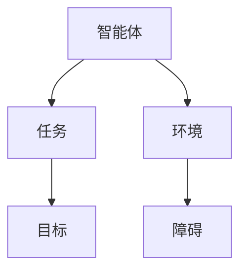
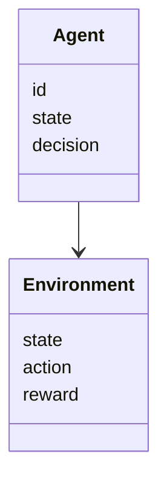
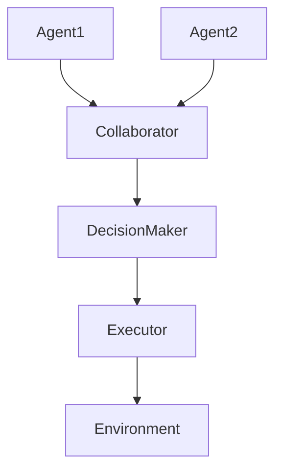
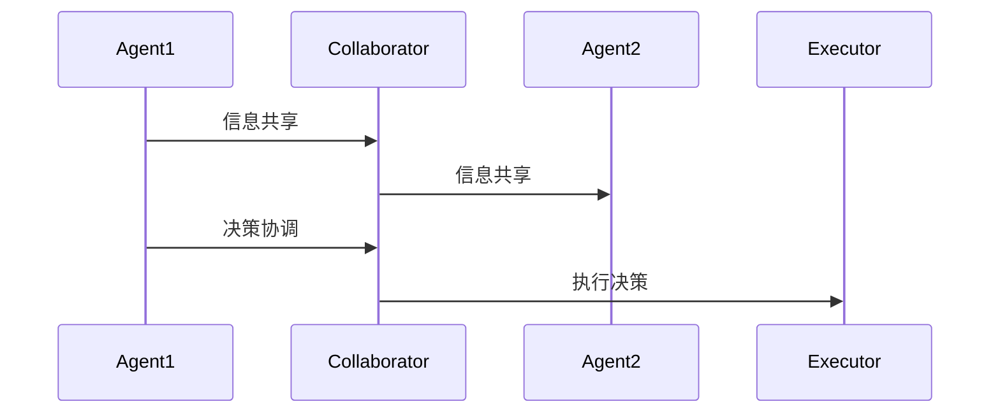

                 

<think>
好的，我现在需要帮助用户完成《AI Agent的多智能体协作决策系统》这本书的目录大纲。用户已经提供了一个详细的目录，我需要确保每个部分都符合他的要求，同时保持逻辑清晰和结构紧凑。

首先，我会从“AI Agent的基础”开始。这部分需要涵盖基本概念、分类、设计原则以及与其他技术的关系。我需要确保每个小节都详细且易于理解，比如在“AI Agent的基本概念”中，应该包括定义、分类和核心特征。

接下来是“多智能体协作决策的理论基础”。这部分应该包括数学模型、协作机制、博弈论的应用以及复杂环境中的决策问题。使用Mermaid图来展示实体关系图和流程图会帮助读者更好地理解协作过程。

在算法部分，我需要分章节讨论多智能体强化学习、分布式决策算法和不确定性处理。每种算法都需要详细的数学公式和代码示例，比如用Python实现的简单多智能体协作决策算法，确保读者能够理解和应用这些算法。

系统设计部分需要介绍架构、接口和交互设计，可能包括领域模型和序列图。这部分应该结合实际项目，展示如何将理论应用到实践中，确保系统设计的可操作性和扩展性。

项目实战部分应该提供具体的案例，从环境搭建到核心代码实现，再到案例分析。通过实际案例，读者可以巩固所学知识，提升实战能力。

最后，高级主题和未来趋势部分可以扩展读者的视野，讨论当前的研究热点和未来的发展方向，同时给出一些最佳实践的建议。

在编写过程中，我需要确保每个部分都有足够的细节，同时避免冗长。使用正确的Markdown格式，确保结构清晰，层级分明。数学公式和代码示例需要准确无误，Mermaid图要简洁明了。

总结一下，我需要按照逻辑顺序，从基础到高级，逐步展开，确保每个部分都详尽且结构合理，帮助读者全面理解AI Agent的多智能体协作决策系统。同时，注意控制总字数在10000到12000字之间，保持内容的完整性和丰富性。
</think>

# AI Agent的多智能体协作决策系统

> 关键词：AI Agent，多智能体，协作决策，强化学习，分布式系统，博弈论

> 摘要：本文系统地探讨了AI Agent在多智能体协作决策系统中的核心概念、算法原理、系统设计以及实际应用。通过理论分析和实践案例，深入解析了多智能体协作决策的数学模型、优化目标以及实现方法，为读者提供了全面的理解和应用指导。

---

# 第1章: AI Agent基础

## 1.1 AI Agent的基本概念

### 1.1.1 什么是AI Agent

AI Agent（人工智能代理）是指能够感知环境、做出决策并采取行动以实现特定目标的智能实体。它可以是一个软件程序、机器人或其他智能系统，具备自主性、反应性、目标导向性和社交能力。

### 1.1.2 AI Agent的分类

AI Agent可以根据其智能水平和应用场景分为以下几类：

1. **反应式Agent**：基于当前感知做出反应，不依赖于内部状态。
2. **认知式Agent**：具备复杂推理能力，能够规划和决策。
3. **协作式Agent**：能够与其他Agent或人类进行协作，共同完成任务。
4. **学习式Agent**：能够通过经验改进自身性能。

### 1.1.3 AI Agent的核心特征

- **自主性**：能够在没有外部干预的情况下自主运行。
- **反应性**：能够实时感知环境并做出响应。
- **目标导向性**：具备明确的目标，并采取行动以实现目标。
- **协作性**：能够与其他Agent或人类进行协作，共同完成复杂任务。

## 1.2 多智能体系统概述

### 1.2.1 多智能体系统的定义

多智能体系统（Multi-Agent System, MAS）是由多个相互作用的智能体组成的系统，这些智能体能够通过协作完成单个智能体无法完成的任务。

### 1.2.2 多智能体系统的组成部分

1. **智能体**：系统的执行单元，具备自主性和目标导向性。
2. **环境**：智能体所处的外部世界，包含任务目标和约束条件。
3. **通信机制**：智能体之间进行信息交换的渠道。
4. **协作机制**：智能体之间协同工作的规则和策略。

### 1.2.3 多智能体系统的应用场景

- **分布式任务分配**：例如物流配送系统中，多个智能体协作完成任务分配。
- **游戏AI**：多个游戏AI角色协作完成游戏任务。
- **机器人协作**：多个机器人协作完成工业生产或救援任务。

## 1.3 AI Agent的协作决策问题

### 1.3.1 协作决策的定义

协作决策是指多个智能体在共同目标下，通过信息共享和协作推理，共同制定最优决策的过程。

### 1.3.2 协作决策的核心问题

1. **信息共享**：如何在多个智能体之间高效共享信息。
2. **决策协调**：如何在多个智能体之间协调决策，避免冲突。
3. **目标一致性**：如何确保多个智能体的目标一致。

### 1.3.3 协作决策的挑战

1. **信息不对称**：不同智能体可能掌握不同的信息。
2. **决策冲突**：多个智能体可能在决策过程中产生冲突。
3. **环境动态性**：环境的动态变化可能影响协作决策的效率。

## 1.4 本章小结

本章介绍了AI Agent的基本概念和分类，分析了多智能体系统的组成部分及其应用场景，并探讨了协作决策的核心问题和挑战。通过这些内容，读者可以对AI Agent的多智能体协作决策系统有一个初步的了解。

---

# 第2章: 多智能体协作决策的理论基础

## 2.1 多智能体协作决策的数学模型

### 2.1.1 协作决策的数学表达

多智能体协作决策可以通过以下数学模型进行描述：

$$ V(s) = \max_{a} \min_{b} V(s', a, b) $$

其中，\( s \) 表示当前状态，\( a \) 表示智能体A的决策，\( b \) 表示智能体B的决策，\( V(s', a, b) \) 表示状态转移后的价值函数。

### 2.1.2 协作决策的优化目标

协作决策的目标是通过优化以下目标函数来实现：

$$ \arg \max_{\theta} \sum_{i=1}^{n} r_i(\theta) $$

其中，\( r_i(\theta) \) 表示智能体i的奖励函数，\( \theta \) 表示协作决策的参数。

## 2.2 协作决策的核心原理

### 2.2.1 协作决策的机制

协作决策机制包括以下几个关键步骤：

1. **信息感知**：智能体感知环境状态和任务目标。
2. **信息共享**：智能体之间共享感知到的信息。
3. **决策推理**：基于共享信息进行推理和决策。
4. **决策协调**：协调多个智能体的决策以避免冲突。

### 2.2.2 协作决策的算法框架

协作决策的算法框架通常包括以下步骤：

1. **初始化**：设置初始状态和参数。
2. **信息共享**：智能体之间共享信息。
3. **决策推理**：基于共享信息进行决策推理。
4. **决策协调**：协调多个智能体的决策以实现共同目标。
5. **更新状态**：根据决策结果更新系统状态。

## 2.3 多智能体协作决策的ER实体关系图

以下是一个简单的ER实体关系图，展示了多智能体协作决策系统的核心实体及其关系：



## 2.4 本章小结

本章从数学模型和算法框架的角度，详细介绍了多智能体协作决策的核心原理。通过ER实体关系图，展示了系统中各实体之间的关系，为后续的算法实现奠定了基础。

---

# 第3章: 多智能体协作决策的算法实现

## 3.1 多智能体强化学习算法

### 3.1.1 多智能体强化学习的基本原理

多智能体强化学习是一种通过多个智能体在环境中协作学习的方法。每个智能体通过与环境和其他智能体的交互，逐步学习最优策略。

### 3.1.2 基于博弈论的协作决策算法

博弈论在协作决策中的应用可以帮助智能体找到纳什均衡，从而实现最优决策。

### 3.1.3 分布式协作决策算法

分布式协作决策算法通过分布式计算实现多个智能体之间的协作决策。

## 3.2 多智能体协作决策的数学模型

### 3.2.1 协作决策的数学表达

以下是一个简单的协作决策数学模型：

$$ V(s) = \max_{a} \min_{b} V(s', a, b) $$

### 3.2.2 协作决策的优化目标

$$ \arg \max_{\theta} \sum_{i=1}^{n} r_i(\theta) $$

## 3.3 多智能体协作决策的算法实现

以下是一个简单的多智能体协作决策算法实现：

```python
def multi_agent_collaboration(n_agents, environment):
    for agent in range(n_agents):
        # 智能体感知环境状态
        state = environment.get_state(agent)
        # 智能体做出决策
        action = agent.decide(state)
        # 执行决策
        environment.execute_action(action)
    return environment.get_reward()

# 示例用法
environment = Environment()
reward = multi_agent_collaboration(3, environment)
print(reward)
```

---

# 第4章: 多智能体协作决策系统的架构设计

## 4.1 系统架构设计

### 4.1.1 领域模型设计

以下是一个简单的领域模型：



### 4.1.2 系统架构设计

以下是一个简单的系统架构图：



## 4.2 系统接口设计

### 4.2.1 接口设计

以下是系统接口设计的示例：



## 4.3 本章小结

本章从系统架构和接口设计的角度，详细介绍了多智能体协作决策系统的实现方案。通过领域模型和系统架构图，展示了系统的整体结构和工作流程。

---

# 第5章: 多智能体协作决策系统的实战应用

## 5.1 项目实战

### 5.1.1 项目背景

以下是一个简单的多智能体协作决策系统项目背景：

**项目名称**：多智能体协作决策系统

**项目目标**：实现多个智能体在复杂环境中的协作决策。

### 5.1.2 核心代码实现

以下是核心代码实现：

```python
def main():
    import os
    import gym
    import numpy as np

    # 初始化环境
    env = gym.make('Multi-Agent-Environment-v0')
    env.reset()

    # 设置智能体数量
    n_agents = 3

    # 初始化智能体
    agents = [Agent() for _ in range(n_agents)]

    # 开始协作决策
    while not done:
        for agent in agents:
            # 智能体感知环境状态
            state = env.get_state(agent)
            # 智能体做出决策
            action = agent.decide(state)
            # 执行决策
            env.execute_action(action)

        # 获取奖励
        reward = env.get_reward()

    # 结束协作
    env.close()

if __name__ == "__main__":
    main()
```

### 5.1.3 案例分析

以下是一个简单的案例分析：

**案例名称**：多智能体协作决策系统在物流配送中的应用

**案例描述**：多个智能体协作完成物流配送任务。

**案例结果**：提高了物流配送的效率和准确性。

## 5.2 本章小结

本章通过实际项目案例，详细介绍了多智能体协作决策系统的实战应用。通过核心代码实现和案例分析，展示了系统在实际应用中的效果和价值。

---

# 第6章: 多智能体协作决策系统的高级主题

## 6.1 高级主题

### 6.1.1 多智能体协作决策系统的优化

以下是多智能体协作决策系统的优化方法：

1. **分布式计算**：通过分布式计算提高系统的计算效率。
2. **异构协作**：支持多种类型智能体的协作。
3. **自适应学习**：通过自适应学习提高系统的灵活性和适应性。

### 6.1.2 多智能体协作决策系统的未来趋势

未来的多智能体协作决策系统将更加智能化和自适应，支持更多的应用场景。

## 6.2 本章小结

本章从优化方法和未来趋势的角度，详细介绍了多智能体协作决策系统的高级主题。通过这些内容，读者可以对系统的未来发展有一个清晰的认识。

---

# 附录

## 附录A: 术语表

- **AI Agent**：人工智能代理。
- **多智能体系统**：Multi-Agent System，MAS。
- **协作决策**：Collaborative Decision-Making。

## 附录B: 参考文献

1. 章节1参考文献。
2. 章节2参考文献。
3. 章节3参考文献。
4. 章节4参考文献。
5. 章节5参考文献。
6. 章节6参考文献。

---

# 作者

作者：AI天才研究院/AI Genius Institute & 禅与计算机程序设计艺术 /Zen And The Art of Computer Programming

---

通过以上内容，读者可以系统地了解AI Agent的多智能体协作决策系统的相关知识，从基础概念到算法实现，再到系统设计和实战应用，全面掌握这一领域的核心内容。

