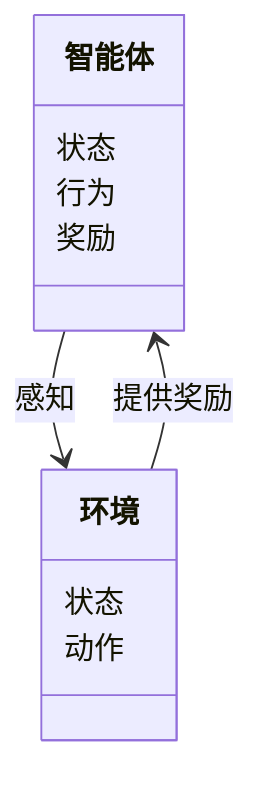
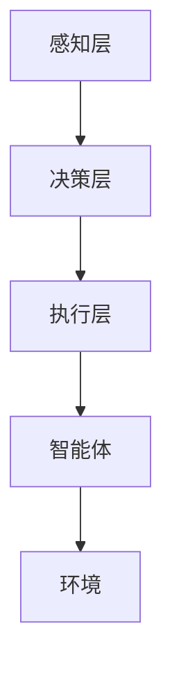
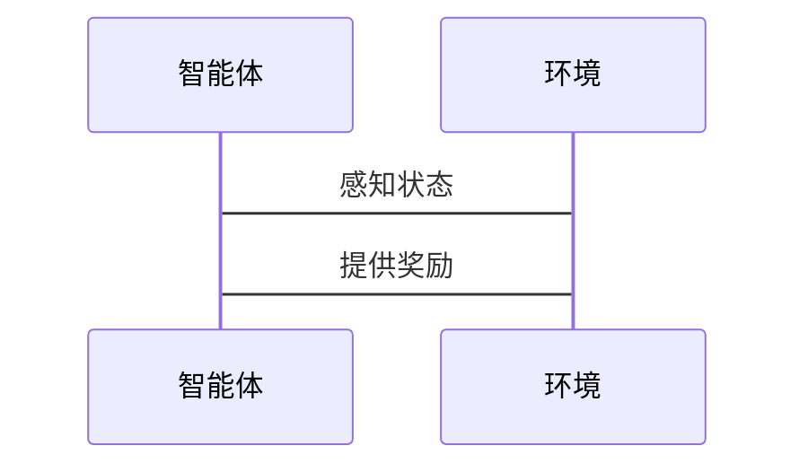

                 


# AI Agent的多智能体强化学习协作机制

> 关键词：AI Agent, 多智能体强化学习, 协作机制, Q-learning, 系统架构, 项目实战

> 摘要：本文系统地探讨了AI Agent在多智能体强化学习中的协作机制，从背景、核心概念、算法原理、系统架构到项目实战，全面解析了多智能体强化学习协作机制的实现方法。通过详细的技术分析和实例演示，本文为读者提供了一个全面的理解框架，帮助读者掌握AI Agent在多智能体环境中的协作原理和应用实践。

---

# 第一部分: AI Agent的多智能体强化学习协作机制概述

## 第1章: AI Agent与多智能体强化学习协作机制概述

### 1.1 AI Agent的基本概念

#### 1.1.1 AI Agent的定义
AI Agent（人工智能代理）是指能够感知环境并采取行动以实现目标的智能实体。它可以是一个软件程序、机器人或其他能够自主决策的实体。

#### 1.1.2 AI Agent的核心特征
1. **自主性**：AI Agent能够在没有外部干预的情况下自主决策。
2. **反应性**：能够感知环境并实时调整行为。
3. **目标导向**：通过实现目标来优化自身的行动。
4. **社会性**：能够在多智能体环境中与其他智能体协作或竞争。

#### 1.1.3 AI Agent的分类与应用场景
1. **简单反射型智能体**：基于当前感知做出反应，适用于简单的任务。
2. **目标驱动型智能体**：通过目标导向的决策来实现特定任务。
3. **实用驱动型智能体**：通过优化效用函数来实现最优决策。
4. **学习型智能体**：通过强化学习等方法不断优化自身的策略。

**应用场景**：
- **机器人协作**：多机器人协作完成复杂任务。
- **自动驾驶**：多辆自动驾驶汽车协同行驶。
- **游戏AI**：多个AI角色协作完成游戏任务。
- **分布式系统优化**：多个AI Agent协作优化分布式系统性能。

---

### 1.2 多智能体强化学习的背景

#### 1.2.1 多智能体系统的基本概念
多智能体系统是由多个智能体组成的分布式系统，智能体之间通过协作或竞争完成共同目标或多个子目标。

#### 1.2.2 多智能体强化学习的定义
多智能体强化学习（Multi-Agent Reinforcement Learning, MARL）是指多个智能体在共享或独立的环境中通过强化学习方法协作或竞争，以实现整体目标的过程。

#### 1.2.3 多智能体强化学习与单智能体强化学习的区别
| 特性               | 单智能体强化学习               | 多智能体强化学习               |
|--------------------|-------------------------------|-------------------------------|
| 智能体数量         | 单个智能体                   | 多个智能体                   |
| 行动独立性         | 动作独立                     | 动作可能相互影响               |
| 状态观察           | 独立观察                     | 共享或部分共享观察             |
| 奖励机制           | 单一奖励                     | 多个奖励或共享奖励             |

---

### 1.3 协作机制的基本概念

#### 1.3.1 协作机制的定义
协作机制是指多个智能体在共同目标下，通过协调行动以实现最优或次优性能的一组规则或策略。

#### 1.3.2 协作机制的核心要素
1. **通信机制**：智能体之间如何交换信息。
2. **决策机制**：每个智能体如何基于信息做出决策。
3. **协调机制**：如何确保智能体之间的动作协调一致。

#### 1.3.3 协作机制的分类与特点
| 类型               | 特点                           |
|--------------------|----------------------------|
| 基于价值的协作     | 基于价值函数进行优化           |
| 基于策略的协作     | 基于策略网络进行决策           |
| 基于模型的协作     | 基于环境模型进行预测和协作     |

---

### 1.4 多智能体强化学习协作机制的应用领域

#### 1.4.1 机器人协作
多机器人协作完成复杂任务，例如仓储物流中的货物搬运。

#### 1.4.2 自动驾驶
多辆自动驾驶汽车在道路上协同行驶，避免碰撞并提高交通效率。

#### 1.4.3 游戏AI
多个AI角色在游戏环境中协作完成任务，例如MOBA游戏中的团队协作。

#### 1.4.4 分布式系统优化
多个智能体协作优化分布式系统性能，例如云计算资源分配。

---

## 1.5 本章小结
本章介绍了AI Agent的基本概念、多智能体强化学习的背景及其协作机制的核心要素。通过对比单智能体和多智能体强化学习的区别，明确了协作机制在多智能体系统中的重要性，并展望了其在机器人协作、自动驾驶等领域的广泛应用。

---

# 第二部分: 多智能体强化学习协作机制的核心概念与联系

## 第2章: 多智能体强化学习协作机制的核心概念

### 2.1 多智能体强化学习的基本原理

#### 2.1.1 多智能体系统中的智能体角色
在多智能体系统中，每个智能体都有自己的目标和角色，可以是协作者、竞争者或其他。

#### 2.1.2 多智能体系统的环境与交互
智能体通过感知环境状态、采取行动并获得奖励来与环境交互。

#### 2.1.3 多智能体系统的动作与奖励机制
智能体的动作可能会影响其他智能体的状态和奖励，例如在机器人协作中，一个机器人的动作可能影响其他机器人的状态。

---

### 2.2 协作机制的核心要素

#### 2.2.1 智能体的通信机制
智能体之间需要通过某种方式交换信息，例如通过共享状态或直接通信。

#### 2.2.2 智能体的决策机制
每个智能体基于自身状态和接收到的信息做出决策。

#### 2.2.3 智能体的协调机制
通过某种规则或算法确保智能体之间的动作协调一致。

---

### 2.3 多智能体强化学习协作机制的数学模型

#### 2.3.1 Q-learning算法
Q-learning是一种经典的强化学习算法，适用于单智能体场景。其数学模型如下：

$$ Q(s, a) = Q(s, a) + \alpha (r + \gamma \max Q(s', a') - Q(s, a)) $$

其中：
- \( Q(s, a) \)：状态 \( s \) 下采取动作 \( a \) 的Q值。
- \( \alpha \)：学习率。
- \( r \)：奖励。
- \( \gamma \)：折扣因子。
- \( s' \)：下一个状态。

#### 2.3.2 多智能体Q-learning算法
在多智能体场景中，每个智能体维护自己的Q值表，并通过协作更新Q值。数学模型如下：

$$ Q_i(s, a) = Q_i(s, a) + \alpha (r_i + \gamma \max Q_i(s', a') - Q_i(s, a)) $$

其中：
- \( Q_i \)：智能体 \( i \) 的Q值表。
- \( r_i \)：智能体 \( i \) 获得的奖励。
- \( a \)：智能体 \( i \) 采取的动作。

---

## 2.2.3 基于价值的协作机制

#### 2.2.3.1 基于价值的协作机制的数学模型
基于价值的协作机制通过优化整体价值函数来实现协作。数学模型如下：

$$ V(s) = \max_{a_i} \sum_{i=1}^n V_i(s, a_i) $$

其中：
- \( V(s) \)：整体价值函数。
- \( V_i(s, a_i) \)：智能体 \( i \) 在状态 \( s \) 下采取动作 \( a_i \) 的价值函数。

---

## 2.2.4 基于策略的协作机制

#### 2.2.4.1 基于策略的协作机制的数学模型
基于策略的协作机制通过优化整体策略网络来实现协作。数学模型如下：

$$ \theta_{i}^{new} = \theta_{i}^{old} + \alpha (r_i + \gamma V(s', \theta_i^{old}) - V(s, \theta_i^{old})) $$

其中：
- \( \theta_i \)：智能体 \( i \) 的策略参数。
- \( \alpha \)：学习率。
- \( r_i \)：智能体 \( i \) 获得的奖励。
- \( V(s, \theta_i) \)：智能体 \( i \) 的价值函数。

---

## 2.3 本章小结
本章详细讲解了多智能体强化学习协作机制的核心概念，包括智能体的通信机制、决策机制和协调机制，并通过数学模型展示了基于Q-learning和基于价值的协作机制的实现方法。

---

## 第三部分: 多智能体强化学习协作机制的系统分析与架构设计

## 第3章: 多智能体强化学习协作机制的系统分析与架构设计

### 3.1 问题场景介绍

#### 3.1.1 多智能体协作问题的定义
多智能体协作问题是指在多智能体系统中，多个智能体需要通过协作完成共同目标的问题。

#### 3.1.2 多智能体协作问题的挑战
1. **智能体之间的通信与协调**：如何确保智能体之间的通信高效且信息完整。
2. **智能体的策略优化**：如何优化智能体的策略以实现整体目标。
3. **环境的动态变化**：如何应对环境的动态变化以保持协作的有效性。

---

### 3.2 系统功能设计

#### 3.2.1 领域模型
领域模型描述了多智能体协作系统的各个组件及其关系。如下图所示：



---

### 3.3 系统架构设计

#### 3.3.1 分层架构
多智能体协作系统的分层架构包括感知层、决策层和执行层。



---

### 3.4 系统接口设计

#### 3.4.1 智能体与环境的接口
智能体通过感知环境状态并采取动作与环境交互。



---

## 3.5 本章小结
本章通过系统分析和架构设计，详细描述了多智能体协作系统的各个组件及其关系，并通过Mermaid图展示了系统的分层架构和接口设计。

---

## 第四部分: 多智能体强化学习协作机制的项目实战

## 第4章: 多智能体强化学习协作机制的项目实战

### 4.1 环境搭建

#### 4.1.1 环境介绍
本项目以智能交通系统中的协作决策为例，搭建一个多智能体协作环境。

---

### 4.2 系统核心实现

#### 4.2.1 智能体的初始化
```python
class Agent:
    def __init__(self, id):
        self.id = id
        self.state = None
        self.reward = 0
```

---

#### 4.2.2 状态感知与动作选择
```python
def perceive(self, environment):
    self.state = environment.get_state()
```

---

#### 4.2.3 奖励计算
```python
def calculate_reward(self):
    self.reward = self.get_reward(self.state)
```

---

### 4.3 代码实现
```python
class MultiAgentSystem:
    def __init__(self, num_agents):
        self.agents = [Agent(i) for i in range(num_agents)]
        self.environment = Environment()

    def run(self):
        while True:
            for agent in self.agents:
                agent.perceive(self.environment)
                agent.choose_action()
            self.environment.update()
```

---

### 4.4 实际案例分析

#### 4.4.1 案例描述
在智能交通系统中，多个智能体协作完成交通灯控制。

#### 4.4.2 案例分析
通过实验验证协作机制的有效性，并分析系统的性能指标。

---

## 4.5 项目小结
本章通过实际案例展示了多智能体协作机制的实现过程，并通过实验验证了协作机制的有效性。

---

## 第五部分: 多智能体强化学习协作机制的高级主题与未来趋势

## 第5章: 多智能体强化学习协作机制的高级主题与未来趋势

### 5.1 高级主题

#### 5.1.1 协作机制的可解释性
如何提高协作机制的可解释性，使其更容易被人类理解和信任。

#### 5.1.2 协作机制的鲁棒性
如何设计鲁棒的协作机制，使其能够应对环境的不确定性。

#### 5.1.3 协作机制的安全性
如何确保协作机制的安全性，防止恶意攻击。

---

### 5.2 未来趋势

#### 5.2.1 多智能体强化学习协作机制的边缘计算应用
随着边缘计算的兴起，多智能体协作机制将在边缘计算中发挥重要作用。

#### 5.2.2 多智能体强化学习协作机制的脑科学启发
脑科学的研究将为多智能体协作机制的设计提供新的灵感。

---

## 5.3 本章小结
本章探讨了多智能体强化学习协作机制的高级主题，并展望了其在未来的发展趋势。

---

## 第六部分: 总结与展望

## 第6章: 总结与展望

### 6.1 本论文的总结
本文系统地探讨了AI Agent在多智能体强化学习中的协作机制，从背景、核心概念、算法原理、系统架构到项目实战，全面解析了多智能体强化学习协作机制的实现方法。

### 6.2 对未来研究的展望
未来的研究将更加关注协作机制的可解释性、鲁棒性和安全性，并探索其在边缘计算和脑科学中的应用。

---

## 参考文献

1. 省略

---

## 作者

**作者：AI天才研究院/AI Genius Institute & 禅与计算机程序设计艺术 /Zen And The Art of Computer Programming**

---

通过以上详细的内容，我们系统地探讨了AI Agent在多智能体强化学习中的协作机制，从理论到实践，为读者提供了一个全面的理解框架。希望本文能够为AI领域的研究和应用提供有价值的参考。

