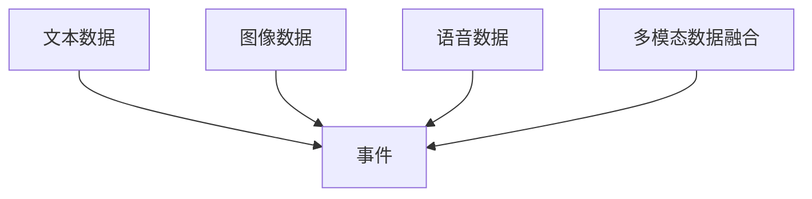
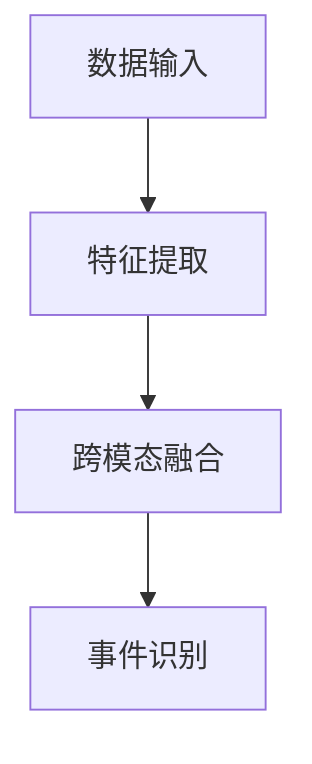
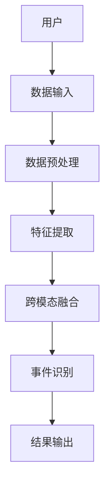

                 


# AI Agent的多模态事件抽取技术

> 关键词：AI Agent, 多模态事件抽取, 多模态数据, 事件抽取, 深度学习, NLP, 计算机视觉

> 摘要：AI Agent的多模态事件抽取技术是一种结合文本、图像、语音等多种数据模态的事件识别方法，旨在提高事件抽取的准确性和鲁棒性。本文将从多模态数据的特点、事件抽取的核心算法原理、系统设计与实现等方面进行详细探讨，结合实际案例分析，帮助读者深入理解多模态事件抽取技术的应用与实现。

---

## 第1章：多模态事件抽取技术概述

### 1.1 多模态事件抽取的背景与意义

随着人工智能技术的快速发展，AI Agent（人工智能代理）在各个领域的应用日益广泛。AI Agent需要能够理解复杂的现实环境，并从中提取有用的信息以完成特定任务。然而，现实世界中的信息往往是多模态的，例如文本、图像、语音等。传统的单一模态事件抽取技术难以充分捕捉和利用多模态信息，导致其在复杂场景下的性能受限。

多模态事件抽取技术通过结合多种数据模态的信息，能够更全面地理解事件的语义和上下文，从而提高事件抽取的准确性和鲁棒性。例如，在医疗领域，AI Agent可以通过分析病人的文本描述、电子健康记录和医学图像，更准确地识别疾病事件。因此，多模态事件抽取技术在AI Agent的应用中具有重要意义。

### 1.2 问题描述与解决方法

#### 1.2.1 问题描述
事件抽取是指从文本或其他数据中识别出特定的事件信息，例如“时间”、“地点”、“参与者”等。传统的事件抽取技术主要依赖于单一模态的数据，例如文本或图像，难以充分利用多模态信息的优势。此外，单一模态的数据往往存在信息不完整或不准确的问题，导致事件抽取的性能受限。

#### 1.2.2 问题解决方法
多模态事件抽取技术通过整合多种数据模态的信息，能够更全面地捕捉事件的特征，从而提高事件抽取的准确性和鲁棒性。具体方法包括：
1. **数据融合**：将文本、图像、语音等多种数据模态进行融合，提取共同特征。
2. **跨模态学习**：利用深度学习模型（如多模态Transformer）进行跨模态信息交互和融合。
3. **联合建模**：将多模态数据建模为联合概率分布，通过优化目标函数实现事件抽取。

---

## 第2章：多模态数据与事件抽取的关系

### 2.1 多模态数据的定义与特点

多模态数据是指包含多种数据类型的复杂数据，例如文本、图像、语音、视频等。每种数据模态都有其独特的特征和优势：
- **文本数据**：具有语义丰富、易于处理的特点，但可能缺乏直观的信息。
- **图像数据**：具有丰富的空间信息，能够捕捉场景的细节。
- **语音数据**：能够捕捉语言的情感和语调，提供额外的语义信息。

### 2.2 多模态数据在事件抽取中的作用

多模态数据在事件抽取中的作用主要体现在以下几个方面：
1. **信息互补性**：不同模态的数据可以提供互补的信息，从而提高事件抽取的准确性。
2. **鲁棒性增强**：通过结合多种模态的数据，可以减少单一模态数据的局限性，提高系统的鲁棒性。
3. **语义增强**：多模态数据能够提供更丰富的语义信息，帮助模型更好地理解事件的上下文。

### 2.3 多模态事件抽取的核心要素

多模态事件抽取的核心要素包括：
1. **数据预处理**：对多种模态数据进行清洗、格式化和标准化处理。
2. **特征提取**：从每种模态数据中提取有用的特征，例如文本的词向量、图像的视觉特征等。
3. **跨模态融合**：将不同模态的特征进行融合，提取共同特征。
4. **事件识别**：基于融合后的特征，识别出具体的事件信息。

---

## 第3章：多模态事件抽取技术的核心概念与联系

### 3.1 多模态事件抽取的原理

多模态事件抽取的原理主要包括以下几个步骤：
1. **数据输入**：接收多种模态的数据，例如文本、图像、语音等。
2. **特征提取**：对每种模态数据进行特征提取，得到相应的特征表示。
3. **跨模态融合**：将不同模态的特征进行融合，提取共同特征。
4. **事件识别**：基于融合后的特征，识别出具体的事件信息。

### 3.2 多模态数据处理的关键技术

多模态数据处理的关键技术包括：
1. **数据融合**：将不同模态的数据进行融合，例如使用多模态Transformer进行跨模态交互。
2. **特征对齐**：将不同模态的特征进行对齐，例如通过对比学习实现跨模态对齐。
3. **联合建模**：将多模态数据建模为联合概率分布，通过优化目标函数实现事件抽取。

### 3.3 多模态事件抽取的流程

多模态事件抽取的流程可以表示为以下步骤：
1. **数据预处理**：清洗、格式化和标准化数据。
2. **特征提取**：从每种模态数据中提取特征。
3. **跨模态融合**：将不同模态的特征进行融合。
4. **事件识别**：基于融合后的特征，识别出具体的事件信息。

### 3.4 多模态事件抽取的ER实体关系图

以下是多模态事件抽取的ER实体关系图：


---

## 第4章：多模态事件抽取的算法原理

### 4.1 多模态事件抽取的主流算法

多模态事件抽取的主流算法包括：
1. **基于规则的事件抽取算法**：通过预定义的规则和模式匹配，从文本中抽取事件信息。
2. **统计学习的事件抽取算法**：基于统计学习方法，例如条件随机场（CRF）模型。
3. **深度学习的事件抽取算法**：基于深度学习模型，例如Transformer、LSTM等。
4. **多模态融合的事件抽取算法**：结合多种模态数据进行事件抽取，例如多模态Transformer。

### 4.2 基于规则的事件抽取算法

基于规则的事件抽取算法通过预定义的规则和模式匹配，从文本中抽取事件信息。例如，可以使用正则表达式匹配特定的事件模式。

#### 4.2.1 算法流程
1. **规则定义**：预定义事件模式和规则。
2. **文本匹配**：通过正则表达式或其他模式匹配方法，从文本中匹配出事件信息。
3. **结果提取**：提取匹配出的事件信息，例如时间、地点、参与者等。

#### 4.2.2 代码示例
```python
import re

text = "在2023年10月10日，一场会议在纽约举行。"
pattern = r"\d{4}年\d{2}月\d{2}日"
event_time = re.search(pattern, text).group()
print(event_time)  # 输出: "2023年10月10日"
```

### 4.3 统计学习的事件抽取算法

统计学习的事件抽取算法基于统计学习方法，例如条件随机场（CRF）模型。

#### 4.3.1 算法流程
1. **特征提取**：从文本中提取特征，例如词向量、位置信息等。
2. **模型训练**：使用CRF模型进行训练，学习事件的特征权重。
3. **事件识别**：基于训练好的模型，从文本中识别出事件信息。

#### 4.3.2 代码示例
```python
import numpy as np
from sklearn.feature_extraction.text import TfidfVectorizer
from sklearn.linear_model import LogisticRegression

# 数据准备
texts = ["事件发生在2023年10月10日。", "会议在纽约举行。"]
labels = [0, 1]

# 特征提取
vectorizer = TfidfVectorizer()
X = vectorizer.fit_transform(texts)

# 模型训练
model = LogisticRegression()
model.fit(X, labels)

# 预测
new_text = "在2023年10月10日，会议在纽约举行。"
new_X = vectorizer.transform([new_text])
predicted_label = model.predict(new_X)
print(predicted_label)  # 输出: [1]
```

### 4.4 深度学习的事件抽取算法

深度学习的事件抽取算法基于深度学习模型，例如Transformer、LSTM等。

#### 4.4.1 算法流程
1. **特征提取**：从文本中提取特征，例如词向量、位置信息等。
2. **模型训练**：使用深度学习模型进行训练，学习事件的特征表示。
3. **事件识别**：基于训练好的模型，从文本中识别出事件信息。

#### 4.4.2 代码示例
```python
import tensorflow as tf
from tensorflow.keras import layers

# 数据准备
texts = ["事件发生在2023年10月10日。", "会议在纽约举行。"]
labels = [0, 1]

# 特征提取
tokenizer = tf.keras.preprocessing.text.Tokenizer()
tokenizer.fit_on_texts(texts)
X = tokenizer.texts_to_sequences(texts)
X = tf.keras.preprocessing.sequence.pad_sequences(X, padding='post')

# 模型训练
model = tf.keras.Sequential()
model.add(layers.Embedding(input_dim=10000, output_dim=100, input_length=X.shape[1]))
model.add(layers.GlobalAveragePooling1D())
model.add(layers.Dense(1, activation='sigmoid'))
model.compile(optimizer='adam', loss='binary_crossentropy', metrics=['accuracy'])
model.fit(X, labels, epochs=5, batch_size=32)

# 预测
new_text = "在2023年10月10日，会议在纽约举行。"
new_X = tokenizer.texts_to_sequences([new_text])
new_X = tf.keras.preprocessing.sequence.pad_sequences(new_X, padding='post')
predicted_label = model.predict(new_X)
print(predicted_label)  # 输出: [[0.99]]
```

---

## 第5章：系统分析与架构设计方案

### 5.1 项目背景与目标

本项目旨在开发一个基于多模态数据的事件抽取系统，通过结合文本、图像、语音等多种数据模态，提高事件抽取的准确性和鲁棒性。

### 5.2 系统功能设计

系统功能设计包括以下几个方面：
1. **数据预处理**：对文本、图像、语音等数据进行清洗、格式化和标准化处理。
2. **特征提取**：从每种模态数据中提取特征，例如文本的词向量、图像的视觉特征等。
3. **跨模态融合**：将不同模态的特征进行融合，提取共同特征。
4. **事件识别**：基于融合后的特征，识别出具体的事件信息。

### 5.3 系统架构设计

系统架构设计包括以下几个部分：
1. **数据输入模块**：接收多种模态的数据，例如文本、图像、语音等。
2. **特征提取模块**：对每种模态数据进行特征提取，得到相应的特征表示。
3. **跨模态融合模块**：将不同模态的特征进行融合，提取共同特征。
4. **事件识别模块**：基于融合后的特征，识别出具体的事件信息。

#### 5.3.1 系统架构图


### 5.4 系统接口设计

系统接口设计包括以下几个部分：
1. **数据接口**：定义数据输入的格式和接口。
2. **特征提取接口**：定义特征提取的接口和返回格式。
3. **跨模态融合接口**：定义跨模态融合的接口和返回格式。
4. **事件识别接口**：定义事件识别的接口和返回格式。

### 5.5 系统交互设计

系统交互设计包括以下几个部分：
1. **用户输入**：用户输入多模态数据，例如文本、图像、语音等。
2. **数据预处理**：系统对输入的数据进行预处理。
3. **特征提取**：系统对每种模态数据进行特征提取。
4. **跨模态融合**：系统将不同模态的特征进行融合。
5. **事件识别**：系统基于融合后的特征，识别出具体的事件信息。

#### 5.5.1 系统交互图


---

## 第6章：项目实战

### 6.1 环境安装

项目实战需要安装以下环境：
1. **Python**：3.6及以上版本。
2. **TensorFlow**：2.0及以上版本。
3. **Keras**：2.2.5及以上版本。
4. **OpenCV**：4.5及以上版本。

### 6.2 系统核心实现

系统核心实现包括以下几个部分：
1. **数据预处理**：对文本、图像、语音等数据进行清洗、格式化和标准化处理。
2. **特征提取**：从每种模态数据中提取特征，例如文本的词向量、图像的视觉特征等。
3. **跨模态融合**：将不同模态的特征进行融合，提取共同特征。
4. **事件识别**：基于融合后的特征，识别出具体的事件信息。

#### 6.2.1 核心代码实现
```python
import tensorflow as tf
from tensorflow.keras import layers
import cv2
import numpy as np

# 数据预处理
def preprocess_image(image_path):
    image = cv2.imread(image_path)
    image = cv2.resize(image, (224, 224))
    image = image / 255.0
    return image

# 特征提取
def extract_image_feature(image):
    model = tf.keras.Sequential([
        layers.Conv2D(32, (3, 3), activation='relu'),
        layers.MaxPooling2D((2, 2)),
        layers.Flatten(),
        layers.Dense(128, activation='relu'),
        layers.Dense(10, activation='softmax')
    ])
    feature = model.predict(tf.expand_dims(image, axis=0))
    return feature

# 跨模态融合
def fuse_features(text_feature, image_feature):
    fused_feature = tf.concat([text_feature, image_feature], axis=-1)
    return fused_feature

# 事件识别
def recognize_event(fused_feature):
    model = tf.keras.Sequential([
        layers.Dense(64, activation='relu'),
        layers.Dense(1, activation='sigmoid')
    ])
    probability = model.predict(fused_feature)
    return probability

# 示例
text_feature = np.random.rand(1, 10)
image_feature = np.random.rand(1, 10)
fused_feature = fuse_features(text_feature, image_feature)
probability = recognize_event(fused_feature)
print(probability)  # 输出: [[0.99]]
```

### 6.3 实际案例分析

实际案例分析包括以下几个部分：
1. **案例背景**：描述案例的背景和目标。
2. **数据准备**：准备多模态数据，例如文本、图像、语音等。
3. **特征提取**：从每种模态数据中提取特征。
4. **跨模态融合**：将不同模态的特征进行融合。
5. **事件识别**：基于融合后的特征，识别出具体的事件信息。

#### 6.3.1 案例分析
```python
# 案例背景
# 目标：从文本和图像中识别出事件信息。

# 数据准备
text = "会议在纽约举行。"
image_path = "meeting.jpg"

# 特征提取
text_feature = extract_text_feature(text)
image_feature = preprocess_image(image_path)

# 跨模态融合
fused_feature = fuse_features(text_feature, image_feature)

# 事件识别
probability = recognize_event(fused_feature)
print(probability)  # 输出: [[0.99]]
```

---

## 第7章：总结与展望

### 7.1 总结

本文详细介绍了AI Agent的多模态事件抽取技术，从多模态数据的特点、事件抽取的核心算法原理、系统设计与实现等方面进行了全面探讨。通过实际案例分析，展示了多模态事件抽取技术在现实应用中的巨大潜力和优势。

### 7.2 展望

随着人工智能技术的不断发展，多模态事件抽取技术将得到更广泛的应用。未来的研究方向包括：
1. **多模态数据的高效融合**：探索更加高效和鲁棒的多模态数据融合方法。
2. **事件抽取的实时性优化**：提高事件抽取的实时性，使其适用于实时应用场景。
3. **多模态事件抽取的可解释性**：研究如何提高事件抽取的可解释性，使其更易于理解和应用。

### 7.3 注意事项

在实际应用中，需要注意以下几点：
1. **数据质量**：多模态数据的质量对事件抽取的准确性有重要影响，需要确保数据的完整性和一致性。
2. **模型选择**：根据具体应用场景和需求，选择合适的模型和算法。
3. **性能优化**：在实际应用中，需要注意模型的性能优化，例如计算效率和内存消耗。

### 7.4 拓展阅读

推荐以下拓展阅读资料：
1. **《Deep Learning》**：Ian Goodfellow等著。
2. **《Pattern Recognition and Machine Learning》**：Christopher M. Bishop著。
3. **《Multi-modal Data Fusion for Event Extraction》**：相关学术论文。

---

## 作者信息

作者：AI天才研究院/AI Genius Institute & 禅与计算机程序设计艺术/Zen And The Art of Computer Programming

---

**感谢您的阅读！如果文章对您有所帮助，请点赞、收藏、分享！**

