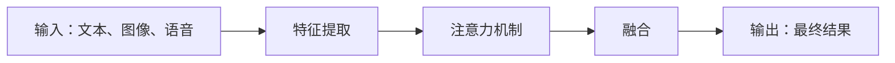
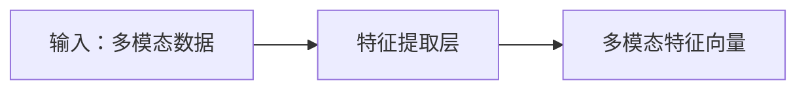
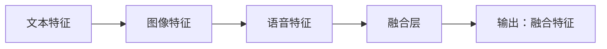
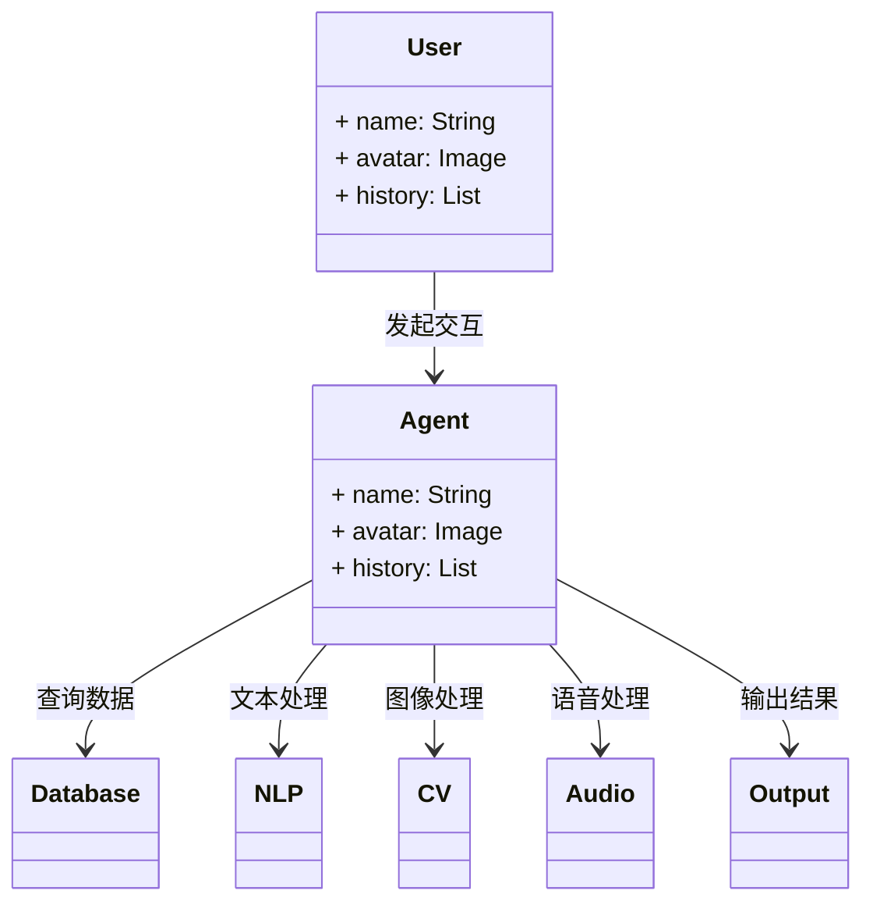
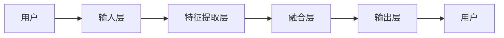
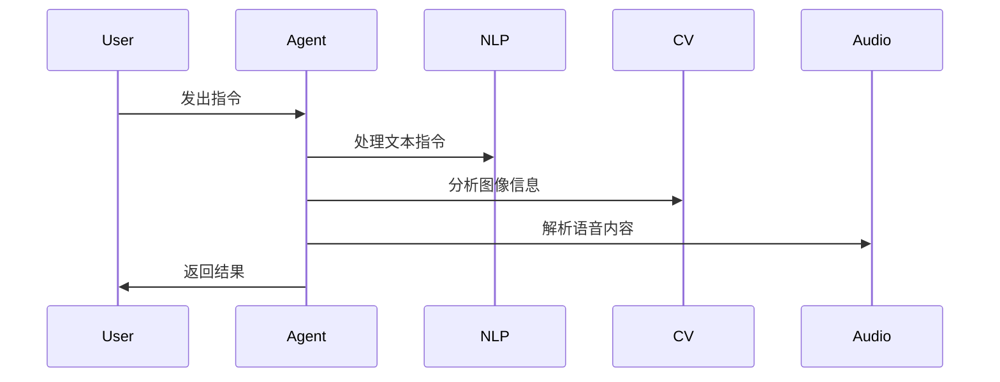

                 

<think>
嗯，我现在需要帮用户撰写一篇关于《AI Agent的多模态交互设计》的技术博客文章。用户要求文章结构清晰，内容丰富，涵盖从背景到项目实战的各个方面。首先，我得明确文章的结构，确保每个部分都详细且符合逻辑。

首先，标题是《AI Agent的多模态交互设计》，关键词需要包括多模态交互、AI Agent、自然语言处理、计算机视觉、语音识别等。摘要部分要简明扼要，概述文章的核心内容和主题，强调多模态交互设计的重要性以及文章将详细探讨的内容。

接下来，正文部分需要分为几个主要部分。第一部分是背景介绍，我需要解释什么是AI Agent，多模态交互的意义，以及它们的应用场景。这部分需要使用表格和Mermaid图来展示多模态数据的特点和优势。

第二部分是核心概念与联系，这里需要详细讲解多模态数据的类型、处理流程，以及它们之间的关系。我需要使用表格列出不同模态数据的优缺点，并通过Mermaid图展示信息处理流程和数据融合的结构。

第三部分是算法原理，这部分需要详细阐述多模态数据融合的算法，如注意力机制和生成对抗网络。我需要用Mermaid流程图展示算法的步骤，并提供Python代码示例，解释代码的功能和数学模型，使用Latex公式进行详细说明。

第四部分是系统分析与架构设计，我需要介绍应用场景，设计系统功能模块，如自然语言处理和图像识别。然后，用Mermaid图展示系统架构、接口设计和交互流程，帮助读者理解系统的结构和工作流程。

第五部分是项目实战，这里需要详细指导如何构建一个多模态交互系统，包括环境配置、核心代码实现、代码解读以及实际案例分析。这部分需要提供详细的代码示例，帮助读者动手实践。

最后，最佳实践部分需要总结经验和注意事项，提供进一步阅读的资源，并以优雅的结尾结束全文。整个过程中，我需要确保内容详细，逻辑清晰，同时保持语言的专业性和易懂性，帮助读者全面理解AI Agent的多模态交互设计。
</think>

# AI Agent的多模态交互设计

## 关键词：AI Agent，多模态交互，自然语言处理，计算机视觉，语音识别

## 摘要：  
AI Agent的多模态交互设计是实现智能化人机交互的核心技术。本文将从背景、核心概念、算法原理、系统架构、项目实战等多个方面详细探讨多模态交互设计的关键问题，包括多模态数据的处理、融合算法、系统架构设计以及实际应用案例分析。通过本文的系统性分析，读者将能够全面理解AI Agent的多模态交互设计的理论与实践。

---

# 第一部分：AI Agent与多模态交互概述

## 第1章：AI Agent的基本概念

### 1.1 什么是AI Agent
AI Agent（人工智能代理）是指能够感知环境、执行任务、与用户交互的智能实体。它可以是一个软件程序、一个机器人，或是一个虚拟助手。

### 1.2 AI Agent的核心特征
| 特性 | 描述 |
|------|------|
| 智能性 | 能够理解和推理复杂信息 |
| 反应性 | 能够实时响应用户的输入 |
| 学习性 | 能够通过数据优化自身行为 |
| 交互性 | 支持多种交互方式（文本、语音、图像等） |

### 1.3 多模态交互的定义与特点
多模态交互是指通过多种信息载体（如文本、语音、图像等）进行交互的方式。其特点包括：
- **多样性**：支持多种交互形式，满足不同用户需求。
- **鲁棒性**：能够处理复杂场景下的交互。
- **智能化**：结合上下文信息，提供更智能的交互体验。

---

# 第二部分：多模态数据处理与融合

## 第2章：多模态数据的采集与预处理

### 2.1 多模态数据的类型
| 数据类型 | 描述 | 示例 |
|----------|------|------|
| 文本 | 文本信息，如对话、查询 | 用户输入的自然语言查询 |
| 图像 | 图片、视频 | 用户上传的照片 |
| 音频 | 语音、音乐 | 用户的语音指令 |
| 传感器数据 | 物理传感器数据 | 智能设备的传感器读数 |

### 2.2 多模态数据的采集技术
- **文本采集**：通过输入框、语音识别等技术获取文本。
- **图像采集**：使用摄像头、API接口等获取图像。
- **音频采集**：通过麦克风、语音识别API获取语音数据。

### 2.3 多模态数据的预处理方法
- **数据清洗**：去除噪声、填补缺失值。
- **数据增强**：通过旋转、缩放等方式增强数据多样性。
- **格式转换**：将数据转换为统一格式，便于后续处理。

---

## 第3章：多模态数据融合算法

### 3.1 多模态数据融合的基本原理
多模态数据融合的目标是将来自不同模态的信息进行整合，以提高系统的理解和响应能力。常用的方法包括：
- **特征融合**：将不同模态的特征向量进行线性组合或非线性变换。
- **注意力机制**：通过注意力网络模型，动态调整各模态的重要性。
- **生成对抗网络**：通过生成器和判别器的对抗训练，生成高质量的多模态数据。

### 3.2 多模态数据融合的主流算法
#### 3.2.1 基于特征融合的方法
- **输入层融合**：在输入层将不同模态的数据进行拼接。
- **中间层融合**：在特征提取层进行融合。
- **输出层融合**：在输出层进行融合，结合多模态信息。

#### 3.2.2 基于注意力机制的方法


---

## 第4章：多模态交互的核心算法

### 4.1 多模态交互的算法实现
#### 4.1.1 多模态数据的特征提取


#### 4.1.2 多模态数据的融合策略


### 4.2 多模态交互的数学模型
#### 4.2.1 注意力机制
$$
\alpha_i = \frac{\exp(s_i)}{\sum_{j} \exp(s_j)}
$$
其中，$\alpha_i$ 是第 $i$ 个模态的注意力权重，$s_i$ 是对应的得分。

#### 4.2.2 融合模型
$$
y = \sum_{i=1}^{n} \alpha_i x_i
$$
其中，$y$ 是融合结果，$\alpha_i$ 是注意力权重，$x_i$ 是第 $i$ 个模态的特征向量。

---

# 第三部分：系统分析与架构设计

## 第5章：系统架构设计

### 5.1 问题场景介绍
AI Agent需要处理多种模态数据，支持复杂的交互任务，如语音对话、图像识别等。

### 5.2 系统功能设计


### 5.3 系统架构设计


### 5.4 接口设计
- **输入接口**：接收多种模态的数据输入。
- **输出接口**：返回多模态的交互结果。

### 5.5 交互流程


---

# 第四部分：项目实战

## 第6章：环境安装与核心代码实现

### 6.1 环境配置
```bash
pip install numpy
pip install matplotlib
pip install scikit-learn
```

### 6.2 核心代码实现
```python
import numpy as np
from sklearn.metrics import accuracy_score

def multi_modal_fusion(features):
    # 特征融合
    alpha = np.exp(features[:, 0]) / np.sum(np.exp(features[:, 0]))
    fused_features = np.dot(features, alpha)
    return fused_features

def main():
    # 示例数据
    features = np.random.randn(10, 3)
    fused_features = multi_modal_fusion(features)
    print("Fused Features:", fused_features)

if __name__ == "__main__":
    main()
```

### 6.3 代码解读
- **multi_modal_fusion**：对多模态特征进行融合，计算注意力权重并生成融合特征。
- **main**：生成随机数据并调用融合函数。

---

## 第7章：案例分析与总结

### 7.1 案例分析
通过实际案例分析，展示AI Agent在多模态交互中的应用，如智能客服、虚拟助手等。

### 7.2 项目小结
总结项目实现的关键点，包括数据处理、模型设计、系统架构等。

---

## 第五部分：最佳实践与总结

## 第8章：最佳实践与注意事项

### 8.1 设计注意事项
- **数据多样性**：确保数据涵盖多种模态。
- **模型可解释性**：设计易于解释的模型。
- **性能优化**：优化模型的计算效率。

### 8.2 拓展阅读
- 推荐书籍：《深度学习》、《机器学习实战》。
- 推荐论文：相关领域的顶会论文。

---

## 结语

AI Agent的多模态交互设计是一项复杂而有趣的任务，需要结合多种技术手段，从数据处理到模型设计，再到系统实现，每个环节都需要精心设计。通过本文的系统性分析，读者可以全面掌握AI Agent的多模态交互设计的核心内容，并能够在实际项目中灵活应用这些知识。

---

**作者：AI天才研究院 & 禅与计算机程序设计艺术**

