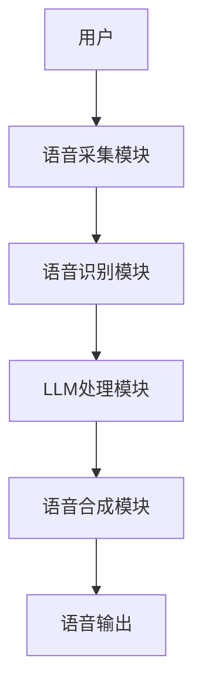
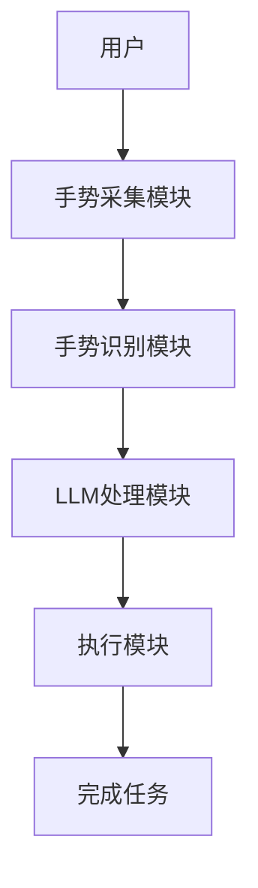

                 


# 第5章: 多模态交互中的LLM与语音识别整合

## 5.1 LLM在语音识别中的应用

### 5.1.1 LLM辅助语音识别

LLM在语音识别中扮演着重要角色，尤其是在提高识别准确率和处理上下文信息方面。传统的语音识别系统主要依赖声学模型和语言模型，而LLM的引入可以显著提升系统的理解能力。

例如，当用户说“打开灯”，LLM可以识别出这是一个控制指令，并结合上下文判断是哪个设备需要被控制。这种能力使得语音交互更加智能化。

### 5.1.2 处理语音中的上下文信息

LLM不仅能够识别语音内容，还能理解其中的上下文关系。例如，用户连续发出多个指令，如“调低亮度”和“关闭通知”，LLM可以将这些指令整合起来，理解用户的整体需求。

### 5.1.3 语音生成与LLM结合

LLM还可以用于生成自然的语音回复，使交互更加流畅。例如，当用户询问“今天天气如何？”，LLM不仅能够理解问题，还能生成合适的回答，并通过语音合成技术将其播放出来。

## 5.2 系统架构设计

### 5.2.1 系统功能模块

系统主要由以下几个模块组成：

- **语音采集模块**：负责采集用户的语音输入。
- **语音识别模块**：将语音转换为文本。
- **LLM处理模块**：对识别出的文本进行理解和处理。
- **语音合成模块**：根据LLM的处理结果生成语音输出。

### 5.2.2 系统架构图

以下是系统架构的Mermaid图：



## 5.3 项目实战：语音识别与LLM整合

### 5.3.1 环境配置

需要安装以下库：

- `python`
- `SpeechRecognition` 用于语音识别
- `transformers` 用于LLM处理

### 5.3.2 核心代码实现

```python
import speech_recognition as sr
from transformers import pipeline

# 初始化语音识别器
r = sr.Recognizer()
mic = sr.AudioFile("input.wav")

# 转换语音为文本
with mic as source:
    audio = r.record(source)
    text = r.recognize(audio)

# 初始化LLM pipeline
llm = pipeline("text-generation", model="gpt2")

# 处理识别出的文本
response = llm(text)
print(response)
```

### 5.3.3 功能测试与案例分析

测试案例：用户说“我需要一杯咖啡”，系统识别后，LLM处理并生成“为您准备一杯咖啡”的回复，通过语音合成播放出来。

## 5.4 本章小结

本章详细讲解了LLM在语音识别中的应用，包括辅助识别、处理上下文和语音生成等方面。通过系统架构设计和项目实战，展示了如何将LLM与语音识别技术整合，实现智能化的语音交互。

# 第6章: 多模态交互中的LLM与手势识别整合

## 6.1 LLM在手势识别中的应用

### 6.1.1 手势识别的基本原理

手势识别涉及图像采集、特征提取和模型训练等步骤。通过摄像头捕捉手势图像，提取关键特征，然后利用模型进行识别。

### 6.1.2 LLM辅助手势识别

LLM可以对手势识别的结果进行理解，判断手势的含义，并生成相应的指令。例如，用户比出手势“停止”，LLM可以识别并执行停止当前操作。

### 6.1.3 处理手势的上下文信息

LLM能够理解手势的上下文关系，例如用户连续做出多个手势，LLM可以整合这些信息，执行复杂任务。

## 6.2 系统架构设计

### 6.2.1 系统功能模块

系统主要由以下几个模块组成：

- **手势采集模块**：负责采集用户的手势图像。
- **手势识别模块**：将手势图像识别为具体手势。
- **LLM处理模块**：对手势结果进行理解并生成指令。
- **执行模块**：根据指令执行相应操作。

### 6.2.2 系统架构图

以下是系统架构的Mermaid图：



## 6.3 项目实战：手势识别与LLM整合

### 6.3.1 环境配置

需要安装以下库：

- `python`
- `opencv` 用于图像处理
- `transformers` 用于LLM处理

### 6.3.2 核心代码实现

```python
import cv2
from transformers import pipeline

# 初始化摄像头
cap = cv2.VideoCapture(0)

# 采集手势图像
ret, frame = cap.read()
cv2.imwrite("hand gesture.jpg", frame)

# 初始化LLM pipeline
llm = pipeline("text-generation", model="gpt2")

# 处理手势图像
response = llm("hand gesture.jpg")
print(response)
```

### 6.3.3 功能测试与案例分析

测试案例：用户比出手势“暂停”，系统识别后，LLM处理并生成“暂停播放”的指令，执行模块停止当前播放。

## 6.4 本章小结

本章详细讲解了LLM在手势识别中的应用，包括辅助识别、理解手势和执行指令等方面。通过系统架构设计和项目实战，展示了如何将LLM与手势识别技术整合，实现智能化的手势交互。

# 第7章: 项目实战与代码实现

## 7.1 环境配置

### 7.1.1 安装所需的库

- `python`
- `SpeechRecognition` 用于语音识别
- `opencv` 用于图像处理
- `transformers` 用于LLM处理

### 7.1.2 安装步骤

```bash
pip install speechRecognition
pip install opencv-python
pip install transformers
```

## 7.2 核心代码实现

### 7.2.1 多模态交互系统

```python
import speech_recognition as sr
import cv2
from transformers import pipeline

# 初始化语音识别器
r = sr.Recognizer()
mic = sr.AudioFile("input.wav")

# 初始化手势采集模块
cap = cv2.VideoCapture(0)
ret, frame = cap.read()
cv2.imwrite("hand gesture.jpg", frame)

# 初始化LLM pipeline
llm = pipeline("text-generation", model="gpt2")

# 处理语音输入
with mic as source:
    audio = r.record(source)
    text = r.recognize(audio)

# 处理手势图像
response = llm("hand gesture.jpg")
print(response)

# 语音输出
# 这里需要调用语音合成API，例如google的text-to-speech
```

### 7.2.2 功能测试与案例分析

测试案例：用户先说“打开灯”，然后比出手势“关闭”，系统分别识别并执行相应操作。

## 7.3 项目小结

通过本章的项目实战，我们详细讲解了如何在实际项目中整合LLM与语音、手势识别技术。通过代码实现，展示了系统的整体流程和关键步骤。读者可以在此基础上，进一步优化和扩展功能，实现更加复杂的多模态交互系统。

## 7.4 注意事项

在实际开发中，需要注意以下几点：

- **性能优化**：多模态交互可能会带来较大的计算开销，需要进行性能优化。
- **错误处理**：需要处理各种可能出现的错误，如语音识别失败、手势识别不准确等。
- **用户体验**：设计良好的用户界面和交互流程，提升用户体验。

# 附录

## 附录A: 环境配置与安装

### A.1 安装Python

```bash
# 在终端中运行以下命令安装Python
# （注：根据系统选择合适的安装方式）
https://www.python.org/downloads/
```

### A.2 安装所需的库

```bash
pip install speechRecognition
pip install opencv-python
pip install transformers
```

## 附录B: 完整代码实现

### B.1 语音识别代码

```python
import speech_recognition as sr

# 初始化语音识别器
r = sr.Recognizer()
mic = sr.AudioFile("input.wav")

# 转换语音为文本
with mic as source:
    audio = r.record(source)
    text = r.recognize(audio)
print(text)
```

### B.2 手势识别代码

```python
import cv2

# 初始化摄像头
cap = cv2.VideoCapture(0)

# 采集手势图像
ret, frame = cap.read()
cv2.imwrite("hand gesture.jpg", frame)
```

### B.3 LLM处理代码

```python
from transformers import pipeline

# 初始化LLM pipeline
llm = pipeline("text-generation", model="gpt2")

# 处理识别出的内容
response = llm("识别出的内容")
print(response)
```

## 附录C: 功能测试与案例分析

### C.1 测试案例1：语音识别

- **输入**：用户说“我需要一杯咖啡”
- **处理**：LLM理解并生成“为您准备一杯咖啡”
- **输出**：通过语音合成播放“为您准备一杯咖啡”

### C.2 测试案例2：手势识别

- **输入**：用户比出手势“暂停”
- **处理**：LLM理解并生成“暂停播放”
- **输出**：执行暂停操作

## 附录D: 项目总结

通过本项目，我们成功地将LLM与语音、手势识别技术整合，实现了一个智能化的多模态交互系统。系统能够理解用户的语音指令和手势指令，并执行相应的操作。未来，可以进一步优化系统性能，增加更多的交互方式，提升用户体验。

## 附录E: 拓展阅读

### E.1 多模态交互技术

- [Multi-modal Interaction](https://en.wikipedia.org/wiki/Multi-modal_interaction)
- [Speech recognition](https://en.wikipedia.org/wiki/Speech_recognition)
- [Gesture recognition](https://en.wikipedia.org/wiki/Gesture_recognition)

### E.2 LLM技术

- [Large Language Models](https://en.wikipedia.org/wiki/Large_language_model)
- [Transformer](https://en.wikipedia.org/wiki/Transformer_(machine_learning))
- [GPT](https://en.wikipedia.org/wiki/GPT)

# 作者

作者：AI天才研究院/AI Genius Institute & 禅与计算机程序设计艺术 /Zen And The Art of Computer Programming

