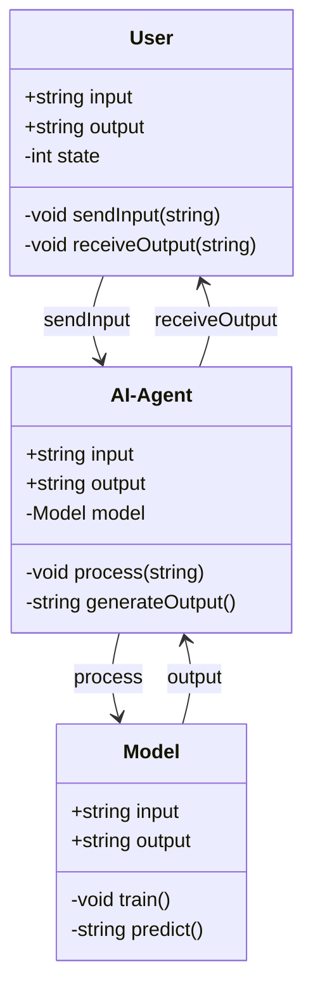
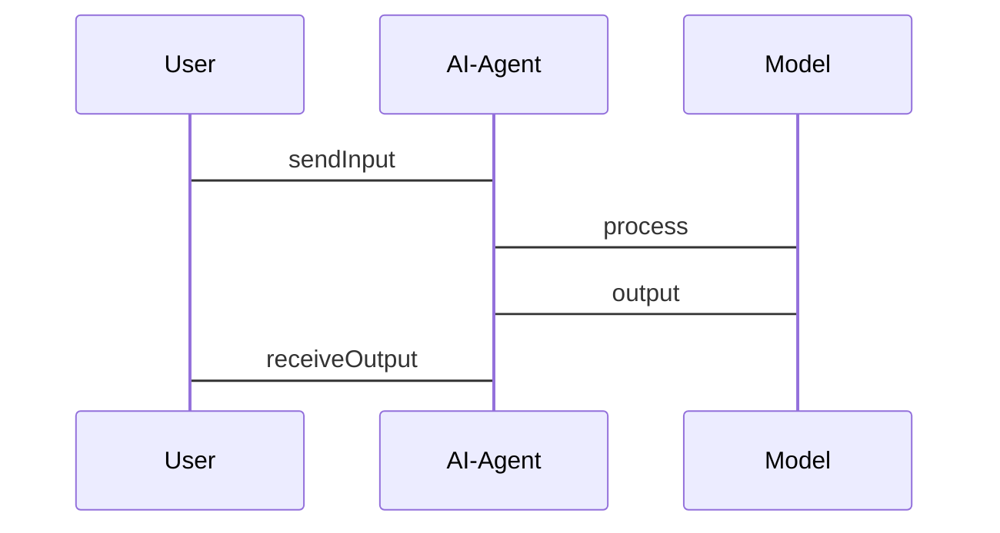

                 

<think>
嗯，我现在需要帮用户设计一本名为《AI Agent的多模态内容理解与生成》的书籍目录大纲。用户希望这个大纲详细且逻辑清晰，覆盖所有主题内容。首先，我需要理解这本书的核心主题是什么。AI Agent，也就是智能体，它能够理解并生成多模态的内容，比如文本、图像、语音等。这意味着书的内容需要涵盖AI Agent的基本概念、多模态技术、算法原理以及实际应用。

接下来，我应该考虑目录的结构。通常，技术书籍会分为几个主要部分，比如基础、核心概念、算法、系统架构、实战和总结等。用户提供的示例显示，目录需要有至少七章，每章下还有子章节，细化到三级目录。首先，第一章应该是背景介绍，涵盖AI Agent的基本概念、问题背景、问题描述以及其在多模态领域的应用。这样读者可以了解为什么AI Agent在多模态内容处理上重要。

然后，第二章需要深入讨论多模态内容理解与生成的核心概念。这里要解释什么是多模态数据，如何处理它们，并展示一些核心概念之间的关系，比如使用ER图或Mermaid图来说明。接下来，第三章应该聚焦于AI Agent的算法原理。这部分需要详细讲解常用的算法，如多模态融合算法、注意力机制等，并用Mermaid流程图展示算法的工作流程。同时，还需要提供Python代码示例，帮助读者理解这些算法的实际应用。

第四章是数学模型和公式部分。这里要详细推导一些关键的数学模型，比如多模态表示模型，展示它们的公式，并通过例子说明这些模型如何在实际中应用。这部分需要使用LaTeX公式，确保数学表达准确无误。

第五章应该涉及系统分析与架构设计。这部分需要介绍系统应用场景，设计系统功能模块，用Mermaid类图展示领域模型，架构图展示系统结构，并描述系统接口和交互流程，比如使用序列图来展示用户与AI Agent的互动。

第六章是项目实战，这部分要指导读者如何安装环境，实现核心功能，并进行案例分析。通过实际项目，读者可以将理论知识应用到实践中，巩固所学内容。

最后，第七章作为总结和展望，回顾全书内容，给出最佳实践的建议，提醒读者注意的事项，并推荐进一步阅读的资料。在设计过程中，我需要确保每一章都涵盖用户要求的核心内容，比如背景、核心概念、算法、数学模型、系统架构、项目实战和总结。同时，要使用Mermaid图和Python代码来增强理解，确保目录结构完整且逻辑清晰。

可能遇到的挑战是如何将复杂的多模态处理和AI Agent的算法讲解得通俗易懂，同时保持目录的结构合理。因此，在设计时，我会尽量细化每一章的内容，确保每个部分都深入浅出，帮助读者逐步掌握相关知识。总的来说，我需要按照用户的要求，构建一个结构合理、内容全面的目录大纲，确保涵盖所有必要的主题，并且每一部分都详细到三级目录，满足用户的详细需求。
</think>

# AI Agent的多模态内容理解与生成

## 关键词
AI Agent, 多模态内容, 多模态理解, 多模态生成, 多模态融合

## 摘要
AI Agent作为人工智能领域的重要研究方向，其多模态内容理解与生成能力是实现智能化系统的关键。本文将从AI Agent的基本概念出发，详细探讨多模态内容理解与生成的核心技术，包括多模态数据的融合、生成算法的实现、数学模型的构建以及系统架构设计。通过实际案例分析和代码实现，帮助读者全面掌握AI Agent在多模态内容处理中的应用。

---

# 第1章: AI Agent与多模态内容概述

## 1.1 AI Agent的基本概念
### 1.1.1 AI Agent的定义与特点
AI Agent（人工智能代理）是指能够感知环境、执行任务并做出决策的智能实体。其特点包括自主性、反应性、目标导向和社会能力。

### 1.1.2 多模态内容的理解与生成
多模态内容是指包含多种数据类型（如文本、图像、语音等）的信息。AI Agent需要能够理解和生成多模态内容，以实现更复杂的应用场景。

### 1.1.3 AI Agent在多模态任务中的作用
AI Agent通过多模态内容处理，能够提升任务的准确性和效率，例如在自然语言处理、计算机视觉和人机交互等领域发挥重要作用。

## 1.2 多模态内容理解与生成背景
### 1.2.1 多模态数据的定义与类型
多模态数据包括文本、图像、语音、视频等多种形式，每种数据类型都有其独特的特点和应用场景。

### 1.2.2 多模态内容理解的挑战
多模态内容理解的挑战包括数据异构性、信息冗余和计算复杂性等问题。

### 1.2.3 多模态生成的前沿技术
前沿技术包括生成对抗网络（GAN）、变体自编码器（VAE）和Transformer模型等。

## 1.3 AI Agent的应用场景
### 1.3.1 多模态内容理解的应用场景
例如智能客服、图像描述生成和视频摘要生成等。

### 1.3.2 多模态内容生成的应用场景
例如虚拟助手、智能音箱和多模态对话系统等。

### 1.3.3 AI Agent在多模态任务中的优势
AI Agent能够整合多种数据源，提供更全面和精准的信息处理能力。

## 1.4 本章小结

---

# 第2章: 多模态内容理解与生成的核心概念

## 2.1 多模态数据的处理方法
### 2.1.1 多模态数据的融合方法
包括特征级融合、决策级融合和混合融合等。

### 2.1.2 多模态数据的表示方法
例如词嵌入、图像特征提取和语音特征提取等。

### 2.1.3 多模态数据的分析方法
包括统计分析、机器学习和深度学习等。

## 2.2 AI Agent的核心算法
### 2.2.1 多模态融合算法
例如多模态注意力机制和多模态变换器。

### 2.2.2 多模态生成算法
包括多模态生成对抗网络（GAN）和多模态变体自编码器（VAE）。

### 2.2.3 多模态理解算法
例如多模态Transformer模型和多任务学习模型。

## 2.3 多模态内容理解与生成的流程
### 2.3.1 数据输入与预处理
包括数据清洗、特征提取和数据增强。

### 2.3.2 数据特征提取
使用CNN、RNN和Transformer等模型提取特征。

### 2.3.3 数据模型训练
包括模型参数优化和损失函数设计。

### 2.3.4 数据结果生成与输出
生成文本、图像或其他形式的结果。

## 2.4 本章小结

---

# 第3章: AI Agent的算法原理与实现

## 3.1 多模态融合算法
### 3.1.1 多模态融合的基本原理
通过将不同模态的特征进行融合，提升模型的表达能力。

### 3.1.2 多模态融合的实现方法
使用注意力机制、门控机制和因子分解等方法。

### 3.1.3 多模态融合的优缺点
优点包括提升准确性和鲁棒性，缺点包括计算复杂性和数据异构性。

## 3.2 多模态生成算法
### 3.2.1 多模态生成的基本原理
通过生成模型生成新的多模态数据。

### 3.2.2 多模态生成的实现方法
使用GAN、VAE和Transformer等模型。

### 3.2.3 多模态生成的优缺点
优点包括生成多样性和逼真性，缺点包括训练不稳定性和生成可控性问题。

## 3.3 多模态理解算法
### 3.3.1 多模态理解的基本原理
通过深度学习模型理解多模态数据的语义信息。

### 3.3.2 多模态理解的实现方法
使用Transformer模型、对比学习和多任务学习等方法。

## 3.4 算法实现的代码示例
### 3.4.1 使用Python实现多模态融合算法
```python
import torch
class MultiModalAttention(torch.nn.Module):
    def __init__(self, embed_dim, num_heads):
        super().__init__()
        self.embed_dim = embed_dim
        self.num_heads = num_heads
        self.heads = torch.nn.Linear(embed_dim, embed_dim, bias=False)
    def forward(self, x):
        # x: (batch_size, seq_len, embed_dim)
        x = self.heads(x)
        return x
```

### 3.4.2 使用PyTorch实现多模态生成模型
```python
import torch
import torch.nn as nn
class MultiModalGenerator(nn.Module):
    def __init__(self, latent_dim, img_size):
        super().__init__()
        self.latent_dim = latent_dim
        self.img_size = img_size
        self.model = nn.Sequential(
            nn.ConvTranspose2d(latent_dim, 512, 4, 1, 0),
            nn.ReLU(),
            nn.ConvTranspose2d(512, 256, 4, 1, 0),
            nn.ReLU(),
            nn.ConvTranspose2d(256, 128, 4, 1, 0),
            nn.ReLU(),
            nn.ConvTranspose2d(128, 3, 4, 1, 0),
            nn.Tanh()
        )
    def forward(self, x):
        return self.model(x)
```

## 3.5 本章小结

---

# 第4章: 多模态内容理解与生成的数学模型与公式

## 4.1 多模态融合的数学模型
### 4.1.1 多模态注意力机制
$$\text{Attention}(Q, K, V) = \text{softmax}\left(\frac{QK^T}{\sqrt{d_k}}\right)V$$

### 4.1.2 多模态变换器模型
$$\text{Transformer}(X) = \text{Encoder}(X) + \text{Decoder}(X)$$

## 4.2 多模态生成的数学模型
### 4.2.1 生成对抗网络（GAN）
$$\min_G \max_D \mathbb{E}_{x \sim p_{\text{data}}}[\log D(x)] + \mathbb{E}_{z \sim p_z}[\log (1 - D(G(z)))]$$

### 4.2.2 变体自编码器（VAE）
$$\mathcal{L} = \mathbb{E}_{z \sim q(z|x)}[\log p(x|z)] - \text{KL}(q(z|x) || p(z))$$

## 4.3 多模态理解的数学模型
### 4.3.1 多任务学习模型
$$\mathcal{L} = \sum_{i=1}^n \lambda_i \mathcal{L}_i$$
其中$\lambda_i$是任务$i$的权重。

## 4.4 本章小结

---

# 第5章: AI Agent的系统分析与架构设计

## 5.1 系统应用场景
### 5.1.1 多模态内容理解的应用场景
例如智能客服系统中的图像识别和语音识别。

### 5.1.2 多模态内容生成的应用场景
例如虚拟助手中的对话生成和图像生成。

## 5.2 系统功能设计
### 5.2.1 领域模型设计
使用Mermaid类图展示系统功能模块之间的关系。



### 5.2.2 系统架构设计
使用Mermaid架构图展示系统的整体架构。


## 5.3 系统接口设计
### 5.3.1 系统接口描述
定义API接口，例如RESTful API。

### 5.3.2 系统交互流程
使用Mermaid序列图展示用户与AI-Agent的交互流程。



## 5.4 本章小结

---

# 第6章: 项目实战——AI Agent的多模态内容理解与生成

## 6.1 项目环境安装
### 6.1.1 安装Python和依赖库
使用pip安装PyTorch、Transformers和其他必要的库。

## 6.2 核心功能实现
### 6.2.1 多模态融合算法实现
实现多模态注意力机制和融合模型。

### 6.2.2 多模态生成算法实现
实现生成对抗网络和变体自编码器。

## 6.3 实际案例分析
### 6.3.1 多模态内容理解案例
例如图像描述生成。

### 6.3.2 多模态内容生成案例
例如多模态对话生成。

## 6.4 项目小结
总结项目的实现过程和关键点。

## 6.5 代码实现与解读
### 6.5.1 多模态融合算法代码
```python
import torch
class MultiModalFusion(nn.Module):
    def __init__(self, input_dim, output_dim):
        super().__init__()
        self.fc = nn.Linear(input_dim, output_dim)
    def forward(self, x):
        return self.fc(x)
```

### 6.5.2 多模态生成算法代码
```python
import torch
import torch.nn as nn
class MultiModalGenerator(nn.Module):
    def __init__(self, latent_dim, output_dim):
        super().__init__()
        self.model = nn.Sequential(
            nn.Linear(latent_dim, output_dim),
            nn.Sigmoid()
        )
    def forward(self, x):
        return self.model(x)
```

## 6.6 本章小结

---

# 第7章: 总结与展望

## 7.1 本章总结
总结AI Agent的多模态内容理解与生成的核心内容和技术要点。

## 7.2 未来展望
展望多模态AI Agent的发展方向和潜在应用。

## 7.3 最佳实践Tips
### 7.3.1 数据预处理的注意事项
确保数据的多样性和均衡性。

### 7.3.2 模型训练的技巧
合理选择超参数和优化方法。

### 7.3.3 系统部署的建议
优化模型的计算效率和扩展性。

## 7.4 本章小结

---

# 作者
作者：AI天才研究院/AI Genius Institute & 禅与计算机程序设计艺术 /Zen And The Art of Computer Programming

