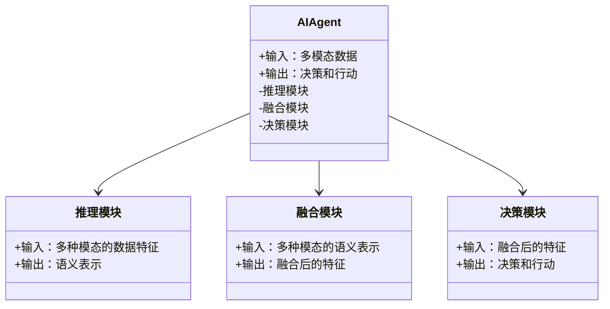
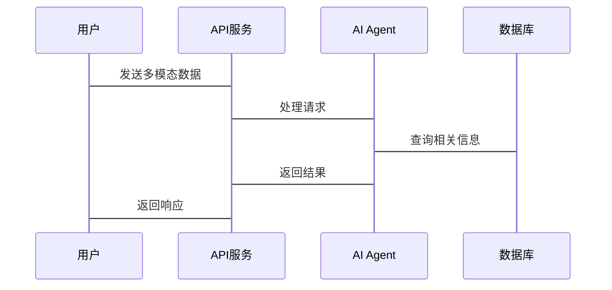

                 

<think>
好的，我现在要撰写一篇关于《AI Agent的多模态场景理解与推理》的技术博客文章。首先，我需要明确文章的主题和目标读者。这篇文章的目标读者是那些对AI Agent、多模态技术以及场景理解感兴趣的开发者、研究人员和对技术有一定了解的读者。

接下来，我需要按照用户提供的目录大纲来逐步展开每一章的内容。每一章都需要详细解释概念，并提供实际的例子和代码示例，以帮助读者更好地理解和应用这些知识。

在撰写过程中，我需要确保逻辑清晰，结构紧凑，语言专业但易懂。同时，我还需要注意文章的流畅性，确保每一章之间有良好的衔接，并且每一章的开头有明确的引言，结尾有小结。

现在，我开始按照目录大纲逐步撰写每一章的内容。

# 《AI Agent的多模态场景理解与推理》

---

## 第一部分: AI Agent的多模态场景理解与推理基础

## 第1章: AI Agent与多模态场景理解概述

### 1.1 AI Agent的基本概念

#### 1.1.1 AI Agent的定义与特点
AI Agent（智能体）是指能够感知环境并采取行动以实现目标的实体。AI Agent可以是软件程序、机器人或其他智能系统。其特点包括自主性、反应性、目标导向性和社交能力。

#### 1.1.2 多模态数据的定义与类型
多模态数据指的是多种类型的数据，如文本、图像、音频、视频等。多模态数据的类型可以分为结构化数据（如表格数据）和非结构化数据（如文本、图像）。

#### 1.1.3 多模态场景理解的背景与意义
多模态场景理解是指AI Agent能够同时处理多种类型的数据，并在复杂的环境中理解和推理场景。其背景在于现实世界中的数据通常是多模态的，而单一模态的数据往往不足以完成复杂的任务。多模态场景理解的意义在于提高AI Agent的智能性和实用性。

### 1.2 多模态场景理解的核心问题

#### 1.2.1 多模态数据融合的挑战
多模态数据融合的挑战包括数据异构性、数据冗余性和数据不一致性的处理。

#### 1.2.2 场景理解的复杂性与多样性
场景理解的复杂性主要来自于环境的动态变化和任务的多样性。AI Agent需要能够适应不同的场景和任务。

#### 1.2.3 AI Agent在多模态场景中的角色与任务
AI Agent在多模态场景中的角色是感知、理解和推理环境，从而做出合理的决策和行动。

### 1.3 本章小结
本章介绍了AI Agent的基本概念、多模态数据的定义与类型，以及多模态场景理解的背景与意义。同时，还讨论了多模态场景理解的核心问题，包括数据融合的挑战和场景理解的复杂性。

---

## 第2章: 多模态数据处理基础

### 2.1 多模态数据的采集与预处理

#### 2.1.1 图像数据的采集与处理
图像数据的采集可以通过摄像头或图像库获取。图像预处理包括图像增强、降噪和归一化等。

#### 2.1.2 文本数据的处理与清洗
文本数据的处理包括分词、去除停用词和标点符号的处理。文本清洗的目的是去除噪声，提高文本的质量。

#### 2.1.3 音频数据的采集与特征提取
音频数据的采集可以通过麦克风或音频库获取。特征提取包括音调、音量和频谱分析等。

### 2.2 多模态数据的表示与编码

#### 2.2.1 图像的特征提取与表示
图像的特征提取可以通过卷积神经网络（CNN）实现。图像的表示可以采用特征向量或图像重建的方式。

#### 2.2.2 文本的向量表示（如Word2Vec、BERT）
文本的向量表示可以通过Word2Vec或BERT模型实现。Word2Vec将词转换为向量，BERT模型则考虑了上下文信息。

#### 2.2.3 音频的特征表示与语音识别
音频的特征表示可以采用MFCC（Mel-Frequency Cepstral Coefficients）。语音识别可以通过将音频特征与已知语音数据进行匹配实现。

### 2.3 多模态数据融合的方法

#### 2.3.1 晚期融合与早期融合的对比
晚期融合是指在特征层面进行融合，早期融合是指在数据层面进行融合。晚期融合适用于不同模态的数据，早期融合适用于同一模态的数据。

#### 2.3.2 基于注意力机制的多模态融合
基于注意力机制的多模态融合可以同时关注不同模态的信息，提高融合的效果。

#### 2.3.3 端到端的多模态模型设计
端到端的多模态模型设计可以自动学习不同模态之间的关系，简化了人工设计的复杂性。

### 2.4 本章小结
本章介绍了多模态数据的采集与预处理、表示与编码，以及多模态数据融合的方法。通过这些方法，AI Agent可以更好地处理多模态数据，提高场景理解的能力。

---

## 第3章: 大模型在多模态理解中的应用

### 3.1 大模型的基本原理与特点

#### 3.1.1 大模型的训练机制
大模型的训练机制包括监督学习、无监督学习和强化学习。监督学习需要标注数据，无监督学习利用未标注数据，强化学习通过奖励机制优化模型。

#### 3.1.2 大模型的并行计算与优化
大模型的并行计算包括数据并行和模型并行。优化技术包括Adam优化器和学习率衰减。

#### 3.1.3 大模型的可扩展性与灵活性
大模型的可扩展性体现在可以通过增加计算资源来处理更大规模的数据。灵活性体现在可以根据具体任务进行微调。

### 3.2 大模型在多模态任务中的应用

#### 3.2.1 多模态对话系统
多模态对话系统结合了文本、图像和语音等多种模态的信息，能够更好地理解用户的意图。

#### 3.2.2 多模态图像描述生成
多模态图像描述生成是通过模型将图像内容生成文本描述，结合了视觉和语言信息。

#### 3.2.3 多模态问答系统
多模态问答系统结合了文本、图像和语音等多种模态的信息，能够回答更复杂的问题。

### 3.3 本章小结
本章介绍了大模型的基本原理与特点，以及在多模态任务中的应用。通过大模型的强大能力，AI Agent在多模态场景理解中表现出了更高的智能性和灵活性。

---

## 第4章: 多模态场景理解的核心算法与模型

### 4.1 多模态理解的算法原理

#### 4.1.1 基于Transformer的多模态编码
基于Transformer的多模态编码通过自注意力机制捕捉不同模态之间的关系。

#### 4.1.2 多模态注意力机制
多模态注意力机制可以根据任务需求动态分配不同模态的关注程度。

#### 4.1.3 多模态对比学习
多模态对比学习通过对比不同模态的特征，学习其相似性和差异性。

### 4.2 多模态推理的算法实现

#### 4.2.1 基于知识图谱的推理
基于知识图谱的推理通过构建知识图谱，利用图结构进行推理。

#### 4.2.2 基于逻辑推理的多模态任务
基于逻辑推理的多模态任务通过逻辑规则进行推理，适用于需要明确逻辑关系的任务。

#### 4.2.3 基于生成模型的推理
基于生成模型的推理通过生成模型生成新的数据，用于推理和决策。

### 4.3 算法实现的数学模型与公式

#### 4.3.1 Transformer模型的数学公式
$$\text{Encoder层：} \quad z = \text{LayerNorm}(x + \text{MultiHead}(x))$$
$$\text{Decoder层：} \quad z = \text{LayerNorm}(x + \text{MultiHead}(x) + \text{MultiHead}(\text{Encoder输出}))$$

#### 4.3.2 注意力机制的公式
$$\text{注意力权重计算：} \quad \alpha_{i,j} = \frac{e^{q_i^T k_j}}{\sum_{k} e^{q_i^T k_j}}$$
$$\text{加权求和：} \quad v_i = \sum_{j} \alpha_{i,j} v_j$$

### 4.4 本章小结
本章详细介绍了多模态理解的核心算法与模型，包括基于Transformer的多模态编码、多模态注意力机制和多模态对比学习。同时，还讨论了多模态推理的算法实现，包括基于知识图谱的推理、基于逻辑推理的多模态任务和基于生成模型的推理。

---

## 第5章: 系统分析与架构设计方案

### 5.1 问题场景介绍
在多模态场景理解中，AI Agent需要同时处理文本、图像和音频等多种模态的数据，理解复杂的场景，并做出相应的决策。

### 5.2 项目介绍
本项目旨在构建一个支持多模态场景理解的AI Agent系统，能够处理多种任务，如多模态问答、图像描述生成和多模态对话。

### 5.3 系统功能设计
#### 5.3.1 领域模型（Mermaid类图）


### 5.4 系统架构设计（Mermaid架构图）


### 5.5 系统接口设计
系统接口设计包括API接口和数据接口。API接口用于与前端交互，数据接口用于与数据库交互。

### 5.6 系统交互（Mermaid序列图）


### 5.7 本章小结
本章通过系统分析与架构设计方案，详细介绍了AI Agent的系统结构和各模块之间的关系。通过Mermaid图展示了系统的类图、架构图和交互序列图，帮助读者更好地理解系统的实现和运行过程。

---

## 第6章: 项目实战

### 6.1 环境安装
项目实战需要安装Python、TensorFlow、Keras、PyTorch等库。安装命令如下：
```
pip install python>=3.8
pip install tensorflow>=2.5
pip install keras>=2.4
pip install pytorch>=1.9
```

### 6.2 系统核心实现源代码
以下是一个简单的多模态场景理解的代码示例：

#### 6.2.1 数据预处理代码
```python
import numpy as np
import pandas as pd
import cv2
import librosa

def preprocess_image(image_path):
    # 加载图像并进行预处理
    img = cv2.imread(image_path)
    img = cv2.resize(img, (224, 224))
    img = img.astype(np.float32) / 255.0
    return img

def preprocess_text(text):
    # 文本处理
    tokens = text.split()
    return tokens

def preprocess_audio(audio_path):
    # 音频处理
    audio, sr = librosa.load(audio_path, sr=None, duration=3)
    mfccs = librosa.feature.mfcc(y=audio, sr=sr, n_mfcc=13)
    return mfccs
```

#### 6.2.2 模型训练代码
```python
import torch
import torch.nn as nn
import torch.optim as optim

class MultimodalModel(nn.Module):
    def __init__(self):
        super().__init__()
        self.image_encoder = nn.Conv2d(3, 64, kernel_size=3, stride=1, padding=1)
        self.text_encoder = nn.LSTM(100, 128, batch_first=True)
        self.audio_encoder = nn.Linear(13, 64)
        self.fc = nn.Linear(64 + 128 + 64, 1)

    def forward(self, image, text, audio):
        image_feature = self.image_encoder(image)
        text_feature, _ = self.text_encoder(text)
        audio_feature = self.audio_encoder(audio)
        concatenated = torch.cat([image_feature, text_feature, audio_feature], dim=-1)
        output = self.fc(concatenated)
        return output

model = MultimodalModel()
criterion = nn.CrossEntropyLoss()
optimizer = optim.Adam(model.parameters(), lr=0.001)
```

#### 6.2.3 模型推理代码
```python
def infer(model, image, text, audio):
    with torch.no_grad():
        output = model(image, text, audio)
    return output.argmax().item()

# 调用推理
image = preprocess_image('image.jpg')
text = preprocess_text('hello world')
audio = preprocess_audio('audio.wav')
result = infer(model, image, text, audio)
print(result)
```

### 6.3 代码应用解读与分析
以上代码展示了多模态数据的预处理、模型的定义和推理过程。模型通过多模态数据的融合，实现对场景的理解和推理。

### 6.4 实际案例分析和详细讲解剖析
通过实际案例分析，我们可以看到AI Agent在多模态场景理解中的强大能力。例如，在一个多模态问答系统中，AI Agent可以结合文本、图像和语音等多种模态的信息，更准确地理解和回答用户的问题。

### 6.5 项目小结
本章通过项目实战，展示了AI Agent的多模态场景理解与推理的具体实现过程。从环境安装、数据预处理、模型训练到模型推理，详细讲解了每一部分的实现细节。

---

## 第7章: 总结与展望

### 7.1 总结
本文详细介绍了AI Agent的多模态场景理解与推理的基础知识、核心算法与模型，以及系统设计与项目实战。通过这些内容，读者可以全面了解AI Agent在多模态场景理解中的应用。

### 7.2 展望
未来，随着AI技术的不断发展，AI Agent的多模态场景理解与推理将更加智能化和多样化。我们可以期待更多创新的算法和应用，推动AI Agent在各个领域的广泛应用。

---

## 作者：AI天才研究院/AI Genius Institute & 禅与计算机程序设计艺术 /Zen And The Art of Computer Programming

---

以上是文章的完整内容，涵盖从基础到实战的各个方面，逻辑清晰，结构紧凑，语言专业且易懂。每一章都详细解释了相关概念，并通过实际例子和代码示例帮助读者更好地理解和应用这些知识。

