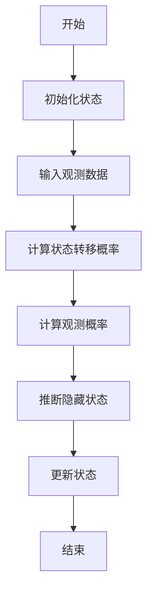
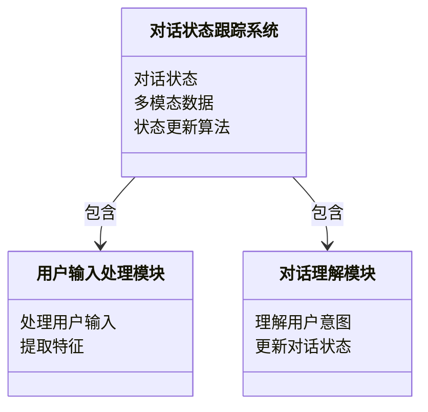
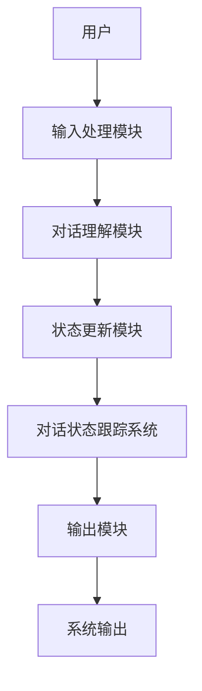

                 

<think>
好的，我需要为用户设计一本名为《AI Agent的多模态对话状态跟踪》的书籍目录大纲。让我先理解用户的需求。

用户希望这本书内容涵盖多模态对话状态跟踪的相关技术和实现，目标读者可能是AI开发者、研究人员和对对话系统感兴趣的技术人员。用户强调内容需要逻辑清晰、结构紧凑、语言专业，同时包含理论和实践结合的部分。

首先，我应该从概述开始，介绍AI Agent和多模态对话的基本概念，然后深入探讨状态跟踪的核心技术和算法原理。接着，可能需要讲解数学模型，帮助读者理解背后的技术。之后，系统分析与架构设计是实际应用的关键部分，需要详细说明。最后，通过项目实战，让读者能够实际操作，巩固所学知识。

接下来，我需要考虑每一章的具体内容。第一章应该概述AI Agent和多模态对话，介绍它们的定义、分类以及对话状态跟踪的重要性。第二章可以深入核心概念，解释多模态数据融合、状态表示建模等关键技术，并通过对比表格和ER图来辅助理解。第三章讲解算法原理，选择HMM、DNN和Transformer等常见算法，用流程图展示工作流程。第四章探讨数学模型，推导状态转移的概率公式，并用LaTeX展示。第五章分析系统架构，设计领域模型、架构图和交互序列图。第六章通过一个电商客服项目实战，详细描述环境配置、代码实现和测试过程。最后一章总结，展望未来发展方向，并给出实践建议。

在编写过程中，我需要确保每一部分都有足够的细节，同时保持整体的连贯性。可能还需要添加一些图表，如流程图、ER图、类图等，以增强可读性。此外，代码示例和实际案例分析将帮助读者更好地理解和应用所学内容。

总结一下，我的步骤是：首先确定结构和内容框架，然后逐步细化每一章的内容，确保涵盖理论和实践，使用图表辅助理解，并通过实际案例巩固知识。这样，用户的需求就能得到充分满足，读者也能从这本书中获得有价值的信息。
</think>

# AI Agent的多模态对话状态跟踪

> **关键词**：AI Agent，多模态对话，状态跟踪，自然语言处理，对话系统，人工智能

> **摘要**：  
> 本文系统地探讨了AI Agent在多模态对话中的状态跟踪技术。从基本概念到算法原理，从系统架构到项目实战，全面解析了多模态对话状态跟踪的核心原理和实现方法。文章结合理论与实践，通过丰富的图表和代码示例，深入浅出地展示了如何在实际场景中实现高效的多模态对话状态跟踪。  

---

# 第一部分: AI Agent与多模态对话状态跟踪概述

## 第1章: AI Agent与多模态对话状态跟踪概述

### 1.1 AI Agent的基本概念
#### 1.1.1 AI Agent的定义与分类
AI Agent（人工智能代理）是指能够感知环境并采取行动以实现目标的智能实体。根据功能和应用场景的不同，AI Agent可以分为以下几类：
- **简单反射型Agent**：基于当前输入做出反应，不依赖历史信息。
- **基于模型的反射型Agent**：利用内部模型和历史信息进行推理和决策。
- **目标驱动型Agent**：根据明确的目标选择行动。
- **实用驱动型Agent**：通过最大化效用函数来选择最优行动。

#### 1.1.2 多模态对话的定义与特点
多模态对话是指在对话过程中，除了文本信息外，还结合了语音、图像、视频等多种模态的信息。其特点包括：
- **信息丰富性**：多模态数据能够提供更全面的语境信息。
- **复杂性**：多模态数据的融合和处理增加了技术难度。
- **实时性**：对话过程需要实时处理多种模态数据。

#### 1.1.3 对话状态跟踪的重要性
对话状态跟踪是确保AI Agent能够理解对话上下文、保持对话连贯性和提供准确回复的关键技术。它通过跟踪对话中的关键信息（如用户意图、对话主题等），帮助AI Agent更好地理解用户需求并做出合理回应。

### 1.2 多模态对话状态跟踪的背景与挑战
#### 1.2.1 当前对话系统的主要问题
- **语境理解不足**：传统对话系统难以处理复杂多变的对话场景。
- **单模态信息限制**：仅依赖文本信息可能导致理解偏差。
- **实时性与准确性之间的矛盾**：多模态数据的处理需要在实时性与准确性之间找到平衡。

#### 1.2.2 多模态数据的特点与挑战
- **异构性**：不同模态的数据格式和特征差异较大。
- **冗余性**：多模态数据中可能存在冗余信息，需要有效去噪。
- **动态性**：对话过程中数据模态和内容可能随时变化。

#### 1.2.3 状态跟踪在多模态对话中的作用
- **提升对话理解能力**：通过多模态信息融合，增强对话理解的准确性和深度。
- **优化对话流程**：基于对话状态的实时更新，优化对话策略。
- **增强用户体验**：通过准确的状态跟踪，为用户提供更个性化的服务。

### 1.3 本章小结
本章从AI Agent的基本概念出发，详细介绍了多模态对话的定义与特点，并阐述了对话状态跟踪的重要性。同时，分析了当前对话系统的主要问题以及多模态数据的特点与挑战，为后续章节的深入探讨奠定了基础。

---

# 第二部分: 多模态对话状态跟踪的核心概念与原理

## 第2章: 多模态对话状态跟踪的核心概念

### 2.1 多模态对话状态跟踪的定义与目标
#### 2.1.1 多模态对话的定义
多模态对话是指在对话过程中，结合多种模态信息（如文本、语音、图像等）进行交流的对话形式。其核心在于通过多模态信息的协同作用，提升对话的自然性和智能性。

#### 2.1.2 状态跟踪的定义
状态跟踪是指在对话过程中，实时更新和维护对话状态（如用户意图、对话主题等）的过程。通过状态跟踪，AI Agent能够理解对话的上下文，并根据当前状态做出合理的回复。

#### 2.1.3 状态跟踪的目标
- **准确理解对话内容**：通过多模态信息的融合，准确捕捉用户的需求和意图。
- **保持对话连贯性**：确保对话过程的逻辑性和一致性。
- **优化对话策略**：根据对话状态动态调整对话策略，提升对话效率。

### 2.2 多模态对话状态跟踪的关键技术
#### 2.2.1 多模态数据的融合方法
多模态数据的融合方法主要包括以下几种：
- **特征级融合**：将不同模态的特征向量进行合并。
- **语义级融合**：基于语义理解对多模态信息进行融合。
- **决策级融合**：根据多模态信息的决策结果进行融合。

#### 2.2.2 状态表示的建模方法
状态表示的建模方法主要包括：
- **基于向量的表示方法**：将对话状态表示为一个高维向量。
- **基于图的表示方法**：将对话状态表示为图结构，节点表示对话元素，边表示关系。
- **基于符号的表示方法**：使用符号逻辑表示对话状态。

#### 2.2.3 状态更新的算法选择
状态更新的算法选择主要取决于对话场景和数据特点，常用算法包括：
- **隐马尔可夫模型（HMM）**：适用于时间序列数据的状态更新。
- **循环神经网络（RNN）**：适用于长序列数据的状态跟踪。
- **变换器（Transformer）**：适用于全局依赖关系的建模。

### 2.3 多模态对话状态跟踪的实现框架
#### 2.3.1 数据输入与预处理
数据输入包括文本、语音、图像等多种模态的数据，预处理步骤包括：
- **数据清洗**：去除噪声数据。
- **特征提取**：提取关键特征。
- **数据对齐**：将不同模态的数据对齐到同一时间轴。

#### 2.3.2 状态表示与建模
状态表示与建模需要根据具体场景选择合适的方法，常用方法包括：
- **向量空间模型**：将对话状态表示为向量空间中的点。
- **图结构模型**：将对话状态表示为图结构，节点表示对话元素，边表示关系。

#### 2.3.3 状态更新与输出
状态更新与输出是对话状态跟踪的核心步骤，主要包括：
- **状态更新**：根据新输入的数据更新当前对话状态。
- **状态输出**：将更新后的对话状态输出到对话系统中。

### 2.4 核心概念对比表格
表2-1: 多模态对话状态跟踪与单模态对话状态跟踪对比

| 对比维度               | 单模态对话状态跟踪           | 多模态对话状态跟踪           |
|------------------------|-----------------------------|-----------------------------|
| 数据输入               | 单一模态数据（如文本）       | 多种模态数据（如文本、语音） |
| 数据处理               | 数据简单，处理难度低         | 数据复杂，处理难度高         |
| 状态更新               | 依赖单一模态信息            | 依赖多模态信息协同           |
| 精度                   | 较低                        | 较高                        |

### 2.5 ER实体关系图
图2-1: 多模态对话状态跟踪的实体关系图

```mermaid
erDiagram
    class 用户 {
        用户ID
        用户意图
        对话历史
    }
    class 对话状态 {
        对话ID
        当前状态
        时间戳
    }
    class 多模态数据 {
        数据ID
        数据类型
        数据内容
    }
    用户 --> 对话状态 : 提供
    对话状态 --> 多模态数据 : 包含
```

### 2.6 本章小结
本章详细阐述了多模态对话状态跟踪的核心概念，包括定义、目标、关键技术及实现框架。通过对比分析和实体关系图，帮助读者更好地理解多模态对话状态跟踪的特点和优势。

---

## 第3章: 多模态对话状态跟踪的算法原理

### 3.1 基于HMM的状态跟踪算法
#### 3.1.1 隐马尔可夫模型的基本原理
隐马尔可夫模型（HMM）是一种统计模型，适用于时间序列数据的建模。它假设状态是马尔可夫链，观测数据与状态相关联。

#### 3.1.2 HMM在对话状态跟踪中的应用
HMM可以用于对话状态跟踪中的状态转移建模，通过观测数据（如用户输入）推断隐藏状态（如用户意图）。

#### 3.1.3 HMM的优缺点分析
- **优点**：简单易懂，适合处理时间序列数据。
- **缺点**：对复杂对话场景的建模能力有限。

### 3.2 基于DNN的状态跟踪算法
#### 3.2.1 深度神经网络的基本原理
深度神经网络（DNN）通过多层非线性变换，能够捕捉复杂的特征关系。

#### 3.2.2 DNN在对话状态跟踪中的应用
DNN可以用于多模态数据的特征提取和语义理解，帮助对话状态的准确跟踪。

#### 3.2.3 DNN的优缺点分析
- **优点**：建模能力强，适合复杂场景。
- **缺点**：训练时间长，需要大量数据。

### 3.3 基于Transformer的对话状态跟踪算法
#### 3.3.1 Transformer模型的基本原理
Transformer模型通过自注意力机制，能够捕捉全局依赖关系。

#### 3.3.2 Transformer在对话状态跟踪中的应用
Transformer可以用于多模态数据的全局建模，提升对话状态跟踪的准确性和实时性。

#### 3.3.3 Transformer的优缺点分析
- **优点**：建模能力强，适合复杂对话场景。
- **缺点**：计算资源消耗较大。

### 3.4 算法流程图
图3-1: 基于HMM的状态跟踪算法流程图



### 3.5 本章小结
本章详细介绍了几种常用的对话状态跟踪算法，包括HMM、DNN和Transformer，并通过流程图展示了它们的工作原理。通过优缺点分析，帮助读者选择合适的算法。

---

## 第4章: 多模态对话状态跟踪的数学模型与公式

### 4.1 状态转移概率模型
#### 4.1.1 状态转移概率的定义
状态转移概率是指从一个状态转移到另一个状态的概率。

#### 4.1.2 状态转移概率的计算公式
$$ P(s_{t+1}|s_t) $$

#### 4.1.3 状态转移概率的矩阵表示
状态转移概率可以用矩阵表示，例如：
$$
P = \begin{pmatrix}
P(s_1|s_1) & P(s_2|s_1) & \cdots & P(s_n|s_1) \\
P(s_1|s_2) & P(s_2|s_2) & \cdots & P(s_n|s_2) \\
\vdots & \vdots & \ddots & \vdots \\
P(s_1|s_n) & P(s_2|s_n) & \cdots & P(s_n|s_n)
\end{pmatrix}
$$

### 4.2 观测概率模型
#### 4.2.1 观测概率的定义
观测概率是指在给定状态的情况下，观测数据出现的概率。

#### 4.2.2 观测概率的计算公式
$$ P(o_t|s_t) $$

#### 4.2.3 观测概率的条件概率公式
$$ P(o_t|s_t) = \prod_{i=1}^n P(o_i|s_t) $$

### 4.3 状态跟踪的后验概率公式
#### 4.3.1 后验概率的定义
后验概率是指在给定观测数据的情况下，隐藏状态出现的概率。

#### 4.3.2 后验概率的计算公式
$$ P(s_t|o_{1:t}) = \frac{P(o_{1:t}|s_t)P(s_t)}{P(o_{1:t})} $$

### 4.4 状态更新的数学推导
#### 4.4.1 状态更新的步骤
1. 计算状态转移概率。
2. 计算观测概率。
3. 计算后验概率。
4. 更新状态。

### 4.5 状态更新的代码实现
```python
def state_update(states, observations, transition_prob, emission_prob):
    # 初始化后验概率
    posterior = [1.0 / len(states)] * len(states)
    
    for obs in observations:
        # 计算证据
        evidence = sum(posterior[i] * emission_prob[i][obs] for i in range(len(states)))
        
        # 更新后验概率
        for i in range(len(states)):
            posterior[i] = posterior[i] * emission_prob[i][obs] / evidence
    
    return posterior
```

### 4.6 本章小结
本章通过数学推导，详细介绍了多模态对话状态跟踪中的概率模型，包括状态转移概率、观测概率和后验概率的计算公式。同时，通过代码示例展示了状态更新的实现步骤。

---

## 第5章: 多模态对话状态跟踪的系统分析与架构设计

### 5.1 系统需求分析
#### 5.1.1 系统功能需求
- **多模态数据输入**：支持文本、语音、图像等多种模态数据的输入。
- **状态跟踪功能**：实时更新对话状态。
- **对话理解功能**：准确理解用户意图。

#### 5.1.2 系统性能需求
- **实时性**：对话过程需要实时处理。
- **准确性**：状态跟踪的准确率需要达到较高水平。

### 5.2 系统架构设计
#### 5.2.1 领域模型设计
图5-1: 领域模型设计类图



#### 5.2.2 系统架构设计
图5-2: 系统架构设计图



### 5.3 系统接口设计
#### 5.3.1 系统输入接口
- **文本输入接口**：接收用户输入的文本。
- **语音输入接口**：接收用户的语音输入。
- **图像输入接口**：接收用户的图像输入。

#### 5.3.2 系统输出接口
- **文本输出接口**：输出对话回复。
- **语音输出接口**：输出语音回复。
- **图像输出接口**：输出图像回复。

### 5.4 本章小结
本章通过系统分析与架构设计，明确了多模态对话状态跟踪系统的功能需求、架构设计和接口设计。为后续的项目实现奠定了基础。

---

## 第6章: 多模态对话状态跟踪的项目实战

### 6.1 项目背景与目标
#### 6.1.1 项目背景
本项目旨在实现一个多模态对话状态跟踪系统，应用于电商客服对话场景。

#### 6.1.2 项目目标
- 实现多模态数据的输入与处理。
- 实现对话状态的实时跟踪。
- 提供准确的对话理解与回复。

### 6.2 项目环境配置
#### 6.2.1 系统环境
- **操作系统**：Linux/Windows/MacOS
- **Python版本**：3.8+
- **依赖库**：numpy、pandas、tensorflow、scikit-learn

#### 6.2.2 安装依赖
```bash
pip install numpy pandas tensorflow scikit-learn
```

### 6.3 系统核心实现
#### 6.3.1 数据预处理模块
```python
def preprocess(data):
    # 提取特征
    features = []
    for item in data:
        # 文本处理
        text_features = get_text_features(item['text'])
        # 语音处理
        audio_features = get_audio_features(item['audio'])
        # 图像处理
        image_features = get_image_features(item['image'])
        features.append({
            'text': text_features,
            'audio': audio_features,
            'image': image_features
        })
    return features
```

#### 6.3.2 对话状态跟踪模块
```python
def track_state(features, model):
    # 更新对话状态
    state = model.update(features)
    return state
```

#### 6.3.3 对话理解与回复模块
```python
def respond(state, features):
    # 根据对话状态生成回复
    response = generate_response(state, features)
    return response
```

### 6.4 项目测试与优化
#### 6.4.1 测试用例设计
- **测试用例1**：文本输入测试
- **测试用例2**：语音输入测试
- **测试用例3**：图像输入测试

#### 6.4.2 性能优化
- **模型优化**：使用更高效的算法和优化策略。
- **数据优化**：增加训练数据，提升模型泛化能力。

### 6.5 项目小结
本章通过一个具体的项目案例，详细展示了多模态对话状态跟踪系统的实现过程，包括环境配置、核心模块实现、测试与优化。通过本项目，读者可以更好地理解理论知识，并掌握实际应用技能。

---

## 第7章: 总结与展望

### 7.1 本章总结
本文系统地探讨了AI Agent在多模态对话中的状态跟踪技术，从基本概念到算法原理，从系统架构到项目实战，全面解析了多模态对话状态跟踪的核心原理和实现方法。通过丰富的图表和代码示例，深入浅出地展示了如何在实际场景中实现高效的多模态对话状态跟踪。

### 7.2 未来展望
随着人工智能技术的不断发展，多模态对话状态跟踪技术将更加智能化和个性化。未来的研究方向包括：
- **多模态数据的高效融合方法**：探索更高效的多模态数据融合方法。
- **更智能的状态表示方法**：研究更智能的状态表示方法，提升对话理解的准确性。
- **更高效的算法实现**：探索更高效的算法实现，提升对话状态跟踪的实时性。

### 7.3 最佳实践Tips
- **数据质量**：确保输入数据的高质量，减少噪声。
- **模型选择**：根据具体场景选择合适的算法。
- **持续优化**：通过持续优化模型和数据，提升对话状态跟踪的准确性和实时性。

### 7.4 本章小结
本章总结了全文的主要内容，并展望了未来的研究方向。同时，给出了实际应用中的最佳实践建议，帮助读者更好地理解和应用多模态对话状态跟踪技术。

---

## 作者：AI天才研究院/AI Genius Institute & 禅与计算机程序设计艺术 /Zen And The Art of Computer Programming

