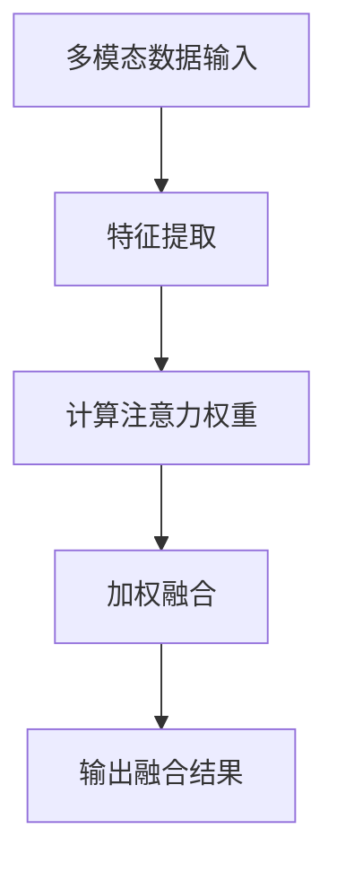
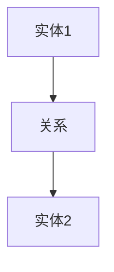
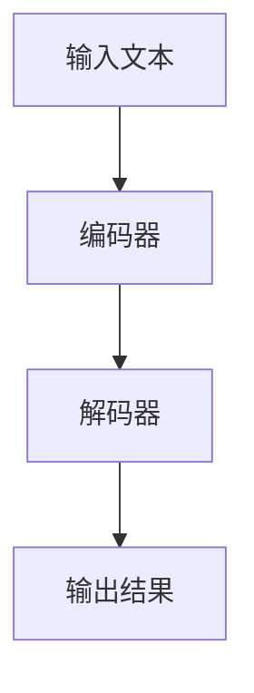
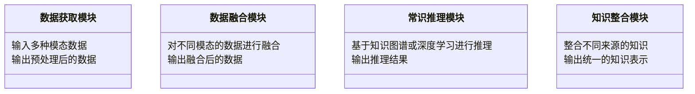
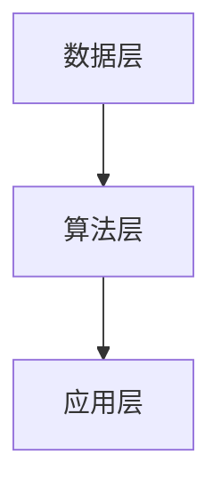
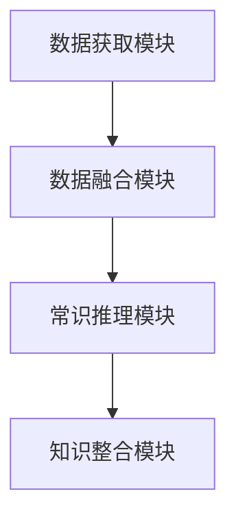
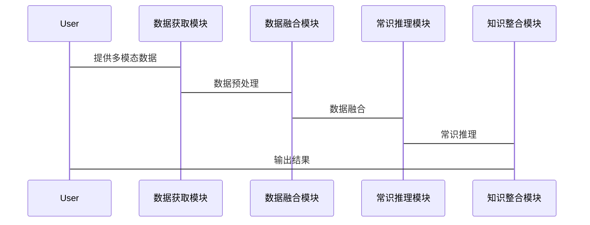

                 


# AI Agent的多模态常识推理与知识整合

## 关键词：
AI Agent, 多模态, 常识推理, 知识整合, 图神经网络,  Transformer, 知识图谱

## 摘要：
本文深入探讨了AI Agent在多模态环境下的常识推理与知识整合的关键技术。文章首先介绍了AI Agent的基本概念和背景，然后详细分析了多模态数据处理与融合的方法，接着讲解了常识推理的原理与实现，包括基于知识图谱和深度学习的方法。最后，文章从系统架构设计到项目实战，详细阐述了AI Agent在多模态常识推理与知识整合中的应用，并给出了最佳实践和未来研究方向。

---

## 第1章: AI Agent的基本概念与背景

### 1.1 AI Agent的定义与特点
AI Agent（人工智能代理）是指在计算机系统中，能够感知环境并采取行动以实现目标的实体。AI Agent的核心特点包括：
1. **自主性**：能够在没有外部干预的情况下自主决策。
2. **反应性**：能够实时感知环境并做出反应。
3. **目标导向性**：所有的行为都是为了实现特定的目标。
4. **社会能力**：能够与其他AI Agent或人类进行交互和协作。

AI Agent在多模态环境下的应用，要求其能够处理和理解多种类型的数据，包括文本、图像、语音、视频等。

### 1.2 多模态数据处理的重要性
多模态数据处理是AI Agent实现复杂任务的基础。通过整合不同模态的数据，AI Agent可以更全面地理解环境，做出更准确的决策。例如，在智能客服系统中，AI Agent需要同时处理用户的文本输入和语音情感，以提供更个性化的服务。

### 1.3 常识推理的背景与意义
常识推理是指AI Agent能够理解并运用人类的基本常识和逻辑进行推理。它是实现类人智能的关键技术之一。例如，当AI Agent收到“今天下雨了，我需要带伞”这样的指令时，它需要理解“下雨”与“带伞”之间的因果关系。

---

## 第2章: 多模态数据处理与融合

### 2.1 多模态数据的获取与预处理
多模态数据的获取是AI Agent处理信息的第一步。常见的数据获取方法包括：
1. **传感器数据**：如摄像头、麦克风等设备获取的图像和语音数据。
2. **数据库查询**：从结构化数据库中获取文本数据。
3. **网络爬取**：从互联网上爬取文本、图像等数据。

预处理步骤通常包括数据清洗、格式转换和特征提取。例如，对于图像数据，预处理可能包括调整分辨率、去除噪声等。

### 2.2 多模态数据融合算法
多模态数据融合的目标是将不同模态的数据结合起来，以提高AI Agent的决策能力。常见的融合方法包括：
1. **基于特征融合的方法**：将不同模态的特征向量进行线性组合或非线性变换。
2. **基于注意力机制的融合方法**：通过注意力机制确定每个模态的重要性，并进行加权融合。
3. **基于图神经网络的融合方法**：将不同模态的数据建模为图结构，通过图神经网络进行融合。

下图展示了基于注意力机制的多模态融合流程：



---

## 第3章: 常识推理的原理与方法

### 3.1 常识推理的基本原理
常识推理的核心是通过已有的知识库或经验，推断出新的结论。常见的推理方法包括：
1. **基于知识图谱的推理**：通过知识图谱中的关系进行推断。
2. **基于逻辑推理的推理**：通过逻辑规则进行推断。
3. **基于深度学习的推理**：通过神经网络模型进行非监督或弱监督学习。

### 3.2 基于知识图谱的常识推理
知识图谱是一种结构化的知识表示方法，由节点和边组成，节点表示实体，边表示实体之间的关系。例如，知识图谱可以表示“人”与“职业”之间的关系。

下图展示了知识图谱的构建过程：



通过知识图谱，AI Agent可以进行路径查询、最短路径计算等操作，从而实现常识推理。

### 3.3 基于深度学习的常识推理
基于深度学习的常识推理通常使用Transformer或图神经网络模型。例如，Transformer模型通过自注意力机制捕捉文本中的长距离依赖关系，从而实现常识推理。

下图展示了基于Transformer的常识推理流程：



---

## 第4章: 知识整合与统一表示

### 4.1 知识整合的挑战
知识整合的主要挑战包括：
1. **异构性**：不同知识来源的表示形式不同。
2. **冗余性**：同一知识可能以多种形式表示。
3. **动态性**：知识需要不断更新和扩展。

### 4.2 知识的统一表示
知识的统一表示是实现知识整合的关键。常见的表示方法包括：
1. **符号表示**：使用符号逻辑表示知识。
2. **向量表示**：使用向量空间模型表示知识。
3. **图表示**：使用图结构表示知识。

下图展示了知识图谱的统一表示：


---

## 第5章: 系统分析与架构设计

### 5.1 问题场景介绍
AI Agent在多模态常识推理与知识整合中的应用场景包括智能助手、智能客服、智能监控等。

### 5.2 系统功能设计
系统功能设计包括数据获取、数据融合、常识推理和知识整合四个模块。

下图展示了系统的领域模型：



### 5.3 系统架构设计
系统架构设计采用分层架构，包括数据层、算法层和应用层。

下图展示了系统的架构图：



### 5.4 系统接口设计
系统接口设计包括数据接口、推理接口和知识库接口。

下图展示了系统的接口设计：



### 5.5 系统交互设计
系统交互设计包括用户输入、系统处理和结果输出三个阶段。

下图展示了系统的交互流程：



---

## 第6章: 项目实战

### 6.1 环境安装
项目实战需要以下环境：
- Python 3.8+
- PyTorch 1.9+
- Transformers库
- Mermaid工具

### 6.2 核心代码实现
以下是常识推理模块的代码示例：

```python
from transformers import AutoTokenizer, AutoModelForMaskedLM
import torch

tokenizer = AutoTokenizer.from_pretrained('bert-base-uncased')
model = AutoModelForMaskedLM.from_pretrained('bert-base-uncased')

def common_sense_reasoning(question):
    inputs = tokenizer(question, return_tensors='pt')
    outputs = model(**inputs)
    predicted_token_idx = torch.argmax(outputs.logits, dim=-1)
    predicted_token = tokenizer.decode(predicted_token_idx.item())
    return predicted_token

print(common_sense_reasoning("What is the capital of France?"))
```

### 6.3 案例分析
以“What is the capital of France?”为例，AI Agent需要通过常识推理模块找到正确的答案“Paris”。

### 6.4 项目总结
通过本项目，读者可以理解AI Agent在多模态常识推理与知识整合中的实现过程。

---

## 第7章: 最佳实践与未来方向

### 7.1 最佳实践
- 在数据预处理阶段，尽量减少数据的冗余和噪声。
- 在数据融合阶段，选择合适的融合方法，如注意力机制。
- 在常识推理阶段，结合知识图谱和深度学习模型，提高推理的准确率。

### 7.2 小结
本文详细介绍了AI Agent的多模态常识推理与知识整合的关键技术，包括多模态数据处理、常识推理方法和知识整合策略。

### 7.3 注意事项
- 数据隐私和安全问题需要特别注意。
- 系统的可扩展性和可维护性需要在设计阶段考虑。

### 7.4 拓展阅读
- 建议读者进一步阅读关于图神经网络和知识图谱的相关论文。

---

## 作者：AI天才研究院 & 禅与计算机程序设计艺术

---

通过本文的详细讲解，读者可以系统地理解AI Agent的多模态常识推理与知识整合的技术要点，并能够在实际项目中应用这些方法。

