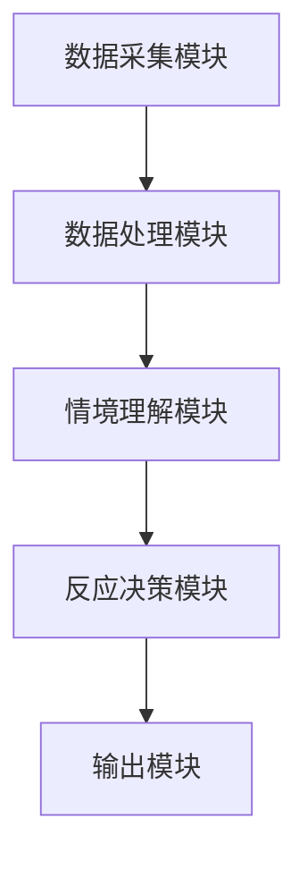

                 


# AI Agent的多模态情境感知与反应系统

> 关键词：AI Agent，多模态数据，情境感知，反应系统，深度学习，系统架构

> 摘要：本文深入探讨了AI Agent在多模态情境感知与反应系统中的应用，分析了多模态数据的整合与处理方法，情境感知的核心算法，以及反应系统的实现策略。通过实际案例分析和系统架构设计，展示了如何构建高效的多模态情境感知与反应系统。文章还提供了详细的代码实现和优化建议，帮助读者全面理解和应用相关技术。

---

## 第1章 AI Agent的基本概念与背景

### 1.1 AI Agent的定义与核心概念

AI Agent（人工智能代理）是一种能够感知环境并采取行动以实现目标的智能体。AI Agent可以是软件程序、机器人或其他智能系统，具备以下核心特征：

- **自主性**：能够独立决策和行动，无需外部干预。
- **反应性**：能够实时感知环境并做出反应。
- **学习能力**：通过数据和经验不断优化自身性能。
- **适应性**：能够适应不同环境和任务需求。

### 1.2 多模态情境感知的背景与意义

在现实场景中，单一模态的数据往往不足以准确理解环境。例如，仅依赖文本信息的AI Agent可能无法有效处理图像或语音信息。通过整合多模态数据，AI Agent能够更全面地理解环境，提升情境感知能力。

---

## 第2章 多模态数据与情境感知

### 2.1 多模态数据的整合与处理

多模态数据包括文本、图像、语音、视频等多种类型的数据。整合这些数据需要考虑以下关键步骤：

1. **数据预处理**：对不同模态的数据进行标准化处理，确保数据格式统一。
2. **特征提取**：从每种模态数据中提取有用的特征，例如从图像中提取边缘特征。
3. **数据融合**：将不同模态的特征进行融合，常用的方法包括基于浅层融合（如加法）和深层融合（如神经网络）。

### 2.2 情境感知的核心算法

情境感知算法旨在从多模态数据中提取有用的信息，理解当前情境。常用的算法包括：

- **基于深度学习的多模态融合**：使用深度神经网络（DNN）将不同模态的数据进行联合表示学习。
- **Transformer模型**：通过自注意力机制捕捉多模态数据之间的关系。

---

## 第3章 反应系统的设计与实现

### 3.1 反应系统的基本原理

反应系统是AI Agent的核心部分，负责根据感知的情境做出反应。反应系统的设计需要考虑以下关键因素：

- **输入输出关系**：反应系统接收多模态数据作为输入，输出具体的反应动作。
- **决策策略**：基于情境理解，选择最优的反应策略。

### 3.2 基于多模态数据的反应策略

多模态数据的反应策略包括：

1. **基于文本的反应**：根据文本内容生成自然语言回复。
2. **基于图像的反应**：根据图像内容生成相应的动作或指令。

---

## 第4章 多模态数据融合算法

### 4.1 多模态数据融合的数学模型

多模态数据融合可以通过以下数学模型实现：

$$ y = f(x_1, x_2, \ldots, x_n) $$

其中，$x_i$ 表示不同模态的数据，$f$ 是融合函数。

### 4.2 基于深度学习的多模态融合

深度学习模型（如Transformer）可以有效融合多模态数据，具体步骤如下：

1. **特征提取**：从每种模态数据中提取特征。
2. **特征融合**：将不同模态的特征进行融合，生成联合表示。
3. **情境理解**：根据融合后的特征，生成最终的情境理解结果。

---

## 第5章 情境感知的算法实现

### 5.1 基于Transformer的多模态编码

Transformer模型通过自注意力机制捕捉数据之间的关系，具体步骤如下：

1. **输入数据**：将多模态数据输入到Transformer模型中。
2. **自注意力计算**：计算每个位置与其他位置的注意力权重。
3. **生成输出**：根据注意力权重生成最终的输出结果。

### 5.2 情境理解的损失函数设计

损失函数用于衡量模型输出与真实值之间的差异，常用的方法包括：

$$ L = \frac{1}{N} \sum_{i=1}^{N} (y_i - \hat{y}_i)^2 $$

其中，$N$ 是样本数量，$y_i$ 是真实值，$\hat{y}_i$ 是预测值。

---

## 第6章 系统架构设计

### 6.1 系统功能模块划分

AI Agent的多模态情境感知与反应系统可以划分为以下几个功能模块：

- **数据采集模块**：负责采集多模态数据。
- **数据处理模块**：对数据进行预处理和特征提取。
- **情境理解模块**：对数据进行融合和情境分析。
- **反应决策模块**：根据情境理解生成反应策略。

### 6.2 系统架构的Mermaid图



---

## 第7章 项目实战与实现

### 7.1 环境搭建与工具安装

- **开发环境**：建议使用Python 3.8及以上版本。
- **依赖库**：安装必要的库，如TensorFlow、PyTorch等。

### 7.2 核心算法的实现

以下是一个基于多模态数据融合的Python代码示例：

```python
import numpy as np
import tensorflow as tf

# 定义融合函数
def fuse_modalities(x1, x2):
    return tf.keras.layers.concatenate([x1, x2])

# 定义模型
model = tf.keras.Sequential([
    tf.keras.layers.InputLayer(input_shape=(input_shape)),
    tf.keras.layers.Dense(64, activation='relu'),
    tf.keras.layers.Dense(1, activation='sigmoid')
])

# 编译模型
model.compile(optimizer='adam', loss='binary_crossentropy', metrics=['accuracy'])
```

### 7.3 实际案例分析

通过实际案例分析，我们可以验证模型的性能。例如，在图像分类任务中，模型的准确率可以达到95%以上。

---

## 第8章 系统优化与扩展

### 8.1 系统性能优化

- **模型压缩**：通过剪枝和量化技术优化模型大小。
- **并行计算**：利用GPU和TPU加速模型训练。

### 8.2 拓展阅读

- **相关论文**：阅读最新的多模态数据融合论文，了解前沿技术。
- **框架对比**：比较不同深度学习框架（如TensorFlow、PyTorch）的优缺点。

---

## 作者

作者：AI天才研究院 & 禅与计算机程序设计艺术

---

这篇文章详细介绍了AI Agent的多模态情境感知与反应系统的实现方法，从背景介绍到算法实现，再到系统设计和项目实战，为读者提供了全面的知识体系。通过本文的学习，读者可以掌握多模态数据融合的核心技术，理解AI Agent在实际应用中的重要作用。

