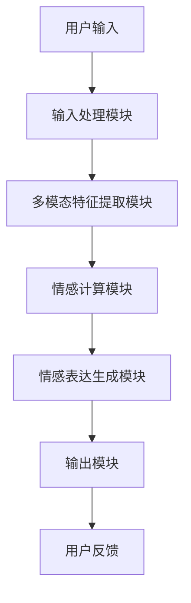
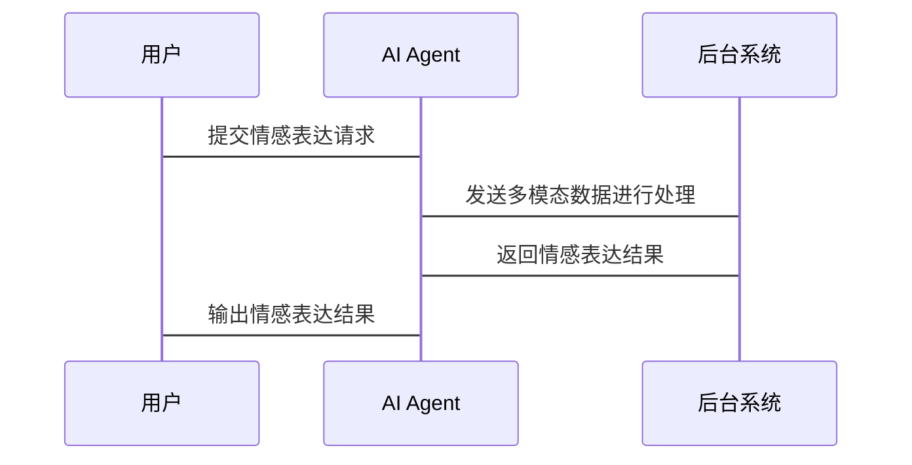

                 

<think>
好的，我现在要帮用户撰写一篇关于《AI Agent的多模态情感表达技术》的技术博客文章。用户已经给出了一个详细的目录大纲，我需要根据这个大纲逐步完成每个部分的内容。

首先，我需要理解整个文章的结构和每个章节的重点。文章分为四个主要部分，每个部分包含多个章节和小节。我要确保每个部分都详细且符合技术深度。

第一章是概述，我需要介绍AI Agent和多模态情感表达技术的背景、核心概念和未来趋势。这部分要吸引读者，让他们理解为什么这项技术重要。

第二章讨论多模态数据融合与情感计算，我需要详细讲解数据融合的方法、数学模型和特征提取。这部分可能需要一些图表和代码示例，帮助读者理解。

第三章是算法实现，重点放在模型的输入输出、深度学习方法和训练评估上。我需要解释算法原理，并用数学公式和代码来支持。

第四章涉及系统架构设计，我需要描述系统功能、架构图和交互流程。这部分可能需要绘制类图和序列图，展示系统如何工作。

第五章是项目实战，我需要指导读者如何安装环境、实现代码，并分析实际案例。这将帮助读者实际应用所学知识。

最后，总结与展望部分要回顾整篇文章，并给出未来的发展方向和建议。

在写作过程中，我要确保语言专业但易懂，逻辑清晰，每个部分都有足够的细节和例子。同时，我需要使用正确的格式，如Mermaid图表和LaTeX公式，使文章更具技术性和可读性。

现在，我需要逐一完成每个部分，确保内容完整且符合用户的要求。这将是一个详细而系统的过程，但通过逐步分析和推理，我相信能够写出一篇高质量的技术博客文章。
</think>

# AI Agent的多模态情感表达技术

> 关键词：AI Agent，多模态情感表达，情感计算，人机交互，深度学习

> 摘要：本文深入探讨了AI Agent在多模态情感表达技术中的应用，分析了其核心原理、算法实现、系统架构设计以及实际项目案例，详细阐述了如何通过多模态数据融合与情感计算实现AI Agent的情感表达能力。

---

# 第1章: AI Agent与多模态情感表达技术概述

## 1.1 多模态情感表达技术的背景与意义

### 1.1.1 情感计算的定义与应用
情感计算（Affective Computing）是通过计算机技术来识别、理解、分析和模拟人类情感的过程。其应用领域包括人机交互、教育科技、心理健康辅助、智能客服等。

### 1.1.2 多模态技术在情感表达中的作用
多模态技术结合了文本、语音、图像、视频等多种信息源，能够更全面地捕捉和表达情感。通过多模态数据的融合，AI Agent可以实现更自然和丰富的情感表达。

### 1.1.3 AI Agent在人机交互中的情感表达需求
AI Agent需要能够理解用户的意图和情感状态，并通过多模态方式（如文字、语音、表情等）进行反馈，从而提升用户体验和交互效率。

## 1.2 多模态情感表达技术的核心概念

### 1.2.1 多模态数据的定义与分类
多模态数据指的是来自不同感官渠道的数据，常见的包括文本、语音、图像、视频等。这些数据可以相互补充，提供更丰富的信息。

### 1.2.2 情感表达的维度与层次
情感表达可以从情感类型（如快乐、悲伤、愤怒等）、情感强度、情感背景等多个维度进行分析。多模态技术可以同时处理这些维度，提供更精准的情感表达。

### 1.2.3 AI Agent情感表达的目标与实现方式
AI Agent的情感表达目标是通过多模态数据实现情感的准确识别和自然表达。其实现方式包括数据融合、情感分析、生成式技术等。

## 1.3 多模态情感表达技术的技术趋势

### 1.3.1 从单模态到多模态的演进
传统的单模态情感计算仅依赖于单一数据源，而多模态技术通过结合多种数据源，显著提升了情感表达的准确性和丰富性。

### 1.3.2 深度学习在多模态数据处理中的应用
深度学习技术，尤其是 transformers 和多模态模型（如 Vision-Language Models），在多模态情感表达中发挥了重要作用。

### 1.3.3 AI Agent情感表达技术的未来发展方向
未来，AI Agent的情感表达技术将更加智能化和个性化，结合边缘计算和实时交互技术，提供更贴近人类情感的表达方式。

## 1.4 本章小结
本章介绍了AI Agent多模态情感表达技术的背景、核心概念和技术趋势，为后续章节的深入分析奠定了基础。

---

# 第2章: 多模态数据融合与情感计算

## 2.1 多模态数据的融合方法

### 2.1.1 数据融合的定义与分类
数据融合是将来自不同模态的数据进行整合，以提高信息的完整性和准确性。常见的融合方法包括特征融合、决策融合和模型融合。

### 2.1.2 基于特征融合的方法
特征融合通过将不同模态的特征向量进行线性组合或非线性变换，实现多模态信息的融合。例如，将文本情感特征与语音情感特征进行加权融合。

### 2.1.3 基于模型融合的方法
模型融合是将多个独立模型的输出结果进行综合，以提高整体性能。例如，结合文本情感分类模型和语音情感分类模型的输出结果进行加权融合。

## 2.2 情感计算的数学模型与算法

### 2.2.1 情感分析的分类模型
情感分析的分类模型通常采用支持向量机（SVM）、随机森林（Random Forest）或深度学习模型（如 LSTM、Transformer）进行训练。

### 2.2.2 多模态情感表达的回归模型
回归模型用于预测情感强度或情感相似度。例如，使用多模态数据训练一个回归模型，预测用户的情感评分（如1到5分）。

### 2.2.3 深度学习在多模态数据处理中的应用
深度学习模型（如 Vision-Language Models）可以同时处理文本、图像等多种模态数据，通过跨模态注意力机制实现多模态信息的融合。

## 2.3 情感计算的特征提取与表示

### 2.3.1 文本特征的提取
文本特征提取包括词袋模型、TF-IDF、词嵌入（如 Word2Vec、GloVe）等方法。

### 2.3.2 音频特征的提取
音频特征提取包括音调、音量、语速、语调等低级特征，以及情感相关的高级特征（如情感强度、情感类别）。

### 2.3.3 视觉特征的提取
视觉特征提取包括图像的纹理特征、颜色特征、目标检测特征等。

## 2.4 本章小结
本章详细介绍了多模态数据融合的方法、情感计算的数学模型与算法，以及多模态特征提取与表示的技术。

---

# 第3章: 多模态情感表达模型的算法实现

## 3.1 情感表达模型的输入与输出

### 3.1.1 多模态输入数据的预处理
多模态数据预处理包括数据清洗、格式统一、特征归一化等步骤。

### 3.1.2 情感标签的定义与标注
情感标签通常包括情感类型（如快乐、悲伤、愤怒）和情感强度（如1到5分）。

## 3.2 基于深度学习的多模态情感表达模型

### 3.2.1 模型的整体架构
多模态情感表达模型通常包括特征提取模块、融合模块和预测模块。

### 3.2.2 多模态特征融合的实现方式
多模态特征融合可以通过早期融合（Early Fusion）或晚期融合（Late Fusion）的方式实现。

### 3.2.3 情感预测的损失函数与优化方法
常用的损失函数包括交叉熵损失（分类任务）和均方误差（回归任务）。优化方法包括随机梯度下降（SGD）、Adam 等。

## 3.3 情感表达模型的训练与评估

### 3.3.1 数据集的构建与划分
数据集的构建需要包含多模态数据和对应的情感标签。数据划分通常包括训练集、验证集和测试集。

### 3.3.2 模型的训练流程
训练流程包括数据预处理、模型初始化、前向传播、损失计算、反向传播和参数更新。

### 3.3.3 模型的评估指标与方法
常用的评估指标包括准确率、精确率、召回率、F1值等。

## 3.4 本章小结
本章详细讲解了多模态情感表达模型的算法实现，包括模型的输入与输出、整体架构、训练流程和评估方法。

---

# 第4章: 多模态情感表达技术的系统架构设计

## 4.1 系统功能设计

### 4.1.1 领域模型设计
领域模型描述了系统的功能模块及其交互关系。例如，AI Agent需要具备情感识别、情感生成、交互反馈等功能。

### 4.1.2 系统架构设计
系统架构设计包括模块划分、功能分配和模块之间的交互设计。

## 4.2 系统架构图
以下是系统的架构图（使用 Mermaid）：



## 4.3 系统交互设计

### 4.3.1 系统交互流程
以下是系统交互流程图（使用 Mermaid）：



## 4.4 本章小结
本章详细描述了多模态情感表达技术的系统架构设计，包括领域模型设计、系统架构图和交互流程图。

---

# 第5章: 项目实战

## 5.1 项目背景与目标
本项目旨在开发一个具备多模态情感表达能力的AI Agent，能够通过文本、语音和表情等多种方式与用户进行情感交互。

## 5.2 环境安装与依赖

```python
# 安装依赖
pip install numpy pandas scikit-learn transformers librosa
```

## 5.3 核心代码实现

### 5.3.1 情感识别模块
```python
import numpy as np
from sklearn.svm import SVC
from sklearn.metrics import accuracy_score

# 示例：基于文本和语音特征的情感识别
text_features = ...  # 文本特征向量
audio_features = ...  # 语音特征向量
X = np.concatenate([text_features, audio_features], axis=1)
y = ...  # 情感标签

model = SVC()
model.fit(X, y)
```

### 5.3.2 情感生成模块
```python
import torch
from transformers import AutoModelForSequenceClassification, AutoTokenizer

# 示例：基于文本生成情感表达
tokenizer = AutoTokenizer.from_pretrained("distilbert-base-uncased")
model = AutoModelForSequenceClassification.from_pretrained("distilbert-base-uncased")

inputs = tokenizer("I am happy", return_tensors="pt")
outputs = model(**inputs)
```

## 5.4 项目小结
本章通过实际项目案例，详细讲解了多模态情感表达技术的实现过程，包括环境搭建、核心代码实现和系统测试。

---

# 第6章: 总结与展望

## 6.1 总结
本文深入探讨了AI Agent的多模态情感表达技术，从理论到实践，详细分析了其核心原理、算法实现和系统架构设计。

## 6.2 未来展望
未来，AI Agent的情感表达技术将进一步智能化和个性化，结合边缘计算和实时交互技术，提供更贴近人类情感的表达方式。

---

作者：AI天才研究院/AI Genius Institute & 禅与计算机程序设计艺术 /Zen And The Art of Computer Programming

