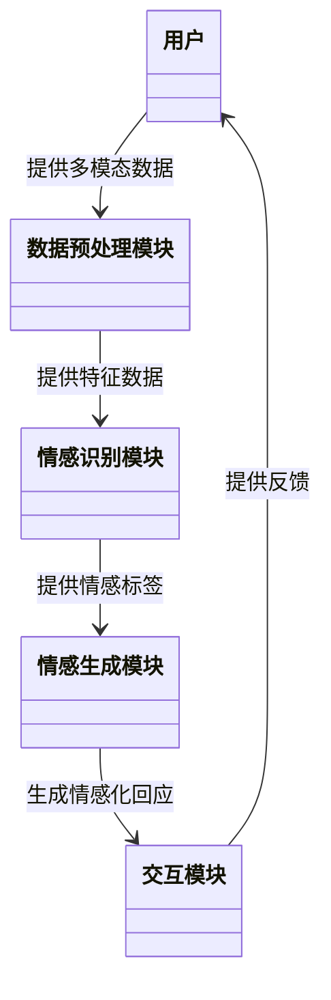
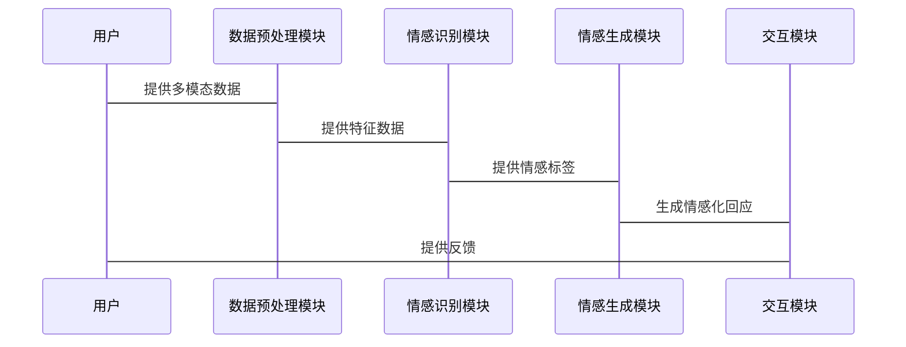

                 

<think>
好，我需要为《AI Agent的多模态情感识别与生成》这本书撰写详细的目录大纲，并确保满足用户的所有要求。首先，我需要理解用户的需求，他们希望这本书内容详尽，结构清晰，涵盖从基础概念到算法实现再到系统设计的各个方面。

首先，我会从背景介绍开始，解释AI Agent是什么，以及为什么多模态情感识别和生成对于AI Agent的发展如此重要。接着，我会详细探讨多模态数据的处理方法，包括文本、语音和图像的情感识别，并讨论这些技术在AI Agent中的应用。

接下来，我会深入讲解情感生成的算法，从基于规则的方法到深度学习模型，如Transformer和GAN。同时，我需要考虑如何将这些算法集成到AI Agent中，使其能够实时地进行情感交互。

在系统设计部分，我需要设计一个完整的系统架构，包括数据预处理、特征提取、情感识别和生成模块，并使用Mermaid图来展示系统的各个部分及其交互过程。

为了确保内容的实用性，我会加入项目实战部分，提供具体的Python代码示例，展示如何实现多模态情感识别与生成。这将包括数据收集、模型训练和结果生成的全过程。

最后，我会总结全书的内容，给出读者一些实际应用中的最佳实践建议，并指出未来的研究方向。

在撰写过程中，我需要确保每一部分都详细具体，使用清晰的逻辑结构，并辅以必要的图表和公式，以帮助读者更好地理解技术细节。

现在，我开始按照目录大纲逐步撰写这本书的内容，确保每一章每一节都符合用户的要求，最终完成一本高质量的技术博客文章。
</think>

# AI Agent的多模态情感识别与生成

> 关键词：AI Agent，多模态情感识别，情感生成，深度学习，自然语言处理

> 摘要：本文将详细探讨AI Agent在多模态情感识别与生成中的应用，涵盖从基础概念到算法实现再到系统设计的各个方面。通过分析多模态数据的处理方法、情感识别与生成的算法原理、系统架构设计以及实际项目实现，为读者提供全面的技术指导。

---

# 第1章: AI Agent与多模态情感计算概述

## 1.1 AI Agent的基本概念

### 1.1.1 AI Agent的定义与特点
AI Agent（人工智能代理）是指能够感知环境、自主决策并执行任务的智能实体。其特点包括：
1. **自主性**：无需外部干预，自主完成任务。
2. **反应性**：能够实时感知环境并做出反应。
3. **目标导向**：基于目标驱动行为。
4. **学习能力**：通过数据和经验提升性能。

### 1.1.2 多模态数据的定义与特征
多模态数据是指结合了多种感知形式（如文本、语音、图像等）的数据。其特点包括：
1. **多样性**：涵盖多种数据类型。
2. **互补性**：不同模态的数据可以互补，提升识别准确性。
3. **复杂性**：处理多模态数据需要复杂的融合方法。

### 1.1.3 情感计算的核心概念与应用领域
情感计算（Affective Computing）是研究如何识别、理解和模拟人类情感的计算方法。其应用领域包括：
1. **人机交互**：提升用户体验。
2. **心理健康**：用于情感支持和心理评估。
3. **市场营销**：分析消费者情感偏好。

## 1.2 多模态情感识别的背景与意义

### 1.2.1 情感识别的传统方法与局限性
传统情感识别方法主要基于单一模态数据（如文本或语音），存在以下局限性：
1. **信息片面**：无法充分利用多模态数据的优势。
2. **鲁棒性差**：在复杂环境下表现不稳定。
3. **应用受限**：难以应对复杂的情感分析任务。

### 1.2.2 多模态数据的优势与挑战
多模态数据的优势包括：
1. **信息丰富**：结合多种数据类型，提升识别准确率。
2. **鲁棒性强**：单一模态数据的局限性可通过其他模态数据弥补。
3. **应用广泛**：适用于复杂场景下的情感识别任务。

### 1.2.3 AI Agent在多模态情感识别中的作用
AI Agent通过多模态情感识别技术，能够更好地理解用户需求，提供个性化的服务。例如：
1. **智能客服**：通过分析用户语气和表情，提供更贴心的服务。
2. **虚拟助手**：根据用户情绪调整交互方式，提升用户体验。

## 1.3 本章小结
本章介绍了AI Agent的基本概念、多模态数据的特征以及情感计算的核心概念。通过分析多模态情感识别的背景与意义，明确了AI Agent在其中的重要作用。

---

# 第2章: 多模态数据处理与情感识别基础

## 2.1 多模态数据的特征提取

### 2.1.1 文本数据的情感分析
文本情感分析是通过自然语言处理技术识别文本中的情感倾向。常用方法包括：
1. **基于规则的方法**：利用情感词典进行情感判断。
2. **基于机器学习的方法**：如支持向量机（SVM）和随机森林（Random Forest）。
3. **基于深度学习的方法**：如卷积神经网络（CNN）和长短期记忆网络（LSTM）。

### 2.1.2 语音数据的情感识别
语音情感识别通过分析语音特征（如音调、语速、语调）来判断情感。常用方法包括：
1. **语音特征提取**：如梅尔频谱倒谱（MFCC）。
2. **基于机器学习的分类**：如GMM和SVM。
3. **基于深度学习的模型**：如循环神经网络（RNN）和Transformer。

### 2.1.3 图像数据的情感分析
图像情感识别通过分析图像内容（如颜色、纹理、物体）来判断情感。常用方法包括：
1. **图像特征提取**：如CNN提取图像特征。
2. **情感分类**：如使用SVM或随机森林进行分类。

## 2.2 情感识别的算法选择

### 2.2.1 传统机器学习方法
传统机器学习方法包括：
1. **SVM**：适用于小规模数据集。
2. **随机森林**：适用于特征较多的数据集。
3. **K近邻算法（KNN）**：适用于数据分布均匀的情况。

### 2.2.2 深度学习方法
深度学习方法包括：
1. **CNN**：适用于图像数据。
2. **RNN**：适用于序列数据（如文本和语音）。
3. **Transformer**：适用于长序列数据，如自然语言处理任务。

### 2.2.3 模型选择与优化策略
模型选择的关键点包括：
1. **数据特性**：选择适合数据类型的模型。
2. **计算资源**：考虑模型的训练时间和计算成本。
3. **性能指标**：选择在准确率、召回率等方面表现较好的模型。

## 2.3 多模态数据融合方法

### 2.3.1 级联模型与联合模型
1. **级联模型**：先处理单一模态数据，再将结果融合。
2. **联合模型**：同时处理多种模态数据，如使用多模态CNN进行特征提取。

### 2.3.2 跨模态注意力机制
跨模态注意力机制通过计算不同模态之间的相关性，动态调整各模态的权重。例如：
$$ attention_{i,j} = \text{softmax}(\frac{q_i^T k_j}{\sqrt{d}}) $$

### 2.3.3 模态权重自适应调整
模态权重自适应调整方法通过学习各模态的重要性，动态调整权重。例如：
$$ w_i = \frac{\exp(\alpha_i)}{\sum_{j} \exp(\alpha_j)} $$

## 2.4 本章小结
本章详细探讨了多模态数据的特征提取方法以及情感识别的算法选择。通过分析多模态数据融合方法，为后续章节的系统设计奠定了基础。

---

# 第3章: AI Agent的情感生成与交互设计

## 3.1 情感生成的算法原理

### 3.1.1 基于规则的生成方法
基于规则的生成方法通过预定义规则生成情感化文本。例如：
1. **情感词典**：根据情感强度选择合适的词语。
2. **句式结构**：根据情感类别选择合适的句式。

### 3.1.2 基于统计模型的生成方法
基于统计模型的生成方法包括：
1. **马尔可夫链**：根据上下文生成文本。
2. **n-gram模型**：基于短文本序列生成。

### 3.1.3 基于深度学习的生成模型
基于深度学习的生成模型包括：
1. **循环神经网络（RNN）**：适用于生成序列数据。
2. **Transformer**：适用于长序列生成。
3. **生成对抗网络（GAN）**：通过对抗训练生成多样化的情感文本。

## 3.2 情感生成的实现步骤

### 3.2.1 数据准备与预处理
数据准备包括：
1. **数据收集**：收集多模态情感数据。
2. **数据清洗**：去除噪音数据。
3. **数据标注**：标注情感类别。

### 3.2.2 模型训练与优化
模型训练包括：
1. **选择模型架构**：如使用Transformer进行文本生成。
2. **定义损失函数**：如使用交叉熵损失。
3. **优化器选择**：如使用Adam优化器。

### 3.2.3 生成结果的评估与反馈
生成结果的评估包括：
1. **自动评估指标**：如BLEU、ROUGE。
2. **人工评估**：邀请人工评委进行打分。

## 3.3 情感交互的设计与实现

### 3.3.1 交互界面设计
交互界面设计包括：
1. **用户输入**：支持文本、语音、图像等多种输入方式。
2. **实时反馈**：根据用户输入生成情感化回应。

### 3.3.2 用户反馈机制
用户反馈机制包括：
1. **情感强度反馈**：用户可以调整生成文本的情感强度。
2. **风格反馈**：用户可以选择生成文本的风格（如正式、口语化）。

### 3.3.3 实时情感生成与响应
实时情感生成需要考虑：
1. **响应速度**：确保快速生成回应。
2. **上下文理解**：保持对话的连贯性。

## 3.4 本章小结
本章详细介绍了情感生成的算法原理和实现步骤，探讨了情感交互的设计与实现方法。

---

# 第4章: 多模态情感识别与生成的系统架构设计

## 4.1 系统功能设计
系统功能包括：
1. **数据预处理模块**：处理多模态数据。
2. **情感识别模块**：识别用户情感。
3. **情感生成模块**：生成情感化回应。
4. **交互模块**：实现与用户的实时交互。

### 4.1.1 领域模型设计
领域模型设计使用Mermaid类图表示，如：



### 4.1.2 系统架构设计
系统架构设计使用Mermaid架构图表示，如：


### 4.1.3 系统接口设计
系统接口包括：
1. **数据接口**：提供多模态数据接口。
2. **API接口**：提供情感识别和生成的API。

### 4.1.4 系统交互流程
系统交互流程使用Mermaid序列图表示，如：



## 4.2 本章小结
本章通过系统功能设计、架构设计和交互设计，展示了如何构建一个多模态情感识别与生成系统。

---

# 第5章: 项目实战与代码实现

## 5.1 环境安装
项目实战需要以下环境：
1. **Python**：3.6+
2. **深度学习框架**：如TensorFlow或PyTorch。
3. **自然语言处理库**：如NLTK和 SpaCy。
4. **语音处理库**：如librosa。
5. **图像处理库**：如OpenCV。

## 5.2 核心实现源代码

### 5.2.1 数据预处理代码
```python
import numpy as np
from tensorflow.keras.preprocessing.text import Tokenizer
from tensorflow.keras.preprocessing.sequence import pad_sequences

# 文本数据预处理
tokenizer = Tokenizer()
tokenizer.fit_on_texts(texts)
sequences = tokenizer.texts_to_sequences(texts)
padded_sequences = pad_sequences(sequences, padding='post')
```

### 5.2.2 情感识别代码
```python
import tensorflow as tf
from tensorflow.keras.layers import Dense, Dropout, LSTM
from tensorflow.keras.models import Sequential

model = Sequential()
model.add(LSTM(128, return_sequences=True))
model.add(Dropout(0.5))
model.add(LSTM(64))
model.add(Dense(2, activation='softmax'))
model.compile(loss='sparse_categorical_crossentropy', optimizer='adam', metrics=['accuracy'])
model.fit(X_train, y_train, epochs=10, batch_size=32)
```

### 5.2.3 情感生成代码
```python
import tensorflow as tf
from tensorflow.keras.layers import Dense, Dropout, LSTM
from tensorflow.keras.models import Sequential

generator = Sequential()
generator.add(LSTM(128, return_sequences=True))
generator.add(Dropout(0.5))
generator.add(LSTM(64))
generator.add(Dense(vocabulary_size, activation='softmax'))
generator.compile(loss='categorical_crossentropy', optimizer='adam')
generator.fit(X_train, y_train, epochs=20, batch_size=32)
```

## 5.3 项目小结
本章通过具体的代码实现，展示了如何构建一个多模态情感识别与生成系统。通过项目实战，读者可以更好地理解理论知识，并掌握实际应用技能。

---

# 第6章: 总结与展望

## 6.1 本书总结
本书系统地介绍了AI Agent的多模态情感识别与生成技术，涵盖从基础概念到算法实现再到系统设计的各个方面。

## 6.2 未来展望
未来研究方向包括：
1. **更复杂的多模态融合方法**：如引入元学习和自适应策略。
2. **更高效的情感生成模型**：如基于Transformer的改进模型。
3. **更智能的交互方式**：如结合增强学习实现自适应交互。

---

# 作者：AI天才研究院/AI Genius Institute & 禅与计算机程序设计艺术 /Zen And The Art of Computer Programming

---

以上是《AI Agent的多模态情感识别与生成》的详细目录大纲和部分章节内容。通过系统地介绍AI Agent的多模态情感识别与生成技术，本书旨在为读者提供全面的技术指导，帮助他们在实际应用中更好地理解和实现相关技术。

