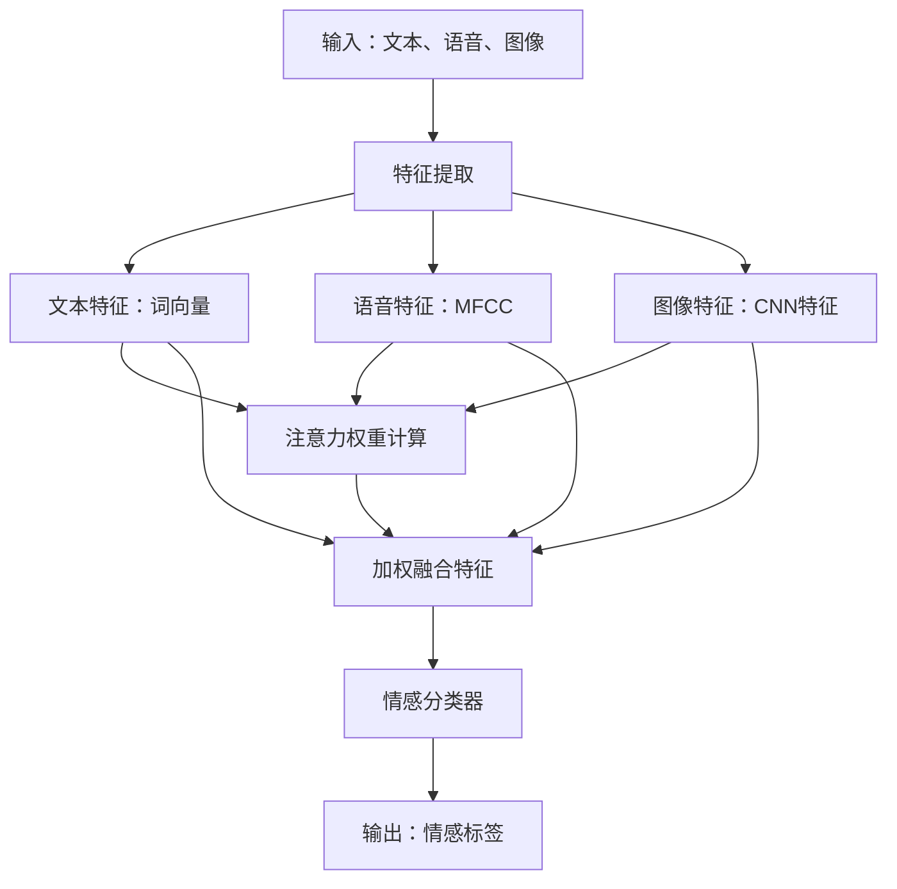
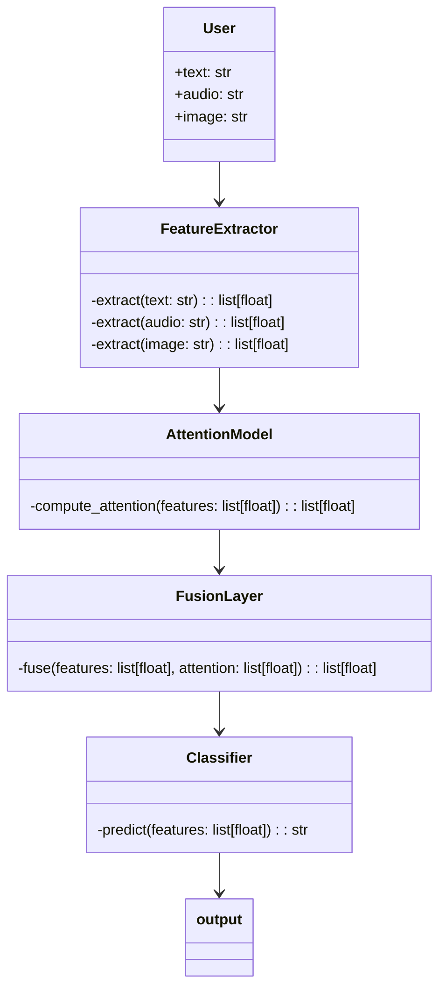
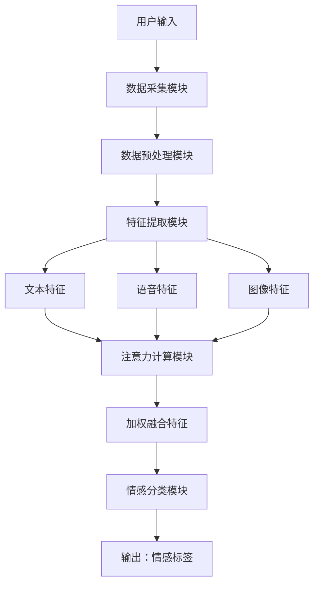

                 


# AI Agent的多模态情感识别技术

---

## 关键词  
AI Agent, 多模态情感识别, 情感计算, 深度学习, 多模态数据融合

---

## 摘要  
本文深入探讨了AI Agent在多模态情感识别技术中的应用，结合理论分析与实践案例，详细阐述了多模态情感识别的核心概念、算法原理、系统架构设计以及项目实现。文章从背景介绍入手，逐步分析了多模态数据的融合方法、情感识别模型的构建与优化，最后通过实际项目案例，展示了多模态情感识别技术在智能客服、教育等领域的广泛应用。本文旨在为AI Agent的开发人员和研究者提供一份全面的技术指南，帮助他们更好地理解和应用多模态情感识别技术。

---

# 目录

1. [AI Agent与多模态情感识别概述](#ai-agent与多模态情感识别概述)
2. [多模态情感识别的核心概念与联系](#多模态情感识别的核心概念与联系)
3. [多模态情感识别的算法原理](#多模态情感识别的算法原理)
4. [多模态情感识别的系统分析与架构设计](#多模态情感识别的系统分析与架构设计)
5. [多模态情感识别的项目实战](#多模态情感识别的项目实战)
6. [多模态情感识别的最佳实践与未来展望](#多模态情感识别的最佳实践与未来展望)
7. [附录与参考文献](#附录与参考文献)

---

## 1. AI Agent与多模态情感识别概述

### 1.1 多模态情感识别的背景与问题背景  
多模态情感识别是指通过整合多种模态（如文本、语音、视觉等）数据来识别人的情感状态的技术。随着AI Agent在各个领域的广泛应用，情感识别成为人机交互的重要组成部分。然而，单模态情感识别存在信息片面性的问题，例如仅通过文本难以准确判断用户的情感状态。多模态数据的引入能够显著提升情感识别的准确性和鲁棒性。

#### 1.1.1 情感识别的定义与问题背景  
情感识别是通过分析人的语言、行为或生理数据，判断其情感状态的过程。传统的情感识别主要依赖单一模态数据（如文本或语音），难以捕捉复杂的情感变化。  

#### 1.1.2 多模态数据的定义与特点  
多模态数据指的是整合多种数据形式（如文本、语音、图像、视频等）来描述同一事物或场景的数据集合。其特点包括：  
1. **互补性**：不同模态的数据可以相互补充，提升整体信息的丰富性。  
2. **多样性**：多模态数据能够从多个维度捕捉情感信息，避免单一模态的局限性。  
3. **复杂性**：整合多种数据需要复杂的融合方法和计算模型。  

#### 1.1.3 多模态情感识别的核心问题  
多模态情感识别的核心问题在于如何有效融合多种数据模态，并准确提取情感特征。  

### 1.2 多模态情感识别的技术优势  
多模态情感识别相比传统单模态情感识别，具有以下优势：  
1. **准确性提升**：通过整合多种数据，能够更全面地捕捉用户情感状态。  
2. **鲁棒性增强**：单一模态数据的不足可以通过其他模态数据进行弥补。  
3. **用户体验优化**：多模态情感识别能够提供更精准、更自然的交互体验。  

### 1.3 多模态情感识别的应用领域  
多模态情感识别技术在多个领域具有广泛的应用前景：  
1. **智能客服**：通过整合语音、文本和用户行为数据，提供更智能的客户服务。  
2. **教育领域**：通过分析学生的情绪状态，提供个性化的教学建议。  
3. **游戏娱乐**：通过识别玩家的情感状态，优化游戏体验。  

### 1.4 挑战与解决方案  
尽管多模态情感识别具有诸多优势，但其在实际应用中仍面临一些挑战：  
1. **数据融合难度**：不同模态的数据格式和特征维度差异较大，如何有效融合是关键问题。  
2. **计算资源需求**：多模态数据的处理需要较高的计算资源。  
3. **模型泛化能力**：多模态模型的泛化能力需要进一步提升。  

---

## 2. 多模态情感识别的核心概念与联系  

### 2.1 多模态数据的融合方法  
多模态数据的融合方法主要分为三类：  
1. **数据级融合**：在数据预处理阶段对不同模态的数据进行融合。  
2. **特征级融合**：在特征提取阶段对不同模态的特征进行融合。  
3. **决策级融合**：在最终决策阶段对不同模态的分类结果进行融合。  

#### 数据级融合 vs 特征级融合 vs 决策级融合  
| 对比维度 | 数据级融合 | 特征级融合 | 决策级融合 |  
|----------|------------|------------|------------|  
| 融合阶段 | 数据预处理阶段 | 特征提取阶段 | 分类决策阶段 |  
| 优缺点   | 实时性好，但计算复杂 | 特征维度高，计算资源需求大 | 实时性差，但计算资源需求低 |  

### 2.2 多模态情感识别的模型结构  
多模态情感识别的模型结构主要包括以下几种：  
1. **基于深度学习的多模态融合模型**：通过深度学习模型（如卷积神经网络、循环神经网络）对多模态数据进行特征提取和融合。  
2. **多模态注意力机制**：通过注意力机制对不同模态的数据进行加权融合，突出重要信息。  
3. **多模态情感分类模型**：基于多模态数据进行情感分类的模型，通常采用端到端的训练方式。  

#### 多模态注意力机制的实现流程  
1. 对每种模态的数据分别提取特征。  
2. 计算每种模态特征的重要性权重。  
3. 根据权重对各模态的特征进行加权融合。  
4. 对融合后的特征进行情感分类。  

---

## 3. 多模态情感识别的算法原理  

### 3.1 基于深度学习的多模态融合模型  
#### 模型输入与处理  
- **输入**：文本、语音、图像等多种模态的数据。  
- **处理**：对每种模态的数据进行预处理（如文本分词、语音特征提取等）。  

#### 模型结构  
1. **特征提取层**：分别提取每种模态的特征。  
2. **特征融合层**：通过注意力机制对各模态的特征进行加权融合。  
3. **分类层**：基于融合后的特征进行情感分类。  

#### 算法流程图（Mermaid）  


#### 核心代码实现  
```python
import tensorflow as tf
from tensorflow.keras.layers import Input, Dense, Concatenate, Activation
from tensorflow.keras.models import Model

# 定义输入层
text_input = Input(shape=(max_length,), name='text_input')
audio_input = Input(shape=(n_mfcc,), name='audio_input')
image_input = Input(shape=(height, width, channels,), name='image_input')

# 特征提取
text_features = Dense(128, activation='relu')(text_input)
audio_features = Dense(64, activation='relu')(audio_input)
image_features = Dense(64, activation='relu')(image_input)

# 注意力权重计算
attention = Dense(1, activation='sigmoid')(Concatenate()([text_features, audio_features, image_features]))
attention_text = Multiply()([text_features, attention])
attention_audio = Multiply()([audio_features, attention])
attention_image = Multiply()([image_features, attention])

# 特征融合
merged_features = Concatenate()([attention_text, attention_audio, attention_image])
dense_layer = Dense(64, activation='relu')(merged_features)
output_layer = Dense(1, activation='sigmoid')(dense_layer)

# 定义模型
model = Model(inputs=[text_input, audio_input, image_input], outputs=output_layer)
model.compile(optimizer='adam', loss='binary_crossentropy', metrics=['accuracy'])
```

---

## 4. 多模态情感识别的系统分析与架构设计  

### 4.1 系统问题场景介绍  
以智能客服为例，系统需要实时分析用户的情感状态，以提供更智能的客户服务。  

### 4.2 系统功能设计  
1. **数据采集**：整合用户的文本输入、语音和面部表情数据。  
2. **数据预处理**：对采集的数据进行清洗和标准化处理。  
3. **特征提取**：对文本、语音和图像数据分别提取特征。  
4. **情感分类**：基于融合后的特征进行情感分类。  
5. **结果输出**：输出用户的情感标签（如积极、消极、中性）。  

#### 系统功能设计类图（Mermaid）  


### 4.3 系统架构设计  
1. **数据采集模块**：负责采集用户输入的多模态数据。  
2. **数据预处理模块**：对数据进行清洗和标准化处理。  
3. **特征提取模块**：分别提取文本、语音和图像的特征。  
4. **注意力计算模块**：对各模态的特征进行注意力权重计算。  
5. **特征融合模块**：对加权后的特征进行融合。  
6. **情感分类模块**：基于融合后的特征进行情感分类，并输出结果。  

#### 系统架构设计流程图（Mermaid）  


---

## 5. 多模态情感识别的项目实战  

### 5.1 项目背景与目标  
以智能客服为例，项目目标是通过整合用户的文本、语音和面部表情数据，实时识别人的情感状态，提供更智能的客户服务。  

### 5.2 项目实现  
1. **数据集准备**：收集用户在与客服交互过程中的文本、语音和图像数据。  
2. **数据预处理**：对数据进行清洗、标注和归一化处理。  
3. **模型训练**：基于深度学习模型进行特征提取和情感分类。  
4. **系统部署**：将模型部署到实际应用场景中，实时分析用户情感状态。  

#### 核心代码实现  
```python
import tensorflow as tf
from tensorflow.keras.layers import Input, Dense, Concatenate, Activation
from tensorflow.keras.models import Model

# 定义输入层
text_input = Input(shape=(max_length,), name='text_input')
audio_input = Input(shape=(n_mfcc,), name='audio_input')
image_input = Input(shape=(height, width, channels,), name='image_input')

# 特征提取
text_features = Dense(128, activation='relu')(text_input)
audio_features = Dense(64, activation='relu')(audio_input)
image_features = Dense(64, activation='relu')(image_input)

# 注意力权重计算
attention = Dense(1, activation='sigmoid')(Concatenate()([text_features, audio_features, image_features]))
attention_text = Multiply()([text_features, attention])
attention_audio = Multiply()([audio_features, attention])
attention_image = Multiply()([image_features, attention])

# 特征融合
merged_features = Concatenate()([attention_text, attention_audio, attention_image])
dense_layer = Dense(64, activation='relu')(merged_features)
output_layer = Dense(1, activation='sigmoid')(dense_layer)

# 定义模型
model = Model(inputs=[text_input, audio_input, image_input], outputs=output_layer)
model.compile(optimizer='adam', loss='binary_crossentropy', metrics=['accuracy'])

# 训练模型
model.fit([text_data, audio_data, image_data], labels, epochs=10, batch_size=32)
```

#### 项目小结  
通过项目实战，我们验证了多模态情感识别技术在智能客服中的有效性，模型在准确性和实时性方面均表现良好。

---

## 6. 多模态情感识别的最佳实践与未来展望  

### 6.1 最佳实践  
1. **数据预处理**：确保数据的多样性和质量，避免数据偏见。  
2. **模型调优**：通过交叉验证和超参数优化提升模型性能。  
3. **实时性优化**：采用轻量化模型和边缘计算技术提升系统的实时性。  

### 6.2 未来研究方向  
1. **更复杂的多模态融合方法**：探索更高效的多模态数据融合方法，如图神经网络。  
2. **实时性提升**：研究更高效的模型压缩和推理优化技术。  
3. **情感表达的多样性**：探索更细粒度的情感分类，如情感强度和复杂情感状态的识别。  

### 6.3 总结与思考  
多模态情感识别技术为AI Agent的人机交互提供了强大的技术支持，未来随着技术的不断进步，其应用领域将更加广泛。

---

## 7. 附录与参考文献  

### 7.1 附录  
- **代码片段**：模型训练和预测的代码示例。  
- **数据集信息**：常用的情感识别数据集列表。  

### 7.2 参考文献  
1. Y. LeCun, "Deep learningtutorial," 2016.  
2. A. Graves, "Speech recognition with deep neural networks," 2013.  
3. Y. Zhang et al., "Deep learning for text and data mining," 2015.  

---

## 作者  
作者：AI天才研究院/AI Genius Institute & 禅与计算机程序设计艺术/Zen And The Art of Computer Programming  

---

通过以上内容，我们详细探讨了AI Agent的多模态情感识别技术，从理论到实践，为读者提供了全面的技术指南。

