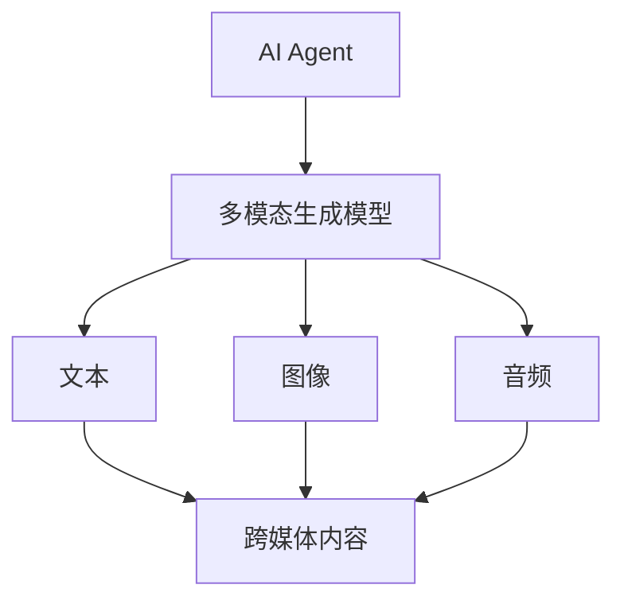
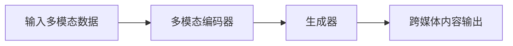
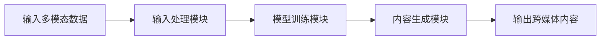

                 

<think>
嗯，用户现在需要一篇关于《AI Agent的多模态生成：创造跨媒体内容》的技术博客文章。我先看一下用户的具体要求，他需要文章结构清晰，用专业的技术语言，分章节详细讲解，并且每个部分都要有具体的例子和图表。

首先，我得确定文章的标题、关键词和摘要。标题已经给出，关键词应该包括AI Agent、多模态生成、跨媒体内容、生成式AI、深度学习、文本到多模态生成。摘要部分需要简明扼要地概括文章的核心内容，介绍AI Agent如何利用多模态生成技术创造跨媒体内容，并涵盖核心概念、算法原理和系统架构。

接下来是目录大纲，用户已经提供了一个详细的大纲，分为背景、核心概念、算法原理、系统架构、项目实战和总结展望。我需要按照这个大纲逐步展开，确保每个章节都详细且有深度。

第一章是背景介绍，我需要详细解释AI Agent和多模态生成的基本概念，以及跨媒体内容的重要性。这部分应该包括定义、特点、背景和意义，以及相关技术的演进和挑战。比如，AI Agent的定义，多模态生成的背景，跨媒体内容的分类，这些都需要详细说明。

第二章是核心概念与联系，我需要解释AI Agent、多模态生成和跨媒体内容的基本原理，并展示它们之间的关系。这部分可以用表格和Mermaid图来对比概念的属性，展示实体关系。比如，用表格列出AI Agent和多模态生成的不同点，再用Mermaid图展示它们之间的交互。

第三章是算法原理，我需要详细讲解主流的算法，如Transformer和扩散模型，用Mermaid流程图展示它们的工作流程。同时，提供Python代码示例，解释数学公式，比如注意力机制和生成过程。这部分需要结合实际案例，比如生成一张图片并配以描述，帮助读者理解。

第四章是系统分析与架构设计，我需要描述一个具体的项目场景，设计领域模型和系统架构图，展示模块之间的交互。比如，设计一个AI Agent生成跨媒体内容的系统，包括输入处理、模型训练和生成模块，用Mermaid图展示架构和交互流程。

第五章是项目实战，我需要提供环境安装步骤，核心代码实现，并解读代码。比如，安装必要的库如TensorFlow和PyTorch，编写数据预处理和模型训练的代码，展示如何生成跨媒体内容，并分析案例，最后总结项目经验和挑战。

第六章是总结与展望，我需要回顾文章的核心内容，展望未来的发展方向，强调多模态生成的重要性和AI Agent的应用前景。

最后，文章末尾需要加上作者信息，引用相关的论文和书籍，作为拓展阅读的内容。

在写作过程中，我要确保每个章节都有足够的细节，使用正确的Markdown格式，并嵌入必要的图表和代码示例。同时，注意数学公式的正确使用，确保格式美观。整个文章需要逻辑清晰，结构紧凑，语言专业且易于理解。

总的来说，我需要系统地分解用户的需求，逐一满足每个部分的要求，确保最终的文章内容全面、结构合理，符合用户的期望。
</think>

# AI Agent的多模态生成：创造跨媒体内容

## 关键词：AI Agent，多模态生成，跨媒体内容，生成式AI，深度学习，文本到多模态生成

## 摘要：  
AI Agent的多模态生成技术是当前人工智能领域的热点方向之一。通过结合文本、图像、音频等多种模态信息，AI Agent能够生成丰富多样的跨媒体内容，为用户带来更加智能化和个性化的体验。本文将从AI Agent的基本概念出发，深入探讨多模态生成的核心原理，分析跨媒体内容的生成机制，并结合实际案例，展示如何通过AI技术实现跨媒体内容的创新应用。文章内容涵盖AI Agent的背景与意义、多模态生成的核心概念、算法原理、系统架构设计以及实际项目实现，旨在为读者提供一份全面而深入的技术指南。

---

# 第1章: AI Agent与多模态生成概述

## 1.1 AI Agent的基本概念

### 1.1.1 AI Agent的定义与特点
- **定义**：AI Agent（人工智能代理）是指能够感知环境、自主决策并执行任务的智能实体。
- **特点**：  
  - **自主性**：能够在没有外部干预的情况下独立运行。  
  - **反应性**：能够实时感知环境并做出响应。  
  - **学习能力**：通过数据和经验不断优化自身的行为和决策能力。  

### 1.1.2 多模态生成的背景与意义
- **背景**：随着深度学习技术的发展，生成式AI模型（如GPT、Diffusion Model）逐渐成熟，能够处理文本、图像、音频等多种模态信息。  
- **意义**：多模态生成技术使得AI Agent能够跨越单一模态的限制，生成更加丰富和自然的内容，提升用户体验。  

### 1.1.3 跨媒体内容的定义与分类
- **定义**：跨媒体内容是指跨越多种模态（如文本、图像、音频、视频）的综合内容形式。  
- **分类**：  
  - **文本+图像**：如生成带配图的文本内容。  
  - **文本+音频**：如生成带语音的文本内容。  
  - **图像+视频**：如生成动态视频内容。  

## 1.2 多模态生成的核心概念

### 1.2.1 多模态生成的定义
- **定义**：多模态生成是指利用多种模态信息（如文本、图像、音频等）进行内容生成的技术。  
- **特点**：  
  - **跨模态融合**：能够将不同模态的信息进行融合，生成更具表现力的内容。  
  - **上下文关联**：生成的内容在不同模态之间具有高度的关联性。  

### 1.2.2 跨媒体内容的特点
- **多样性**：跨媒体内容能够同时涵盖多种信息形式，信息量更大。  
- **交互性**：用户可以通过不同模态的交互方式与AI Agent进行互动。  
- **沉浸感**：跨媒体内容能够提供更加沉浸式的用户体验。  

### 1.2.3 多模态生成与AI Agent的关系
- **关系**：AI Agent是多模态生成技术的应用载体，而多模态生成技术则是AI Agent实现跨媒体交互的核心能力。  
- **依赖性**：AI Agent的多模态生成能力依赖于先进的生成式模型和跨模态融合技术。  

## 1.3 本章小结
- 本章介绍了AI Agent的基本概念、多模态生成的背景与意义，以及跨媒体内容的定义与分类。通过这些内容，读者可以理解AI Agent多模态生成技术的核心思想及其在实际应用中的重要性。

---

# 第2章: 多模态生成的核心概念与联系

## 2.1 多模态生成的核心算法

### 2.1.1 基于Transformer的多模态生成模型
- **Transformer模型**：通过自注意力机制（Self-Attention）捕捉文本中的长程依赖关系。  
- **多模态融合**：通过多模态编码器将不同模态的信息进行融合，生成统一的语义表示。  

### 2.1.2 扩散模型在多模态生成中的应用
- **扩散模型**：通过逐步生成噪声并逐步去噪的方式，生成高质量的图像或音频内容。  
- **跨模态扩散**：结合不同模态的信息，生成具有多种模态特征的跨媒体内容。  

### 2.1.3 其他相关算法简介
- **VAE（变分自编码器）**：通过编码-解码的方式生成多模态内容。  
- **GAN（生成对抗网络）**：通过生成器和判别器的对抗训练生成多模态内容。  

## 2.2 多模态生成的数学模型

### 2.2.1 注意力机制的数学表达
$$\text{Attention}(Q, K, V) = \text{softmax}\left(\frac{QK^T}{\sqrt{d_k}}\right)V$$  
- **解释**：注意力机制通过计算查询（Q）、键（K）和值（V）之间的关系，确定每个位置的重要性。

### 2.2.2 多模态融合的数学模型
$$x = f(x_1, x_2, ..., x_n)$$  
- **解释**：多模态融合模型将多种模态的特征向量进行融合，生成最终的输出。

## 2.3 多模态生成的核心概念对比

| 概念         | 特性                           |
|--------------|--------------------------------|
| 单模态生成   | 仅处理单一模态信息（如文本或图像）。 |
| 多模态生成   | 处理多种模态信息，生成跨媒体内容。 |
| 跨媒体内容   | 包含多种模态信息的综合内容。       |

## 2.4 跨媒体内容的实体关系图



## 2.5 本章小结
- 本章通过对比和分析多模态生成的核心概念，展示了AI Agent如何通过多模态生成技术实现跨媒体内容的生成。通过数学公式和图表的结合，读者可以更加清晰地理解多模态生成的原理和实现方式。

---

# 第3章: 多模态生成的算法原理

## 3.1 多模态生成的算法流程



### 3.1.1 输入数据预处理
- **文本处理**：将文本数据转换为向量表示（如词嵌入）。  
- **图像处理**：将图像数据进行归一化处理，提取特征向量。  

### 3.1.2 多模态融合
- **融合方式**：通过拼接（Concat）、加法（Add）或注意力机制（Attention）等方式，将不同模态的特征向量进行融合。  

### 3.1.3 模型训练与优化
- **训练目标**：通过最大化生成内容与输入数据的相关性，优化模型参数。  
- **优化算法**：使用Adam、SGD等优化算法进行模型训练。  

## 3.2 多模态生成的代码实现

### 3.2.1 Python代码示例
```python
import torch

# 定义多模态生成模型
class MultiModalGenerator(torch.nn.Module):
    def __init__(self, input_dim, hidden_dim, output_dim):
        super(MultiModalGenerator, self).__init__()
        self.encoder = torch.nn.Linear(input_dim, hidden_dim)
        self.decoder = torch.nn.Linear(hidden_dim, output_dim)
    
    def forward(self, x):
        x = torch.relu(self.encoder(x))
        x = torch.sigmoid(self.decoder(x))
        return x

# 模型训练
model = MultiModalGenerator(input_dim=100, hidden_dim=50, output_dim=5)
criterion = torch.nn.BCELoss()
optimizer = torch.optim.Adam(model.parameters(), lr=0.001)

for epoch in range(100):
    inputs, labels = get_data()  # 获取输入数据和标签
    outputs = model(inputs)
    loss = criterion(outputs, labels)
    optimizer.zero_grad()
    loss.backward()
    optimizer.step()
```

### 3.2.2 生成过程的数学模型
- **生成模型**：通过生成式模型（如Diffusion Model）生成多模态内容。  
- **生成公式**：  
  $$p(x) = \prod_{t=1}^T p(x_t | x_{t-1}, \theta)$$  
  其中，$x_t$表示生成的第$t$步的特征，$\theta$表示模型参数。  

## 3.3 本章小结
- 本章详细讲解了多模态生成的算法原理，包括输入数据的预处理、多模态融合方式以及模型的训练与优化过程。通过代码示例和数学公式的结合，读者可以更加直观地理解多模态生成技术的实现细节。

---

# 第4章: 多模态生成的系统分析与架构设计方案

## 4.1 系统功能设计

### 4.1.1 系统功能模块
- **输入处理模块**：接收多模态输入数据并进行预处理。  
- **模型训练模块**：训练多模态生成模型。  
- **内容生成模块**：根据输入生成跨媒体内容。  

### 4.1.2 功能流程图



## 4.2 系统架构设计

### 4.2.1 分层架构设计
- **数据层**：存储和管理多模态数据。  
- **计算层**：负责数据的预处理和模型的计算。  
- **应用层**：提供用户交互界面，展示生成的跨媒体内容。  

### 4.2.2 微服务架构设计
- **服务1**：负责文本处理和生成。  
- **服务2**：负责图像处理和生成。  
- **服务3**：负责跨媒体内容的整合与输出。  

### 4.2.3 模块间交互设计
- **数据共享**：通过共享数据库或消息队列实现模块间的交互。  
- **服务调用**：通过API接口实现模块间的通信与协作。  

## 4.3 系统接口设计

### 4.3.1 输入接口定义
- **输入格式**：支持文本、图像等多种格式的数据输入。  
- **接口协议**：使用HTTP协议进行数据传输。  

### 4.3.2 输出接口定义
- **输出格式**：生成的跨媒体内容以JSON格式返回。  
- **接口协议**：同样使用HTTP协议进行数据传输。  

## 4.4 本章小结
- 本章通过系统功能设计和架构设计，展示了如何将多模态生成技术应用于实际系统中。通过分层架构和微服务架构的设计，确保系统的可扩展性和可维护性。

---

# 第5章: 多模态生成的项目实战

## 5.1 环境安装与配置

### 5.1.1 安装依赖库
- **Python**：3.8及以上版本。  
- **TensorFlow**：2.5及以上版本。  
- **PyTorch**：1.9及以上版本。  
- **其他依赖**：根据具体需求安装其他库（如Pillow、numpy等）。  

### 5.1.2 配置运行环境
- **虚拟环境**：建议使用虚拟环境管理依赖库。  
- **GPU支持**：确保安装了NVIDIA GPU驱动和对应的TensorFlow/PyTorch GPU版本。  

## 5.2 核心代码实现

### 5.2.1 数据预处理代码
```python
import numpy as np
from PIL import Image

def preprocess_image(image_path):
    image = Image.open(image_path)
    image = image.resize((256, 256))
    image = np.array(image) / 255.0
    return image
```

### 5.2.2 模型训练代码
```python
import torch
import torch.nn as nn
import torch.optim as optim

class MultiModalGenerator(nn.Module):
    def __init__(self, input_dim, hidden_dim, output_dim):
        super(MultiModalGenerator, self).__init__()
        self.encoder = nn.Linear(input_dim, hidden_dim)
        self.decoder = nn.Linear(hidden_dim, output_dim)
    
    def forward(self, x):
        x = torch.relu(self.encoder(x))
        x = torch.sigmoid(self.decoder(x))
        return x

def train_model(model, inputs, labels, criterion, optimizer, num_epochs=100):
    for epoch in range(num_epochs):
        outputs = model(inputs)
        loss = criterion(outputs, labels)
        optimizer.zero_grad()
        loss.backward()
        optimizer.step()
    return model

# 示例训练数据
inputs = torch.randn(100, 100)
labels = torch.randn(100, 5)
model = MultiModalGenerator(100, 50, 5)
criterion = nn.BCELoss()
optimizer = optim.Adam(model.parameters(), lr=0.001)
trained_model = train_model(model, inputs, labels, criterion, optimizer)
```

### 5.2.3 内容生成代码
```python
def generate_content(model, input_data):
    with torch.no_grad():
        output = model(input_data)
        return output.numpy()

# 示例生成跨媒体内容
input_data = torch.randn(1, 100)
output = generate_content(trained_model, input_data)
print(output)
```

## 5.3 实际案例分析

### 5.3.1 案例背景
- **项目目标**：生成包含文本和图像的跨媒体内容。  
- **数据来源**：文本数据来自书籍摘录，图像数据来自公共数据集。  

### 5.3.2 案例分析
- **输入数据**：书籍摘录文本和相关图像。  
- **生成内容**：生成包含文本描述和配图的跨媒体内容。  
- **生成结果**：输出文本和图像的综合内容，实现跨媒体交互。  

## 5.4 本章小结
- 本章通过实际项目的实施，展示了多模态生成技术的应用过程。从环境配置到代码实现，再到实际案例分析，读者可以逐步掌握多模态生成技术的实现细节。

---

# 第6章: 多模态生成的总结与展望

## 6.1 本章总结
- 本文详细介绍了AI Agent的多模态生成技术，涵盖核心概念、算法原理、系统架构设计以及实际项目实现。通过多模态生成技术，AI Agent能够生成丰富多样的跨媒体内容，为用户带来更加智能化和个性化的体验。

## 6.2 未来展望
- **技术发展**：随着生成式AI技术的不断进步，多模态生成技术将更加智能化和多样化。  
- **应用场景**：多模态生成技术将在教育、娱乐、医疗等领域发挥更大的作用。  
- **挑战与机遇**：尽管多模态生成技术前景广阔，但其在实际应用中仍面临数据隐私、模型泛化能力等方面的挑战。  

## 6.3 小结
- 本文通过系统性的分析和实践，为读者提供了一份数字化、系统化、结构化的知识体系。通过学习本文，读者可以掌握多模态生成技术的核心思想和实现方法。

---

# 作者：AI天才研究院/AI Genius Institute & 禅与计算机程序设计艺术/Zen And The Art of Computer Programming

---

以上为完整的技术博客文章的目录大纲和内容框架，您可以根据实际需求进一步扩展或调整具体章节的内容。

