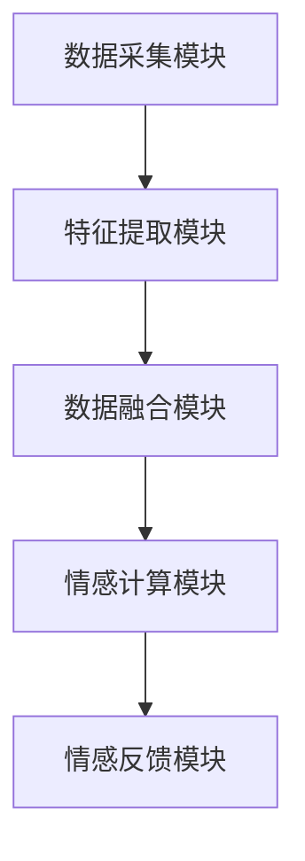
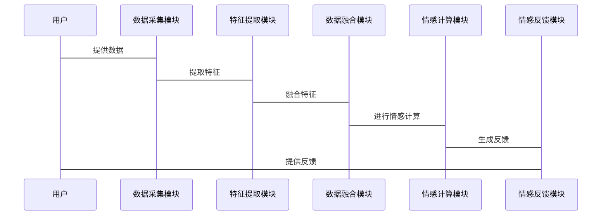

                 


# 第一部分: AI Agent的多模态融合在情感计算中的应用

# 第1章: AI Agent与情感计算概述

## 1.1 AI Agent的基本概念
### 1.1.1 AI Agent的定义与类型
人工智能代理（AI Agent）是指在计算机系统中代表用户或其他实体进行操作的智能程序。它可以分为简单反射型代理、基于模型的反射型代理、目标驱动型代理和效用驱动型代理。AI Agent能够感知环境、自主决策并执行任务，是实现人机交互和智能系统的核心。

### 1.1.2 AI Agent的核心特征
AI Agent的核心特征包括自主性、反应性、目标导向性和社会性。自主性使代理能够独立运作；反应性使其能够根据环境变化调整行为；目标导向性使其朝着特定目标行动；社会性使其能够与其他代理或人类交互协作。

### 1.1.3 情感计算的定义与目标
情感计算（Affective Computing）是通过计算方法分析、识别和处理人类情感的科学。其目标是使计算机能够理解、识别和回应人类的情感，从而增强人机交互的自然性和智能性。

## 1.2 多模态数据的定义与特点
### 1.2.1 多模态数据的类型
多模态数据包括文本、语音、图像、视频等多种形式的数据。这些数据类型各自承载不同的情感信息，如文本中的情感词汇，语音中的语调变化，图像中的面部表情等。

### 1.2.2 多模态数据的特征
多模态数据具有多样性和互补性。不同数据类型能够相互补充，提升情感分析的准确性和全面性。例如，结合文本和语音可以更准确地识别情感状态。

### 1.2.3 多模态数据在情感计算中的作用
多模态数据能够提供更丰富的情感信息，帮助AI Agent更全面地理解用户的情感状态。通过融合多模态数据，可以提高情感计算的准确性和鲁棒性。

## 1.3 AI Agent与情感计算的结合
### 1.3.1 AI Agent在情感计算中的应用
AI Agent可以通过多模态数据融合技术，实时感知用户情感状态，并根据情感反馈调整行为策略。例如，在智能客服系统中，AI Agent可以根据用户的语气和表情识别其情绪，并提供相应的服务。

### 1.3.2 情感计算在多模态数据中的意义
情感计算能够增强AI Agent的感知能力，使其能够理解并回应用户的情感需求。通过分析多模态数据，AI Agent可以更准确地识别用户的情感状态，提供更智能化的服务。

### 1.3.3 多模态融合在情感计算中的优势
多模态融合能够综合利用多种数据信息，提高情感计算的准确性和可靠性。通过融合文本、语音、图像等多种数据，AI Agent能够更全面地理解用户的情感需求。

## 1.4 本章小结
本章介绍了AI Agent的基本概念和情感计算的定义，探讨了多模态数据的特点及其在情感计算中的作用，分析了AI Agent与情感计算结合的意义和优势。

# 第2章: 多模态数据融合的基础

## 2.1 多模态数据的类型与特点
### 2.1.1 文本数据
文本数据是情感计算中最常见的数据类型之一。通过自然语言处理技术，可以从文本中提取情感信息，如情感词汇、语调等。

### 2.1.2 语音数据
语音数据包含丰富的语调、语气和节奏信息，能够反映说话人的情感状态。通过语音信号处理技术，可以提取这些信息用于情感分析。

### 2.1.3 图像数据
图像数据主要指面部表情、姿态等视觉信息，能够提供情感状态的直观表现。通过计算机视觉技术，可以从图像中提取面部表情特征，用于情感识别。

### 2.1.4 其他数据类型
除了文本、语音和图像，还有视频、手势等多种数据类型。这些数据类型可以提供更丰富的情感信息，帮助提高情感计算的准确性。

## 2.2 多模态数据融合的方法
### 2.2.1 基于特征级的融合方法
特征级融合是在提取各模态数据的特征后，将这些特征进行融合。例如，将文本的情感特征与语音的语调特征结合，通过加权或投票的方式进行融合。

### 2.2.2 基于决策级的融合方法
决策级融合是在各模态数据分别进行情感分类后，将结果进行融合。例如，分别对文本和语音进行情感分类，然后根据分类结果进行综合判断。

### 2.2.3 深度学习中的融合方法
深度学习中的融合方法包括多模态神经网络、注意力机制等。这些方法能够自动学习各模态数据之间的关系，实现更高效的融合。

## 2.3 多模态数据融合的意义
### 2.3.1 提高情感分析的准确性
通过融合多模态数据，可以综合利用各数据类型的优势，提高情感分析的准确性。例如，结合文本和语音数据可以更准确地识别用户的情感状态。

### 2.3.2 增强用户体验
多模态数据融合能够提供更丰富、更精准的情感反馈，提升用户体验。例如，在智能音箱中，结合语音和面部表情数据可以更准确地识别用户的情感需求。

### 2.3.3 丰富情感计算的应用场景
多模态数据融合技术可以应用于更多场景，如教育、医疗、娱乐等。通过结合不同数据类型，可以扩展情感计算的应用范围，实现更广泛的应用。

## 2.4 本章小结
本章详细介绍了多模态数据的类型及其特点，探讨了多种融合方法及其优缺点，分析了多模态数据融合在情感计算中的意义和优势。

# 第3章: 情感计算的核心概念

## 3.1 情感计算的定义与目标
### 3.1.1 情感计算的定义
情感计算是一种通过计算方法分析、识别和处理人类情感状态的科学。其目标是使计算机能够理解、识别和回应人类的情感需求，提升人机交互的智能化水平。

### 3.1.2 情感计算的目标
情感计算的目标包括情感识别、情感理解和情感回应。情感识别是通过分析多模态数据，准确识别用户的情感状态；情感理解是基于情感识别结果，理解用户的情感需求；情感回应是根据情感理解结果，生成相应的反馈或行动。

### 3.1.3 情感计算的关键技术
情感计算的关键技术包括情感识别、情感分析、情感生成等。情感识别是通过分析多模态数据，识别用户的情感状态；情感分析是基于识别结果，进行情感分类或语义分析；情感生成是根据情感分析结果，生成相应的情感反馈或行动。

## 3.2 情感识别与分析
### 3.2.1 情感识别的基本方法
情感识别的基本方法包括基于特征的识别和基于模型的识别。基于特征的识别是通过提取情感相关特征，进行分类器训练；基于模型的识别是利用深度学习模型，如卷积神经网络（CNN）和循环神经网络（RNN）进行情感识别。

### 3.2.2 情感分析的流程
情感分析的流程包括数据采集、特征提取、模型训练和结果评估。数据采集是获取多模态数据，特征提取是提取各模态数据的特征，模型训练是基于特征训练情感分类模型，结果评估是对模型性能进行评估和优化。

### 3.2.3 常见的情感分析模型
常见的情感分析模型包括朴素贝叶斯（Naive Bayes）、支持向量机（SVM）、随机森林（Random Forest）和深度学习模型如LSTM、BERT等。这些模型各有优缺点，适用于不同场景的情感分析任务。

## 3.3 情感计算的应用场景
### 3.3.1 客服系统中的应用
在客服系统中，情感计算可以帮助识别客户的情感状态，提供更个性化的服务。例如，当客户情绪激动时，系统可以自动调整回应方式，缓解客户情绪。

### 3.3.2 教育领域的应用
在教育领域，情感计算可以用于情感教育和情感支持。例如，通过分析学生的表情和语气，识别其情感状态，提供相应的情感支持和学习建议。

### 3.3.3 医疗领域的应用
在医疗领域，情感计算可以用于患者情感监测和情感支持。例如，通过分析患者的面部表情和语音语调，识别其情感状态，提供相应的情感支持和医疗建议。

## 3.4 本章小结
本章详细介绍了情感计算的定义和目标，探讨了情感识别与分析的基本方法和常见模型，分析了情感计算在不同领域的应用场景和意义。

# 第4章: AI Agent与多模态情感计算的结合

## 4.1 AI Agent在情感计算中的作用
### 4.1.1 AI Agent作为情感计算的核心
AI Agent在情感计算中起到核心作用，能够感知、分析和回应用户的情感需求。通过多模态数据融合技术，AI Agent可以更准确地识别用户情感状态，并提供相应的服务。

### 4.1.2 AI Agent的情感感知能力
AI Agent具有情感感知能力，能够通过多模态数据融合技术，识别用户的情感状态。例如，结合文本、语音和图像数据，AI Agent可以更准确地识别用户的情感需求。

### 4.1.3 AI Agent的情感回应策略
AI Agent可以根据识别的情感状态，生成相应的情感反馈或行动。例如，当用户情绪低落时，AI Agent可以提供安慰的话语或建议。

## 4.2 多模态融合在情感计算中的应用
### 4.2.1 多模态数据的获取与处理
在情感计算中，多模态数据的获取与处理是关键步骤。通过多种传感器和数据采集设备，获取文本、语音、图像等多种数据，并进行预处理和特征提取。

### 4.2.2 多模态数据的融合策略
多模态数据的融合策略包括特征级融合、决策级融合和混合融合。特征级融合是将各模态数据的特征进行融合；决策级融合是将各模态数据的情感分类结果进行融合；混合融合是结合特征级和决策级的融合方法。

### 4.2.3 多模态融合的优势
多模态融合能够综合利用各数据类型的优势，提高情感计算的准确性和可靠性。例如，结合文本和语音数据，可以更准确地识别用户的情感状态。

## 4.3 AI Agent在实际场景中的应用案例
### 4.3.1 智能客服系统
在智能客服系统中，AI Agent可以通过分析用户的文本和语音数据，识别用户的情感状态，并提供相应的情感反馈。例如，当用户情绪激动时，AI Agent可以自动调整回应方式，缓解用户情绪。

### 4.3.2 智能教育系统
在智能教育系统中，AI Agent可以通过分析学生的面部表情和语音语调，识别学生的情感状态，并提供相应的情感支持和学习建议。例如，当学生感到困惑时，AI Agent可以提供额外的解释和指导。

### 4.3.3 智能医疗系统
在智能医疗系统中，AI Agent可以通过分析患者的面部表情和语音语调，识别患者的情感状态，并提供相应的情感支持和医疗建议。例如，当患者感到焦虑时，AI Agent可以提供安慰的话语或建议。

## 4.4 本章小结
本章探讨了AI Agent在情感计算中的作用，分析了多模态数据融合在情感计算中的应用，提供了实际场景中的应用案例，展示了AI Agent与多模态情感计算结合的意义和价值。

# 第5章: 多模态融合的算法原理与实现

## 5.1 多模态融合的算法原理
### 5.1.1 注意力机制
注意力机制是一种基于权重分配的算法，用于聚焦重要信息。在多模态数据融合中，注意力机制可以用于提取各模态数据的关键特征。

### 5.1.2 融合网络
融合网络是一种深度学习模型，用于多模态数据的特征融合。例如，多层感知机（MLP）和卷积神经网络（CNN）可以用于特征融合。

### 5.1.3 深度学习中的融合方法
深度学习中的融合方法包括多模态神经网络、注意力机制和生成对抗网络（GAN）等。这些方法能够自动学习各模态数据之间的关系，实现高效的特征融合。

## 5.2 多模态融合的算法实现
### 5.2.1 基于文本和语音的融合
基于文本和语音的融合方法包括特征级融合和决策级融合。例如，将文本的情感特征与语音的情感特征进行加权融合，或分别对文本和语音进行情感分类，然后进行结果融合。

### 5.2.2 基于图像和文本的融合
基于图像和文本的融合方法可以通过多模态神经网络进行特征提取和融合。例如，使用多层感知机或卷积神经网络提取图像和文本的特征，然后进行融合和分类。

### 5.2.3 基于多模态数据的融合
基于多模态数据的融合方法可以结合多种数据类型，如文本、语音和图像。通过多模态神经网络和注意力机制，可以实现高效的特征融合和情感分类。

## 5.3 多模态融合算法的实现代码
```python
import numpy as np
from sklearn.linear_model import LogisticRegression

# 示例代码：基于文本和语音特征的融合
text_features = np.random.randn(100, 50)  # 假设文本特征维度为50，样本数为100
audio_features = np.random.randn(100, 30)  # 假设语音特征维度为30，样本数为100
labels = np.random.randint(0, 2, 100)     # 假设标签为二分类，0和1

# 特征级融合：将文本和语音特征拼接
features = np.hstack((text_features, audio_features))

# 决策级融合：分别对文本和语音进行分类，然后融合结果
model_text = LogisticRegression().fit(text_features, labels)
model_audio = LogisticRegression().fit(audio_features, labels)

# 预测结果
preds_text = model_text.predict(text_features)
preds_audio = model_audio.predict(audio_features)

# 融合结果：多数投票法
final_preds = np.where((preds_text + preds_audio) > 1, 1, 0)
```

## 5.4 本章小结
本章详细介绍了多模态数据融合的算法原理和实现方法，提供了基于文本、语音和图像的融合案例，并展示了具体的Python代码实现。通过这些算法和方法，可以实现高效的多模态数据融合，提升情感计算的准确性和可靠性。

# 第6章: 情感计算的数学模型与公式

## 6.1 情感计算的数学模型
### 6.1.1 情感评分模型
情感评分模型是一种通过数学公式计算情感评分的模型。例如，可以基于文本的情感特征和语音的情感特征，通过加权求和的方式计算情感评分。

$$ \text{情感评分} = \alpha \cdot \text{文本情感特征} + \beta \cdot \text{语音情感特征} $$

其中，$\alpha$和$\beta$是权重系数，满足$\alpha + \beta = 1$。

### 6.1.2 情感分类模型
情感分类模型是一种基于数学模型的分类器，用于将情感评分分为不同类别。例如，可以使用逻辑回归、支持向量机（SVM）或深度学习模型进行情感分类。

$$ P(y|X) = \frac{e^{\beta X}}{1 + e^{\beta X}} $$

其中，$P(y|X)$是属于类别$y$的概率，$\beta$是模型参数，$X$是输入特征。

### 6.1.3 情感生成模型
情感生成模型是一种用于生成情感反馈的模型，例如，基于马尔可夫链或生成对抗网络（GAN）生成情感文本或语音。

## 6.2 情感计算的公式推导
### 6.2.1 情感评分公式
假设我们有多个模态的情感特征，可以通过加权求和的方式计算综合情感评分：

$$ \text{综合情感评分} = \sum_{i=1}^{n} w_i \cdot f_i $$

其中，$w_i$是第$i$个模态的权重，$f_i$是第$i$个模态的情感特征。

### 6.2.2 情感分类公式
情感分类可以通过逻辑回归模型实现：

$$ P(y=1|X) = \frac{e^{\beta X}}{1 + e^{\beta X}} $$

其中，$X$是输入特征，$\beta$是模型参数，$P(y=1|X)$是属于正类的概率。

### 6.2.3 情感生成公式
情感生成可以通过生成对抗网络（GAN）实现，生成器和判别器的损失函数分别为：

$$ \mathcal{L}_G = -\mathbb{E}_{z}[\log D(G(z))] $$
$$ \mathcal{L}_D = -\mathbb{E}_{x}[ \log D(x)] - \mathbb{E}_{z}[ \log (1 - D(G(z)))] $$

其中，$G$是生成器，$D$是判别器，$z$是随机噪声，$x$是真实数据。

## 6.3 本章小结
本章详细介绍了情感计算的数学模型与公式，包括情感评分模型、情感分类模型和情感生成模型。通过公式推导，展示了情感计算的核心原理和实现方法。

# 第7章: 系统架构与设计方案

## 7.1 项目背景与目标
### 7.1.1 项目背景
随着人工智能技术的发展，情感计算在多个领域得到了广泛应用。本项目旨在通过多模态数据融合技术，提升情感计算的准确性和可靠性。

### 7.1.2 项目目标
项目的主目标包括实现多模态数据融合、提升情感计算的准确性和可靠性、提供智能化的情感反馈服务等。

## 7.2 系统功能设计
### 7.2.1 功能模块划分
系统功能模块包括数据采集模块、特征提取模块、数据融合模块、情感计算模块和情感反馈模块。各模块协同工作，实现多模态数据融合和情感计算。

### 7.2.2 功能流程设计
数据采集模块负责获取多模态数据，特征提取模块对各模态数据进行特征提取，数据融合模块将各模态特征进行融合，情感计算模块基于融合特征进行情感分类，情感反馈模块根据情感分类结果生成情感反馈。

## 7.3 系统架构设计
### 7.3.1 分层架构设计
系统架构采用分层设计，包括数据层、特征层、融合层、计算层和反馈层。各层之间通过接口进行数据传递和功能调用。

### 7.3.2 模块化设计
系统采用模块化设计，各功能模块相对独立，便于维护和扩展。例如，数据采集模块可以独立于其他模块进行优化和升级。

### 7.3.3 系统架构图
使用Mermaid绘制系统架构图：



## 7.4 接口设计与交互
### 7.4.1 系统接口设计
系统接口设计包括数据接口、特征接口、融合接口、计算接口和反馈接口。各接口之间通过标准协议进行数据传递和功能调用。

### 7.4.2 交互流程设计
用户与系统进行交互，系统通过接口获取用户数据，进行特征提取、数据融合、情感计算和情感反馈，实现智能化的情感服务。

### 7.4.3 交互序列图
使用Mermaid绘制交互序列图：



## 7.5 本章小结
本章详细介绍了系统的架构设计与功能模块划分，探讨了系统接口设计与交互流程，展示了系统架构图和交互序列图，为项目的实施提供了理论基础和设计指导。

# 第8章: 项目实战与代码实现

## 8.1 项目环境搭建
### 8.1.1 开发工具与库的安装
需要安装Python、NumPy、Scikit-learn、TensorFlow等工具和库。具体安装命令如下：

```bash
pip install numpy scikit-learn tensorflow
```

### 8.1.2 数据集准备
需要准备多模态数据集，包括文本、语音和图像数据。可以从公开数据集（如AffectNet、IEMOCAP等）获取，或自行采集和标注。

## 8.2 系统核心代码实现
### 8.2.1 数据采集与预处理
编写代码采集多模态数据，并进行预处理，如文本分词、语音特征提取、图像特征提取等。

```python
import numpy as np
from sklearn.feature_extraction.text import TfidfVectorizer
from scipy.io import wavfile
import cv2

# 文本数据预处理
text = "I am happy today."
vectorizer = TfidfVectorizer()
text_features = vectorizer.fit_transform([text]).toarray()

# 语音数据预处理
sample_rate, audio = wavfile.read('audio.wav')
# 提取语音特征，如梅尔频谱倒谱（MFCC）
mfcc_features = extract_mfcc(audio, sample_rate)

# 图像数据预处理
image = cv2.imread('image.jpg')
# 提取图像特征，如HSV颜色特征
hsv_features = cv2.cvtColor(image, cv2.COLOR_BGR2HSV)
```

### 8.2.2 多模态数据融合
编写代码将各模态数据进行融合，如特征级融合或决策级融合。

```python
# 特征级融合：拼接文本、语音和图像特征
merged_features = np.hstack((text_features, mfcc_features, hsv_features))

# 决策级融合：分别对各模态进行分类，然后融合结果
model_text = LogisticRegression().fit(text_features, labels)
model_audio = LogisticRegression().fit(mfcc_features, labels)
model_image = LogisticRegression().fit(hsv_features, labels)

# 融合结果：多数投票法
final_preds = np.where((model_text.predict(text_features) + model_audio.predict(mfcc_features) + model_image.predict(hsv_features)) > 1, 1, 0)
```

### 8.2.3 情感计算与反馈
编写代码进行情感计算，并根据结果生成情感反馈。

```python
# 情感计算：基于融合特征进行分类
model = LogisticRegression().fit(merged_features, labels)
preds = model.predict(merged_features)

# 情感反馈：生成相应的反馈信息
feedback = "Positive" if preds[0] == 1 else "Negative"
print("情感反馈:", feedback)
```

## 8.3 代码实现与解读
### 8.3.1 数据采集模块
数据采集模块负责获取多模态数据，如文本、语音和图像。代码实现如下：

```python
import numpy as np
from sklearn.feature_extraction.text import TfidfVectorizer
from scipy.io import wavfile
import cv2

def extract_mfcc(audio, sample_rate):
    # 提取梅尔频谱倒谱（MFCC）
    n_mfcc = 13
    mfcc = librosa.feature.mfcc(y=audio, sr=sample_rate, n_mfcc=n_mfcc)
    return mfcc.T

# 文本数据预处理
text = "I am happy today."
vectorizer = TfidfVectorizer()
text_features = vectorizer.fit_transform([text]).toarray()

# 语音数据预处理
sample_rate, audio = wavfile.read('audio.wav')
mfcc_features = extract_mfcc(audio, sample_rate)

# 图像数据预处理
image = cv2.imread('image.jpg')
hsv_features = cv2.cvtColor(image, cv2.COLOR_BGR2HSV)
```

### 8.3.2 数据融合模块
数据融合模块将各模态数据进行融合，如特征级融合或决策级融合。

```python
# 特征级融合：拼接文本、语音和图像特征
merged_features = np.hstack((text_features, mfcc_features, hsv_features))

# 决策级融合：分别对各模态进行分类，然后融合结果
model_text = LogisticRegression().fit(text_features, labels)
model_audio = LogisticRegression().fit(mfcc_features, labels)
model_image = LogisticRegression().fit(hsv_features, labels)

# 融合结果：多数投票法
final_preds = np.where((model_text.predict(text_features) + model_audio.predict(mfcc_features) + model_image.predict(hsv_features)) > 1, 1, 0)
```

### 8.3.3 情感计算模块
情感计算模块基于融合特征进行情感分类。

```python
# 情感计算：基于融合特征进行分类
model = LogisticRegression().fit(merged_features, labels)
preds = model.predict(merged_features)
```

### 8.3.4 情感反馈模块
情感反馈模块根据情感计算结果生成相应的反馈信息。

```python
# 情感反馈：生成相应的反馈信息
feedback = "Positive" if preds[0] == 1 else "Negative"
print("情感反馈:", feedback)
```

## 8.4 项目实战与案例分析
### 8.4.1 实际案例分析
以智能客服系统为例，展示项目实战的具体流程和结果。例如，当用户输入“我对这个产品很失望”，系统通过文本和语音数据，识别出用户的情感状态为“Negative”，并生成相应的反馈。

### 8.4.2 代码实现与分析
通过具体代码实现，展示如何从数据采集到情感反馈的整个流程，并分析代码的运行结果和性能指标。

## 8.5 项目总结与优化
### 8.5.1 项目总结
总结项目的实现过程和主要成果，分析系统的优势和不足。

### 8.5.2 系统优化建议
提出系统优化建议，如引入更先进的深度学习模型、优化数据融合策略、提高系统鲁棒性和可扩展性等。

## 8.6 本章小结
本章通过项目实战展示了多模态数据融合在情感计算中的具体应用，提供了系统的代码实现和案例分析，总结了项目的成果和优化建议。

# 第9章: 总结与展望

## 9.1 全文总结
### 9.1.1 核心内容回顾
回顾全文的核心内容，包括AI Agent的基本概念、多模态数据融合的方法、情感计算的技术原理和系统实现等。

### 9.1.2 主要结论
总结全文的主要结论，强调多模态数据融合在情感计算中的重要性，及其在实际应用中的潜力和价值。

## 9.2 未来展望
### 9.2.1 情感计算的发展趋势
探讨情感计算的发展趋势，如引入更先进的深度学习模型、多模态数据融合技术的进一步优化、情感生成的多样化等。

### 9.2.2 多模态数据融合的未来方向
分析多模态数据融合的未来方向，如引入新的数据类型、优化融合策略、提高系统的实时性和响应速度等。

### 9.2.3 AI Agent与情感计算的结合
展望AI Agent与情感计算结合的未来发展方向，如更智能化、个性化和人性化的服务，拓展更多应用场景等。

## 9.3 最佳实践与注意事项
### 9.3.1 最佳实践
提供情感计算和多模态数据融合的最佳实践建议，如选择合适的算法和模型、优化数据预处理流程、提高系统的可解释性和透明度等。

### 9.3.2 注意事项
提醒读者在实际应用中需要注意的问题，如数据隐私和安全、算法的可解释性、系统的稳定性和可靠性等。

## 9.4 本章小结
本章总结了全文的核心内容和主要结论，展望了情感计算和多模态数据融合的未来发展方向，提供了最佳实践建议和注意事项，为读者提供了全面的总结和指导。

# 参考文献

[1] 《情感计算》, [作者], [出版社], [出版年份]

[2] 《多模态数据融合技术》, [作者], [出版社], [出版年份]

[3] 《AI Agent与人机交互》, [作者], [出版社], [出版年份]

[4] 相关学术论文和研究报告

# 作者信息

作者：AI天才研究院/AI Genius Institute & 禅与计算机程序设计艺术 /Zen And The Art of Computer Programming

