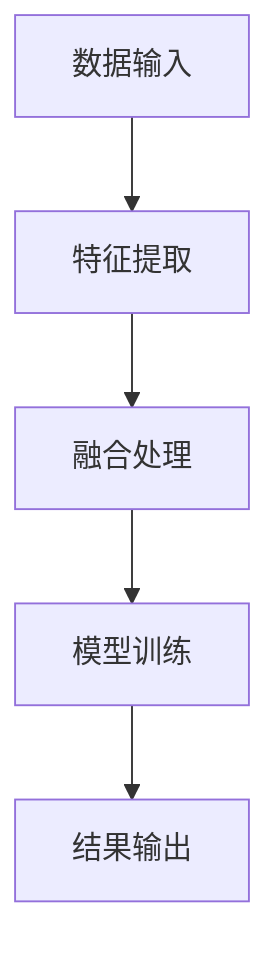

                 


# AI Agent的多模态融合学习技术

> 关键词：AI Agent、多模态融合学习、机器学习、深度学习、多模态数据

> 摘要：本文深入探讨了AI Agent在多模态融合学习技术中的应用，从概念、算法、系统架构到项目实战，全面分析了多模态数据的融合方式、数学模型以及实际应用场景。通过详细的技术解析和案例分析，本文为读者提供了全面的理论基础和实践指导。

---

# 第1章 AI Agent与多模态融合学习概述

## 1.1 AI Agent的基本概念

### 1.1.1 AI Agent的定义与特点

AI Agent（人工智能代理）是指能够感知环境、自主决策并执行任务的智能体。它具有以下特点：

1. **自主性**：AI Agent能够自主决策，无需外部干预。
2. **反应性**：能够实时感知环境并做出响应。
3. **目标导向**：通过优化目标函数来实现特定任务。
4. **学习能力**：能够通过数据和经验进行自我优化。

### 1.1.2 AI Agent的核心功能与应用场景

AI Agent的核心功能包括：

1. **感知**：通过多模态数据（如文本、图像、声音等）感知环境。
2. **决策**：基于感知信息做出最优决策。
3. **执行**：通过执行机构或接口完成任务。

AI Agent的应用场景广泛，例如智能助手、自动驾驶、智能客服、机器人控制等。

### 1.1.3 多模态数据的定义与特征

多模态数据是指多种类型的数据，例如文本、图像、声音、视频等。其主要特征包括：

1. **异构性**：不同模态的数据具有不同的特征和表示方式。
2. **互补性**：多种模态数据能够互补，提供更全面的信息。
3. **复杂性**：多模态数据的处理需要复杂的算法和模型。

## 1.2 多模态融合学习的背景与意义

### 1.2.1 多模态数据的挑战与机遇

多模态数据的挑战在于不同模态之间的异构性和复杂性，而机遇在于通过融合多模态数据能够提高AI Agent的感知和决策能力。

### 1.2.2 多模态融合学习的必要性

在单一模态数据的基础上，融合其他模态数据能够提高模型的准确性和鲁棒性，尤其是在复杂场景中。

### 1.2.3 多模态融合学习的现状与发展趋势

目前，多模态融合学习在自然语言处理、计算机视觉、语音识别等领域得到了广泛应用，并且随着深度学习技术的发展，其应用前景广阔。

## 1.3 本章小结

本章介绍了AI Agent的基本概念、核心功能以及多模态数据的定义与特征，同时探讨了多模态融合学习的背景与意义，为后续章节奠定了基础。

---

# 第2章 多模态数据的特征与融合方式

## 2.1 多模态数据的特征分析

### 2.1.1 文本模态的特征与处理方法

文本模态的特征包括词汇、语法、语义等。处理方法包括词袋模型、TF-IDF、Word2Vec、BERT等。

### 2.1.2 图像模态的特征与处理方法

图像模态的特征包括颜色、纹理、形状等。处理方法包括CNN、ResNet、Faster R-CNN等。

### 2.1.3 声音模态的特征与处理方法

声音模态的特征包括频率、振幅、时域特征等。处理方法包括Mel频谱、MFCC、GAN、WaveNet等。

## 2.2 多模态数据的融合方式

### 2.2.1 基于特征融合的方式

将不同模态的特征向量进行线性组合或非线性变换，例如拼接、加权求和等。

### 2.2.2 基于模型融合的方式

通过训练一个多模态模型，将不同模态的数据输入到模型中，例如使用多模态编码器-解码器架构。

### 2.2.3 基于注意力机制的融合方式

通过注意力机制对不同模态的重要性进行加权，例如多模态Transformer模型。

## 2.3 多模态融合的挑战与解决方案

### 2.3.1 数据异构性问题

不同模态的数据具有不同的特征维度和分布，需要通过数据预处理或特征对齐等方法解决。

### 2.3.2 融合模型的复杂性问题

多模态融合模型通常较为复杂，需要通过模型简化、参数优化等方法解决。

### 2.3.3 融合模型的可解释性问题

多模态融合模型的可解释性较差，需要通过可视化、注意力分析等方法提高模型的可解释性。

## 2.4 本章小结

本章分析了多模态数据的特征，并介绍了几种常见的融合方式，同时探讨了融合过程中的挑战与解决方案。

---

# 第3章 多模态融合学习的算法原理

## 3.1 多模态编码器与解码器的设计

### 3.1.1 多模态编码器的实现原理

多模态编码器通常包括多个分支，分别处理不同的模态数据，例如文本编码器、图像编码器和声音编码器。

### 3.1.2 多模态解码器的实现原理

多模态解码器通过将不同模态的编码结果进行融合，生成最终的输出，例如文本生成、图像生成等。

### 3.1.3 多模态编码器-解码器架构

多模态编码器-解码器架构包括编码器和解码器两部分，编码器将输入数据转换为 latent space 表示，解码器将 latent space 表示转换为输出。

## 3.2 多模态融合的注意力机制

### 3.2.1 多头注意力机制

多头注意力机制通过并行处理多个注意力头，提高了模型的表达能力。

### 3.2.2 交叉注意力机制

交叉注意力机制用于处理不同模态之间的关系，例如在图像-文本联合编码中，图像注意力和文本注意力可以相互增强。

## 3.3 多模态融合的损失函数设计

### 3.3.1 分类任务的损失函数

在分类任务中，通常使用交叉熵损失函数。

$$ L = -\frac{1}{N}\sum_{i=1}^{N} \log P(y_i|x_i) $$

### 3.3.2 回归任务的损失函数

在回归任务中，通常使用均方误差损失函数。

$$ L = \frac{1}{N}\sum_{i=1}^{N} (y_i - \hat{y_i})^2 $$

## 3.4 本章小结

本章详细介绍了多模态融合学习的算法原理，包括编码器-解码器架构、注意力机制和损失函数设计。

---

# 第4章 多模态融合学习的系统架构与实现

## 4.1 系统功能设计

### 4.1.1 系统模块划分

多模态融合学习系统通常包括数据输入、特征提取、融合处理、模型训练和结果输出五个模块。

### 4.1.2 系统功能流程

系统功能流程如下：

1. 数据输入：接收多模态数据。
2. 特征提取：对不同模态的数据进行特征提取。
3. 融合处理：将不同模态的特征进行融合。
4. 模型训练：训练多模态融合模型。
5. 结果输出：输出最终结果。

## 4.2 系统架构设计

### 4.2.1 系统架构图

以下是一个多模态融合学习系统的架构图：



### 4.2.2 系统接口设计

系统接口设计包括：

1. 数据输入接口：接收多模态数据。
2. 特征提取接口：对不同模态的数据进行特征提取。
3. 融合处理接口：将不同模态的特征进行融合。
4. 模型训练接口：训练多模态融合模型。
5. 结果输出接口：输出最终结果。

## 4.3 本章小结

本章详细介绍了多模态融合学习系统的功能设计和架构设计，为后续的项目实现奠定了基础。

---

# 第5章 多模态融合学习的项目实战

## 5.1 环境安装

### 5.1.1 系统需求

建议使用Python 3.8以上版本，安装TensorFlow、PyTorch、Keras等深度学习框架。

### 5.1.2 依赖安装

安装以下依赖：

```bash
pip install numpy pandas matplotlib tensorflow keras
```

## 5.2 系统核心实现

### 5.2.1 多模态编码器实现

以下是一个多模态编码器的实现示例：

```python
class MultiModalEncoder:
    def __init__(self):
        self.text_encoder = TextEncoder()
        self.image_encoder = ImageEncoder()
        self.audio_encoder = AudioEncoder()
    
    def encode(self, text, image, audio):
        text_feat = self.text_encoder.encode(text)
        image_feat = self.image_encoder.encode(image)
        audio_feat = self.audio_encoder.encode(audio)
        return text_feat, image_feat, audio_feat
```

### 5.2.2 多模态解码器实现

以下是一个多模态解码器的实现示例：

```python
class MultiModalDecoder:
    def __init__(self):
        self.decoder = Decoder()
    
    def decode(self, text_feat, image_feat, audio_feat):
        combined_feat = self.combine_features(text_feat, image_feat, audio_feat)
        output = self.decoder.decode(combined_feat)
        return output
```

## 5.3 实际案例分析

### 5.3.1 案例背景

假设我们有一个多模态情感分析任务，需要同时分析文本、图像和声音的情感。

### 5.3.2 数据集构建

数据集包括文本、图像和声音三类数据，每类数据都有对应的情感标签（正面、中性、负面）。

### 5.3.3 模型训练

使用多模态编码器-解码器架构进行模型训练，损失函数采用交叉熵损失函数。

### 5.3.4 模型评估

通过准确率、召回率和F1分数对模型进行评估。

## 5.4 项目小结

本章通过一个实际案例详细介绍了多模态融合学习的项目实现过程，包括环境安装、系统核心实现和案例分析。

---

# 第6章 最佳实践与注意事项

## 6.1 最佳实践

### 6.1.1 数据预处理

在进行多模态融合之前，需要对数据进行预处理，例如归一化、特征对齐等。

### 6.1.2 模型优化

通过调整超参数、使用早停法、降低模型复杂度等方法进行模型优化。

### 6.1.3 可解释性分析

通过可视化、注意力分析等方法提高模型的可解释性。

## 6.2 小结

多模态融合学习技术在AI Agent中的应用前景广阔，但需要我们在实际应用中不断探索和优化。

## 6.3 注意事项

在实际应用中，需要注意数据隐私、模型泛化能力以及计算资源消耗等问题。

## 6.4 拓展阅读

推荐阅读以下书籍和论文：

1. 《Deep Learning》（Ian Goodfellow等著）
2. 《Attention Is All You Need》（Vaswani等著）
3. 《多模态数据融合方法与应用》（相关论文）

---

# 作者信息

作者：AI天才研究院/AI Genius Institute & 禅与计算机程序设计艺术 /Zen And The Art of Computer Programming

---

以上是一个详细的目录大纲和文章内容，您可以根据实际需求进一步扩展和修改。

