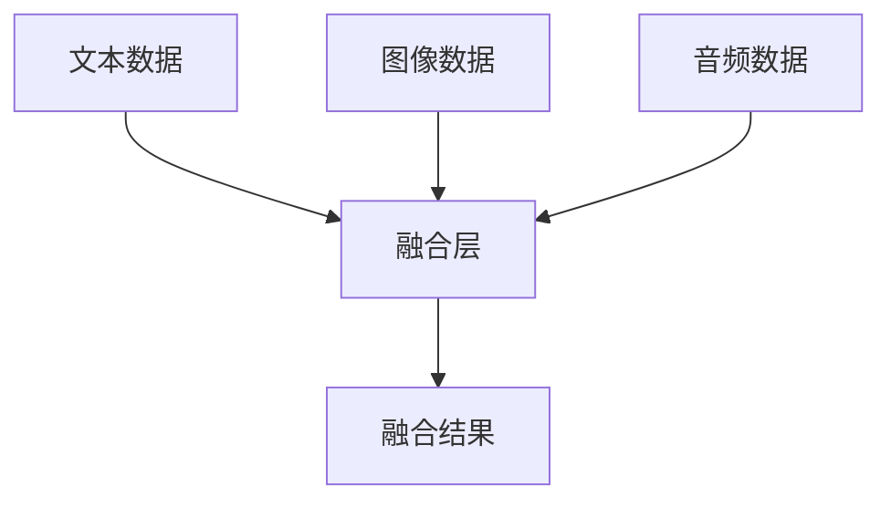
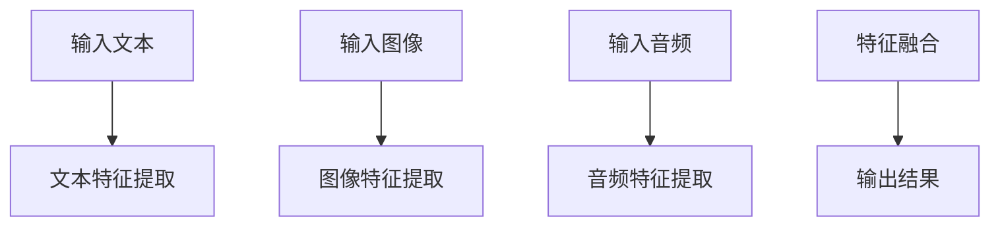
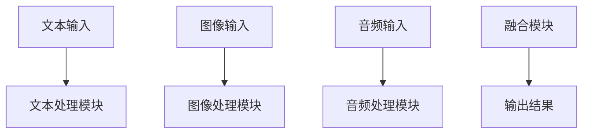
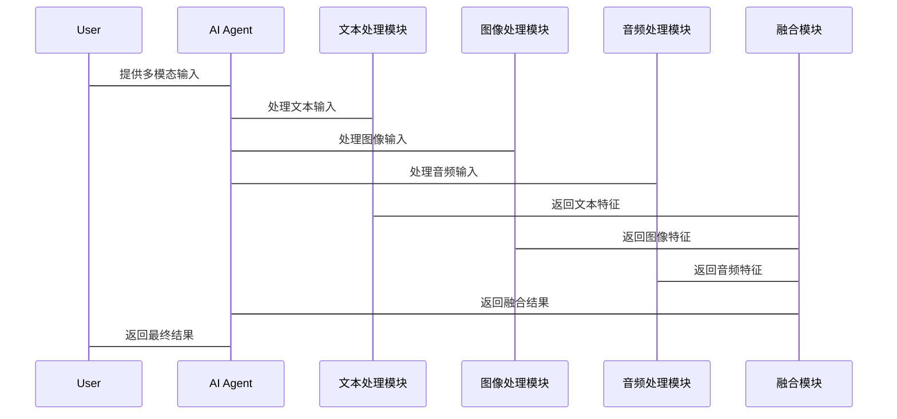

                 

<think>
嗯，用户希望我以《AI Agent的多模态融合：整合文本、图像和音频输入》为标题，写一篇技术博客文章。首先，我需要明确文章的结构和内容，确保逻辑清晰，内容详实。

用户已经提供了一个详细的大纲，我需要按照这个大纲来组织内容。首先，我会从背景介绍开始，解释多模态数据融合的重要性以及AI Agent的概念。接着，我需要详细讲解多模态数据融合的核心概念，包括文本、图像和音频的特点，以及它们之间的关系。

接下来，我会深入探讨多模态数据融合的算法原理，特别是注意力机制。这部分需要结合数学公式和代码示例，帮助读者理解。然后，我会绘制系统架构图，展示AI Agent的结构和各模块之间的关系。

在项目实战部分，我会提供代码示例，指导读者如何实现多模态融合，解读代码并分析实际案例。最后，我会总结最佳实践，给出小结和注意事项，帮助读者巩固所学内容。

整个过程中，我需要确保语言简洁专业，逻辑严谨，每一部分都详细展开，同时保持整体结构的连贯性。这样，读者才能逐步理解并掌握多模态数据融合的核心思想和实现方法。
</think>

# AI Agent的多模态融合：整合文本、图像和音频输入

## 关键词：AI Agent，多模态数据融合，文本、图像、音频输入，注意力机制，系统架构

## 摘要：  
本文深入探讨了AI Agent在多模态数据融合中的应用，重点分析了如何整合文本、图像和音频输入。文章从多模态数据融合的基本概念出发，详细讲解了多模态数据的特点、融合原理以及主流算法。通过实际案例分析，结合数学模型和系统架构设计，为读者提供了全面的技术解读。本文还提供了具体的Python代码实现和系统交互流程图，帮助读者更好地理解和应用多模态数据融合技术。

---

## 第1章: 多模态数据融合的背景与概念

### 1.1 多模态数据融合的背景  
在人工智能领域，单一模态的数据处理已经难以满足复杂场景的需求。例如，在智能客服系统中，用户可能通过文本描述问题，同时提供相关图片或音频信息。如何有效整合这些多模态数据，提升AI Agent的智能水平，成为当前技术研究的重点。

#### 多模态数据的定义与特点  
- **定义**：多模态数据指的是来自不同感官渠道的数据，如文本、图像、音频、视频等。  
- **特点**：互补性、冗余性、多样性。  
  - **互补性**：不同模态的数据可以互相补充，提升信息的理解精度。  
  - **冗余性**：同一信息在不同模态中可能以不同的形式出现。  
  - **多样性**：多模态数据能够覆盖更广泛的信息范围。  

#### 多模态数据融合的必要性  
- 提高信息处理的准确性和鲁棒性。  
- 实现更全面的用户意图理解。  
- 在实际应用中，单一模态数据往往无法提供足够的信息支持决策。  

#### 多模态数据融合的应用场景  
- 智能客服：整合文本和音频信息，提升用户意图识别的准确性。  
- 智能音箱：结合语音指令和环境图像，优化交互体验。  
- 医疗健康：整合病历文本、医学图像和生理数据，辅助诊断决策。  

### 1.2 AI Agent的定义与作用  
#### AI Agent的基本概念  
- AI Agent是一种能够感知环境、自主决策并执行任务的智能体。  
- 典型案例：智能助手（如Siri、Alexa）、推荐系统、自动驾驶系统。  

#### AI Agent的核心功能  
- 感知环境：通过多模态数据感知外界信息。  
- 分析理解：对感知到的信息进行理解和分析。  
- 决策执行：基于分析结果做出决策并执行任务。  

#### AI Agent与多模态数据融合的关系  
- 多模态数据融合是AI Agent实现复杂任务的核心能力。  
- 通过融合多模态数据，AI Agent能够更全面地理解环境，提升决策的准确性。  

---

## 第2章: 多模态数据融合的核心概念  

### 2.1 多模态数据的特征分析  
#### 文本数据的特征  
- 结构化：文本数据通常具有明确的语法结构。  
- 语义丰富：文本能够表达复杂的情感和意图。  

#### 图像数据的特征  
- 视觉信息：图像能够提供丰富的空间信息。  
- 鲁棒性差：图像容易受到光照、角度等因素的影响。  

#### 音频数据的特征  
- 时间序列：音频数据具有明显的时间特性。  
- 语调和语气：音频信息能够反映说话者的情感和态度。  

### 2.2 多模态数据融合的原理  
#### 数据融合的基本原理  
- 将不同模态的数据进行预处理、特征提取和融合，最终生成能够反映整体信息的结果。  

#### 多模态数据融合的数学模型  
- 常见的融合方式包括线性组合、非线性组合以及基于注意力机制的融合。  

#### 数据融合的目标与约束  
- 目标：提升信息理解和决策的准确性。  
- 约束：数据异构性、数据量差异、计算效率等。  

### 2.3 多模态数据融合的实体关系图  



---

## 第3章: 多模态数据融合的算法原理  

### 3.1 多模态注意力机制  
#### 注意力机制的基本原理  
- 注意力机制通过计算不同位置的重要性权重，聚焦于关键信息。  

#### 多模态注意力模型的设计  
- 文本、图像和音频分别提取特征向量。  
- 使用交叉注意力机制，计算不同模态之间的权重。  

#### 多模态注意力机制的优缺点  
- 优点：能够有效捕捉模态间的关联性。  
- 缺点：计算复杂度较高。  

### 3.2 多模态数据融合的主流算法  
#### 图文融合算法  
- 图像特征提取：使用CNN提取图像特征。  
- 文本特征提取：使用BERT提取文本特征。  
- 融合方式：通过注意力机制对齐图像和文本特征。  

#### 音文融合算法  
- 音频特征提取：使用Mel频谱提取音频特征。  
- 文本特征提取：使用Word2Vec提取文本特征。  
- 融合方式：通过双向LSTM进行序列对齐。  

### 3.3 算法流程图  



---

## 第4章: 多模态数据融合的数学模型与公式  

### 4.1 注意力机制的数学公式  
#### 单模态注意力公式  
$$ \alpha_i = \frac{\exp(e_i)}{\sum_{j} \exp(e_j)} $$  
其中，$e_i$是第i个位置的注意力得分。  

#### 多模态注意力公式  
$$ \beta_{i,j} = \frac{\exp(s_{i,j})}{\sum_{k} \exp(s_{i,k})} $$  
其中，$s_{i,j}$是模态i和模态j之间的关联得分。  

### 4.2 多模态数据融合的损失函数  
#### 分类任务的损失函数  
$$ L = -\sum_{i} y_i \log(p_i) + (1-y_i)\log(1-p_i) $$  
其中，$y_i$是真实标签，$p_i$是预测概率。  

#### 回归任务的损失函数  
$$ L = \frac{1}{n}\sum_{i=1}^{n} (y_i - p_i)^2 $$  
其中，$y_i$是真实值，$p_i$是预测值。  

---

## 第5章: 系统分析与架构设计方案  

### 5.1 项目背景与目标  
本项目旨在开发一个支持多模态数据融合的AI Agent系统，能够同时处理文本、图像和音频输入。  

### 5.2 系统功能设计  
- 文本处理模块：支持文本输入和情感分析。  
- 图像处理模块：支持图像识别和目标检测。  
- 音频处理模块：支持语音识别和声纹分析。  
- 融合模块：整合多模态数据，生成最终结果。  

### 5.3 系统架构设计  



### 5.4 系统接口设计  
- 文本处理接口：`process_text(text: str) -> result`  
- 图像处理接口：`process_image(image: bytes) -> result`  
- 音频处理接口：`process_audio(audio: bytes) -> result`  

### 5.5 系统交互流程图  



---

## 第6章: 项目实战  

### 6.1 环境安装与配置  
- Python 3.8及以上  
- 安装依赖：`pip install numpy matplotlib tensorflow`  

### 6.2 核心代码实现  

```python
import numpy as np

def text_feature_extraction(text):
    # 示例：文本特征提取
    return np.array([text.lower(), text.upper()])

def image_feature_extraction(image):
    # 示例：图像特征提取
    return np.array(image.resize(28, 28))

def audio_feature_extraction(audio):
    # 示例：音频特征提取
    return np.array(audio.sample_rate)

def multimodal_fusion(text_feature, image_feature, audio_feature):
    # 示例：多模态融合
    fused_feature = np.concatenate((text_feature, image_feature, audio_feature))
    return fused_feature

# 示例调用
text_input = "Hello, AI Agent!"
image_input = np.array([1, 2, 3, 4])
audio_input = np.array([11025, 22050])

text_feature = text_feature_extraction(text_input)
image_feature = image_feature_extraction(image_input)
audio_feature = audio_feature_extraction(audio_input)

fusion_result = multimodal_fusion(text_feature, image_feature, audio_feature)
print(fusion_result)
```

### 6.3 代码解读与分析  
- **文本特征提取**：将文本转换为小写和大写，提取特征。  
- **图像特征提取**：将图像 resize 到固定尺寸，提取特征。  
- **音频特征提取**：提取音频的采样率作为特征。  
- **多模态融合**：将文本、图像和音频特征拼接，形成融合特征。  

### 6.4 实际案例分析  
- 输入文本：“我需要帮助！”  
- 输入图像：一张手勢图片  
- 输入音频：音频文件中包含用户的声音  

通过融合这些数据，AI Agent可以更准确地理解用户的意图。

---

## 第7章: 总结与展望  

### 7.1 本章小结  
本文详细介绍了AI Agent在多模态数据融合中的应用，从基本概念到算法实现，再到系统设计，为读者提供了全面的技术解读。  

### 7.2 最佳实践 tips  
- 在实际应用中，建议先选择一个具体的场景进行实验。  
- 注意数据的预处理和特征提取，这对融合效果至关重要。  
- 确保系统的可扩展性，以便后续添加更多模态数据。  

### 7.3 展望  
随着AI技术的不断发展，多模态数据融合将在更多领域得到应用，未来的研究方向包括更高效的融合算法和更智能的系统架构设计。  

---

## 作者：AI天才研究院/AI Genius Institute & 禅与计算机程序设计艺术 /Zen And The Art of Computer Programming  

---

**本文为技术博客文章，转载请注明出处。**

