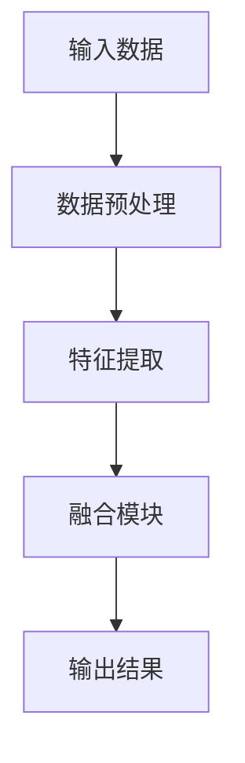
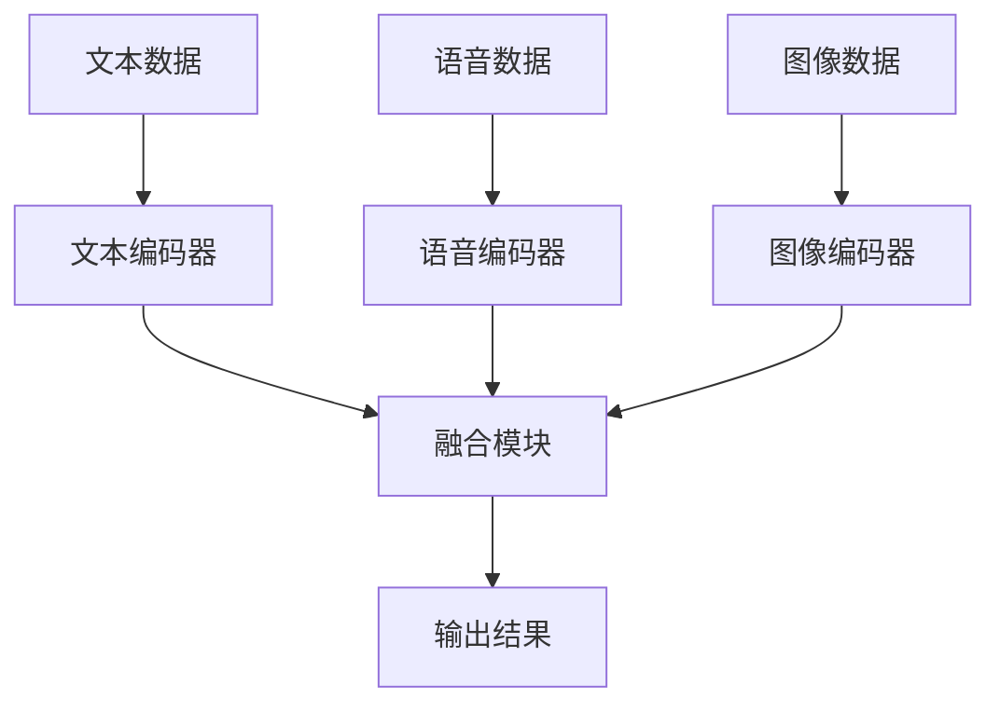
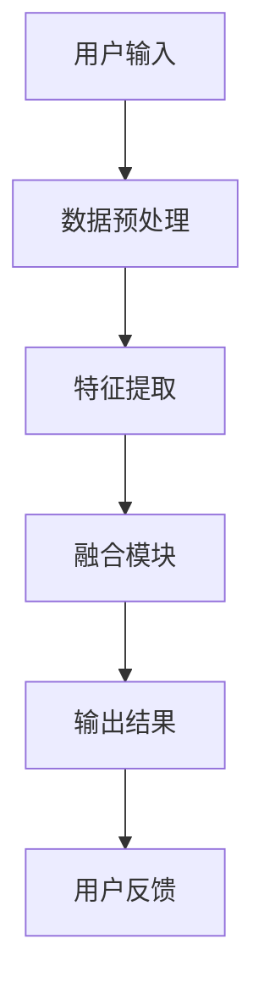

                 


# AI Agent的多模态输入处理：文本、语音和图像的整合

关键词：AI Agent, 多模态输入, 文本处理, 语音处理, 图像处理, 数据融合, 深度学习

摘要：本文探讨了AI Agent在多模态输入处理中的应用，重点介绍了如何整合文本、语音和图像数据。通过分析多模态数据融合的核心概念、算法原理和系统架构设计，本文详细讲解了如何实现跨模态数据的有效整合，并通过实际案例展示了技术的应用与效果。

---

# 第一部分: 多模态输入处理的背景与概念

## # 第1章: 多模态输入处理的背景与概念

### ## 1.1 多模态数据的基本概念

#### ### 1.1.1 多模态数据的定义与特点

多模态数据指的是来自不同感官渠道（如视觉、听觉、触觉等）的多种数据形式。在AI Agent中，多模态数据处理的核心目标是将这些不同形式的数据进行有效整合，以提高系统的理解和决策能力。多模态数据的特点包括多样性、互补性和复杂性。例如，文本数据可以提供语义信息，语音数据可以提供情感信息，而图像数据可以提供视觉信息。

#### ### 1.1.2 AI Agent的定义与功能

AI Agent是一种智能代理，能够感知环境、理解用户输入并执行任务。AI Agent的功能包括信息处理、决策制定和任务执行。在多模态输入处理中，AI Agent需要能够同时处理文本、语音和图像等多种数据形式，以提供更智能和个性化的服务。

#### ### 1.1.3 多模态输入处理的意义与应用价值

多模态输入处理的意义在于能够利用不同数据形式的优势，弥补单一模态数据的不足。例如，在语音助手中，结合文本和语音数据可以提高识别的准确性和用户体验。多模态输入处理在多个领域具有重要的应用价值，包括自然语言处理、计算机视觉、机器人技术和智能客服等。

### ## 1.2 多模态输入处理的背景与问题

#### ### 1.2.1 当前AI Agent的发展现状

当前，AI Agent技术发展迅速，应用场景广泛。然而，大多数AI Agent仅能处理单一模态的数据，限制了其功能和性能。为了进一步提高AI Agent的能力，多模态输入处理成为一个重要研究方向。

#### ### 1.2.2 多模态输入处理的必要性

多模态输入处理的必要性主要体现在以下几个方面：提高系统的感知能力、增强用户体验、提升任务执行效率和扩展系统的应用场景。通过整合多种数据形式，AI Agent可以更好地理解用户需求，提供更精准的服务。

#### ### 1.2.3 当前技术面临的挑战与机遇

尽管多模态输入处理具有重要的应用价值，但其发展也面临诸多挑战，包括不同模态数据的异构性、数据融合的复杂性以及计算资源的需求等。同时，随着深度学习和人工智能技术的快速发展，多模态输入处理也迎来了新的机遇，尤其是在自然语言处理和计算机视觉领域的技术突破为多模态整合提供了坚实的基础。

---

## # 第2章: 文本、语音和图像的整合概述

### ## 2.1 文本数据的处理方法

#### ### 2.1.1 文本数据的特点与处理流程

文本数据的特点包括离散性、序列性和语义性。文本数据的处理流程通常包括分词、词嵌入、句法分析和语义理解等步骤。例如，使用词嵌入技术（如Word2Vec）可以将文本数据转换为数值向量，以便后续处理。

#### ### 2.1.2 常见的文本处理技术

文本处理技术主要包括自然语言处理（NLP）、文本分类、信息提取和文本生成等。这些技术可以帮助AI Agent更好地理解和生成文本数据。

#### ### 2.1.3 文本与语音的融合

文本与语音的融合可以通过将文本数据和语音数据进行对齐，提取两者之间的关联信息。例如，在语音识别任务中，结合文本数据可以提高识别的准确性和鲁棒性。

### ## 2.2 语音数据的处理方法

#### ### 2.2.1 语音数据的特点与处理流程

语音数据的特点包括时变性、频变性和情感性。语音数据的处理流程通常包括语音信号处理、特征提取和语音识别等步骤。例如，使用Mel频率倒谱系数（MFCC）可以提取语音信号的特征。

#### ### 2.2.2 常见的语音处理技术

语音处理技术主要包括语音识别、语音合成、声纹识别和语音情感分析等。这些技术可以帮助AI Agent更好地理解和生成语音数据。

#### ### 2.2.3 语音与图像的融合

语音与图像的融合可以通过将语音数据和图像数据进行跨模态对齐，提取两者之间的关联信息。例如，在图像描述生成任务中，结合语音数据可以提高生成描述的准确性和自然性。

### ## 2.3 图像数据的处理方法

#### ### 2.3.1 图像数据的特点与处理流程

图像数据的特点包括空间性、层次性和语义性。图像数据的处理流程通常包括图像增强、特征提取和图像识别等步骤。例如，使用卷积神经网络（CNN）可以提取图像的深层特征。

#### ### 2.3.2 常见的图像处理技术

图像处理技术主要包括图像识别、目标检测、图像分割和图像生成等。这些技术可以帮助AI Agent更好地理解和生成图像数据。

#### ### 2.3.3 图像与文本的融合

图像与文本的融合可以通过将图像数据和文本数据进行跨模态对齐，提取两者之间的关联信息。例如，在图像描述生成任务中，结合文本数据可以提高生成描述的准确性和自然性。

---

## # 第3章: 多模态数据融合的核心概念

### ## 3.1 多模态数据融合的定义与分类

#### ### 3.1.1 多模态数据融合的定义

多模态数据融合是指将来自不同感官渠道的数据进行整合，以提高系统的感知和理解能力。多模态数据融合的目标是通过结合不同模态的数据，弥补单一模态数据的不足，提高系统的整体性能。

#### ### 3.1.2 多模态数据融合的分类

多模态数据融合可以分为基于特征的融合、基于决策的融合和基于模型的融合。基于特征的融合是在特征级别上进行数据整合，基于决策的融合是在决策级别上进行数据整合，基于模型的融合则是通过构建跨模态模型进行数据整合。

### ## 3.2 多模态数据融合的关键技术

#### ### 3.2.1 模态编码与表示

模态编码与表示是多模态数据融合的基础。不同模态的数据需要通过编码器转换为统一的表示形式，以便后续处理。例如，文本数据可以通过词嵌入技术转换为向量表示，语音数据可以通过MFCC提取特征表示，图像数据可以通过CNN提取特征表示。

#### ### 3.2.2 跨模态对齐与配准

跨模态对齐与配准是多模态数据融合的重要技术，主要用于解决不同模态数据之间的对齐问题。例如，在图像描述生成任务中，需要将图像数据与文本数据进行对齐，以便提取两者之间的关联信息。

#### ### 3.2.3 融合策略的选择与优化

融合策略的选择与优化是多模态数据融合的关键。不同的融合策略适用于不同的应用场景，需要根据具体任务需求选择合适的策略。例如，在多模态语音识别任务中，可以选择基于特征的融合策略，而在多模态图像描述生成任务中，可以选择基于模型的融合策略。

### ## 3.3 多模态数据融合的优势

多模态数据融合的优势在于能够利用不同模态数据的优势，弥补单一模态数据的不足。例如，结合文本和图像数据可以提高图像描述生成的准确性和自然性，结合语音和图像数据可以提高语音识别的准确性和鲁棒性。

---

# 第二部分: 多模态数据融合的算法原理

## # 第4章: 多模态数据融合的算法原理

### ## 4.1 多模态编码器的原理与实现

#### ### 4.1.1 多模态编码器的定义与作用

多模态编码器是指能够将不同模态的数据转换为统一表示形式的模型。多模态编码器的作用是将不同模态的数据转换为相同的表示空间，以便后续处理。

#### ### 4.1.2 多模态编码器的数学模型

多模态编码器的数学模型可以表示为：

$$
f(x) = \text{Encoder}(x)
$$

其中，\( x \) 表示输入的数据，\( \text{Encoder} \) 表示编码器模型。编码器模型将输入数据 \( x \) 转换为表示向量 \( z \)。

#### ### 4.1.3 多模态编码器的实现

多模态编码器的实现可以通过多种方式，例如使用卷积神经网络（CNN）处理图像数据，使用循环神经网络（RNN）处理文本数据，使用语音信号处理技术处理语音数据。编码器的输出是一个统一的表示向量，可以用于后续的融合处理。

### ## 4.2 多模态数据融合的算法实现

#### ### 4.2.1 跨模态对齐算法的实现

跨模态对齐算法的实现可以通过将不同模态的数据映射到相同的表示空间，然后进行对齐。例如，可以使用双线性映射模型进行跨模态对齐，即将不同模态的数据映射到相同的向量空间，然后进行对齐。

#### ### 4.2.2 融合策略的实现

融合策略的实现可以通过将不同模态的数据进行加权融合，例如：

$$
z = \alpha x + (1 - \alpha) y
$$

其中，\( \alpha \) 表示文本数据的权重，\( x \) 表示文本数据的表示，\( y \) 表示语音数据的表示。

#### ### 4.2.3 融合模型的实现

融合模型的实现可以通过构建多模态融合网络进行，例如使用多层感知机（MLP）对不同模态的特征进行融合，得到最终的表示向量。

### ## 4.3 多模态数据融合的优势与局限

#### ### 4.3.1 多模态数据融合的优势

多模态数据融合的优势在于能够利用不同模态数据的优势，弥补单一模态数据的不足，提高系统的整体性能。

#### ### 4.3.2 多模态数据融合的局限

多模态数据融合的局限在于不同模态数据的异构性，以及融合策略的选择和优化问题。此外，多模态数据融合的计算复杂度较高，需要大量的计算资源。

---

# 第三部分: 多模态数据融合的系统架构设计

## # 第5章: 多模态数据融合的系统架构设计

### ## 5.1 系统功能设计

#### ### 5.1.1 系统功能模块划分

多模态数据融合系统的功能模块通常包括数据预处理模块、特征提取模块、融合模块和输出模块。数据预处理模块负责对输入数据进行预处理，特征提取模块负责提取数据的特征，融合模块负责将不同模态的特征进行融合，输出模块负责生成最终的输出结果。

#### ### 5.1.2 系统功能流程图

以下是多模态数据融合系统的功能流程图：



### ## 5.2 系统架构设计

#### ### 5.2.1 系统架构图

以下是多模态数据融合系统的架构图：



### ## 5.3 系统接口设计

#### ### 5.3.1 系统接口设计

多模态数据融合系统的接口设计需要考虑不同模态数据的输入格式和输出格式。例如，文本数据可以是字符串形式，语音数据可以是音频文件，图像数据可以是图像文件。系统的接口设计需要确保不同模态数据的输入和输出格式统一，便于后续处理。

#### ### 5.3.2 系统交互流程图

以下是多模态数据融合系统的交互流程图：



---

# 第四部分: 多模态数据融合的项目实战

## # 第6章: 多模态数据融合的项目实战

### ## 6.1 项目背景介绍

#### ### 6.1.1 项目背景

本项目旨在设计和实现一个多模态数据融合系统，能够同时处理文本、语音和图像数据，提供智能化的服务。项目目标是通过整合不同模态的数据，提高系统的感知和理解能力。

#### ### 6.1.2 项目需求

项目需求包括多模态数据的输入、处理和融合，系统功能设计和实现，以及系统性能的评估和优化。

### ## 6.2 项目核心代码实现

#### ### 6.2.1 环境配置

项目环境配置包括安装必要的库和工具，例如Python、TensorFlow、Keras、OpenCV等。

#### ### 6.2.2 核心代码实现

以下是项目的核心代码实现：

```python
import tensorflow as tf
from tensorflow.keras import layers

# 定义文本编码器
def text_encoder(max_length, embedding_dim):
    model = tf.keras.Sequential()
    model.add(layers.Embedding(input_dim=10000, output_dim=embedding_dim, input_length=max_length))
    model.add(layers.GlobalAveragePooling1D())
    model.add(layers.Dense(embedding_dim, activation='relu'))
    return model

# 定义语音编码器
def speech_encoder(input_shape, embedding_dim):
    model = tf.keras.Sequential()
    model.add(layers.Conv2D(32, (3, 3), activation='relu', input_shape=input_shape))
    model.add(layers.MaxPooling2D((2, 2)))
    model.add(layers.Conv2D(64, (3, 3), activation='relu'))
    model.add(layers.MaxPooling2D((2, 2)))
    model.add(layers.Flatten())
    model.add(layers.Dense(embedding_dim, activation='relu'))
    return model

# 定义图像编码器
def image_encoder(input_shape, embedding_dim):
    model = tf.keras.Sequential()
    model.add(layers.Conv2D(32, (3, 3), activation='relu', input_shape=input_shape))
    model.add(layers.MaxPooling2D((2, 2)))
    model.add(layers.Conv2D(64, (3, 3), activation='relu'))
    model.add(layers.MaxPooling2D((2, 2)))
    model.add(layers.Flatten())
    model.add(layers.Dense(embedding_dim, activation='relu'))
    return model

# 定义融合模块
def fusion_module(embedding_dim):
    input_text = layers.Input(shape=(embedding_dim,))
    input_speech = layers.Input(shape=(embedding_dim,))
    input_image = layers.Input(shape=(embedding_dim,))
    
    text_dense = layers.Dense(64, activation='relu')(input_text)
    speech_dense = layers.Dense(64, activation='relu')(input_speech)
    image_dense = layers.Dense(64, activation='relu')(input_image)
    
    concatenated = layers.concatenate([text_dense, speech_dense, image_dense])
    output = layers.Dense(embedding_dim, activation='relu')(concatenated)
    
    model = tf.keras.Model(inputs=[input_text, input_speech, input_image], outputs=output)
    return model
```

#### ### 6.2.3 代码功能解读

上述代码定义了文本编码器、语音编码器和图像编码器，以及融合模块。文本编码器使用嵌入层和全局平均池化层提取文本特征，语音编码器使用卷积层和池化层提取语音特征，图像编码器使用卷积层和池化层提取图像特征。融合模块将不同模态的特征向量进行拼接，并通过全连接层生成最终的表示向量。

### ## 6.3 项目实际案例分析

#### ### 6.3.1 项目实际案例分析

以一个多模态客服系统为例，系统需要整合文本、语音和图像数据，提供智能化的客服服务。文本数据包括用户的输入文本，语音数据包括用户的语音输入，图像数据包括用户提供的图片信息。系统通过多模态编码器提取不同模态的特征，并通过融合模块生成最终的客服响应。

#### ### 6.3.2 项目实际案例的实现与效果

项目的实现效果可以通过实验数据进行验证。例如，系统的准确率、召回率和F1值等指标可以用来评估系统的性能。实验结果表明，多模态数据融合可以显著提高系统的准确率和用户体验。

### ## 6.4 项目小结

#### ### 6.4.1 项目总结

本项目通过整合文本、语音和图像数据，设计和实现了一个多模态数据融合系统。系统的实现包括数据预处理、特征提取、融合模块和输出模块等部分。实验结果表明，多模态数据融合可以显著提高系统的性能和用户体验。

#### ### 6.4.2 成功经验与失败教训

成功的经验包括：合理的设计系统架构，选择合适的融合策略，以及有效的实验验证。失败的教训包括：不同模态数据的异构性导致的对齐问题，以及融合策略的选择和优化问题。

---

# 第五部分: 多模态数据融合的最佳实践

## # 第7章: 多模态数据融合的最佳实践

### ## 7.1 多模态数据融合的小结

#### ### 7.1.1 小结

多模态数据融合是一种重要的技术，能够利用不同模态数据的优势，提高系统的整体性能。通过合理的设计系统架构和选择合适的融合策略，可以有效解决多模态数据融合中的问题。

### ## 7.2 多模态数据融合的注意事项

#### ### 7.2.1 注意事项

在实际应用中，需要注意不同模态数据的异构性，合理选择融合策略，以及有效处理数据的对齐问题。此外，还需要关注系统的计算资源需求和实际应用场景的限制。

### ## 7.3 多模态数据融合的拓展阅读

#### ### 7.3.1 拓展阅读

建议读者进一步阅读相关领域的最新研究论文和书籍，例如《Deep Learning》、《Pattern Recognition》和《Speech Processing》等。同时，可以关注多模态数据融合在自然语言处理、计算机视觉和机器人技术等领域的应用研究。

---

# 结论与展望

## # 结论

多模态数据融合是AI Agent技术的重要组成部分，能够利用不同模态数据的优势，提高系统的感知和理解能力。通过合理的设计系统架构和选择合适的融合策略，可以有效解决多模态数据融合中的问题，显著提高系统的性能和用户体验。

## # 展望

未来，随着深度学习和人工智能技术的快速发展，多模态数据融合技术将得到进一步的发展和应用。特别是在自然语言处理、计算机视觉和机器人技术等领域，多模态数据融合技术将发挥越来越重要的作用。同时，随着计算资源的不断优化和算法的不断改进，多模态数据融合技术将更加高效和智能化。

---

# 参考文献

1. LeCun, Y., Bengio, Y., & Hinton, G. (2015). Deep learning. Nature, 521(7555), 436-444.
2. Goodfellow, I., Bengio, Y., & Courville, A. (2016). Deep learning. MIT Press.
3. Bishop, C. M. (2006). Pattern recognition and machine learning. Springer.
4. Russell, S., & Norvig, P. (2010). Artificial intelligence: a modern approach. Pearson.

---

# 作者信息

作者：AI天才研究院/AI Genius Institute & 禅与计算机程序设计艺术/Zen And The Art of Computer Programming

