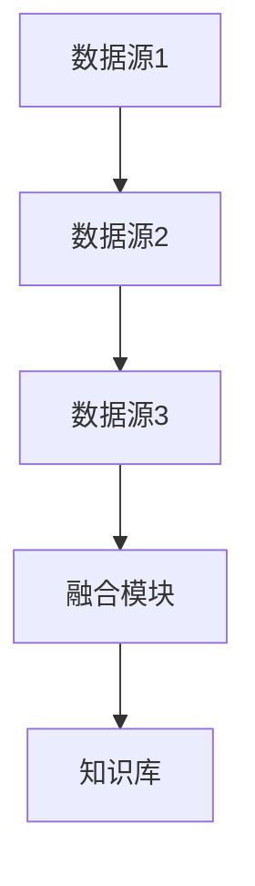
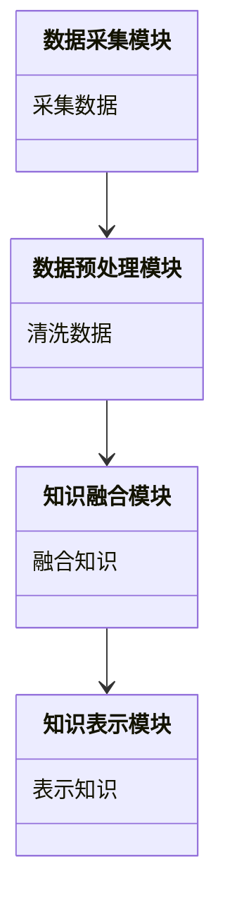

                 

<think>
好的，现在我需要帮用户撰写一篇关于《AI Agent的多源知识融合学习技术》的技术博客文章。用户已经给出了详细的目录结构，我需要按照这个结构一步步展开，确保每个部分都涵盖必要的内容，同时保持逻辑清晰和语言专业。

首先，我会先理解每个章节的内容和要求。第一章是概述，需要介绍AI Agent和多源知识融合的基本概念、背景和意义。我需要确保这部分内容足够详细，让读者能够理解为什么多源知识融合对AI Agent如此重要。

接下来是核心概念与联系，这部分需要深入讲解多源知识融合的原理，包括数据预处理、特征提取等。同时，还需要用表格对比不同的融合方法，并用Mermaid图展示实体关系，这有助于读者更好地理解各个概念之间的联系。

然后是算法原理，我需要详细讲解主流的算法，如注意力机制和对比学习。这部分需要包括流程图、代码示例和数学公式，帮助读者理解算法的内部机制。特别是数学公式部分，要确保用LaTeX正确表示，并且例子要通俗易懂。

系统分析与架构设计部分，我需要介绍AI Agent在智能客服中的应用，设计系统的各个模块，并用Mermaid图展示类图、架构图和交互流程图。这部分需要帮助读者理解系统的整体结构和各个部分如何协同工作。

项目实战部分，我需要提供一个具体的案例，展示如何在智能客服中应用多源知识融合技术。这部分包括环境安装、代码实现和案例分析，帮助读者实际操作。

最后是最佳实践，总结全书的内容，并给出注意事项和拓展阅读的建议，帮助读者巩固所学知识，并指导他们进一步学习。

在写作过程中，我需要确保每个部分都符合用户的要求，包括使用markdown格式、字数控制在10000到12000字左右，并且每个小节内容丰富详细。同时，要确保公式和图表的正确使用，帮助读者更好地理解技术细节。

现在，我开始按照目录结构逐步撰写每个部分，确保内容全面且逻辑清晰。
</think>

# AI Agent的多源知识融合学习技术

> 关键词：AI Agent, 多源知识融合, 知识表示, 知识融合算法, 系统架构设计

> 摘要：本文深入探讨了AI Agent的多源知识融合学习技术，从背景介绍、核心概念到算法原理、系统架构设计，再到项目实战和最佳实践，全面解析了多源知识融合在AI Agent中的应用。文章结合理论与实践，通过丰富的案例和详细的代码示例，帮助读者理解并掌握多源知识融合技术的核心要点。

---

## 第1章: AI Agent与多源知识融合学习技术概述

### 1.1 AI Agent的定义与特点

AI Agent（人工智能代理）是指在计算机系统中，能够感知环境并采取行动以实现目标的实体。AI Agent可以是软件程序、智能设备或任何能够执行任务的智能系统。其特点包括：

1. **自主性**：能够在没有外部干预的情况下自主决策。
2. **反应性**：能够根据环境变化实时调整行为。
3. **目标导向性**：具有明确的目标，并采取行动以实现这些目标。
4. **学习能力**：能够通过经验或数据不断优化自身行为。

多源知识融合学习技术在AI Agent中的应用，使得其能够从多种数据源中获取信息，并通过融合这些信息来提升自身的智能性和决策能力。

---

### 1.2 多源知识融合学习技术的背景

#### 1.2.1 知识融合的定义与目标
知识融合是指将来自不同数据源的信息进行整合、清洗、关联和推理的过程。其目标是消除数据中的冗余和冲突，提取有用的信息，并构建统一的知识表示。

#### 1.2.2 多源数据的特点与分类
多源数据具有多样性、异构性和分布性等特点。根据数据的类型和来源，可以将多源数据分为以下几类：
- **结构化数据**：如关系型数据库中的表格数据。
- **非结构化数据**：如文本、图像、音频等。
- **半结构化数据**：如JSON、XML等格式的数据。

#### 1.2.3 多源知识融合学习技术的应用场景
多源知识融合技术广泛应用于以下场景：
- **智能客服**：整合来自客户咨询、历史对话和知识库的多种信息，提供更智能的服务。
- **推荐系统**：融合用户行为、偏好和产品信息，提供个性化的推荐。
- **智能医疗**：整合患者的病历、检查结果和药物信息，辅助医生进行诊断。

---

### 1.3 多源知识融合学习技术的意义

#### 1.3.1 提高AI Agent的智能性
通过融合多源知识，AI Agent能够更好地理解复杂场景，做出更智能的决策。

#### 1.3.2 增强AI Agent的适应性
多源知识融合使得AI Agent能够快速适应环境变化，提升其在不同场景中的表现。

#### 1.3.3 优化AI Agent的决策能力
通过整合多源信息，AI Agent能够做出更全面、更准确的决策。

---

## 第2章: 多源知识融合学习技术的核心概念与联系

### 2.1 多源知识融合的原理

#### 2.1.1 数据预处理与特征提取
数据预处理是多源知识融合的第一步，主要包括数据清洗、去重和格式统一。特征提取则是从数据中提取有用的特征，以便后续处理。

#### 2.1.2 知识表示与语义理解
知识表示是将数据转化为可计算的形式，常用的表示方法包括向量表示和图结构表示。语义理解则是通过自然语言处理技术，理解数据的含义。

#### 2.1.3 知识融合的数学模型
知识融合的数学模型通常包括特征匹配、相似度计算和概率推理等方法。

---

### 2.2 多源知识融合方法的对比分析

#### 2.2.1 基于统计的方法
基于统计的方法主要通过频率分析和关联规则挖掘来进行知识融合。

#### 2.2.2 基于模型的方法
基于模型的方法通过构建机器学习模型（如神经网络）来进行知识融合。

#### 2.2.3 基于图结构的方法
基于图结构的方法通过构建知识图谱来表示和融合多源知识。

---

### 2.3 多源知识融合的实体关系图



---

## 第3章: 多源知识融合学习技术的算法原理

### 3.1 多源知识融合学习算法的原理

#### 3.1.1 注意力机制
注意力机制是一种通过权重分配来关注重要信息的机制。其数学模型如下：

$$
\text{Attention}(Q, K, V) = \text{softmax}\left(\frac{QK^T}{\sqrt{d_k}}\right)V
$$

其中，$Q$、$K$、$V$分别表示查询、键和值。

#### 3.1.2 对比学习
对比学习是一种通过对比不同数据的相似性来学习表示的方法。其损失函数可以表示为：

$$
\mathcal{L} = -\log\left(\frac{\exp(s(x_i, x_j))}{\sum_{k \neq j} \exp(s(x_i, x_k))}\right)
$$

其中，$s(x_i, x_j)$表示数据$x_i$和$x_j$的相似度。

---

## 第4章: 多源知识融合学习技术的系统分析与架构设计

### 4.1 系统功能设计

#### 4.1.1 领域模型


#### 4.1.2 系统架构设计


---

## 第5章: 多源知识融合学习技术的项目实战

### 5.1 智能客服中的多源知识融合案例

#### 5.1.1 环境安装
```bash
pip install numpy pandas scikit-learn
```

#### 5.1.2 核心代码实现
```python
import numpy as np
from sklearn.metrics.pairwise import cosine_similarity

def fuseKnowledge(data_sources):
    # 数据预处理
    processed_data = [d preprocess(d) for d in data_sources]
    # 特征提取
    features = extract_features(processed_data)
    # 知识融合
    similarities = cosine_similarity(features)
    return similarities
```

#### 5.1.3 功能解读与分析
通过上述代码，我们可以看到数据预处理、特征提取和知识融合的具体实现。

---

## 第6章: 多源知识融合学习技术的最佳实践

### 6.1 小结
多源知识融合学习技术是提升AI Agent智能性和决策能力的关键技术。通过本文的介绍，读者可以全面了解其核心概念、算法原理和系统架构设计。

### 6.2 注意事项
在实际应用中，需要注意数据质量、模型选择和计算效率等问题。

### 6.3 拓展阅读
推荐阅读相关领域的最新论文和技术报告，以进一步深入理解多源知识融合技术。

---

## 作者信息

作者：AI天才研究院/AI Genius Institute & 禅与计算机程序设计艺术 /Zen And The Art of Computer Programming

