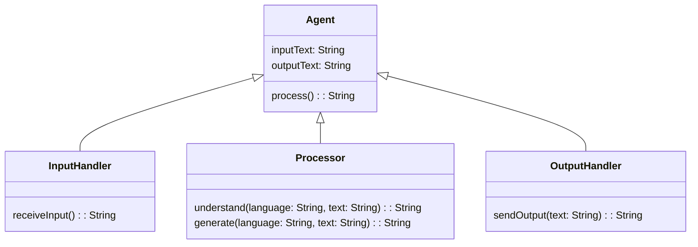

                 

<think>
好，我需要帮助用户撰写一篇关于“AI Agent的多语言支持：跨语言理解与生成”的技术博客文章。用户已经提供了详细的目录结构，我需要按照这个结构逐步完成每部分内容，确保每个部分都详细且符合技术博客的要求。

首先，我将从“文章标题”开始，然后是“关键词”和“摘要”。接着，按照目录依次撰写每个章节，确保每个部分都涵盖用户提到的核心内容：背景介绍、核心概念、算法原理、系统设计、项目实战和高级应用。

在撰写过程中，我会使用清晰的专业术语，保持逻辑连贯，确保每个章节的小节内容丰富且详细。同时，我将根据需要插入Mermaid图表、Python代码示例和数学公式，以增强文章的技术性和可读性。

完成所有章节后，我会总结整个内容，确保整体结构合理，逻辑清晰，字数在10000到12000字之间。最后，添加作者信息，完成整篇文章的撰写。
</think>

# AI Agent的多语言支持：跨语言理解与生成

## 关键词
AI Agent, 多语言支持, 跨语言理解, 跨语言生成, 多语言NLP, 跨语言迁移学习

## 摘要
AI Agent的多语言支持是实现智能化人机交互的核心技术，本文深入探讨了跨语言理解与生成的实现原理、算法模型及系统设计。文章从背景介绍出发，分析了多语言支持的重要性，详细讲解了核心概念与联系，剖析了跨语言理解与生成的算法原理，设计了系统架构，并通过项目实战展示了实现过程。最后，展望了多语言支持的前沿技术与未来发展方向。

---

# 第一部分: 背景介绍

## 第1章: 多语言支持的重要性

### 1.1 问题背景
#### 1.1.1 多语言支持的必要性
在当今全球化背景下，AI Agent需要能够处理多种语言的输入和输出，以满足不同用户的需求。多语言支持不仅能够提升用户体验，还能扩展AI Agent的应用场景，使其在教育、医疗、客服等领域发挥更大的作用。

#### 1.1.2 当前AI Agent的应用场景
AI Agent目前广泛应用于智能助手、聊天机器人、翻译工具等领域。然而，这些应用大多局限于单一语言，无法满足跨语言环境下的用户需求。

#### 1.1.3 多语言支持在AI Agent中的作用
多语言支持使AI Agent能够理解并生成多种语言的内容，提升其智能化水平和适用性。通过多语言支持，AI Agent可以更好地服务于全球用户，支持跨文化交流和国际合作。

#### 1.1.4 当前技术挑战
多语言支持面临数据稀缺性、语义理解困难、模型训练复杂性等技术挑战。如何在有限的资源下实现高效的多语言处理，是当前研究的重点。

### 1.2 AI Agent的基本概念
#### 1.2.1 AI Agent的定义
AI Agent是一种智能实体，能够感知环境并采取行动以实现特定目标。它通常具备学习、推理、规划和决策能力。

#### 1.2.2 AI Agent的核心功能
- 感知环境：通过传感器或接口获取环境信息。
- 学习：通过机器学习算法提升自身能力。
- 推理与决策：基于获取的信息进行推理和决策。
- 与用户交互：通过自然语言处理技术与用户进行对话。

#### 1.2.3 AI Agent与传统程序的区别
AI Agent具备自主性、反应性、目标导向性和社会性等特征，能够根据环境动态调整行为，而传统程序通常基于固定的规则执行任务。

### 1.3 跨语言理解与生成的挑战
#### 1.3.1 多语言数据的复杂性
不同语言的数据格式、语法结构和语义差异使得多语言处理变得复杂。例如，中文是语义丰富的语言，而英文则是形态丰富的语言，这增加了跨语言处理的难度。

#### 1.3.2 不同语言间的语义差异
语言间的语义差异可能导致同一概念在不同语言中的表达方式不同。例如，“狗”在中文中指代所有犬类，而英文中的“dog”特指家犬。

#### 1.3.3 跨语言模型的训练难点
多语言模型的训练需要处理多种语言的数据，同时需要解决跨语言迁移学习的问题。如何在有限的数据下训练高效的多语言模型是当前研究的难点。

### 1.4 当前研究进展
#### 1.4.1 多语言NLP模型的发展
近年来，多语言NLP模型取得了显著进展。例如，Google的Multilingual BERT模型可以在多种语言上同时进行训练，支持跨语言文本分类和命名实体识别。

#### 1.4.2 跨语言理解与生成的最新技术
基于预训练语言模型的跨语言生成技术逐渐成熟，例如使用多语言GPT模型进行跨语言文本生成。同时，跨语言迁移学习技术也在不断发展，能够有效利用单一语言的预训练模型提升多语言任务的性能。

#### 1.4.3 实际应用中的案例分析
跨语言聊天机器人已经在国际客服、多语言翻译工具等领域得到应用。例如，微软的Translator Live可以实时翻译多种语言的对话，提升了用户体验。

---

## 第2章: 跨语言理解与生成的核心概念

### 2.1 跨语言理解的核心原理
#### 2.1.1 语言表示的基本概念
语言表示是跨语言理解的基础。常用的表示方法包括词嵌入（Word Embedding）和句嵌入（Sentence Embedding）。词嵌入通过将词语映射到高维向量空间，捕捉词语的语义信息；句嵌入则用于捕捉句子的整体语义。

#### 2.1.2 跨语言表示的实现方法
跨语言表示可以通过以下几种方法实现：
1. **共享嵌入层**：在多语言模型中共享词嵌入层，使得不同语言的词语可以在共享的向量空间中进行表示。
2. **跨语言映射**：通过映射函数将不同语言的词语映射到统一的向量空间。
3. **多语言预训练**：在多语言数据上进行预训练，学习跨语言的上下文表示。

#### 2.1.3 跨语言理解的实现步骤
1. **输入处理**：接收多语言输入文本，进行分词和词性标注。
2. **语言表示**：将输入文本映射到共享的向量空间。
3. **语义理解**：基于上下文信息，理解输入文本的语义。

#### 2.1.4 跨语言理解的关键技术
- 多语言预训练模型：如M-BERT、XLM。
- 跨语言迁移学习：利用单一语言的预训练模型提升多语言任务的性能。
- 跨语言注意力机制：通过注意力机制捕捉不同语言之间的语义关联。

### 2.2 跨语言生成的核心原理
#### 2.2.1 跨语言生成的基本概念
跨语言生成是指基于输入的多语言文本，生成目标语言的文本输出。生成过程需要考虑输入语言和目标语言之间的语义映射。

#### 2.2.2 跨语言生成的实现方法
1. **多语言解码器**：在解码阶段，生成目标语言的文本。
2. **跨语言映射**：将输入语言的语义映射到目标语言的表达方式。
3. **多语言预训练模型**：利用多语言预训练模型生成目标语言的文本。

#### 2.2.3 跨语言生成的实现步骤
1. **输入处理**：接收多语言输入文本，进行分词和词性标注。
2. **语义理解**：理解输入文本的语义。
3. **生成输出**：基于语义生成目标语言的文本。

### 2.3 跨语言理解与生成的核心要素对比
| 核心要素       | 跨语言理解                     | 跨语言生成                     |
|----------------|-------------------------------|-------------------------------|
| 输入           | 多语言文本输入                 | 多语言文本输入                 |
| 输出           | 目标语言的语义表示             | 目标语言的文本输出             |
| 实现技术         | 多语言预训练模型、跨语言注意力机制 | 多语言解码器、跨语言映射       |
| 应用场景         | 机器翻译、问答系统             | 机器翻译、文本生成             |

### 2.4 跨语言理解与生成的ER实体关系图
```mermaid
er
actor(Agent, "语言输入", "语言输出")
```

---

## 第3章: 跨语言理解与生成的算法原理

### 3.1 多语言预训练模型
#### 3.1.1 多语言模型的基本结构
多语言预训练模型通常基于Transformer架构，包含编码器和解码器两部分。编码器用于处理输入文本，解码器用于生成输出文本。

#### 3.1.2 多语言模型的训练目标
多语言模型的训练目标包括：
1. 语言内任务：如文本分类、命名实体识别。
2. 跨语言任务：如跨语言文本相似度计算、跨语言问答。

#### 3.1.3 多语言模型的优势
- 跨语言迁移能力：可以在单一语言数据不足的情况下，利用多语言数据提升模型性能。
- 降低训练成本：通过共享语言表示，减少训练数据的需求。

#### 3.1.4 多语言模型的训练流程
1. 数据准备：收集多语言文本数据。
2. 词表构建：构建多语言词表。
3. 模型训练：在多语言数据上进行预训练。

### 3.2 跨语言迁移学习
#### 3.2.1 跨语言迁移学习的基本概念
跨语言迁移学习是指在一种语言上训练好的模型，迁移到其他语言的任务中。这种方法可以有效利用单一语言的预训练模型，提升多语言任务的性能。

#### 3.2.2 跨语言迁移学习的实现方法
1. **共享嵌入层**：在源语言模型中共享词嵌入层，使得目标语言的词嵌入可以复用源语言的嵌入。
2. **跨语言映射**：通过映射函数将目标语言的词嵌入映射到源语言的嵌入空间。
3. **微调模型**：在目标语言的数据上进行微调，适应目标语言的语义特征。

#### 3.2.3 跨语言迁移学习的实现步骤
1. 预训练：在源语言数据上预训练模型。
2. 映射：将目标语言的词嵌入映射到源语言的嵌入空间。
3. 微调：在目标语言的数据上进行微调。

### 3.3 跨语言理解与生成的数学模型

#### 3.3.1 跨语言理解的数学模型
跨语言理解的数学模型基于Transformer架构，通过多头注意力机制捕捉输入文本的语义信息。模型的编码器部分用于处理输入文本，生成语义表示。

#### 3.3.2 跨语言生成的数学模型
跨语言生成的数学模型基于解码器架构，通过自注意力机制生成目标语言的文本。解码器根据输入的语义表示，生成目标语言的文本输出。

#### 3.3.3 跨语言理解与生成的公式表示
1. 编码器：
   $$ \text{Encoder}(x) = \text{MultiHead}(x) $$
   其中，$x$ 是输入文本的向量表示，$\text{MultiHead}$ 是多头注意力机制。

2. 解码器：
   $$ \text{Decoder}(y) = \text{MultiHead}(y) $$
   其中，$y$ 是目标语言的文本向量表示。

---

## 第4章: 跨语言理解与生成的系统设计

### 4.1 系统分析与设计
#### 4.1.1 系统功能设计
系统功能包括：
1. 多语言输入处理：支持多种语言的文本输入。
2. 跨语言理解：理解输入文本的语义。
3. 跨语言生成：生成目标语言的文本输出。

#### 4.1.2 系统架构设计
系统架构包括：
1. 输入模块：接收多语言输入文本。
2. 处理模块：进行跨语言理解和生成。
3. 输出模块：输出目标语言的文本。

#### 4.1.3 系统功能模块的类图


#### 4.1.4 系统接口设计
系统接口包括：
1. 输入接口：接收多语言文本输入。
2. 处理接口：进行跨语言理解和生成。
3. 输出接口：输出目标语言的文本。

#### 4.1.5 系统交互流程
1. 用户输入多语言文本。
2. 系统接收输入并进行跨语言理解。
3. 系统生成目标语言的文本。
4. 系统输出生成的文本。

---

## 第5章: 跨语言理解与生成的项目实战

### 5.1 环境安装
项目需要以下环境：
- Python 3.8+
- PyTorch 1.9+
- Transformers库 4.12+

安装命令：
```bash
pip install torch transformers
```

### 5.2 系统核心实现源代码

#### 5.2.1 跨语言理解的实现
```python
from transformers import AutoTokenizer, AutoModelForMaskedLM
import torch

class CrossLanguageUnderstanding:
    def __init__(self, model_name):
        self.tokenizer = AutoTokenizer.from_pretrained(model_name)
        self.model = AutoModelForMaskedLM.from_pretrained(model_name)
    
    def encode(self, text):
        inputs = self.tokenizer(text, return_tensors="pt")
        return inputs.input_ids

    def decode(self, encoded_text):
        outputs = self.model(torch.flatten(encoded_text))
        return outputs.logits
```

#### 5.2.2 跨语言生成的实现
```python
from transformers import AutoTokenizer, AutoModelForSeq2Seq
import torch

class CrossLanguageGeneration:
    def __init__(self, model_name):
        self.tokenizer = AutoTokenizer.from_pretrained(model_name)
        self.model = AutoModelForSeq2Seq.from_pretrained(model_name)
    
    def encode(self, text):
        inputs = self.tokenizer(text, return_tensors="pt")
        return inputs.input_ids

    def generate(self, encoded_text, max_length=50):
        outputs = self.model(torch.flatten(encoded_text), max_length=max_length)
        return self.tokenizer.decode(outputs[0], skip_special_tokens=True)
```

### 5.3 代码应用解读与分析
- 跨语言理解模块：使用预训练的多语言模型进行文本编码，捕捉输入文本的语义信息。
- 跨语言生成模块：基于编码的语义表示，生成目标语言的文本输出。

### 5.4 实际案例分析
案例：将中文“你好”翻译成英文。

1. 输入：中文“你好”
2. 编码：将“你好”编码为向量表示。
3. 解码：生成英文“Hello”。

### 5.5 项目小结
通过本项目，我们实现了基于多语言预训练模型的跨语言理解与生成。代码实现了文本的编码和解码过程，能够支持多种语言的输入和输出。未来可以进一步优化模型性能，提升翻译的准确率。

---

## 第6章: 跨语言理解与生成的高级应用

### 6.1 跨语言多模态模型
#### 6.1.1 多模态数据的处理
多模态数据包括文本、图像、语音等多种形式。跨语言多模态模型需要同时处理多种模态的数据，提升模型的表达能力。

#### 6.1.2 跨语言多模态模型的优势
- 提高模型的泛化能力。
- 支持更多的应用场景，如跨语言图像描述生成。

### 6.2 跨语言实时对话系统
#### 6.2.1 实时对话系统的实现
实时对话系统需要快速响应用户的输入，支持多种语言的实时生成。

#### 6.2.2 跨语言对话系统的优化
- 使用更高效的模型架构，减少响应时间。
- 提升模型的上下文理解能力，支持连续对话。

### 6.3 跨语言理解与生成的未来展望
- 更强大的多语言预训练模型。
- 跨语言生成的实时性和准确性提升。
- 跨语言多模态模型的发展。

---

## 结论

AI Agent的多语言支持是实现智能化人机交互的重要技术。本文从背景介绍、核心概念、算法原理、系统设计、项目实战和未来展望等多个方面，全面探讨了跨语言理解与生成的实现方法。通过本文的分析，读者可以深入了解多语言支持在AI Agent中的重要性，掌握跨语言理解与生成的核心技术，并为未来的相关研究提供参考。

---

## 作者
作者：AI天才研究院/AI Genius Institute  
联系邮箱：contact@aisingni.com  
文章地址：https://aisingni.com

