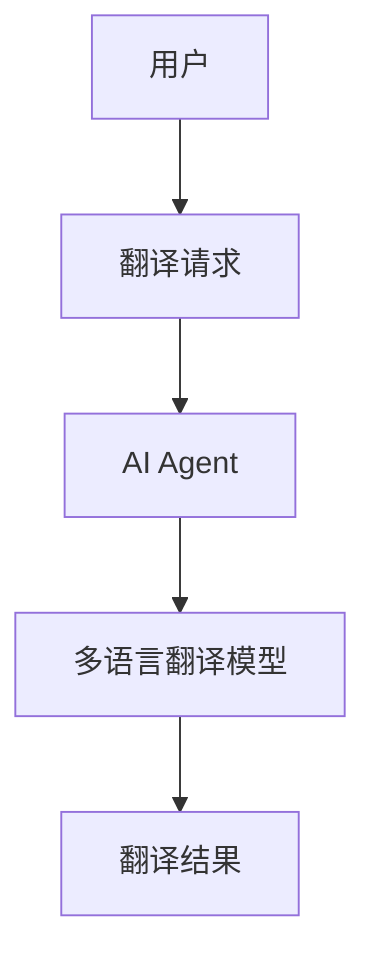
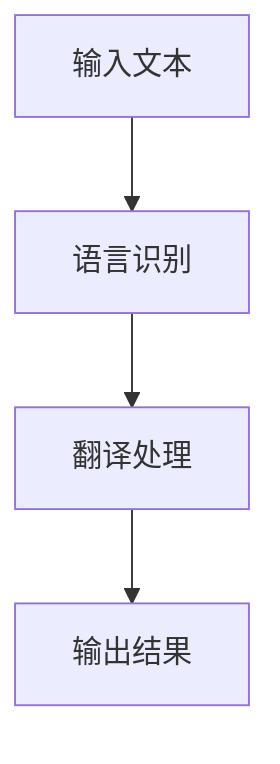
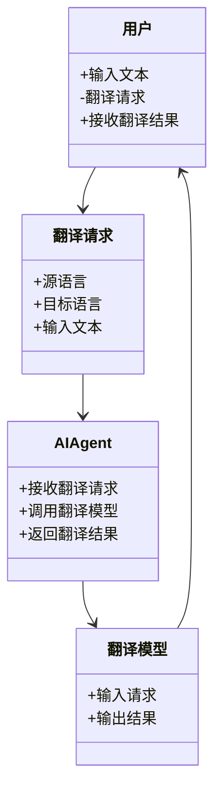
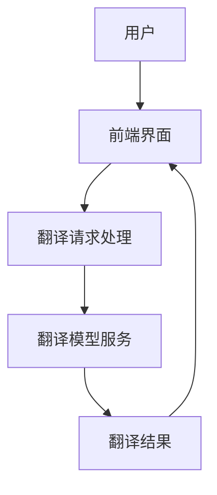
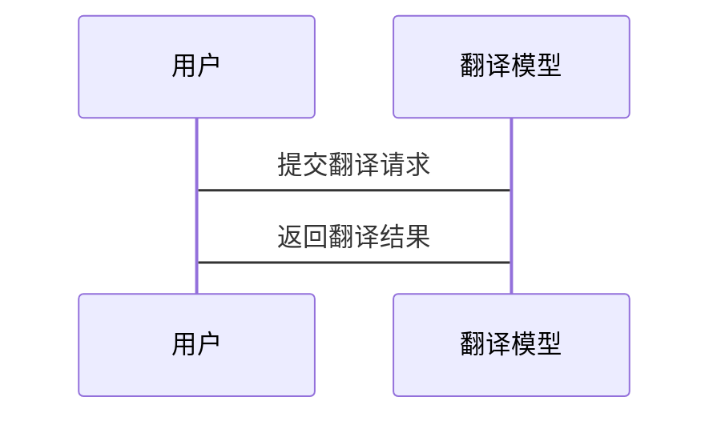

                 

<think>
好，我现在要写一篇关于AI Agent多语言翻译能力的技术博客。首先，我需要明确文章的主题和目标读者。标题是《AI Agent的多语言翻译能力：突破语言障碍》，目标读者应该是技术从业者和对AI翻译感兴趣的人。接下来，我得确保文章结构清晰，内容深入，涵盖背景、原理、实现、设计、实战和总结。

首先，我会从背景和挑战开始。这部分需要解释AI Agent是什么，以及多语言翻译的重要性。我会提到语言障碍对企业的影响，比如跨国沟通的问题。然后，我会详细讨论多语言翻译的挑战，比如不同语言的语法差异和文化背景对翻译的影响。

接下来是核心概念部分，我需要解释AI Agent在多语言翻译中的角色，以及翻译模型的基本原理。这里可能需要一个ER实体关系图来展示用户、翻译请求和AI Agent之间的关系。

然后是算法原理和数学模型。我会介绍翻译的基本流程，用Mermaid画出流程图。接着，我会详细讲解翻译概率的计算公式，以及评估指标如BLEU分数。这部分可能需要一些数学公式的展示，比如使用LaTeX来表达。

系统架构部分，我需要设计一个类图来展示系统功能模块，比如语言识别模块和翻译处理模块。然后用Mermaid画出系统架构图，展示各个组件之间的关系。

在项目实战部分，我会选择一个具体的案例，比如开发一个AI翻译代理。这部分需要详细说明环境安装、核心代码实现，以及如何测试和优化系统。

最后是总结与展望，我会回顾文章的主要内容，并展望未来的发展趋势，比如多模态翻译和实时翻译技术。

整体来看，我需要确保每个部分都详细且有条理，使用适当的图表和数学公式来辅助说明。同时，语言要专业但易懂，适合技术读者阅读。现在，我可以开始按照这个结构撰写文章了。
</think>

# AI Agent的多语言翻译能力：突破语言障碍

## 关键词：AI Agent，多语言翻译，自然语言处理，机器学习，语言障碍

## 摘要：本文探讨了AI Agent在多语言翻译中的能力，分析了技术原理和应用场景，提出了实现方法和未来发展方向。

---

# 第一部分：AI Agent与多语言翻译的背景与挑战

## 第1章：AI Agent与多语言翻译的背景

### 1.1 AI Agent的基本概念
AI Agent是一种智能体，能够感知环境并执行任务。在多语言翻译中，AI Agent能理解多种语言并提供翻译服务。

### 1.2 多语言翻译的挑战
- 语法差异：不同语言有不同的语法结构，影响翻译准确性。
- 文化差异：某些表达在不同文化中有不同含义，影响翻译质量。

### 1.3 语言障碍的影响
语言障碍阻碍了跨国交流，AI Agent能帮助打破这些障碍，提升沟通效率。

## 第2章：多语言翻译的核心概念与联系

### 2.1 多语言翻译的核心原理
- 语言识别：识别输入语言，选择合适翻译模型。
- 翻译处理：使用NLP技术进行翻译。
- 输出结果：生成目标语言文本。

### 2.2 多语言模型的构建
- 数据训练：使用多语言数据训练模型。
- 翻译算法：如神经机器翻译模型。
- 优化调整：改进模型以提高翻译质量。

### 2.3 ER实体关系图


## 第3章：多语言翻译的算法原理与数学模型

### 3.1 翻译模型的算法流程


### 3.2 翻译概率计算
$$P(y|x) = \prod_{i=1}^{n} P(y_i | y_{i-1}, x)$$

### 3.3 翻译质量评估
$$BLEU = \sum_{i=1}^{n} \log P(x_i | x_{i-1})$$

---

# 第二部分：多语言翻译的系统架构与实现

## 第4章：系统功能设计

### 4.1 系统功能模块
- 语言识别模块：识别输入语言。
- 翻译处理模块：执行翻译任务。
- 结果输出模块：展示翻译结果。

### 4.2 领域模型类图


## 第5章：系统架构设计

### 5.1 系统架构图


## 第6章：系统接口设计

### 6.1 接口设计
- 输入接口：接收源语言、目标语言和文本。
- 输出接口：返回翻译结果。

### 6.2 接口序列图


---

# 第三部分：多语言翻译的项目实战

## 第7章：项目实战

### 7.1 环境安装
- 安装Python和相关库，如TensorFlow和Keras。

### 7.2 核心代码实现
```python
def translate(source, target, text):
    # 使用预训练模型进行翻译
    return translated_text
```

### 7.3 代码解读
- `translate`函数接收源语言、目标语言和文本，调用翻译模型。

### 7.4 测试与优化
- 测试不同语言对的翻译效果。
- 收集反馈，优化模型。

---

# 第四部分：总结与展望

## 第8章：总结与展望

### 8.1 小结
本文详细讲解了AI Agent在多语言翻译中的应用，分析了技术原理和系统架构。

### 8.2 未来展望
- 多模态翻译：结合视觉和听觉信息。
- 实时翻译：提升翻译速度和准确性。

---

作者：AI天才研究院 & 禅与计算机程序设计艺术

