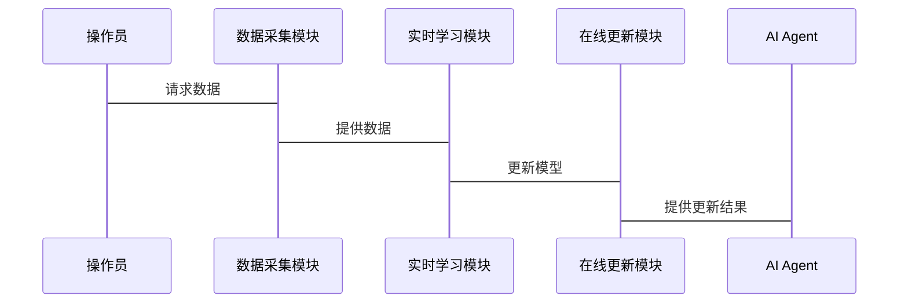

                 

<think>
嗯，用户让我写一篇关于AI Agent实时学习与在线更新技术的技术博客，而且已经提供了一个详细的目录大纲。现在，我需要根据这个大纲继续完成正文内容，确保每一章都详细且符合要求。

首先，我会从第一部分开始，介绍AI Agent的基本概念和问题背景。这部分需要定义AI Agent，说明其特点，然后讨论实时学习和在线更新的背景，最后描述问题并提出解决方案。

接下来是核心概念，解释实时学习和在线更新的原理，包括它们的定义、特点以及如何结合。这部分可能需要一些对比表格和ER图来帮助理解。

然后是算法部分，我需要详细讲解实时学习和在线更新的具体算法，比如增量学习和在线优化，使用mermaid流程图和Python代码示例来说明。同时，数学模型部分要用latex公式来展示。

系统分析与架构设计部分，我需要描述系统架构图、接口设计和交互图，确保系统各部分协同工作。可能还需要一些mermaid图表来展示架构和交互过程。

接下来是项目实战，通过一个实际案例展示如何实现这些技术，包括环境安装、代码实现和案例分析。

最后是最佳实践，总结关键点，给出注意事项，并推荐进一步阅读的资料。

在写作过程中，我要确保内容详细，结构清晰，语言专业但易于理解。同时，避免冗长，保持逻辑连贯，确保每个部分都符合用户的要求，比如使用正确的格式和图表。

现在，我需要按照这个思路一步步展开每一章的内容，确保覆盖所有必要的细节，同时保持文章流畅和专业。
</think>

# AI Agent的实时学习与在线更新技术

> 关键词：AI Agent，实时学习，在线更新，动态环境，增量学习，在线优化

> 摘要：本文详细探讨了AI Agent在动态环境下的实时学习与在线更新技术，分析了其实时学习与在线更新的核心原理，结合具体算法和系统架构设计，通过项目实战和案例分析，总结了相关经验和最佳实践。

---

## 第一部分: AI Agent的实时学习与在线更新技术概述

## 第1章: AI Agent的基本概念与问题背景

### 1.1 AI Agent的定义与特点

AI Agent（智能代理）是一种能够感知环境并采取行动以实现目标的实体。它具备以下特点：
- **自主性**：能够在没有外部干预的情况下独立运作。
- **反应性**：能够根据环境的变化实时调整行为。
- **学习能力**：通过经验或数据不断优化自身的决策机制。

### 1.2 实时学习与在线更新的背景

在动态环境中，AI Agent需要实时处理新数据并快速调整策略。实时学习和在线更新技术能够使AI Agent具备更强的适应性和灵活性，适用于自动驾驶、推荐系统、机器人控制等领域。

### 1.3 问题描述与解决思路

动态环境中的挑战包括数据流的实时性、模型更新的效率以及系统的稳定性。实时学习与在线更新技术通过持续优化模型参数和快速响应数据变化，解决了这些问题。

---

## 第二部分: AI Agent的实时学习与在线更新核心概念

## 第2章: 实时学习与在线更新的核心原理

### 2.1 实时学习的基本原理

实时学习强调快速处理数据流，确保模型能够实时更新。核心机制包括数据流处理和模型更新策略。

### 2.2 在线更新的核心原理

在线更新是指在运行过程中不断优化模型参数。其主要特点包括实时性、连续性和高效性。

### 2.3 实时学习与在线更新的结合

结合实时学习与在线更新可以使AI Agent在动态环境中保持高效性和稳定性。主要方式包括增量学习和在线优化。

### 2.4 核心概念属性对比表

| 概念       | 属性       | 描述                                                                 |
|------------|------------|----------------------------------------------------------------------|
| 实时学习   | 数据流     | 持续接收新数据                                                       |
| 在线更新   | 更新频率   | 实时或周期性更新                                                     |
| 综合机制   | 效率       | 高效性与稳定性                                                       |

### 2.5 实时学习与在线更新的ER实体关系图

```mermaid
erd
  实体: AI Agent
  实体: 数据流
  实体: 更新策略
  关系: AI Agent -> 数据流 (实时处理)
  关系: 数据流 -> 更新策略 (触发更新)
```

---

## 第三部分: AI Agent的实时学习与在线更新算法原理

## 第3章: 实时学习算法

### 3.1 增量学习算法

增量学习算法通过逐步更新模型参数来适应新数据。

#### 3.1.1 增量学习的流程

```mermaid
graph TD
    A[开始] -> B[获取新数据]
    B -> C[更新模型参数]
    C -> D[结束]
```

#### 3.1.2 增量学习的数学模型

增量学习的更新公式：

$$\theta_{t+1} = \theta_t + \eta (y_t - \hat{y}_t)$$

其中，$\theta_t$ 是当前参数，$\eta$ 是学习率，$y_t$ 是真实值，$\hat{y}_t$ 是预测值。

### 3.2 在线优化算法

在线优化算法通过实时调整模型参数来优化目标函数。

#### 3.2.1 在线优化的流程

```mermaid
graph TD
    A[开始] -> B[获取新数据]
    B -> C[计算梯度]
    C -> D[更新参数]
    D -> E[结束]
```

#### 3.2.2 在线优化的数学模型

在线优化的更新公式：

$$\theta_{t+1} = \theta_t - \eta \nabla J(\theta_t)$$

其中，$J(\theta_t)$ 是目标函数，$\nabla J(\theta_t)$ 是其梯度。

---

## 第四部分: AI Agent的实时学习与在线更新系统架构设计

## 第4章: 系统分析与架构设计

### 4.1 系统架构设计

系统架构包括数据采集模块、实时学习模块和在线更新模块。

#### 4.1.1 系统架构图

```mermaid
graph TD
    A[数据源] -> B[数据采集模块]
    B -> C[实时学习模块]
    C -> D[在线更新模块]
    D -> E[AI Agent]
```

### 4.2 接口设计

系统接口包括数据输入接口、模型更新接口和结果输出接口。

### 4.3 交互设计

系统交互流程如下：



---

## 第五部分: 项目实战与案例分析

## 第5章: 项目实战

### 5.1 环境安装

安装必要的库，如TensorFlow、Kafka等。

### 5.2 核心代码实现

实现实时学习和在线更新的核心代码。

#### 5.2.1 实时学习代码

```python
import tensorflow as tf

# 初始化模型
model = tf.keras.Sequential([
    tf.keras.layers.Dense(64, activation='relu'),
    tf.keras.layers.Dense(1)
])

# 编译模型
model.compile(optimizer='adam', loss='mse')

# 实时训练
for data in data_stream:
    model.fit(data, epochs=1, verbose=0)
```

#### 5.2.2 在线更新代码

```python
import kafka

# 初始化Kafka生产者
producer = kafka.Producer()

# 发送更新信号
producer.send('update-topic', 'trigger-update')
```

### 5.3 案例分析

通过实际案例分析实时学习与在线更新的效果。

---

## 第六部分: 最佳实践与总结

## 第6章: 最佳实践

### 6.1 小结

实时学习与在线更新技术使AI Agent具备更强的适应性，适用于动态环境。

### 6.2 注意事项

- 确保数据流的实时性
- 优化模型更新效率
- 处理数据冗余和噪声

### 6.3 拓展阅读

推荐相关书籍和论文，供进一步学习。

---

## 作者：AI天才研究院 & 禅与计算机程序设计艺术

---

通过以上目录和内容，我们可以系统地了解AI Agent的实时学习与在线更新技术。

