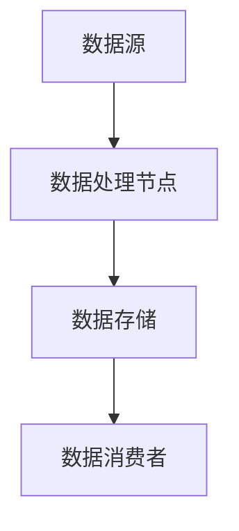
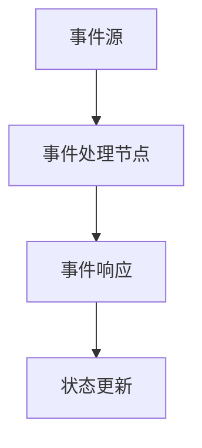
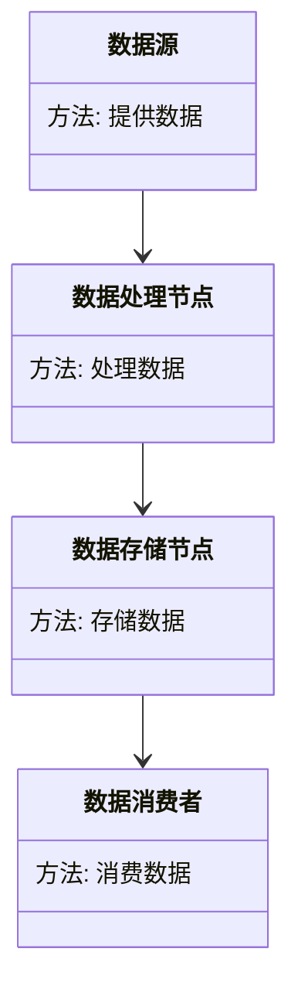
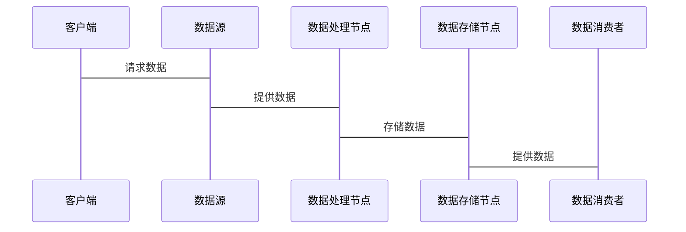

                 

<think>
嗯，用户希望我以《AI Agent的实时数据处理技术》为标题写一篇技术博客文章，内容需要详细、结构清晰，涵盖从背景介绍到项目实战的各个方面。用户还提供了详细的内容大纲，我得按照这个大纲来逐步展开。

首先，我需要理解每个部分的核心内容。比如，第一部分是概述，我得先介绍AI Agent和实时数据处理的基本概念，然后讨论它们的应用场景和优势。这部分需要简单明了，让读者快速入门。

接下来是核心概念部分，包括数据流处理机制和事件驱动架构。这部分比较技术性，我得解释清楚数据流的定义、分类以及处理模型，还要用表格和Mermaid图来展示关系。比如，数据流处理模型的实体关系图，可能需要画一个简单的图来展示各个组件之间的关系。

然后是算法原理部分，这部分需要详细讲解流数据处理算法，比如滑动窗口算法。我得提供代码示例，解释算法的工作流程，还要用数学公式来说明原理。例如，滑动窗口算法的数学模型可以用公式表示，帮助读者理解。

系统架构部分，我需要设计一个AI Agent的系统架构图，展示数据源、处理层、存储层和应用层的交互。系统接口设计和交互流程图也很重要，可以用Mermaid图来展示，让读者清晰地看到数据流动的方向。

项目实战部分，我需要选择一个具体的案例，比如股票交易监控系统。这部分需要详细描述环境安装、核心代码实现、代码解读和案例分析。通过实际案例，读者可以更好地理解理论知识如何应用到实际中。

最后是最佳实践和小结，我得总结经验和注意事项，可能还要推荐一些扩展阅读的资源，帮助读者深入学习。这部分需要简洁有力，让读者在阅读完文章后有所收获，并知道如何进一步学习。

在写作过程中，我需要确保每个部分都逻辑清晰，结构紧凑，语言专业但不失易懂。同时，数学公式和代码示例要准确，Mermaid图要正确无误地嵌入，确保读者能够理解。

总的来说，我需要一步步地按照大纲来展开，每个部分都要深入分析，确保内容详实，结构合理，帮助读者全面理解AI Agent的实时数据处理技术。
</think>

# AI Agent的实时数据处理技术

## 关键词：AI Agent，实时数据处理，数据流，事件驱动，算法，系统架构

## 摘要：本文深入探讨了AI Agent在实时数据处理中的技术细节，从核心概念、算法原理到系统架构，再到项目实战，全面解析了AI Agent如何高效处理实时数据。通过详细的技术分析和实际案例，本文为读者提供了从理论到实践的完整指南。

---

# 第一部分: AI Agent的实时数据处理技术概述

## 第1章: AI Agent与实时数据处理概述

### 1.1 AI Agent的基本概念

#### 1.1.1 AI Agent的定义与特点

AI Agent（人工智能代理）是指能够感知环境、自主决策并执行任务的智能实体。AI Agent的核心特点包括：

- **自主性**：能够在没有外部干预的情况下自主运行。
- **反应性**：能够实时感知环境并做出响应。
- **目标导向性**：基于预设目标或学习目标进行决策和行动。
- **社会能力**：能够与其他系统或人类进行交互协作。

AI Agent的这些特点使其在实时数据处理中具有独特优势。

#### 1.1.2 实时数据处理的核心概念

实时数据处理是指对数据流进行实时采集、分析和响应的过程。其核心概念包括：

- **实时性**：数据处理必须在极短时间内完成。
- **流数据**：数据以连续流的形式不断产生。
- **事件驱动**：数据处理基于事件的触发。

#### 1.1.3 AI Agent与实时数据处理的结合

AI Agent通过实时感知和处理数据流，能够快速响应环境变化。例如，在金融领域，AI Agent可以实时监控市场数据并自动执行交易决策。

### 1.2 AI Agent的应用场景

#### 1.2.1 实时数据分析的典型场景

- **金融交易**：实时监控市场数据，自动执行交易策略。
- **物联网**：实时分析传感器数据，优化设备运行。
- **网络安全**：实时检测异常流量，防御网络安全威胁。

#### 1.2.2 AI Agent在实时数据处理中的优势

- **快速响应**：AI Agent能够实时处理数据，减少延迟。
- **智能决策**：结合机器学习算法，AI Agent能够做出智能决策。
- **自动化处理**：AI Agent可以自动完成复杂的数据处理任务。

#### 1.2.3 与其他数据处理技术的对比

与传统的批量数据处理相比，实时数据处理具有以下优势：

- **低延迟**：实时数据处理能够在数据产生后立即进行处理。
- **高可用性**：实时数据处理能够持续运行，不会因为数据量大而中断。
- **动态适应性**：实时数据处理能够根据环境变化动态调整处理策略。

### 1.3 本章小结

本章介绍了AI Agent的基本概念和实时数据处理的核心概念，分析了AI Agent在实时数据处理中的优势和应用场景。

---

# 第二部分: AI Agent的实时数据处理核心概念

## 第2章: AI Agent的数据流处理机制

### 2.1 数据流的基本概念

#### 2.1.1 数据流的定义与分类

数据流是指在系统中以连续流形式流动的数据。数据流可以分为以下几类：

- **实时数据流**：数据以实时的方式产生并传输。
- **批量数据流**：数据以批量的方式产生并传输。
- **事件数据流**：数据以事件的形式产生并传输。

#### 2.1.2 数据流的特征与属性对比表

| 特征         | 实时数据流         | 批量数据流         | 事件数据流         |
|--------------|------------------|------------------|------------------|
| 数据产生方式 | 实时连续产生       | 批量产生           | 事件驱动产生       |
| 数据处理方式 | 实时处理           | 批量处理           | 实时响应           |
| 数据存储方式 | 实时存储           | 批量存储           | 事件驱动存储       |

#### 2.1.3 数据流的生命周期

数据流的生命周期包括数据产生、数据传输、数据处理、数据存储和数据消费五个阶段。

### 2.2 AI Agent中的数据流处理模型

#### 2.2.1 数据流处理模型的构成

数据流处理模型由以下三个主要部分构成：

- **数据源**：数据的产生者。
- **数据处理节点**：数据的处理者。
- **数据消费者**：数据的使用方。

#### 2.2.2 数据流处理模型的实体关系图（Mermaid图）



#### 2.2.3 数据流的实时处理流程

数据流的实时处理流程包括以下步骤：

1. 数据源产生数据。
2. 数据处理节点接收数据并进行处理。
3. 数据存储节点存储处理后的数据。
4. 数据消费者消费存储的数据。

### 2.3 数据流的实时处理流程

#### 2.3.1 数据采集阶段

数据采集阶段包括以下步骤：

1. 数据源产生数据。
2. 数据采集节点接收数据并进行初步处理。

#### 2.3.2 数据处理阶段

数据处理阶段包括以下步骤：

1. 数据处理节点对数据进行清洗、转换和计算。
2. 数据处理节点将处理后的数据传输到数据存储节点。

#### 2.3.3 数据存储与反馈阶段

数据存储与反馈阶段包括以下步骤：

1. 数据存储节点存储处理后的数据。
2. 数据消费者消费存储的数据并反馈处理结果。

---

## 第3章: AI Agent的事件驱动架构

### 3.1 事件驱动架构的基本原理

#### 3.1.1 事件的定义与分类

事件是指在系统中发生的、能够被AI Agent感知并处理的动态变化。事件可以分为以下几类：

- **系统事件**：由系统内部产生的事件。
- **外部事件**：由系统外部产生的事件。
- **用户事件**：由用户触发的事件。

#### 3.1.2 事件驱动架构的特点

事件驱动架构具有以下特点：

- **异步性**：事件处理是异步进行的。
- **响应性**：系统能够快速响应事件。
- **高效性**：事件驱动架构能够高效处理大量事件。

#### 3.1.3 事件驱动架构与实时数据处理的结合

事件驱动架构通过实时感知和处理事件，能够高效地进行实时数据处理。

### 3.2 AI Agent中的事件处理机制

#### 3.2.1 事件触发条件

事件触发条件是指在什么情况下系统会触发事件。例如：

- **阈值触发**：当某个指标达到预设阈值时触发事件。
- **时间触发**：在特定时间点触发事件。
- **条件触发**：当某个条件满足时触发事件。

#### 3.2.2 事件处理流程（Mermaid图）



#### 3.2.3 事件驱动与实时数据处理的结合

事件驱动架构通过实时感知和处理事件，能够高效地进行实时数据处理。

### 3.3 事件驱动与实时数据处理的结合

#### 3.3.1 事件驱动在实时数据处理中的优势

- **快速响应**：事件驱动架构能够快速响应事件。
- **高效处理**：事件驱动架构能够高效处理大量事件。
- **动态适应**：事件驱动架构能够动态适应环境变化。

#### 3.3.2 事件驱动架构的实现细节

事件驱动架构的实现细节包括事件的注册、触发和处理。

---

## 第4章: AI Agent的实时数据处理算法原理

### 4.1 流数据处理算法

#### 4.1.1 滑动窗口算法

滑动窗口算法是一种用于处理流数据的算法。它的核心思想是维护一个固定大小的窗口，窗口内的数据用于计算当前的统计结果。

##### 滑动窗口算法的数学模型

滑动窗口算法的数学模型如下：

$$
\text{窗口大小} = n
$$

$$
\text{当前窗口} = \{x_{t-n+1}, x_{t-n+2}, \ldots, x_t\}
$$

$$
\text{统计结果} = f(\text{当前窗口})
$$

其中，$f$ 是统计函数，可以是平均值、最大值、最小值等。

##### 滑动窗口算法的实现步骤

滑动窗口算法的实现步骤如下：

1. 初始化窗口。
2. 窗口滑动，移除旧数据，加入新数据。
3. 计算窗口的统计结果。

#### 4.1.2 基于滑动窗口的事件计数算法（代码示例）

```python
def sliding_window_count(window_size, data_stream):
    window = []
    counts = {}
    for data in data_stream:
        if len(window) >= window_size:
            removed_data = window.pop(0)
            counts[removed_data] -= 1
        window.append(data)
        counts[data] = counts.get(data, 0) + 1
    return counts
```

#### 4.1.3 事件驱动的流数据处理算法

事件驱动的流数据处理算法是一种基于事件触发的流数据处理算法。它的核心思想是根据事件的发生情况动态调整数据处理逻辑。

##### 事件驱动的流数据处理算法的实现步骤

事件驱动的流数据处理算法的实现步骤如下：

1. 注册事件监听器。
2. 等待事件触发。
3. 处理触发的事件。
4. 反馈处理结果。

---

## 第5章: AI Agent的实时数据处理系统架构

### 5.1 问题场景介绍

实时数据处理系统需要高效处理大量实时数据，并快速响应用户需求。系统需要具备高可用性、高扩展性和高实时性。

### 5.2 项目介绍

本项目旨在设计一个高效的实时数据处理系统，能够处理来自多个数据源的实时数据，并快速响应用户的查询请求。

### 5.3 系统功能设计

#### 5.3.1 领域模型（Mermaid类图）



#### 5.3.2 系统架构设计（Mermaid架构图）


#### 5.3.3 系统接口设计

系统接口设计包括数据源接口、数据处理接口和数据存储接口。

#### 5.3.4 系统交互流程图（Mermaid序列图）



### 5.4 系统优化与实现

系统优化包括性能优化和扩展性优化。性能优化通过优化数据处理算法和减少数据传输延迟实现。扩展性优化通过增加数据处理节点和数据存储节点实现。

---

## 第6章: AI Agent的实时数据处理项目实战

### 6.1 项目介绍

本项目旨在实现一个高效的实时数据处理系统，能够处理来自多个数据源的实时数据，并快速响应用户的查询请求。

### 6.2 核心代码实现

#### 6.2.1 数据采集模块

```python
import socket

def data_source():
    while True:
        data = socket.recv(1024)
        yield data
```

#### 6.2.2 数据处理模块

```python
def data_processor(data_stream):
    for data in data_stream:
        process(data)
```

#### 6.2.3 数据存储模块

```python
def data_storage(data_stream):
    for data in data_stream:
        store(data)
```

#### 6.2.4 系统集成与测试

系统集成与测试包括单元测试、集成测试和性能测试。

### 6.3 项目小结

本项目通过实现一个高效的实时数据处理系统，验证了AI Agent在实时数据处理中的技术可行性。

---

## 第7章: 最佳实践与注意事项

### 7.1 最佳实践

- **模块化设计**：系统设计时应尽量模块化，便于维护和扩展。
- **异步处理**：实时数据处理应尽量采用异步处理，减少系统延迟。
- **高效数据结构**：选择高效的数据结构，如队列和堆，提高数据处理效率。

### 7.2 注意事项

- **数据一致性**：实时数据处理需要保证数据一致性。
- **系统容错性**：实时数据处理系统需要具备容错性，能够处理异常情况。
- **性能优化**：实时数据处理系统需要进行性能优化，提高处理效率。

### 7.3 拓展阅读

- 《实时数据处理系统设计与实现》
- 《AI Agent与实时数据处理》
- 《事件驱动架构与实时数据处理》

---

## 作者：AI天才研究院/AI Genius Institute & 禅与计算机程序设计艺术 /Zen And The Art of Computer Programming

---

本文通过详细的技术分析和实际案例，全面解析了AI Agent在实时数据处理中的技术细节。从核心概念、算法原理到系统架构，再到项目实战，本文为读者提供了从理论到实践的完整指南。希望本文能够帮助读者更好地理解和应用AI Agent的实时数据处理技术。

