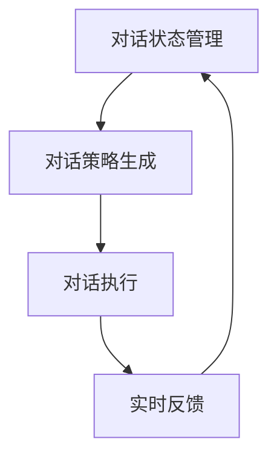

                 


# AI Agent的实时自适应对话管理系统

> 关键词：AI Agent, 实时自适应对话管理, 对话系统, 自然语言处理, 机器学习, 系统架构, 实时反馈

> 摘要：本文详细探讨了AI Agent在实时自适应对话管理中的应用，从核心概念、算法原理到系统架构，再到项目实战，全面分析了如何构建一个高效、灵活的实时对话管理系统。通过对比传统对话管理系统的局限性，提出了基于强化学习和动态反馈的解决方案，并通过具体案例展示了系统的实现与优化。

---

# 第一部分: AI Agent的实时自适应对话管理背景介绍

## 第1章: AI Agent的基本概念与问题背景

### 1.1 AI Agent的核心概念

#### 1.1.1 AI Agent的定义与特点
AI Agent（智能代理）是指能够感知环境、自主决策并采取行动以实现特定目标的智能实体。其核心特点包括：
- **自主性**：能够在没有外部干预的情况下独立运行。
- **反应性**：能够实时感知环境变化并做出反应。
- **目标导向性**：所有行为都围绕实现预设目标展开。
- **学习能力**：通过与环境的交互不断优化自身行为。

AI Agent可以分为基于规则的Agent和基于模型的Agent。基于规则的Agent依赖预定义的规则进行决策，而基于模型的Agent则通过构建环境模型来做出决策。

#### 1.1.2 实时自适应对话管理的定义
实时自适应对话管理是指在对话过程中，系统能够根据对话的实时反馈动态调整对话策略，以更好地满足用户需求。其核心目标是通过实时分析对话上下文，优化对话流程，提高对话效率和用户满意度。

#### 1.1.3 问题背景与应用场景
传统的对话管理系统往往依赖固定的规则或预定义的对话树，难以应对复杂多变的用户需求和场景。随着自然语言处理和机器学习技术的进步，AI Agent在实时对话管理中的应用变得越来越重要。

典型的应用场景包括：
- 智能客服系统
- 智能音箱
- 智能助手（如Siri、Alexa）
- 智慧教育中的智能辅导系统

---

## 第2章: 问题描述与解决思路

### 2.1 对话管理中的关键问题

#### 2.1.1 对话状态管理
- **对话历史记录与上下文管理**：需要记录对话的完整历史，并能够根据上下文理解当前对话的状态。
- **对话目标的动态调整**：在对话过程中，用户的需求可能会发生变化，系统需要能够实时调整对话目标。
- **对话参与者的行为预测**：预测用户或对话参与者的下一步行为，以便提前做好准备。

#### 2.1.2 实时反馈与自适应调整
- **实时反馈的获取与处理**：需要通过实时的用户反馈（如评分、点击、语音语调等）来调整对话策略。
- **自适应策略的动态调整**：根据实时反馈动态调整对话策略，确保对话始终朝着最优方向发展。
- **系统响应的实时性优化**：在实时对话过程中，系统需要快速响应，避免延迟影响用户体验。

---

### 2.2 解决方案与实现思路

#### 2.2.1 基于规则的对话管理
基于规则的对话管理是一种简单但有效的对话管理方法。它通过预定义的规则来控制对话流程，适用于场景简单、规则明确的对话系统。然而，这种方法在面对复杂场景时显得力不从心。

#### 2.2.2 基于机器学习的对话管理
基于机器学习的对话管理通过训练模型来实现对话策略的自动生成和优化。这种方法能够应对复杂多变的对话场景，但需要大量数据和计算资源。

---

# 第二部分: AI Agent实时自适应对话管理的核心概念与联系

## 第3章: 实时自适应对话管理的核心概念

### 3.1 对话管理系统的结构与功能
对话管理系统通常包括以下几个核心模块：
- **对话状态管理模块**：负责记录和更新对话的当前状态。
- **对话策略生成模块**：根据对话状态生成对话策略。
- **对话执行模块**：根据生成的对话策略执行具体的操作。
- **实时反馈模块**：收集用户的实时反馈并用于优化对话策略。

---

## 第4章: 实时自适应对话管理的实现思路

### 4.1 基于强化学习的对话策略优化
强化学习是一种有效的对话策略优化方法。通过定义合适的奖励函数，强化学习算法可以在对话过程中不断优化对话策略，以提高用户满意度。

#### 4.1.1 强化学习的基本原理
强化学习通过智能体与环境的交互，逐步学习最优策略。在对话管理中，智能体是对话系统，环境是用户。

#### 4.1.2 对话策略的优化过程
- **状态表示**：将对话状态表示为一个向量。
- **动作选择**：根据当前状态选择下一步动作。
- **奖励机制**：根据用户的反馈给予奖励或惩罚。
- **策略更新**：根据奖励更新对话策略。

---

### 4.2 实时反馈机制的设计
实时反馈机制是实现自适应对话管理的关键。通过实时收集用户的反馈，系统可以快速调整对话策略。

#### 4.2.1 反馈的获取与处理
- **用户反馈的获取**：通过用户的行为（如点击、评分）或语音语调分析获取反馈。
- **反馈的处理**：将用户反馈转化为系统可以理解的信号，用于优化对话策略。

#### 4.2.2 反馈驱动的策略调整
- **基于反馈的策略优化**：根据用户反馈动态调整对话策略。
- **实时调整的实现**：在对话过程中实时更新策略，确保对话始终朝着最优方向发展。

---

# 第三部分: AI Agent实时自适应对话管理的算法原理与实现

## 第5章: 基于强化学习的对话策略优化算法

### 5.1 基于Q-learning的对话策略优化
Q-learning是一种经典的强化学习算法，适用于离散动作空间的对话策略优化。

#### 5.1.1 Q-learning的基本原理
- **状态-动作空间**：将对话状态和动作离散化。
- **Q值更新**：根据奖励函数更新Q值。
- **策略选择**：根据Q值选择最优动作。

#### 5.1.2 对话策略的优化过程
- **初始化Q表**：初始化所有状态-动作对的Q值为0。
- **状态感知**：系统感知当前对话状态。
- **动作选择**：根据Q表选择动作。
- **奖励获取**：执行动作后获得奖励。
- **Q值更新**：根据奖励更新Q值。

---

### 5.2 基于Deep Q-Networks (DQN) 的对话策略优化
Deep Q-Networks 是一种基于深度学习的强化学习方法，适用于复杂对话场景。

#### 5.2.1 DQN的基本原理
- **神经网络表示**：使用神经网络近似Q函数。
- **经验回放**：通过经验回放减少相关性。
- **目标网络**：通过目标网络稳定训练过程。

#### 5.2.2 对话策略的优化过程
- **状态感知**：系统感知当前对话状态。
- **动作选择**：基于神经网络选择动作。
- **经验存储**：将状态、动作、奖励、下一状态存储到经验回放池。
- **神经网络训练**：从经验回放池中采样样本，训练神经网络。

---

## 第6章: 实时自适应对话管理的数学模型与公式

### 6.1 强化学习的基本公式
强化学习的目标是通过最大化累积奖励来优化策略。常用的公式包括：
$$ Q(s, a) = Q(s, a) + \alpha (r + \gamma \max Q(s', a') - Q(s, a)) $$
其中：
- \( Q(s, a) \)：状态 \( s \) 下动作 \( a \) 的Q值。
- \( \alpha \)：学习率。
- \( r \)：奖励。
- \( \gamma \)：折扣因子。
- \( Q(s', a') \)：下一状态 \( s' \) 下动作 \( a' \) 的Q值。

### 6.2 对话状态表示的数学模型
对话状态可以表示为一个向量：
$$ s = [s_1, s_2, \dots, s_n] $$
其中 \( s_i \) 表示对话的某个特征。

---

# 第四部分: AI Agent实时自适应对话管理的系统架构与实现

## 第7章: 系统架构设计

### 7.1 系统功能模块设计
对话管理系统主要包括以下功能模块：
- **对话状态管理模块**：记录和更新对话状态。
- **对话策略生成模块**：根据对话状态生成对话策略。
- **对话执行模块**：根据策略执行具体操作。
- **实时反馈模块**：收集用户反馈并优化策略。

### 7.2 系统架构图
以下是系统架构的Mermaid图：



---

## 第8章: 项目实战与实现

### 8.1 项目介绍
本项目旨在实现一个基于AI Agent的实时自适应对话管理系统，应用于智能客服场景。

### 8.2 环境安装
需要安装以下依赖：
- Python 3.8+
- TensorFlow 2.0+
- NLTK
- Scikit-learn

### 8.3 核心代码实现

#### 对话状态管理模块
```python
class DialogStateManager:
    def __init__(self):
        self.history = []
        self.current_state = {}
    
    def update_state(self, state):
        self.current_state.update(state)
        self.history.append(self.current_state.copy())
```

#### 对话策略生成模块
```python
class DialogStrategyGenerator:
    def __init__(self, model):
        self.model = model
    
    def generate_strategy(self, state):
        # 假设model是一个训练好的强化学习模型
        action = self.model.predict(state)
        return action
```

#### 实时反馈模块
```python
class RealTimeFeedbackCollector:
    def __init__(self):
        self.feedback = []
    
    def collect_feedback(self, user_response):
        self.feedback.append(user_response)
```

---

## 第9章: 总结与展望

### 9.1 总结
本文详细探讨了AI Agent在实时自适应对话管理中的应用，从核心概念到算法实现，再到系统架构，全面分析了如何构建一个高效的实时对话管理系统。通过对比传统对话管理系统的局限性，提出了基于强化学习和动态反馈的解决方案，并通过具体案例展示了系统的实现与优化。

### 9.2 展望
未来的研究方向包括：
- 更复杂的对话场景建模。
- 更高效的实时反馈机制设计。
- 更先进的对话策略优化算法。

---

作者：AI天才研究院/AI Genius Institute & 禅与计算机程序设计艺术 /Zen And The Art of Computer Programming

