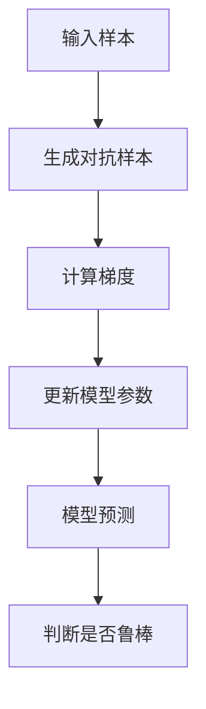
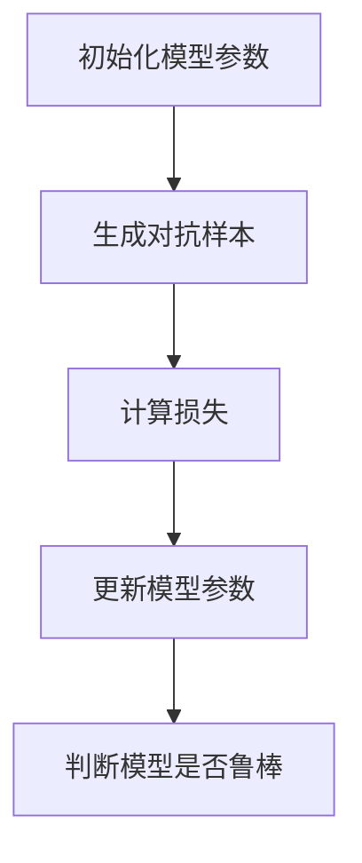
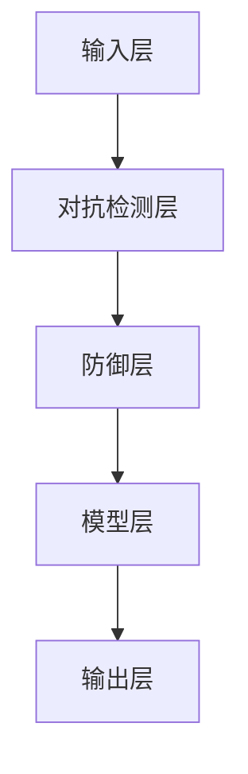

                 


# AI Agent的对抗鲁棒性：增强模型稳定性

> 关键词：AI Agent, 对抗鲁棒性, 模型稳定性, 对抗攻击, 对抗防御

> 摘要：本文深入探讨了AI Agent在对抗环境中的鲁棒性问题，分析了对抗攻击与防御的核心原理，并通过实际案例展示了如何通过算法优化和系统设计来增强AI Agent的稳定性。文章内容涵盖了对抗鲁棒性的定义、核心概念、算法原理、系统架构以及项目实战等，旨在为读者提供全面的技术视角和实践指导。

---

## 第1章: 对抗鲁棒性的概念与背景

### 1.1 对抗鲁棒性的定义与背景

#### 1.1.1 对抗鲁棒性的定义
对抗鲁棒性（Adversarial Robustness）是指AI模型在面对对抗性攻击时，仍然能够保持稳定性和准确性的能力。这种攻击通常是由攻击者故意制造的，目的是通过扰动输入数据或破坏模型的运行环境来降低模型的性能。

#### 1.1.2 对抗攻击的背景与动机
对抗攻击的背景可以追溯到AI模型的广泛应用。随着AI技术的快速发展，AI模型被应用于各种场景，包括但不限于自动驾驶、智能安防、医疗诊断等。这些场景中，AI模型的决策直接影响到人们的日常生活和安全。因此，攻击者可能会通过对抗攻击来破坏AI模型的正常运行，甚至导致严重的后果。

#### 1.1.3 AI Agent在对抗环境中的重要性
AI Agent是一种能够自主决策和行动的智能体，它需要在复杂的环境中与各种不确定性进行交互。对抗环境是指存在恶意攻击者试图干扰或破坏AI Agent的行为。在这种环境下，AI Agent的对抗鲁棒性显得尤为重要，因为它直接关系到AI Agent的生存能力和任务完成度。

---

### 1.2 对抗鲁棒性与模型稳定性

#### 1.2.1 模型稳定性的定义
模型稳定性（Model Stability）是指AI模型在面对输入数据的微小扰动时，其输出结果保持一致性的能力。一个稳定的模型在面对噪声或对抗扰动时，不会出现剧烈的输出变化，从而保证了模型的可靠性。

#### 1.2.2 对抗攻击对模型稳定性的影响
对抗攻击通过引入精心设计的扰动，使得模型的输出结果发生显著变化。这种变化可能包括误分类、错误决策或模型崩溃等。对抗攻击对模型稳定性的影响是破坏性的，因为它可能导致模型在面对攻击时失去信任和实用性。

#### 1.2.3 对抗鲁棒性与模型稳定性的关系
对抗鲁棒性是模型稳定性的核心保障。通过增强模型的对抗鲁棒性，可以有效提高模型的稳定性，使其在面对对抗攻击时仍然保持较高的性能和可靠性。因此，对抗鲁棒性是提升模型稳定性的关键手段。

---

## 第2章: 对抗鲁棒性的核心概念与联系

### 2.1 对抗攻击的基本原理

#### 2.1.1 对抗攻击的分类
对抗攻击可以分为以下几类：
1. **非目标攻击**：攻击者的目标是让模型输出错误的结果，但没有特定的目标类别。
2. **目标攻击**：攻击者的目标是让模型输出特定的错误结果。
3. ** evasion attack**：通过修改输入数据来欺骗模型。
4. **poisoning attack**：通过注入恶意数据来破坏模型的训练过程。
5. **inference attack**：通过窃取模型的推理过程来获取敏感信息。

#### 2.1.2 常见的对抗攻击方法
1. **梯度下降法**：通过计算模型的梯度，生成对抗样本。
2. **FGSM（Fast Gradient Sign Method）**：一种基于梯度的对抗样本生成方法。
3. **PGD（Projected Gradient Descent）**：一种更稳健的对抗样本生成方法。

#### 2.1.3 对抗攻击的目标与实现
对抗攻击的目标是通过最小化损失函数，使得模型输出错误的结果。具体实现方法包括生成对抗样本、破坏模型的训练过程等。

---

### 2.2 对抗防御的基本原理

#### 2.2.1 对抗防御的分类
对抗防御可以分为以下几类：
1. **防御算法**：通过修改模型的训练过程，增强模型的鲁棒性。
2. **防御策略**：通过监控输入数据，识别并消除对抗样本。
3. **防御机制**：通过设计模型的结构，防止对抗攻击的影响。

#### 2.2.2 常见的对抗防御方法
1. **对抗训练**：通过同时训练模型和对抗网络，增强模型的鲁棒性。
2. **防御网络**：在模型的输入层或中间层添加防御机制，防止对抗攻击。
3. **鲁棒优化**：通过优化模型的损失函数，增强模型的鲁棒性。

#### 2.2.3 对抗防御的目标与实现
对抗防御的目标是通过各种手段，阻止对抗攻击对模型的影响。具体实现方法包括对抗训练、防御网络和鲁棒优化等。

---

### 2.3 对抗鲁棒性的系统架构

#### 2.3.1 对抗鲁棒性系统的组成
1. **输入层**：接收原始输入数据。
2. **对抗检测层**：识别输入数据中的对抗样本。
3. **防御层**：对输入数据进行清洗或修改，防止对抗攻击。
4. **模型层**：对处理后的数据进行预测和决策。
5. **输出层**：输出模型的最终结果。

#### 2.3.2 对抗鲁棒性系统的功能模块
1. **对抗检测模块**：通过分析输入数据的特征，识别是否存在对抗样本。
2. **防御模块**：对输入数据进行处理，消除对抗扰动。
3. **模型优化模块**：通过优化模型的参数，增强模型的鲁棒性。

#### 2.3.3 对抗鲁棒性系统的实现流程
1. 接收输入数据。
2. 对抗检测模块识别是否存在对抗样本。
3. 如果存在对抗样本，防御模块对其进行清洗或修改。
4. 模型优化模块对模型参数进行优化，增强模型的鲁棒性。
5. 模型层对处理后的数据进行预测和决策。
6. 输出层输出模型的最终结果。

---

## 第3章: 对抗鲁棒性的算法原理

### 3.1 对抗鲁棒性的数学模型

#### 3.1.1 对抗训练的目标函数
对抗训练的目标函数可以表示为：
$$ \mathcal{L}_{\text{adv}}(\theta) = \mathbb{E}_{(x,y)}[\mathcal{L}(x+\delta, y)] $$
其中，$\theta$ 是模型的参数，$\delta$ 是对抗扰动，$\mathcal{L}$ 是损失函数。

#### 3.1.2 对抗防御的数学模型
对抗防御的数学模型可以表示为：
$$ \mathcal{L}_{\text{def}}(\theta) = \arg \min_{\theta} \mathbb{E}_{(x,y)}[\mathcal{L}(x+\delta, y)] $$

---

### 3.2 对抗训练的流程图



---

### 3.3 对抗鲁棒性的Python代码示例

#### 3.3.1 FGSM对抗样本生成代码
```python
import torch
import torch.nn as nn
import torch.optim as optim

def fgsm_attack(model, criterion, images, labels, eps=0.1):
    images.requires_grad = True
    outputs = model(images)
    loss = criterion(outputs, labels)
    loss.backward()
    adv_images = images + eps * images.grad.sign()
    adv_images = torch.clamp(adv_images, 0.0, 1.0)
    return adv_images

# 使用FGSM生成对抗样本
model = nn.Sequential(
    nn.Conv2d(1, 6, 5),
    nn.ReLU(),
    nn.Conv2d(6, 16, 5),
    nn.ReLU(),
    nn.MaxPool2d(2, 2),
    nn.Flatten(),
    nn.Linear(256, 120),
    nn.ReLU(),
    nn.Linear(120, 10)
)

criterion = nn.CrossEntropyLoss()
optimizer = optim.Adam(model.parameters())

images = torch.randn(1, 1, 32, 32)
labels = torch.randint(0, 10, (1,))

adv_images = fgsm_attack(model, criterion, images, labels, eps=0.1)
```

#### 3.3.2 对抗训练的优化过程


---

## 第4章: 对抗鲁棒性系统的架构设计

### 4.1 对抗鲁棒性系统的功能模块

#### 4.1.1 对抗检测模块
- **功能**：识别输入数据中的对抗样本。
- **实现**：通过分析数据的特征，判断是否存在对抗扰动。

#### 4.1.2 防御模块
- **功能**：对输入数据进行清洗或修改，消除对抗扰动。
- **实现**：通过调整数据的特征，使得模型无法识别对抗样本。

#### 4.1.3 模型优化模块
- **功能**：通过优化模型的参数，增强模型的鲁棒性。
- **实现**：使用对抗训练方法，增强模型的鲁棒性。

---

### 4.2 对抗鲁棒性系统的架构图



---

## 第5章: 对抗鲁棒性的项目实战

### 5.1 项目实战环境安装

#### 5.1.1 安装必要的库
```bash
pip install torch torchvision matplotlib
```

#### 5.1.2 环境配置
```bash
conda create -n adv_robustness python=3.8
conda activate adv_robustness
pip install torch torchvision matplotlib
```

---

### 5.2 核心代码实现

#### 5.2.1 对抗样本生成代码
```python
import torch
import torch.nn as nn
import torch.optim as optim

def generate_adversarial_samples(model, criterion, test_loader, eps=0.1):
    model.eval()
    adversarial_images = []
    for images, labels in test_loader:
        images.requires_grad = True
        outputs = model(images)
        loss = criterion(outputs, labels)
        loss.backward()
        adversarial_images.append(images + eps * images.grad.sign())
    return adversarial_images
```

#### 5.2.2 模型训练代码
```python
def train_model(model, criterion, optimizer, train_loader, epochs=10):
    for epoch in range(epochs):
        model.train()
        for images, labels in train_loader:
            outputs = model(images)
            loss = criterion(outputs, labels)
            loss.backward()
            optimizer.step()
            optimizer.zero_grad()
```

---

## 第6章: 最佳实践与小结

### 6.1 最佳实践

#### 6.1.1 对抗鲁棒性开发中的注意事项
1. **数据多样性**：确保训练数据具有多样性，减少模型的过拟合。
2. **模型复杂性**：选择适当的模型复杂性，避免模型过于简单或过于复杂。
3. **防御策略**：结合多种防御策略，提高模型的鲁棒性。
4. **持续监控**：对模型的性能进行持续监控，及时发现并修复对抗攻击。

#### 6.1.2 对抗鲁棒性开发的注意事项
1. **模型评估**：在开发过程中，定期对模型进行评估，确保模型的鲁棒性。
2. **数据安全**：确保数据的安全性，防止数据被恶意篡改。
3. **代码审查**：对代码进行严格的审查，确保代码的安全性。
4. **团队协作**：团队协作开发，确保开发过程的透明性和可追溯性。

---

### 6.2 小结

通过对AI Agent的对抗鲁棒性问题的深入分析，我们可以得出以下结论：
1. 对抗鲁棒性是AI Agent在复杂环境中稳定运行的关键。
2. 对抗攻击和防御的原理需要深入理解，才能有效应对各种攻击。
3. 对抗鲁棒性的实现需要结合算法优化和系统设计，确保模型的稳定性和可靠性。

---

### 6.3 注意事项

1. **数据预处理**：在对抗鲁棒性开发中，数据预处理是非常重要的一步。确保数据的清洁性和一致性，可以有效减少对抗攻击的影响。
2. **模型调优**：模型的调优是提高对抗鲁棒性的关键。通过调整模型的参数和结构，可以增强模型的鲁棒性。
3. **代码审查**：对代码进行严格的审查，确保代码的安全性和可维护性。
4. **持续学习**：对抗鲁棒性是一个动态发展的领域，需要持续关注最新的研究成果和技术进展。

---

### 6.4 拓展阅读

1. **Goodfellow, I., Bengio, Y., & Courville, A.** (2016). *Deep Learning*. MIT Press.
2. **Madry, A., & Carlini, N.** (2017). *Robustness in Machine Learning*. arXiv preprint arXiv:1711.1148.
3. **Szegedy, C., et al.** (2013). *Intriguing properties of neural networks*. arXiv preprint arXiv:1312.6192.

---

## 作者：AI天才研究院/AI Genius Institute & 禅与计算机程序设计艺术 /Zen And The Art of Computer Programming

