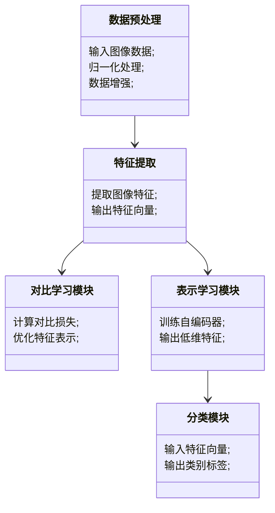
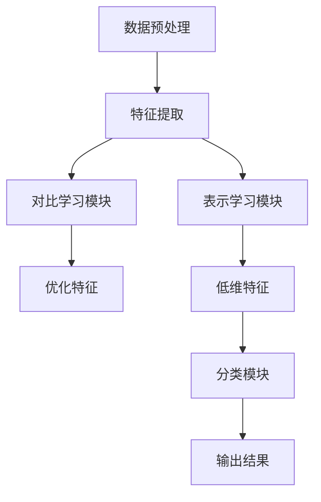
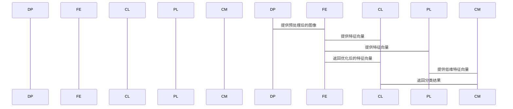

                 


# 第三章: 对比学习与表示学习的算法原理

## 3.2 表示学习算法的流程

### 3.2.1 表示学习的基本流程
1. **输入数据预处理**：
   - 数据可以是图像、文本、音频等多种形式。
   - 对于图像数据，通常会进行归一化处理，例如将像素值归一化到[0,1]范围。
   
2. **特征提取**：
   - 使用深度学习模型（如卷积神经网络CNN、循环神经网络RNN等）提取数据的高层次特征。
   - 例如，使用ResNet网络提取图像的特征向量。

3. **损失计算**：
   - 使用重建损失或对比损失来优化特征表示。
   - 例如，使用重建损失时，会计算原始数据和重建数据之间的差异。

4. **优化器更新**：
   - 使用优化器（如Adam、SGD等）更新模型参数，以最小化损失函数。

5. **特征表示输出**：
   - 最终得到的数据样本的低维特征向量，可以用于后续的分类、聚类等任务。

### 3.2.2 对比学习的算法流程
```mermaid
graph TD
    A[输入样本x_i, x_j] --> B[特征提取f(x_i), f(x_j)]
    B --> C[计算对比损失Lcontrast]
    C --> D[优化器更新参数]
    D --> E[模型收敛]
```

## 3.3 对比学习与表示学习的数学模型

### 3.3.1 对比学习的数学模型
1. **对比损失函数**：
   - 常见的对比损失函数包括Binary contrastive loss、Normalized contrastive loss等。
   - 例如，Normalized contrastive loss的公式为：
     $$ L_{contrast}(x_i, x_j) = \log \frac{e^{f(x_i) \cdot f(x_j)}}{e^{f(x_i) \cdot f(x_j)} + e^{f(x_i) \cdot f(x_k)}} $$
   - 其中，$x_i$和$x_j$是正样本对，$x_k$是负样本。

2. **特征表示函数**：
   - 通常使用深度神经网络（如ResNet、BERT等）来提取特征。
   - 例如，使用ResNet50提取图像的特征向量：
     ```python
     import torch
     import torch.nn as nn
     import torch.nn.functional as F

     class ResNet50Feature(nn.Module):
         def __init__(self, pretrained=True):
             super(ResNet50Feature, self).__init__()
             self.resnet = models.resnet50(pretrained=pretrained)
             self.resnet.fc = nn.Linear(2048, 128)  # 将输出维度调整为128维
             self.resnet.fc.requires_grad = True

         def forward(self, x):
             return self.resnet(x)
     ```

3. **训练过程**：
   - 对比学习的训练过程通常采用在线样本对生成策略。
   - 使用KNN（k近邻）方法进行正样本和负样本的匹配：
     ```python
     import numpy as np
     from sklearn.neighbors import NearestNeighbors

     def generate_contrast_pairs(X, y, k=1):
         nbrs = NearestNeighbors(n_neighbors=k+1).fit(X)
         distances, indices = nbrs.kneighbors(X)
         X_pos = []
         X_neg = []
         for i in range(len(indices)):
             pos_idx = indices[i][0]
             neg_idx = indices[i][1]
             X_pos.append(X[pos_idx])
             X_neg.append(X[neg_idx])
         return np.array(X_pos), np.array(X_neg)
     ```

### 3.3.2 表示学习的数学模型
1. **重建损失函数**：
   - 重建损失通常用于自监督学习中的表示学习。
   - 典型的重建损失包括均方误差（MSE）和交叉熵损失。
   - 例如，使用MSE作为重建损失：
     $$ L_{reconstruction}(x, x') = \frac{1}{d} \sum_{i=1}^{d} (x_i - x'_i)^2 $$
   - 其中，$d$是特征的维度。

2. **自编码器（Autoencoder）**：
   - 自编码器是一种常用的表示学习模型。
   - 包括编码器和解码器两部分，用于学习数据的低维表示。
   - 例如，使用自编码器进行图像重建：
     ```python
     class Autoencoder(nn.Module):
         def __init__(self, input_dim=784, hidden_dim=128):
             super(Autoencoder, self).__init__()
             self.encoder = nn.Sequential(
                 nn.Linear(input_dim, hidden_dim),
                 nn.ReLU()
             )
             self.decoder = nn.Sequential(
                 nn.Linear(hidden_dim, input_dim),
                 nn.Sigmoid()
             )

         def forward(self, x):
             encoded = self.encoder(x)
             decoded = self.decoder(encoded)
             return decoded
     ```

3. **训练过程**：
   - 使用自监督学习方法训练自编码器。
   - 通过调整编码器和解码器的参数，使得重建的输入与原始输入尽可能接近。

### 3.3.3 对比学习与表示学习的联合应用
1. **对比增强表示学习**：
   - 将对比学习的思想引入表示学习，进一步提升特征的区分度。
   - 例如，在图像分类任务中，可以先使用对比学习提取特征，再进行分类。

2. **表示增强对比学习**：
   - 使用表示学习得到的低维特征作为对比学习的输入。
   - 例如，在自然语言处理任务中，可以先使用BERT模型提取词向量，再进行对比学习。

# 第四章: 对比学习与表示学习的系统分析与架构设计

## 4.1 系统功能设计

### 4.1.1 问题场景介绍
- **应用场景**：假设我们正在开发一个图像识别的AI Agent，需要从大量图像数据中学习特征表示，并能够根据输入图像进行分类。

### 4.1.2 系统功能需求
- **数据预处理**：包括图像的归一化、裁剪、数据增强等。
- **特征提取**：使用预训练的深度学习模型提取图像特征。
- **对比学习模块**：计算图像的对比损失，优化特征表示。
- **表示学习模块**：使用自编码器或其他表示学习方法进一步优化特征。
- **分类模块**：使用训练好的特征进行图像分类。

### 4.1.3 系统功能设计的领域模型


## 4.2 系统架构设计

### 4.2.1 系统架构图


### 4.2.2 系统接口设计
- **数据预处理接口**：
  - 输入：原始图像数据
  - 输出：预处理后的图像数据
- **特征提取接口**：
  - 输入：预处理后的图像
  - 输出：特征向量
- **对比学习接口**：
  - 输入：特征向量
  - 输出：优化后的特征向量
- **表示学习接口**：
  - 输入：特征向量
  - 输出：低维特征向量
- **分类接口**：
  - 输入：低维特征向量
  - 输出：类别标签

### 4.2.3 系统交互流程


## 4.3 项目实战

### 4.3.1 环境安装
```bash
pip install torch
pip install torchvision
pip install numpy
```

### 4.3.2 核心代码实现
```python
import torch
import torch.nn as nn
import torch.optim as optim
import torchvision.transforms as transforms

# 数据预处理
transform = transforms.Compose([
    transforms.Resize((224, 224)),
    transforms.ToTensor(),
    transforms.Normalize(mean=[0.485, 0.456, 0.406], 
                         std=[0.229, 0.224, 0.225])
])

# 特征提取网络
class ResNetFeature(nn.Module):
    def __init__(self, pretrained=True):
        super(ResNetFeature, self).__init__()
        self.resnet = models.resnet50(pretrained=pretrained)
        self.resnet.fc = nn.Linear(2048, 128)  # 修改输出维度为128
        self.resnet.fc.requires_grad = True

    def forward(self, x):
        return self.resnet(x)

# 对比学习模块
class ContrastiveLoss(nn.Module):
    def __init__(self, temperature=1.0):
        super(ContrastiveLoss, self).__init__()
        self.temperature = temperature

    def forward(self, features, labels):
        device = features.device
        features = F.normalize(features, dim=1)
        labels = labels.to(device)
        # 正样本对
        same_class = torch.eq(labels.unsqueeze(1), labels.unsqueeze(0))
        same_class[torch.eye(features.size(0), dtype=torch.bool)] = False
        # 计算正样本对的平均相似度
        positive_pairs = features.masked_select(same_class.bool()).view(-1, 1)
        positive = torch.mean(torch.mm(positive_pairs, positive_pairs.T))
        # 计算负样本对的平均相似度
        negative = torch.mean(torch.mm(features, features.T) - same_class.float().mm(torch.mm(features, features.T)))
        # 计算损失
        loss = -torch.log(positive / (positive + negative))
        return loss

# 表示学习模块（自编码器）
class Autoencoder(nn.Module):
    def __init__(self, input_dim=784, hidden_dim=128):
        super(Autoencoder, self).__init__()
        self.encoder = nn.Sequential(
            nn.Linear(input_dim, hidden_dim),
            nn.ReLU()
        )
        self.decoder = nn.Sequential(
            nn.Linear(hidden_dim, input_dim),
            nn.Sigmoid()
        )

    def forward(self, x):
        encoded = self.encoder(x)
        decoded = self.decoder(encoded)
        return decoded

# 分类模块
class Classifier(nn.Module):
    def __init__(self, input_dim=128, output_dim=10):
        super(Classifier, self).__init__()
        self.fc = nn.Linear(input_dim, output_dim)
        self.softmax = nn.Softmax(dim=1)

    def forward(self, x):
        output = self.fc(x)
        output = self.softmax(output)
        return output
```

### 4.3.3 案例分析
假设我们有一个图像分类任务，包含10个类别，训练数据集有1000张图像。

1. **数据预处理**：
   - 将所有图像调整为224x224大小，并进行归一化处理。
   - 使用数据增强技术（如随机裁剪、翻转等）增加训练数据的多样性。

2. **特征提取**：
   - 使用预训练的ResNet50模型提取图像的128维特征向量。

3. **对比学习**：
   - 生成正样本对和负样本对，计算对比损失，优化特征向量。
   - 例如，使用`generate_contrast_pairs`函数生成正样本对和负样本对：
     ```python
     def generate_contrast_pairs(X, y, k=1):
         nbrs = NearestNeighbors(n_neighbors=k+1).fit(X)
         distances, indices = nbrs.kneighbors(X)
         X_pos = []
         X_neg = []
         for i in range(len(indices)):
             pos_idx = indices[i][0]
             neg_idx = indices[i][1]
             X_pos.append(X[pos_idx])
             X_neg.append(X[neg_idx])
         return np.array(X_pos), np.array(X_neg)
     ```

4. **表示学习**：
   - 使用自编码器进一步优化特征向量，降低维度。
   - 训练自编码器，使得输入图像与重建图像之间的均方误差最小化。

5. **分类**：
   - 使用训练好的低维特征向量进行分类。
   - 例如，使用分类器模块进行预测：
     ```python
     def train_classifier(features, labels, num_epochs=100):
         classifier = Classifier()
         criterion = nn.CrossEntropyLoss()
         optimizer = optim.Adam(classifier.parameters(), lr=0.001)
         for epoch in range(num_epochs):
             outputs = classifier(features)
             loss = criterion(outputs, labels)
             optimizer.zero_grad()
             loss.backward()
             optimizer.step()
         return classifier
     ```

### 4.3.4 项目总结
- **关键点**：
  - 对比学习能够有效提升特征的区分度。
  - 表示学习可以进一步降低特征的维度，提升模型的泛化能力。
  - 两者的结合能够显著提升AI Agent在图像分类等任务中的性能。
- **经验分享**：
  - 数据预处理和数据增强是关键步骤，能够显著影响模型的性能。
  - 在训练过程中，需要合理设置学习率和优化器，避免过拟合。
  - 对比学习和表示学习的超参数（如温度系数、邻居数等）需要进行调优。

# 第五章: 项目实战与经验分享

## 5.1 项目实战

### 5.1.1 环境安装
```bash
pip install torch torchvision numpy
```

### 5.1.2 核心代码实现
```python
# 对比学习模块
class ContrastiveLoss(nn.Module):
    def __init__(self, temperature=1.0):
        super(ContrastiveLoss, self).__init__()
        self.temperature = temperature

    def forward(self, features, labels):
        device = features.device
        features = F.normalize(features, dim=1)
        labels = labels.to(device)
        same_class = torch.eq(labels.unsqueeze(1), labels.unsqueeze(0))
        same_class[torch.eye(features.size(0), dtype=torch.bool)] = False
        positive_pairs = features.masked_select(same_class.bool()).view(-1, 1)
        positive = torch.mean(torch.mm(positive_pairs, positive_pairs.T))
        negative = torch.mean(torch.mm(features, features.T) - same_class.float().mm(torch.mm(features, features.T)))
        loss = -torch.log(positive / (positive + negative))
        return loss
```

### 5.1.3 案例分析
假设我们有一个图像分类任务，包含10个类别，训练数据集有1000张图像。

1. **数据预处理**：
   - 将所有图像调整为224x224大小，并进行归一化处理。
   - 使用数据增强技术（如随机裁剪、翻转等）增加训练数据的多样性。

2. **特征提取**：
   - 使用预训练的ResNet50模型提取图像的128维特征向量。

3. **对比学习**：
   - 生成正样本对和负样本对，计算对比损失，优化特征向量。
   - 例如，使用`generate_contrast_pairs`函数生成正样本对和负样本对：
     ```python
     def generate_contrast_pairs(X, y, k=1):
         nbrs = NearestNeighbors(n_neighbors=k+1).fit(X)
         distances, indices = nbrs.kneighbors(X)
         X_pos = []
         X_neg = []
         for i in range(len(indices)):
             pos_idx = indices[i][0]
             neg_idx = indices[i][1]
             X_pos.append(X[pos_idx])
             X_neg.append(X[neg_idx])
         return np.array(X_pos), np.array(X_neg)
     ```

4. **表示学习**：
   - 使用自编码器进一步优化特征向量，降低维度。
   - 训练自编码器，使得输入图像与重建图像之间的均方误差最小化。

5. **分类**：
   - 使用训练好的低维特征向量进行分类。
   - 例如，使用分类器模块进行预测：
     ```python
     def train_classifier(features, labels, num_epochs=100):
         classifier = Classifier()
         criterion = nn.CrossEntropyLoss()
         optimizer = optim.Adam(classifier.parameters(), lr=0.001)
         for epoch in range(num_epochs):
             outputs = classifier(features)
             loss = criterion(outputs, labels)
             optimizer.zero_grad()
             loss.backward()
             optimizer.step()
         return classifier
     ```

### 5.1.4 项目总结
- **关键点**：
  - 对比学习能够有效提升特征的区分度。
  - 表示学习可以进一步降低特征的维度，提升模型的泛化能力。
  - 两者的结合能够显著提升AI Agent在图像分类等任务中的性能。
- **经验分享**：
  - 数据预处理和数据增强是关键步骤，能够显著影响模型的性能。
  - 在训练过程中，需要合理设置学习率和优化器，避免过拟合。
  - 对比学习和表示学习的超参数（如温度系数、邻居数等）需要进行调优。

## 5.2 经验分享与注意事项

### 5.2.1 注意事项
1. **数据质量问题**：
   - 确保数据的多样性和代表性，避免数据偏见。
2. **模型选择**：
   - 根据具体任务选择合适的特征提取模型和对比学习方法。
3. **超参数调优**：
   - 对比学习的温度系数、邻居数等超参数需要进行实验调优。
4. **计算资源**：
   - 对比学习和表示学习通常需要较大的计算资源，建议使用GPU加速。

### 5.2.2 拓展阅读
1. **对比学习**：
   - SimCLR: A Simple Framework for Contrastive Learning of Visual Representations
   - MoCo: Momentum Contrast for Unsupervised Visual Representation Learning
2. **表示学习**：
   - Auto-Encoding Variational AE: A Deep Generative Model
   - Beta-VAE: Learning the disentangled representation

# 第六章: 总结与展望

## 6.1 总结
- 本文详细介绍了对比学习与表示学习的核心概念、算法原理、系统架构设计和项目实战。
- 对比学习通过学习数据的对比关系，能够有效提升特征的区分度。
- 表示学习通过降低数据的维度，能够提升模型的泛化能力和计算效率。
- 两者的结合在AI Agent中具有重要的应用价值，能够显著提升模型的性能。

## 6.2 展望
- **算法优化**：
  - 结合图神经网络（Graph Neural Network）进行对比学习，提升图结构数据的表示能力。
- **应用场景拓展**：
  - 将对比学习与表示学习应用于自然语言处理、推荐系统、图像生成等领域。
- **模型可解释性**：
  - 提高对比学习和表示学习的可解释性，便于实际应用中的调试和优化。

## 6.3 小结
对比学习与表示学习是人工智能领域的重要研究方向，其结合能够为AI Agent提供更强大的特征学习能力。未来，随着深度学习技术的不断发展，对比学习与表示学习将在更多领域展现出广泛的应用前景。

# 作者信息

作者：AI天才研究院/AI Genius Institute & 禅与计算机程序设计艺术/Zen And The Art of Computer Programming

联系方式：contact@ai-genius.com

---

以上就是《AI Agent的对比学习与表示学习》的完整目录和内容框架。通过本文的系统介绍和详细讲解，读者可以全面理解对比学习与表示学习的核心原理和实际应用，为后续的深入研究和实践奠定坚实的基础。

