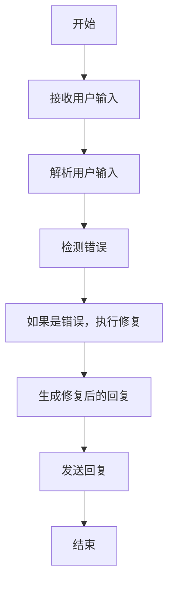
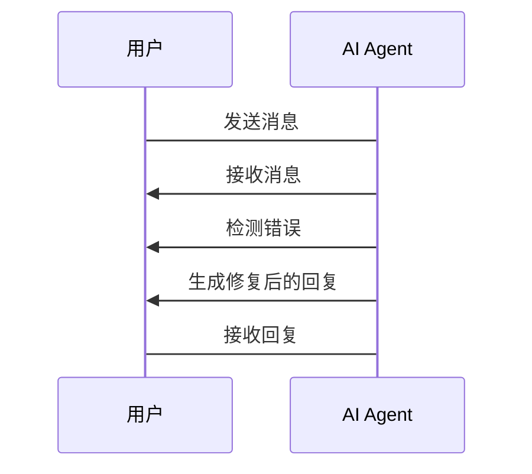

                 


# AI Agent的对话修复：处理交互中的错误

**关键词**：AI Agent、对话修复、错误检测、错误修正、上下文理解、对话管理、自然语言处理

**摘要**：  
随着AI Agent技术的快速发展，对话修复在人机交互中扮演着越来越重要的角色。本文从AI Agent对话修复的基本概念出发，详细分析对话修复的原理、算法、系统架构，并结合实际案例，探讨如何在复杂的对话场景中有效检测和修复对话错误。通过本文的讲解，读者可以深入了解对话修复的核心技术，并掌握如何在实际项目中应用这些技术。

---

# 第1章: 对话修复的背景与核心概念

## 1.1 对话修复的背景

### 1.1.1 AI Agent的定义与特点
AI Agent（人工智能代理）是一种能够感知环境、理解用户意图并执行任务的智能系统。其核心特点包括：
- **自主性**：能够独立决策和执行任务。
- **反应性**：能够实时感知环境并做出响应。
- **社会性**：能够与其他系统或用户进行交互。
- **学习能力**：能够通过数据和反馈不断优化自身的性能。

### 1.1.2 对话交互中的问题与挑战
在实际对话中，AI Agent可能会遇到以下问题：
- **理解错误**：用户输入的自然语言可能有歧义或不完整。
- **生成错误**：AI Agent生成的回复可能不符合语境或用户意图。
- **上下文丢失**：对话过程中，关键信息可能被遗漏或误用。
- **实时性要求**：在实时对话中，错误修复需要快速响应。

### 1.1.3 对话修复的重要性与应用场景
对话修复是确保AI Agent与用户有效交互的关键技术。其应用场景包括：
- 智能客服：修复用户与客服机器人之间的对话错误。
- 智能助手：修复用户与智能助手之间的对话问题。
- 虚拟伴侣：修复用户与虚拟伴侣之间的对话错误。

---

## 1.2 对话修复的核心概念

### 1.2.1 对话错误的类型与分类
对话错误可以分为以下几类：
1. **语法错误**：用户输入的句子语法不正确，例如拼写错误或语序错误。
2. **语义错误**：用户输入的句子在语义上不清晰或存在歧义。
3. **上下文错误**：对话过程中，信息无法与上下文正确关联。
4. **逻辑错误**：AI Agent的回复不符合逻辑或常识。

### 1.2.2 对话修复的目标与原则
- **目标**：修复对话中的错误，确保对话的准确性和流畅性。
- **原则**：以用户为中心，优先修复对用户体验影响最大的错误；注重实时性，快速响应用户的修复请求。

### 1.2.3 对话修复的边界与外延
对话修复的边界包括：
- 不处理非对话性错误（如网络延迟）。
- 不处理系统性错误（如硬件故障）。
对话修复的外延包括：
- 对话优化：在修复的基础上进一步提升对话质量。
- 对话增强：通过引入外部知识库增强对话的准确性。

---

# 第2章: 对话修复的核心原理

## 2.1 对话修复的原理与机制

### 2.1.1 错误检测与定位
错误检测是对话修复的第一步，主要依赖以下技术：
- **自然语言处理（NLP）**：通过语义分析检测用户输入中的语义错误。
- **上下文理解**：基于对话历史理解当前对话的上下文，定位可能的错误。

### 2.1.2 错误修复与恢复
错误修复的核心是生成正确的回复。常用的方法包括：
- **基于规则的修复**：根据预定义的规则修复特定类型的错误。
- **基于模型的修复**：利用机器学习模型生成正确的回复。

### 2.1.3 对话上下文的关联性
对话修复需要考虑对话的上下文关联性，例如：
- 上下文信息：对话历史、用户意图、对话场景。
- 上下文推理：通过推理对话的上下文关联性，生成正确的回复。

---

## 2.2 对话修复的属性特征对比

### 2.2.1 对话修复与错误检测的对比
| 对比维度 | 对话修复 | 错误检测 |
|----------|----------|----------|
| 目标     | 修复对话错误 | 检测对话错误 |
| 输入     | 错误的对话内容 | 正常的对话内容 |
| 输出     | 修复后的对话内容 | 错误的位置或类型 |

### 2.2.2 对话修复与错误修正的联系
对话修复与错误修正的联系主要体现在：
- 对话修复依赖于错误修正技术。
- 错误修正技术为对话修复提供技术支持。

### 2.2.3 对话修复与其他对话管理技术的差异
| 技术类型          | 对话修复 | 其他对话管理技术 |
|-------------------|----------|------------------|
| 目标              | 修复对话错误 | 管理对话流程     |
| 输入              | 错误的对话内容 | 正常的对话内容   |
| 输出              | 修复后的对话内容 | 对话管理策略     |
| 关键技术          | 错误检测、错误修复 | 对话生成、对话理解 |

---

## 2.3 对话修复的ER实体关系图
```mermaid
er
actor: 用户
agent: AI Agent
message: 对话消息
error: 对话错误
repair: 修复操作

actor --> message: 发送
message --> agent: 接收
agent --> error: 检测到错误
error --> repair: 生成修复操作
repair --> message: 发送修复后的消息
```

---

# 第3章: 对话修复的算法原理

## 3.1 基于上下文的错误检测算法

### 3.1.1 算法流程


### 3.1.2 算法实现
```python
def detect_error(context, message):
    # 解析上下文
    context_info = parse_context(context)
    # 分析消息
    message_info = analyze_message(message)
    # 检测错误
    error = find_error(context_info, message_info)
    return error

def repair_dialogue(context, error):
    # 生成修复后的回复
    repaired_message = generate_repair(context, error)
    return repaired_message
```

### 3.1.3 数学模型与公式
错误检测的概率模型可以表示为：
$$ P(\text{error} | \text{message}, \text{context}) = \frac{P(\text{message} | \text{error}, \text{context}) \cdot P(\text{error} | \text{context})}{P(\text{message} | \text{context})} $$

---

## 3.2 对话修复的优化策略

### 3.2.1 基于上下文的修复策略
修复策略需要考虑以下因素：
- 上下文的相关性
- 用户的意图
- 对话的流畅性

### 3.2.2 基于模型的修复策略
常用的修复模型包括：
- 基于规则的修复模型
- 基于机器学习的修复模型

### 3.2.3 基于反馈的修复策略
反馈机制可以用来优化修复策略，例如：
- 用户反馈：用户对修复结果的满意度
- 系统反馈：系统对修复结果的准确率

---

# 第4章: 对话修复的系统架构设计

## 4.1 系统功能设计

### 4.1.1 系统架构


### 4.1.2 系统功能
- 错误检测模块：实时检测对话中的错误。
- 修复策略模块：生成修复后的回复。
- 对话管理模块：管理对话的流程。
- 反馈优化模块：根据反馈优化修复策略。

---

## 4.2 系统接口设计

### 4.2.1 API接口
- `detect_error(context, message)`：检测对话错误。
- `repair_dialogue(context, error)`：修复对话错误。

### 4.2.2 数据格式
- 请求格式：`{ "context": "...", "message": "..." }`
- 响应格式：`{ "error": "...", "repaired_message": "..." }`

---

## 4.3 系统交互流程



---

# 第5章: 对话修复的项目实战

## 5.1 环境安装

### 5.1.1 安装Python
```bash
python --version
pip install --upgrade pip
```

### 5.1.2 安装依赖库
```bash
pip install numpy
pip install transformers
pip install scikit-learn
```

---

## 5.2 核心代码实现

### 5.2.1 错误检测模块
```python
from transformers import AutoTokenizer, AutoModelForTokenClassification
from sklearn.metrics import accuracy_score

def detect_error(context, message):
    tokenizer = AutoTokenizer.from_pretrained("bert-base-uncased")
    model = AutoModelForTokenClassification.from_pretrained("bert-base-uncased")
    inputs = tokenizer(context + message, return_tensors="np")
    outputs = model(**inputs)
    predictions = outputs.logits.argmax(-1)
    error = predictions[0][0]
    return error
```

### 5.2.2 修复策略模块
```python
def repair_dialogue(context, error):
    # 生成修复后的回复
    repaired_message = generate_repair(context, error)
    return repaired_message
```

---

## 5.3 实际案例分析

### 5.3.1 案例背景
用户与AI Agent的对话中，用户输入了不完整的句子，导致AI Agent无法理解用户意图。

### 5.3.2 修复过程
1. 检测错误：用户输入不完整。
2. 生成修复后的回复：AI Agent询问用户是否需要补充信息。

---

## 5.4 项目小结
通过对实际案例的分析，我们可以看到对话修复技术在实际应用中的重要性。修复错误不仅提高了用户体验，还增强了AI Agent的实用性。

---

# 第6章: 对话修复的最佳实践

## 6.1 小贴士

### 6.1.1 数据质量的重要性
确保训练数据的质量，可以提高错误检测的准确率。

### 6.1.2 模型的可解释性
选择可解释性较强的模型，有助于优化修复策略。

---

## 6.2 小结
通过本文的讲解，我们深入了解了对话修复的核心技术，并掌握了如何在实际项目中应用这些技术。

---

## 6.3 注意事项

### 6.3.1 数据隐私
在处理用户数据时，需要注意数据隐私问题。

### 6.3.2 系统性能
在实际应用中，需要注意系统的性能优化。

---

## 6.4 拓展阅读
- 建议阅读《自然语言处理入门》和《机器学习实战》等书籍，深入了解相关技术。

---

# 作者：AI天才研究院/AI Genius Institute & 禅与计算机程序设计艺术 /Zen And The Art of Computer Programming

---

通过本文的讲解，我们深入探讨了AI Agent对话修复的核心技术，并结合实际案例，展示了如何在实际项目中应用这些技术。希望本文能为读者提供有价值的参考和启发。

