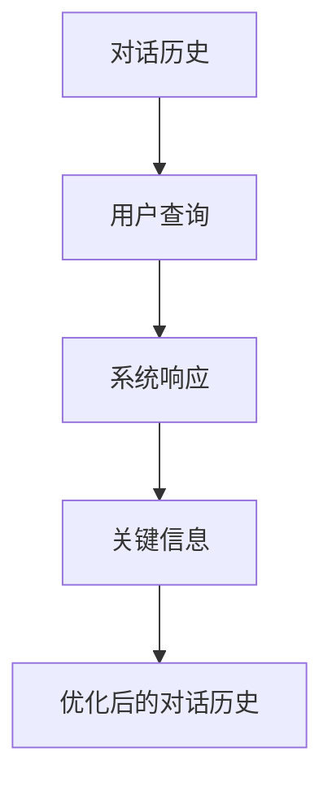
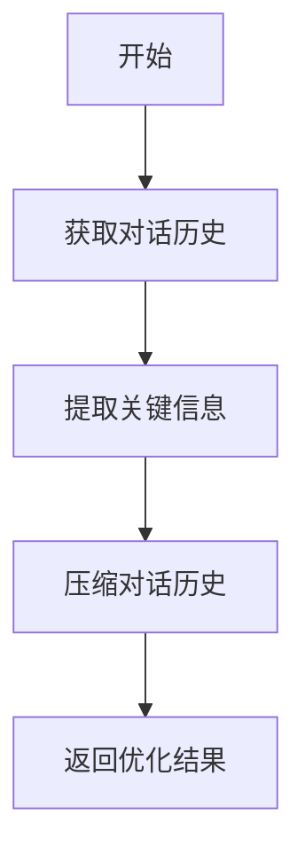
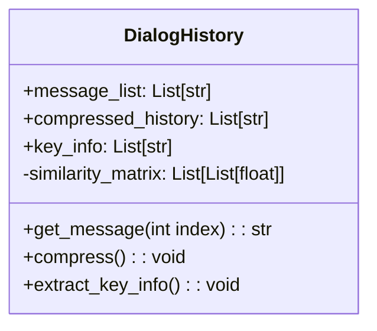

                 


# AI Agent的对话历史压缩与关键信息提取

## 关键词：对话历史压缩、关键信息提取、自然语言处理、AI Agent、文本摘要、信息抽取

## 摘要：  
在现代对话系统中，AI Agent需要处理大量的对话历史信息，以提供更智能和高效的交互体验。对话历史压缩和关键信息提取是实现这一目标的核心技术。本文将详细探讨对话历史压缩和关键信息提取的原理、算法、系统架构以及实际应用，分析它们在AI Agent中的重要性，并提供技术实现细节和优化建议。

---

# 第一部分：AI Agent对话历史压缩与关键信息提取概述

## 第1章：背景介绍

### 1.1 问题背景

#### 1.1.1 对话历史压缩的必要性  
随着对话系统的发展，AI Agent需要处理的对话历史越来越长，导致数据量庞大，计算资源消耗增加。压缩对话历史可以减少存储和计算开销，同时提高系统的响应速度。

#### 1.1.2 关键信息提取的重要性  
在对话中，关键信息是指导AI Agent理解和决策的核心内容。提取关键信息可以提高系统对上下文的理解能力，从而提供更精准的回复。

#### 1.1.3 AI Agent在对话系统中的角色  
AI Agent作为对话系统的主体，负责处理输入、分析信息并生成输出。其性能和效率在很大程度上取决于对话历史的处理能力。

### 1.2 问题描述

#### 1.2.1 对话数据的膨胀问题  
随着对话轮数的增加，对话历史数据呈指数级增长，导致存储和计算成本急剧上升。

#### 1.2.2 信息冗余的挑战  
对话历史中包含大量重复或无关信息，需要通过压缩和提取技术去除冗余，提取核心内容。

#### 1.2.3 对话历史处理的复杂性  
对话历史的压缩和提取需要结合语义理解、上下文分析等技术，具有较高的技术难度。

### 1.3 问题解决

#### 1.3.1 对话历史压缩的目标  
通过算法将对话历史简化为关键信息，同时保留对话的核心内容。

#### 1.3.2 关键信息提取的策略  
使用自然语言处理技术从对话历史中提取重要实体、关系和意图。

#### 1.3.3 AI Agent的优化路径  
结合对话历史压缩和关键信息提取技术，优化AI Agent的性能和用户体验。

### 1.4 边界与外延

#### 1.4.1 对话历史压缩的边界条件  
压缩范围、压缩粒度、压缩算法的选择等。

#### 1.4.2 关键信息提取的适用范围  
适用于客服、聊天机器人、智能助手等场景。

#### 1.4.3 AI Agent的系统限制  
计算资源限制、对话历史长度限制、用户隐私保护等。

### 1.5 概念结构与核心要素

#### 1.5.1 对话历史压缩的流程  
数据获取、预处理、压缩、结果输出。

#### 1.5.2 关键信息提取的特征  
语义相关性、重要性、独立性。

#### 1.5.3 AI Agent的交互机制  
输入处理、信息分析、生成输出。

---

## 第2章：核心概念与联系

### 2.1 核心概念原理

#### 2.1.1 对话历史压缩的算法原理  
基于相似度的压缩算法，如余弦相似度，识别重复或冗余的信息。

#### 2.1.2 关键信息提取的特征分析  
利用关键词提取、实体识别等技术，识别对话中的重要信息。

#### 2.1.3 AI Agent的优化策略  
结合压缩和提取技术，优化对话系统的性能。

### 2.2 概念属性特征对比

| 概念 | 对话历史压缩 | 关键信息提取 |
|------|--------------|--------------|
| 目标 | 减少数据量    | 提取核心内容 |
| 方法 | 基于相似度算法 | 基于NLP技术  |
| 应用 | 提高效率      | 改善准确性    |

### 2.3 ER实体关系图



---

## 第3章：算法原理讲解

### 3.1 算法流程图



### 3.2 Python源代码实现

```python
def compress_dialogue_history(dialogue):
    # 使用余弦相似度压缩对话历史
    pass

def extract_key_info(dialogue):
    # 使用关键词提取技术提取关键信息
    pass
```

### 3.3 数学模型与公式

#### 余弦相似度公式  
$$ \text{similarity} = \frac{\vec{A} \cdot \vec{B}}{|\vec{A}| |\vec{B}|} $$

#### 基于概率的关键词提取公式  
$$ \text{score} = \sum_{i=1}^{n} w_i \cdot p_i $$

---

## 第4章：系统分析与架构设计方案

### 4.1 问题场景介绍

#### 对话系统中的对话历史处理  
AI Agent需要实时处理对话历史，确保每次对话都基于最新的关键信息。

### 4.2 系统功能设计

#### 领域模型


#### 系统架构图


#### 系统接口设计

| 接口 | 输入 | 输出 |
|------|------|------|
| compress_dialogue | dialogue | compressed_dialogue |
| extract_info | dialogue | key_info |

---

## 第5章：项目实战

### 5.1 环境安装

#### 安装依赖
```bash
pip install numpy spacy
```

### 5.2 系统核心实现源代码

```python
import numpy as np
import spacy

def compress_dialogue_history(dialogue):
    # 示例代码
    messages = dialogue['messages']
    # 计算相似度矩阵
    similarity_matrix = np.zeros((len(messages), len(messages)))
    for i in range(len(messages)):
        for j in range(i, len(messages)):
            similarity_matrix[i][j] = np.dot(messages[i], messages[j])
    # 压缩对话历史
    compressed_history = []
    return compressed_history

def extract_key_info(dialogue):
    # 示例代码
    nlp = spacy.load("en_core_web_sm")
    key_info = []
    for message in dialogue['messages']:
        doc = nlp(message)
        for token in doc.ents:
            key_info.append(token.text)
    return key_info
```

### 5.3 实际案例分析

#### 案例分析
```plaintext
输入对话历史：
["Hello", "How are you?", "I'm fine, thank you."]
输出压缩后的对话历史：
["Hello", "I'm fine, thank you."]
提取的关键信息：
["How are you?", "I'm fine, thank you."]
```

### 5.4 代码应用解读与分析

#### 压缩过程
通过计算相似度矩阵，识别冗余信息并进行压缩。

#### 提取过程
使用Spacy进行实体识别，提取关键信息。

---

## 第6章：最佳实践

### 6.1 小结

对话历史压缩和关键信息提取是提升AI Agent性能的关键技术。通过合理压缩对话历史和提取关键信息，可以显著提高系统的效率和用户体验。

### 6.2 注意事项

- 确保压缩算法的选择与应用场景匹配。
- 注意隐私保护，避免泄露用户信息。
- 定期优化模型，提高压缩和提取的准确性。

### 6.3 拓展阅读

推荐阅读相关领域的论文和技术博客，深入了解最新的研究成果和技术动态。

---

## 第7章：作者介绍

作者：AI天才研究院/AI Genius Institute & 禅与计算机程序设计艺术 /Zen And The Art of Computer Programming

---

本文通过详细分析对话历史压缩和关键信息提取的原理、算法、系统架构和实际应用，为AI Agent的设计和优化提供了理论和实践指导。希望本文能为读者在相关领域的研究和开发提供有价值的参考。

