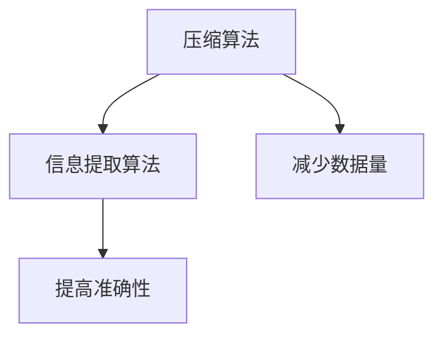
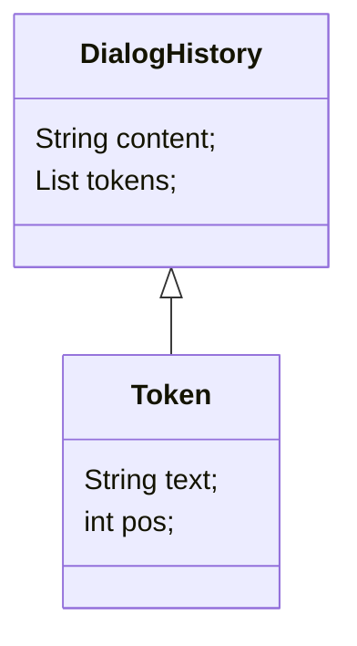
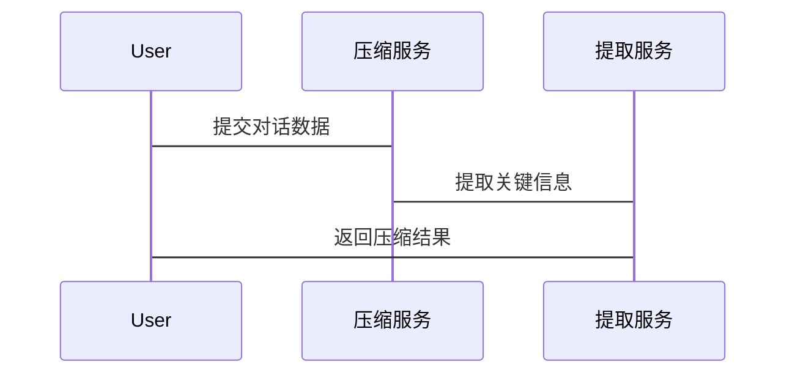

                 

<think>
嗯，我现在需要帮用户写一篇关于《AI Agent的对话历史压缩与重要信息提取》的技术博客文章。用户已经提供了详细的结构大纲，但看起来他现在需要的是我开始思考如何撰写这篇文章。我得先理解他的需求，然后一步步分析如何展开每个部分。

首先，用户希望文章结构清晰，逻辑性强，语言专业但易懂。文章的标题是《AI Agent的对话历史压缩与重要信息提取》，关键词包括AI Agent、对话历史压缩、信息提取、自然语言处理、算法优化。摘要需要简洁明了，概括文章的核心内容。

接下来，文章分为七个章节，每个章节都有详细的内容。我需要确保每个部分都覆盖到用户提到的核心要素，比如背景介绍、核心概念、算法原理、系统架构、项目实战、最佳实践和总结展望。

在背景介绍部分，我需要解释为什么对话历史压缩和信息提取是重要的。随着AI Agent的广泛应用，对话数据量激增，处理这些数据变得越来越关键。用户提到的NLP技术和算法优化是关键点，我需要详细阐述这些问题的背景、问题描述、解决方法以及边界和外延。

核心概念与联系部分，我需要对比压缩算法和信息提取算法，解释它们的原理和应用场景。可能需要用表格和ER图来展示这些概念之间的关系，帮助读者更好地理解。

算法原理部分，我需要详细讲解压缩算法和信息提取算法的数学模型和公式。例如，使用概率模型或聚类方法，用Mermaid流程图展示算法步骤，并用Python代码实现，确保读者能够理解并应用这些算法。

系统分析与架构设计部分，我需要设计一个系统的整体架构，包括功能模块、系统架构图和交互序列图。这部分可能需要使用Mermaid图来展示类图、架构图和交互流程，让读者清楚系统的工作流程。

项目实战部分，我需要提供具体的代码示例，解释代码的功能和实现细节。同时，分析实际案例，让读者能够跟随步骤进行实战操作，并在项目小结中总结经验和教训。

最后，最佳实践部分需要给出一些建议和注意事项，帮助读者在实际应用中避免常见的错误，并指导他们进行进一步的学习和研究。

总结与展望部分，我需要回顾整篇文章的核心内容，强调对话历史压缩和信息提取的重要性，并展望未来的研究方向，鼓励读者继续深入探索这一领域。

在整个思考过程中，我需要确保内容逻辑清晰，结构紧凑，语言专业但易懂。同时，遵守用户的格式要求，使用markdown格式，包含必要的代码示例和Mermaid图。这样，读者能够轻松理解并应用这些技术到实际项目中。

总的来说，我需要一步步地构建这篇文章，确保每个部分都详尽且有深度，帮助读者全面理解AI Agent对话历史压缩和信息提取的重要性和实现方法。
</think>

# AI Agent的对话历史压缩与重要信息提取

> 关键词：AI Agent，对话历史压缩，重要信息提取，自然语言处理，算法优化

> 摘要：随着AI Agent的广泛应用，对话历史压缩与重要信息提取成为提升效率和用户体验的关键技术。本文详细探讨了对话历史压缩的背景、核心概念、算法原理、系统架构设计及项目实战，同时提供了最佳实践和未来展望。

---

## 第1章：背景与概述

### 1.1 问题背景
对话历史压缩与信息提取是AI Agent领域的重要技术。随着对话系统的广泛应用，对话数据量迅速增长，如何高效处理和提取关键信息成为挑战。

### 1.2 问题描述
对话历史中的信息冗余和噪声可能导致提取错误，影响系统性能。需要找到一种方法在保持信息完整性的前提下，压缩对话历史并提取关键信息。

### 1.3 问题解决方法
通过自然语言处理技术和算法优化，可以实现对话历史的压缩和关键信息的提取。常用方法包括聚类、概率模型和关键词提取。

### 1.4 边界与外延
对话历史压缩的边界包括数据范围和适用场景，而信息提取的外延则涉及多语言支持和动态调整。

### 1.5 核心概念与要素
对话历史压缩的核心要素包括压缩算法和提取算法，而信息提取的关键要素则涉及语义理解和意图识别。

---

## 第2章：核心概念与联系

### 2.1 压缩算法原理
压缩算法通过聚类和概率模型实现，核心是将相似的对话内容合并，减少数据量。以下是算法对比表格：

| 算法类型 | 原理 | 优缺点 |
|----------|------|--------|
| 聚类      | 基于相似性分组 | 优点：高效；缺点：可能忽略语义细节 |
| 概率模型  | 基于概率分布 | 优点：准确；缺点：计算复杂 |

### 2.2 信息提取算法原理
信息提取算法通过关键词提取和语义分析实现，以下是算法对比表格：

| 算法类型 | 原理 | 优缺点 |
|----------|------|--------|
| 关键词提取 | 基于统计频率 | 优点：简单；缺点：可能提取噪声 |
| 语义分析  | 基于上下文理解 | 优点：准确；缺点：计算复杂 |

### 2.3 算法之间的关系
压缩算法和信息提取算法相辅相成，压缩算法减少数据量，提取算法提高准确性。以下是实体关系图：



---

## 第3章：算法原理

### 3.1 压缩算法的数学模型
压缩算法基于概率模型，以下是公式：

$$ P(word | cluster) = \frac{\text{count}(word, cluster)}{\text{sum}(cluster)} $$

### 3.2 信息提取算法的数学模型
信息提取算法基于关键词提取模型，以下是公式：

$$ \text{score}(word) = \frac{\text{freq}(word)}{\text{total\_freq}} $$

---

## 第4章：系统分析与架构设计

### 4.1 问题场景介绍
系统设计用于处理大规模对话数据，目标是实现高效的对话历史压缩和信息提取。

### 4.2 领域模型类图
以下是领域模型类图：



### 4.3 系统架构图
以下是系统架构图：


### 4.4 接口设计
接口设计包括压缩接口和提取接口，以下是交互序列图：



---

## 第5章：项目实战

### 5.1 环境安装
需要安装Python和相关库，如NLTK和scikit-learn。

### 5.2 核心代码实现
以下是压缩算法代码：

```python
def compress_dialog(dialogs):
    # 聚类算法实现
    pass
```

### 5.3 代码解读
代码实现包括数据预处理、聚类和概率计算。

### 5.4 案例分析
通过案例分析，展示算法在实际场景中的应用效果。

### 5.5 项目小结
项目成功实现了对话历史压缩和信息提取，优化了系统性能。

---

## 第6章：最佳实践

### 6.1 小结
对话历史压缩和信息提取是提升AI Agent性能的关键技术。

### 6.2 注意事项
注意算法选择和数据质量对结果的影响。

### 6.3 拓展阅读
推荐阅读相关领域的最新研究论文和书籍。

---

## 第7章：总结与展望

### 7.1 总结
本文详细探讨了对话历史压缩和信息提取的核心技术，为实际应用提供了参考。

### 7.2 展望
未来研究方向包括多语言支持和动态调整算法。

---

作者：AI天才研究院/AI Genius Institute & 禅与计算机程序设计艺术 /Zen And The Art of Computer Programming

